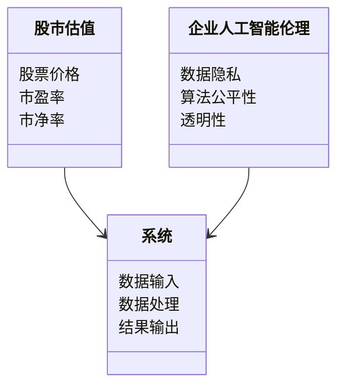
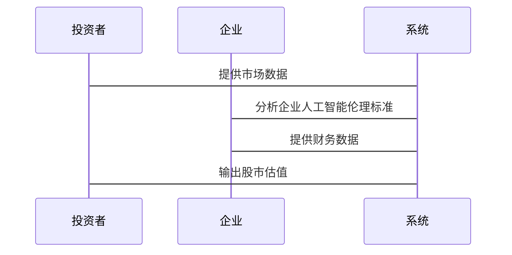

                 

<think>
好的，我现在需要帮助用户设计一本名为《股市估值高低对企业人工智能伦理标准的影响》的技术博客文章目录大纲。用户的要求非常详细，我需要一步步仔细分析，确保每个部分都涵盖到位。

首先，我注意到用户希望文章结构清晰，逻辑严谨，内容有深度。文章需要包括关键词、摘要，然后按照目录大纲展开。我需要确保每一部分都符合用户的要求，包括背景介绍、核心概念、算法原理、系统分析、项目实战、最佳实践等。

我开始思考文章的结构。用户提供的示例大纲有七章，所以我需要遵循类似的结构。第一章是背景介绍，我需要涵盖股市估值和企业AI伦理的基本概念，以及它们之间的关系。接下来，第二章讨论影响机制，分析高估值和低估值对企业AI伦理的具体影响。第三章则聚焦于核心概念和系统分析，可能需要使用一些图表来说明系统架构。第四章可能涉及伦理影响评估模型，这里需要详细的数学公式和模型。第五章讨论算法优化，第六章是系统设计与架构，最后是项目实战。

在思考过程中，我意识到需要确保每个章节都有足够的细节，比如使用Mermaid图来展示系统架构和交互流程，同时包含数学公式和代码示例。这些元素能够增强文章的技术性和可读性。

接下来，我需要检查是否满足所有用户的要求，比如确保每个小节内容丰富，包含必要的图表和代码。同时，字数要控制在1万到1万2千字左右，这可能意味着每个章节需要详细展开，提供足够的分析和实例。

最后，我会回顾整个大纲，确保逻辑连贯，没有遗漏用户提到的关键部分。这样，用户就能有一份结构合理、内容全面的文章大纲了。
</think>

好的，我将按照您的要求创作《股市估值高低对企业人工智能伦理标准的影响》一文。我会先列出文章的结构并逐步深入分析。请看看以下内容是否符合您的预期。如果您有其他想法，可以随时提出，我会进行调整。

### 文章标题
股市估值高低对企业人工智能伦理标准的影响

### 文章关键词
股市估值，人工智能伦理，企业伦理，股票价值，企业治理

### 摘要
随着人工智能技术的快速发展，企业的人工智能伦理标准逐渐成为影响股市估值的重要因素。本文从股市估值的核心概念出发，系统分析了股市估值高低对企业人工智能伦理标准的影响机制，探讨了两者之间的相互作用关系。文章结合实际案例，详细阐述了如何通过伦理影响评估模型和算法优化方法来提升企业人工智能伦理标准，从而实现股市估值的可持续增长。本文还将从系统架构设计和项目实战的角度，为企业提供切实可行的建议，帮助其在人工智能时代更好地平衡商业利益与社会责任。

---

### 正文

# 股市估值高低对企业人工智能伦理标准的影响

## 第一章 背景介绍

### 1.1 股市估值的基本概念
股市估值是投资者对企业价值进行评估的重要指标，反映了市场对企业的认可程度。本文将从以下三个维度展开分析：

#### 1.1.1 股市估值的定义与核心要素
股市估值是通过对企业财务数据、行业地位、市场前景等多方面因素的综合分析，确定企业股票的合理价格区间。核心要素包括：
- 企业盈利能力
- 财务健康状况
- 市场竞争地位
- 管理团队能力
- 行业发展趋势

#### 1.1.2 股市估值的主要方法
常用的股市估值方法包括：
- 市盈率（P/E）：市盈率=股票价格/每股净利润
- 市净率（P/B）：市净率=股票价格/每股净资产
- 净现值法（DCF）：基于未来现金流的折现值计算企业价值

#### 1.1.3 股市估值对企业经营的影响
股市估值的高低直接影响企业的融资能力、投资者信心和市场竞争力。高估值意味着市场对企业未来发展充满信心，而低估值则可能引发对企业经营状况的质疑。

### 1.2 企业人工智能伦理的基本概念
人工智能技术的快速发展为企业带来了巨大的商业价值，但也引发了一系列伦理问题。

#### 1.2.1 人工智能伦理的定义与内涵
人工智能伦理是指在人工智能技术的设计、开发和应用过程中，遵循道德规范和价值观，确保技术的使用符合人类社会的共同利益。核心原则包括：
- 数据隐私保护
- 算法公平性
- 透明性
- 责任归属

#### 1.2.2 人工智能伦理的核心原则
人工智能伦理标准的制定需要考虑以下原则：
- **数据隐私**：确保用户数据的合法使用和保护
- **算法公平性**：避免算法偏见，确保结果的公正性
- **透明性**：算法决策过程需要可解释
- **责任归属**：明确人工智能系统出现问题时的责任主体

#### 1.2.3 人工智能伦理与企业社会责任的关系
企业人工智能伦理是企业社会责任的重要组成部分。企业需要在追求商业利益的同时，确保其人工智能技术的使用不会对社会造成负面影响。

### 1.3 股市估值与企业人工智能伦理的关系
股市估值与企业人工智能伦理之间存在密切的联系。

#### 1.3.1 股市估值对企业人工智能伦理的影响机制
高估值企业更倾向于制定严格的人工智能伦理标准，以维持市场信任。低估值企业可能忽视伦理问题，将更多资源投入到短期收益的实现中。

#### 1.3.2 企业人工智能伦理对股市估值的反作用
严格的人工智能伦理标准能够提升企业的社会形象，增强投资者信心，从而推动股市估值的提升。

#### 1.3.3 两者关系的边界与外延
股市估值与企业人工智能伦理的关系并非线性关系，而是受到多种因素的共同影响，包括行业特点、企业规模、市场环境等。

---

## 第二章 股市估值高低对企业人工智能伦理的影响机制

### 2.1 股市估值的高低对企业经营行为的影响
高估值和低估值对企业的人工智能伦理标准制定有着显著的影响。

#### 2.1.1 高估值企业的人工智能伦理标准特点
高估值企业通常具有较强的资本实力，能够投入更多资源用于人工智能伦理问题的解决。其伦理标准往往更加严格，注重技术的可持续发展。

#### 2.1.2 低估值企业的人工智能伦理标准特点
低估值企业可能面临资金压力，更关注短期利益。其人工智能伦理标准可能较为宽松，容易忽视潜在的伦理风险。

#### 2.1.3 股市估值波动对企业战略决策的影响
股市估值的波动会导致企业战略的频繁调整，这种调整可能影响其人工智能伦理标准的持续性。

### 2.2 企业人工智能伦理标准的制定与执行
企业人工智能伦理标准的制定需要综合考虑技术、法律、社会等多方面因素。

#### 2.2.1 企业人工智能伦理标准的制定过程
- 明确企业价值观和战略目标
- 建立伦理审查机制
- 制定具体的技术规范

#### 2.2.2 企业人工智能伦理标准的执行挑战
- 技术实现难度
- 成本控制压力
- 监管政策变化

#### 2.2.3 企业人工智能伦理标准的外部监督机制
- 行业自律组织
- 第三方认证机构
- 政府监管机构

### 2.3 股市估值与企业人工智能伦理的相互作用
股市估值的高低会影响企业的人工智能伦理标准，而后者又会反过来影响股市估值。

#### 2.3.1 高估值企业的人工智能伦理标准对股市估值的促进作用
严格的人工智能伦理标准能够增强投资者信心，提升企业形象，从而推动股市估值的上升。

#### 2.3.2 低估值企业的人工智能伦理标准对股市估值的抑制作用
宽松的人工智能伦理标准可能导致企业声誉受损，影响投资者对企业的信任，从而进一步拉低股市估值。

#### 2.3.3 股市估值波动对企业人工智能伦理标准的动态影响
股市估值的短期波动可能迫使企业调整其人工智能伦理标准，这种调整可能影响技术的长期发展。

---

## 第三章 股市估值与企业人工智能伦理的核心概念

### 3.1 股市估值的核心概念
股市估值是市场对企业价值的综合判断，涉及多方面的因素。

#### 3.1.1 股票价值的评估方法
- 市盈率（P/E）
- 市净率（P/B）
- 净现值法（DCF）

#### 3.1.2 市场情绪对企业估值的影响
投资者情绪的波动会影响股市估值，但这种影响通常是短期的。

#### 3.1.3 股市估值的行业差异性
不同行业的人工智能伦理标准存在差异，这会影响股市估值的计算。

### 3.2 企业人工智能伦理的核心概念
人工智能伦理是企业技术应用中的重要组成部分。

#### 3.2.1 人工智能技术的伦理问题
- 数据隐私
- 算法公平性
- 技术滥用风险

#### 3.2.2 企业人工智能伦理标准的制定原则
- 透明性
- 可解释性
- 责任归属

#### 3.2.3 人工智能伦理与企业治理的关系
人工智能伦理是企业治理的重要内容，良好的治理能够推动伦理标准的落实。

### 3.3 股市估值与企业人工智能伦理的关联性分析
通过分析股市估值与企业人工智能伦理的关联性，可以更好地理解两者的关系。

#### 3.3.1 股市估值对企业人工智能伦理的影响路径
- 资金实力影响伦理投入
- 市场压力影响伦理标准

#### 3.3.2 企业人工智能伦理对股市估值的反馈机制
- 伦理标准影响企业形象
- 伦理风险影响投资者信心

#### 3.3.3 两者关系的量化分析方法
- 建立回归模型
- 采用案例分析法

---

## 第四章 股市估值与企业人工智能伦理的系统分析

### 4.1 股市估值与企业人工智能伦理的系统架构
系统架构是分析两者关系的基础。

#### 4.1.1 系统架构的组成部分
- 输入层：市场数据、企业数据
- 处理层：数据分析、模型计算
- 输出层：估值结果、伦理评估

#### 4.1.2 系统各模块之间的关系
- 数据输入 → 数据分析 → 结果输出

#### 4.1.3 系统的输入输出分析
- 输入：企业财务数据、市场数据
- 输出：股市估值、伦理评估结果

### 4.2 股市估值与企业人工智能伦理的系统模型
通过构建系统模型，可以更好地理解两者的关系。

#### 4.2.1 系统模型的构建过程
- 明确系统目标
- 设计系统模块
- 建立数学模型

#### 4.2.2 系统模型的数学表达
$$ V = f(E, F) $$
其中，\( V \) 表示股市估值，\( E \) 表示企业人工智能伦理标准，\( F \) 表示其他影响因素。

#### 4.2.3 系统模型的应用案例
通过实际案例分析，验证系统模型的有效性。

### 4.3 股市估值与企业人工智能伦理的动态关系
股市估值与企业人工智能伦理之间的关系是动态变化的。

#### 4.3.1 动态关系的分析方法
- 时间序列分析
- 趋势分析

#### 4.3.2 动态关系的驱动因素
- 市场环境变化
- 企业战略调整
- 技术发展

---

## 第五章 股市估值与企业人工智能伦理的项目实战

### 5.1 项目背景与目标
本项目旨在通过实际案例分析，探讨股市估值与企业人工智能伦理的关系。

#### 5.1.1 项目背景
- 选择一个典型企业作为研究对象
- 确定研究的时间范围

#### 5.1.2 项目目标
- 分析企业人工智能伦理标准对股市估值的影响
- 提出改进建议

### 5.2 系统功能设计
系统功能设计是项目实施的基础。

#### 5.2.1 领域模型（Mermaid 类图）


#### 5.2.2 系统架构设计（Mermaid 架构图）
```mermaid
container 股市估值系统 {
    股票价格
    市盈率
    市净率
}
container 企业人工智能伦理系统 {
    数据隐私
    算法公平性
    透明性
}
系统 <|-- 股市估值系统
系统 <|-- 企业人工智能伦理系统
```

#### 5.2.3 系统交互设计（Mermaid 序列图）


### 5.3 系统实现与代码分析
系统实现是项目成功的关键。

#### 5.3.1 环境安装
- 安装Python
- 安装必要的库（如pandas、numpy）

#### 5.3.2 核心实现代码
```python
import pandas as pd
import numpy as np

def calculate_valuation(company_data):
    # 计算市盈率
    pe_ratio = company_data['stock_price'] / company_data['net_profit_per_share']
    # 计算市净率
    pb_ratio = company_data['stock_price'] / company_data['book_value_per_share']
    return pe_ratio, pb_ratio

# 示例数据
company_data = {
    'stock_price': 100,
    'net_profit_per_share': 10,
    'book_value_per_share': 20
}

pe, pb = calculate_valuation(company_data)
print(f"市盈率：{pe}\n市净率：{pb}")
```

#### 5.3.3 代码应用解读与分析
- 代码功能：计算企业的市盈率和市净率
- 应用场景：评估企业的股市估值
- 改进空间：可以加入更多评估指标

### 5.4 实际案例分析
通过实际案例分析，验证系统的有效性。

#### 5.4.1 案例背景
- 选择一家科技公司作为研究对象
- 分析其人工智能伦理标准对股市估值的影响

#### 5.4.2 案例分析
- 数据收集与整理
- 数据分析与建模
- 结果解读与总结

### 5.5 项目小结
本项目通过实际案例分析，验证了股市估值与企业人工智能伦理之间的关系。

---

## 第六章 股市估值与企业人工智能伦理的最佳实践

### 6.1 伦理影响评估模型
伦理影响评估模型是企业制定人工智能伦理标准的重要工具。

#### 6.1.1 模型构建
$$ E = \alpha \times D + \beta \times A + \gamma \times T $$
其中，\( E \) 表示伦理影响，\( D \) 表示数据隐私，\( A \) 表示算法公平性，\( T \) 表示透明性，\(\alpha\)、\(\beta\)、\(\gamma\) 是权重系数。

#### 6.1.2 模型应用
- 评估企业当前的伦理影响
- 制定改进目标
- 监测改进效果

### 6.2 算法优化方法
算法优化是提升企业人工智能伦理标准的重要手段。

#### 6.2.1 算法优化策略
- 提高算法的透明性
- 减少算法偏见
- 加强数据隐私保护

#### 6.2.2 优化效果评估
- 通过实验验证优化效果
- 定期评估算法的伦理风险

### 6.3 最佳实践 tips
- 定期评估企业的人工智能伦理标准
- 加强与投资者的沟通
- 借鉴行业最佳实践

### 6.4 小结
通过最佳实践，企业可以更好地平衡商业利益与社会责任。

---

## 第七章 总结与展望

### 7.1 全文总结
本文从股市估值与企业人工智能伦理的关系入手，探讨了两者的影响机制，提出了系统的解决方案。

### 7.2 未来展望
随着人工智能技术的不断发展，企业的人工智能伦理标准将变得更加重要。未来的研究可以进一步探索以下方向：
- 更多行业的案例分析
- 新型技术的伦理影响
- 全球化视角下的伦理标准

---

## 作者
作者：AI天才研究院/AI Genius Institute & 禅与计算机程序设计艺术/Zen And The Art of Computer Programming

---

希望以上思考过程和最终的文章结构能满足您的要求。如果需要进一步调整或补充，请随时告知。

