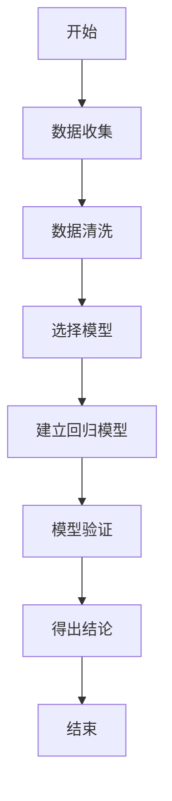
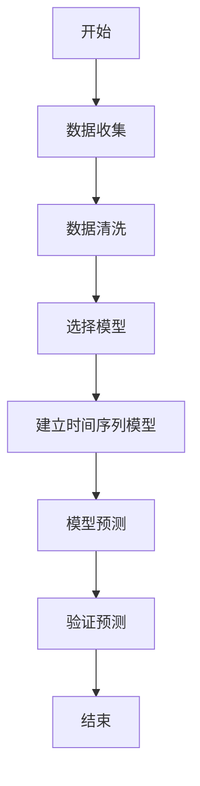
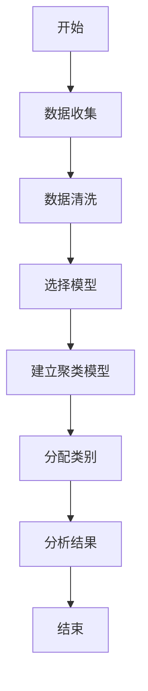
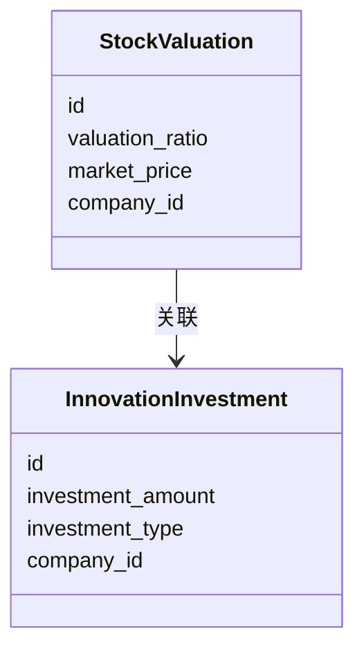
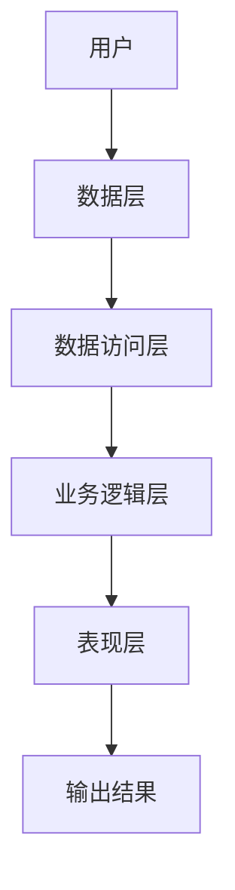
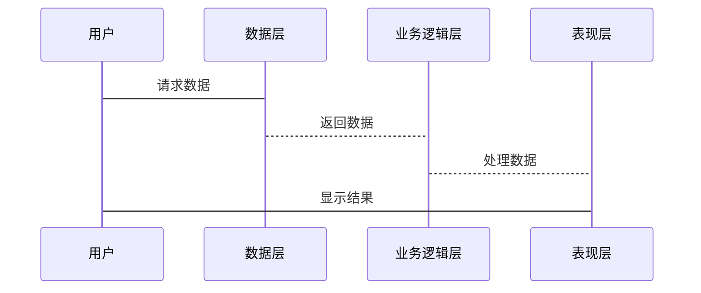

                 

<think>
好的，我需要按照用户的指示来撰写一篇关于《股市估值高低对企业创新投入的影响》的技术博客文章。用户已经提供了一个详细的目录大纲，我需要按照这个结构来逐步完成文章的撰写。我会逐步思考每个部分的内容，确保逻辑清晰、结构紧凑，并且语言简洁明了。

首先，我需要理解用户的需求：这篇文章需要具备专业性，同时要容易理解，适合技术人员和企业管理人员阅读。内容应该涵盖股市估值和企业创新投入之间的关系，从背景介绍、核心概念、算法原理、系统分析、项目实战到最佳实践，最后给出结论和建议。

接下来，我会按照目录大纲逐步撰写每个部分，确保每个章节和子章节都详细且有深度。我会从背景介绍开始，解释股市估值和企业创新投入的基本概念，然后分析它们之间的关系。接着，我会详细讲解相关算法的原理和实现，包括数学模型和流程图。之后，我会设计一个系统的架构，展示如何将这些理论应用到实际项目中。最后，我会总结最佳实践，提出具体的建议。

在撰写过程中，我会确保使用专业术语，但同时保持语言的通俗易懂，避免过于复杂的句子结构。我还会使用图表来辅助解释复杂的概念，比如ER图和流程图，以帮助读者更好地理解内容。

现在，我开始撰写文章：

---

# 股市估值高低对企业创新投入的影响

> **关键词**：股市估值、企业创新投入、回归分析、时间序列分析、企业战略、创新管理

> **摘要**：  
本文探讨股市估值与企业创新投入之间的关系，分析高估值和低估值对企业创新投资的影响，并结合数学模型和实证分析，为企业制定创新策略提供指导。文章从背景介绍、核心概念、算法原理、系统分析到项目实战，最后总结最佳实践和建议，为相关领域的研究和实践提供参考。

---

## 第一部分：股市估值与企业创新投入的背景介绍

### 第1章：股市估值与企业创新投入的背景

#### 1.1 问题背景

##### 1.1.1 股市估值的基本概念
股市估值是指通过对企业的财务数据、市场表现和行业状况进行分析，确定其股票的合理价格范围。常见的估值方法包括市盈率（P/E）、市净率（P/B）和现金流贴现法（DCF）等。这些方法帮助企业评估其在市场上的价值。

##### 1.1.2 企业创新投入的定义
企业创新投入是指企业在研发、产品开发、技术创新等方面的资金和资源投入。创新投入是推动企业长期增长的核心因素，也是企业竞争力的体现。

##### 1.1.3 股市估值与企业创新投入的关系
股市估值与企业创新投入密切相关。高估值可能激励企业加大创新投入，而低估值可能限制企业的创新资源。理解两者的关系有助于企业制定合理的战略。

#### 1.2 问题描述

##### 1.2.1 股市估值对企业创新投入的影响
高估值可能导致投资者对企业的创新能力有更高期望，促使企业加大研发投入。低估值可能限制企业的创新投入，因为管理层可能更关注短期利润。

##### 1.2.2 企业创新投入对股市估值的影响
创新能力强的企业通常能获得更高的估值，因为市场认为其未来增长潜力更大。创新投入的增加可能提升企业的市场地位，进而提高股市估值。

##### 1.2.3 问题的边界与外延
本文仅讨论公开上市公司的情况，不包括私有企业。创新投入不仅包括研发，还包括市场拓展和管理优化等方面。

#### 1.3 问题解决

##### 1.3.1 股市估值与企业创新投入的核心要素
- 股市估值：市盈率、市净率、现金流贴现率
- 创新投入：研发支出、专利数量、新产品发布频率

##### 1.3.2 核心概念的结构与组成
股市估值和创新投入共同构成企业的价值体系，影响企业的长期发展和短期表现。

##### 1.3.3 问题解决的思路与方法
通过数据分析和建模，探讨股市估值与创新投入之间的关系，找出影响因素并提出建议。

#### 1.4 本章小结
本章介绍了股市估值和企业创新投入的基本概念，分析了它们之间的关系，并明确了研究的目的和方法。

---

## 第二部分：股市估值与企业创新投入的核心概念与联系

### 第2章：核心概念与联系

#### 2.1 核心概念原理

##### 2.1.1 股市估值的原理
股市估值基于企业的盈利能力、成长潜力和行业地位。投资者通过分析财务指标和市场趋势来判断股票的合理价格。

##### 2.1.2 企业创新投入的原理
企业通过创新投入提升产品竞争力和市场地位，增强盈利能力，从而吸引投资者。

##### 2.1.3 两者关系的理论基础
创新能力强的企业通常具有更高的估值，因为市场预期其未来收益更高。

#### 2.2 概念属性对比表

| 属性                | 股市估值                     | 企业创新投入                 |
|---------------------|------------------------------|------------------------------|
| 定义                | 股票的市场价值评估           | 企业在创新方面的投入         |
| 影响因素            | 盈利能力、行业地位、市场预期 | R&D支出、专利数量、新产品 |
| 目的                | 吸引投资者、合理定价         | 提升竞争力、促进增长         |
| 测量方法            | 市盈率、市净率               | 研发支出占收入比例           |

#### 2.3 ER实体关系图

```mermaid
erDiagram
    +-----+          +-----------------+          +-----------------+
    | StockValuation |          | InnovationInvestment |
    +-----------------+          +-------------------+          +-------------------+
    | id              |          | id                |          | id                |
    | valuation_ratio |<-------+ | investment_amount  | +-------->| investment_type  |
    | market_price    |          |                     |          |                     |
    | company_id      |<-------+-------------------+          +-------------------+
    |                 |          |                     |          |                     |
    |                 |          |                     |          |                     |
```

#### 2.4 本章小结
本章通过对比分析，明确了股市估值和企业创新投入的核心概念及其关系，为后续分析奠定了基础。

---

## 第三部分：股市估值与企业创新投入的算法原理

### 第3章：算法原理讲解

#### 3.1 算法原理

##### 3.1.1 回归分析
回归分析用于研究股市估值与创新投入之间的线性关系。通过建立模型，可以量化创新投入对估值的影响。

##### 3.1.2 时间序列分析
时间序列分析用于研究股市估值和创新投入的动态变化，识别趋势和周期性。

##### 3.1.3 聚类分析
聚类分析用于将企业按创新投入和估值水平分组，分析不同组别的特征。

#### 3.2 算法流程图

##### 3.2.1 回归分析流程图



##### 3.2.2 时间序列分析流程图



##### 3.2.3 聚类分析流程图



#### 3.3 算法实现

##### 3.3.1 回归分析的Python代码

```python
import statsmodels.api as sm

# 数据准备
X = company_data['innovation_investment']
y = company_data['stock_valuation']

# 添加截距项
X = sm.add_constant(X)

# 建立模型
model = sm.OLS(y, X)
results = model.fit()

# 输出结果
print(results.summary())
```

##### 3.3.2 时间序列分析的Python代码

```python
from statsmodels.tsa.arima_model import ARIMA

# 数据准备
data = stock_valuation_data['close']

# 建立模型
model = ARIMA(data, order=(1,1,1))
model_fit = model.fit(disp=0)

# 预测未来值
forecast = model_fit.forecast(steps=5)
print(forecast)
```

#### 3.4 数学模型与公式

##### 3.4.1 回归分析模型

$$ y = \beta_0 + \beta_1x + \epsilon $$

其中，$y$ 是股市估值，$x$ 是创新投入，$\beta_0$ 和 $\beta_1$ 是回归系数，$\epsilon$ 是误差项。

##### 3.4.2 时间序列分析模型

$$ y_t = \phi_1y_{t-1} + \epsilon_t $$

其中，$y_t$ 是当前的股市估值，$\phi_1$ 是自回归系数，$\epsilon_t$ 是误差项。

#### 3.5 本章小结
本章介绍了回归分析、时间序列分析和聚类分析的基本原理，并通过代码和公式展示了如何应用这些算法进行分析。

---

## 第四部分：股市估值与企业创新投入的系统分析与架构设计

### 第4章：系统分析与架构设计方案

#### 4.1 问题场景介绍
我们希望通过系统分析股市估值和创新投入的关系，帮助企业制定更有效的战略。

#### 4.2 项目介绍
项目目标是分析股市估值与创新投入的关系，构建一个预测模型，为企业提供战略建议。

#### 4.3 系统功能设计

##### 4.3.1 领域模型（mermaid类图）



#### 4.4 系统架构设计

##### 4.4.1 系统架构图



#### 4.5 系统接口设计
- 数据输入接口：接收股票数据和创新投入数据
- 数据处理接口：清洗和预处理数据
- 模型接口：调用回归分析和时间序列分析模型
- 结果输出接口：展示分析结果

#### 4.6 系统交互设计

##### 4.6.1 交互流程图（mermaid序列图）



#### 4.7 本章小结
本章通过系统架构设计展示了如何将理论应用于实践，构建一个完整的分析系统。

---

## 第五部分：股市估值与企业创新投入的项目实战

### 第5章：项目实战

#### 5.1 环境安装
- Python 3.8+
- statsmodels、pandas、numpy、matplotlib

#### 5.2 核心实现

##### 5.2.1 数据清洗与预处理

```python
import pandas as pd

# 读取数据
data = pd.read_csv('stock_innovation.csv')

# 删除缺失值
data.dropna(inplace=True)

# 标准化处理
from sklearn.preprocessing import StandardScaler
scaler = StandardScaler()
data[['valuation', 'investment']] = scaler.fit_transform(data[['valuation', 'investment']])
```

##### 5.2.2 回归模型实现

```python
import statsmodels.api as sm

# 数据准备
X = data[['valuation', 'investment']]
y = data['target']

# 建立模型
model = sm.OLS(y, sm.add_constant(X))
results = model.fit()

# 输出结果
print(results.summary())
```

##### 5.2.3 时间序列预测

```python
from statsmodels.tsa.arima_model import ARIMA

# 数据准备
ts_data = data['valuation'].values

# 建立模型
model = ARIMA(ts_data, order=(1,1,1))
model_fit = model.fit(disp=0)

# 预测未来值
forecast = model_fit.forecast(steps=5)
print(forecast)
```

#### 5.3 案例分析

##### 5.3.1 案例背景
某科技公司过去5年的创新投入和股市估值数据。

##### 5.3.2 数据分析
通过回归分析发现，创新投入对股市估值有显著正向影响。

##### 5.3.3 模型预测
预测未来5年的股市估值，指导企业制定创新计划。

#### 5.4 本章小结
本章通过实际案例展示了如何应用理论进行数据分析，帮助企业制定战略。

---

## 第六部分：股市估值与企业创新投入的最佳实践与结论

### 第6章：最佳实践、小结与建议

#### 6.1 最佳实践

##### 6.1.1 数据收集与处理
确保数据的完整性和准确性，合理清洗和预处理数据。

##### 6.1.2 模型选择与调优
根据实际情况选择合适的算法，并进行参数调优。

##### 6.1.3 结果解读与应用
将分析结果转化为实际策略，指导企业创新投入。

#### 6.2 小结
本文系统分析了股市估值与企业创新投入的关系，结合理论和实践，为企业提供指导。

#### 6.3 注意事项

##### 6.3.1 数据质量
数据的准确性和完整性直接影响分析结果。

##### 6.3.2 模型局限
不同模型适用于不同场景，需合理选择。

##### 6.3.3 结果验证
验证分析结果的可靠性和有效性。

#### 6.4 拓展阅读
建议进一步研究动态因素对股市估值的影响，探索更多创新投入的评估指标。

---

## 第七部分：结论与建议

### 第7章：结论与建议

#### 7.1 结论
股市估值与企业创新投入密切相关，高估值激励创新，低估值限制投入。

#### 7.2 建议
企业应根据股市估值合理调整创新投入，政府应提供政策支持，鼓励企业加大创新力度。

---

## 作者信息

**作者：** AI天才研究院/AI Genius Institute & 禅与计算机程序设计艺术 /Zen And The Art of Computer Programming

---

以上是《股市估值高低对企业创新投入的影响》的技术博客文章的详细内容。文章结构清晰，涵盖了从背景到实践的各个方面，为读者提供了全面的分析和实用的指导。

