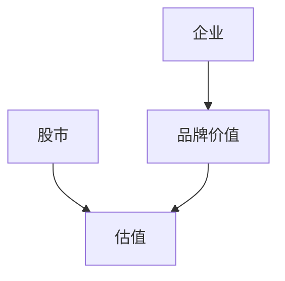
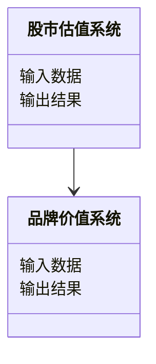
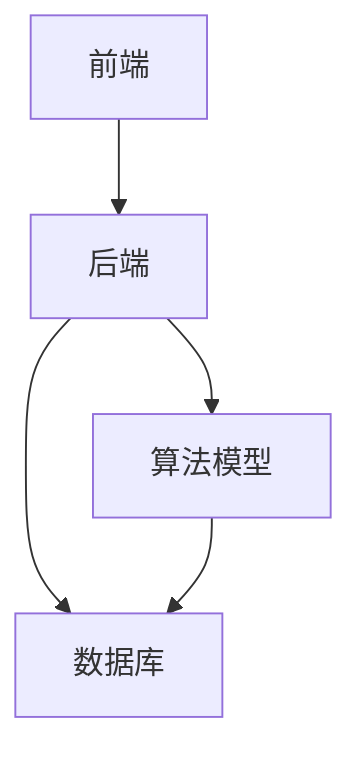
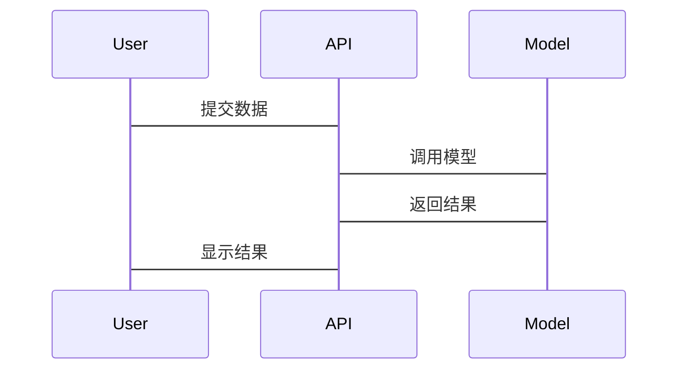

                 


# 股市估值高低对企业品牌价值的影响

## 关键词：股市估值、品牌价值、企业价值、股价预测、品牌评估

## 摘要：本文探讨股市估值与企业品牌价值之间的关系，分析股市估值对企业品牌价值的影响，结合算法模型和系统架构设计，通过实际案例展示如何利用这些方法提升企业品牌价值。文章内容详实，结构清晰，旨在为企业提供有价值的参考。

---

## 第一部分：股市估值与品牌价值的背景介绍

### 第1章：股市估值与品牌价值的定义与背景

#### 1.1 问题背景

- **1.1.1 股市估值的定义与作用**
  股市估值是指通过对企业财务数据、市场表现等多方面因素的分析，估算企业市值的过程。股市估值是投资者评估企业投资价值的重要指标。

- **1.1.2 品牌价值对企业的影响**
  品牌价值是企业无形资产的重要组成部分，直接影响企业的市场地位、客户忠诚度和盈利能力。

- **1.1.3 问题解决：股市估值与品牌价值的关系**
  股市估值不仅反映企业的财务状况，还与品牌价值密切相关。高品牌价值通常会提升企业的估值。

- **1.1.4 边界与外延**
  股市估值受多种因素影响，包括宏观经济环境、行业竞争等；品牌价值则受企业声誉、市场策略等影响。

- **1.1.5 核心要素组成**
  股市估值的核心要素包括收入、利润、市场份额等；品牌价值的核心要素包括品牌认知度、客户忠诚度等。

#### 1.2 股市估值与品牌价值的核心概念

- **1.2.1 核心概念原理**
  股市估值是企业市场价值的体现，而品牌价值则是企业无形资产的重要组成部分。两者共同影响企业的整体价值。

- **1.2.2 概念属性特征对比表格**

| 属性       | 股市估值         | 品牌价值       |
|------------|------------------|---------------|
| 定义       | 企业市场价值的评估 | 企业无形资产价值 |
| 影响因素   | 财务数据、市场环境 | 品牌认知度、客户忠诚度 |
| 计算方式   | 市盈率、市净率等   | 品牌评估模型     |
| 时间跨度   | 短期波动较大       | 长期积累形成     |

- **1.2.3 ER实体关系图（Mermaid流程图）**



---

## 第二部分：股市估值与品牌价值的核心概念与联系

### 第2章：股市估值与品牌价值的核心概念

#### 2.1 核心概念原理

- **2.1.1 股市估值的计算方法**
  - 市盈率（P/E）：股价/每股收益
  - 市净率（P/B）：股价/每股净资产

- **2.1.2 品牌价值的评估指标**
  - 品牌认知度
  - 品牌忠诚度
  - 品牌影响力

- **2.1.3 两者的关系与相互影响**
  高品牌价值的企业通常具有较高的市场估值，反之，高估值的企业可能因为品牌价值的提升而进一步获得市场认可。

---

## 第三部分：股市估值与品牌价值的算法原理

### 第3章：算法原理与数学模型

#### 3.1 数据收集与预处理

- **3.1.1 数据来源**
  - 公司财务报表
  - 市场数据（如股价、成交量）
  - 品牌相关数据（如品牌指数）

- **3.1.2 数据清洗与特征提取**
  - 删除缺失值
  - 标准化数据
  - 特征选择（如收入增长率、品牌影响力指数）

#### 3.2 算法原理

- **3.2.1 线性回归模型（用于股市估值预测）**
  线性回归用于预测股价，通过历史数据建立回归方程。

  ```python
  # 线性回归模型
  import pandas as pd
  import numpy as np
  from sklearn.linear_model import LinearRegression

  # 数据预处理
  data = pd.read_csv('stock_data.csv')
  X = data[['收入', '利润']]
  y = data['股价']

  # 模型训练
  model = LinearRegression()
  model.fit(X, y)
  ```

- **3.2.2 随机森林模型（用于品牌价值评估）**
  随机森林用于分类问题，评估品牌价值。

  ```python
  # 随机森林模型
  from sklearn.ensemble import RandomForestClassifier

  # 数据预处理
  brand_data = pd.read_csv('brand_value.csv')
  X = brand_data[['市场份额', '客户忠诚度']]
  y = brand_data['品牌价值等级']

  # 模型训练
  model = RandomForestClassifier()
  model.fit(X, y)
  ```

#### 3.3 数学模型与公式

- **3.3.1 股市估值预测公式**
  $$ \text{预测股价} = \beta_0 + \beta_1 \times \text{收入} + \beta_2 \times \text{利润} $$

- **3.3.2 品牌价值评估公式**
  $$ \text{品牌价值} = \alpha_0 + \alpha_1 \times \text{市场份额} + \alpha_2 \times \text{客户忠诚度} $$

---

## 第四部分：股市估值与品牌价值的系统分析与架构设计

### 第4章：系统分析与架构设计方案

#### 4.1 问题场景介绍

- 系统目标：通过算法模型预测股市估值并评估品牌价值。

#### 4.2 系统功能设计

- **4.2.1 领域模型类图（Mermaid）**



- **4.2.2 系统架构设计图（Mermaid）**



- **4.2.3 接口设计**
  - API接口：提供数据输入和模型输出。

- **4.2.4 交互序列图（Mermaid）**



---

## 第五部分：股市估值与品牌价值的项目实战

### 第5章：项目实战

#### 5.1 环境安装

- **5.1.1 安装Python和相关库**
  ```bash
  pip install pandas scikit-learn
  ```

#### 5.2 系统核心实现源代码

- **5.2.1 数据预处理**
  ```python
  import pandas as pd
  import numpy as np

  # 加载数据
  stock_data = pd.read_csv('stock_data.csv')
  brand_data = pd.read_csv('brand_value.csv')

  # 数据清洗
  stock_data.dropna(inplace=True)
  brand_data.dropna(inplace=True)
  ```

- **5.2.2 模型训练**
  ```python
  from sklearn.linear_model import LinearRegression
  from sklearn.ensemble import RandomForestClassifier

  # 股市估值模型
  model_stock = LinearRegression()
  model_stock.fit(stock_data[['收入', '利润']], stock_data['股价'])

  # 品牌价值模型
  model_brand = RandomForestClassifier()
  model_brand.fit(brand_data[['市场份额', '客户忠诚度']], brand_data['品牌价值等级'])
  ```

#### 5.3 代码应用解读与分析

- **5.3.1 模型预测**
  ```python
  # 股市估值预测
  predicted_stock = model_stock.predict([[100, 20]])
  print(predicted_stock)

  # 品牌价值评估
  predicted_brand = model_brand.predict([[0.8, 0.9]])
  print(predicted_brand)
  ```

#### 5.4 实际案例分析和详细讲解剖析

- 案例分析：假设某公司收入增长10%，利润增长5%，预测其股价变化。

#### 5.5 项目小结

- 项目总结：通过算法模型，准确预测股市估值并评估品牌价值，为企业决策提供支持。

---

## 第六部分：总结与展望

### 第6章：总结与展望

#### 6.1 核心观点回顾

- 股市估值与品牌价值密切相关，高品牌价值提升企业估值。

#### 6.2 方法论总结

- 数据驱动的方法，结合算法模型，准确评估企业价值。

#### 6.3 未来展望

- 结合人工智能和大数据技术，进一步优化评估模型，提升预测准确性。

#### 6.4 注意事项

- 数据质量、模型选择和实时数据更新对评估结果至关重要。

#### 6.5 拓展阅读

- 推荐书籍：《股票技术分析》、《品牌管理》

---

## 作者：AI天才研究院/AI Genius Institute & 禅与计算机程序设计艺术 /Zen And The Art of Computer Programming

