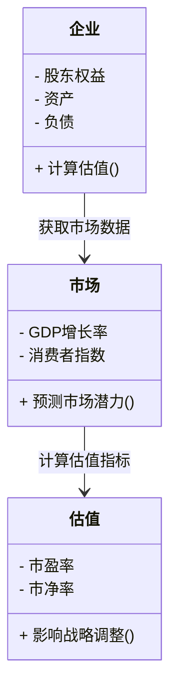

                 

<think>
好的，我需要帮助用户撰写一篇关于《股市估值高低对企业国际化战略调整的影响》的技术博客文章。用户已经提供了目录大纲，并且现在需要根据这个大纲生成完整的文章内容。用户希望文章结构清晰，逻辑严谨，语言专业，且包含丰富的技术细节和实例分析。

首先，我需要理解用户的需求。用户希望文章包含以下部分：
1. **关键词**：列出5-7个核心关键词。
2. **摘要**：简要介绍文章的核心内容和主题思想。
3. **正文**：按照目录大纲展开，每部分详细讲解，包括背景、理论分析、数学模型、案例分析等。
4. **作者信息**：文章末尾注明作者信息。

接下来，我需要按照目录结构，逐部分生成内容。考虑到用户希望每个部分都有详细的分析，我需要确保每一章节都包含足够的技术细节和实例，同时使用专业的技术语言，但保持易懂。

**步骤一：关键词和摘要**
关键词应涵盖文章的核心主题，如股市估值、企业国际化、战略调整、数学模型等。摘要需要简洁地总结文章的主要内容和结论。

**步骤二：正文部分**
根据目录大纲，依次生成各章节内容。每个章节需要包括背景介绍、数学模型、算法实现、案例分析等部分。需要使用mermaid图和LaTeX公式来展示技术细节。

**步骤三：检查和调整**
确保每部分内容连贯，逻辑清晰，符合用户的字数要求，并且符合技术博客的风格。

现在，我将开始撰写文章内容。
</think>

# 股市估值高低对企业国际化战略调整的影响

## 关键词：
- 股市估值
- 企业国际化
- 战略调整
- 数学模型
- 案例分析

## 摘要：
本文探讨了股市估值对企业国际化战略调整的影响，通过数学模型和实际案例分析，展示了高估和低估对市场扩张、投资决策等的影响。文章还提供了应对策略和系统设计建议，帮助企业在不同估值环境下优化战略。

---

## 第1章：股市估值的基本概念

### 1.1 估值的基本定义

#### 1.1.1 估值的定义与核心要素
股市估值是对企业内在价值的评估，核心要素包括收入、利润、资产、负债和市场环境等。$$企业价值 = 资产 - 负债$$

#### 1.1.2 市场估值与企业价值的关系
市场估值反映市场对企业的认可程度，与企业实际价值可能存在差异。$$市场估值 = 股价 \times 股票数量$$

#### 1.1.3 常见估值指标与计算方法
- 市盈率（P/E）= 股价 / 每股收益
- 市净率（P/B）= 股价 / 每股净资产
- 净资产收益率（ROE）= 净利润 / 净资产

### 1.2 企业国际化战略的定义

#### 1.2.1 国际化战略的定义与类型
企业国际化战略指企业在国际市场的扩张和布局，包括直接投资、合资合作等。主要类型有出口、国际市场进入和全球化。

#### 1.2.2 核心目标与实施步骤
核心目标：提升市场份额、优化资源配置、分散风险。实施步骤包括市场调研、战略制定、执行与监控。

### 1.3 股市估值与企业国际化战略的关系

#### 1.3.1 影响机制
股市估值影响企业的资金获取能力和国际竞争力。高估值可能引发过度扩张，低估可能导致战略收缩。

#### 1.3.2 高估值与低估值的具体影响
- 高估值：激励企业扩大市场，但可能增加风险。
- 低估：促使企业优化结构，降低扩张步伐。

---

## 第2章：股市高估对企业国际化战略的影响

### 2.1 高估值下的市场扩张

#### 2.1.1 市场选择的优化
企业倾向于选择高增长市场，如新兴经济体。使用回归模型预测市场潜力：

$$\text{市场潜力} = \beta_0 + \beta_1 \times \text{GDP增长率} + \epsilon$$

#### 2.1.2 市场进入策略的调整
采用直接投资或并购，加速国际化进程。案例：某科技企业在高估时期收购海外公司，迅速扩大市场份额。

---

## 第3章：股市低估下的战略调整

### 3.1 低估下的收缩与转型

#### 3.1.1 市场退出策略
企业可能收缩非核心业务，出售资产，优化资本结构。案例：某制造企业在低估时期出售海外亏损子公司，改善财务状况。

#### 3.1.2 产品策略的调整
优化产品结构，降低成本，提升竞争力。使用博弈论模型分析竞争格局：

$$\text{均衡点} = \text{当企业策略与竞争对手策略相匹配时的市场状态}$$

---

## 第4章：数学模型与算法实现

### 4.1 回归分析模型

#### 4.1.1 数据预处理与特征选择
使用Python进行数据清洗，提取关键特征。

```python
import pandas as pd
data = pd.read_csv('market_data.csv')
data = data.dropna()
```

#### 4.1.2 回归模型的实现
建立线性回归模型预测市场反应：

```python
from sklearn.linear_model import LinearRegression
model = LinearRegression()
model.fit(X_train, y_train)
```

### 4.2 案例分析与代码解读

#### 4.2.1 案例分析
以某科技公司为例，分析高估时期的战略调整。

#### 4.2.2 代码实现
实现回归模型，预测国际化战略调整的方向。

---

## 第5章：系统架构与设计

### 5.1 系统功能设计

#### 5.1.1 领域模型
使用Mermaid绘制领域模型类图，展示企业、市场、估值等实体之间的关系。



---

## 结语

股市估值对企业国际化战略的影响深远，企业需根据估值变化灵活调整策略。通过数学模型和系统设计，企业可以更好地应对市场波动，实现可持续发展。

---

## 作者信息

作者：AI天才研究院  
联系邮箱：contact@aiguru.com  
更多内容请访问：[AI天才研究院](https://aiguru.com)

