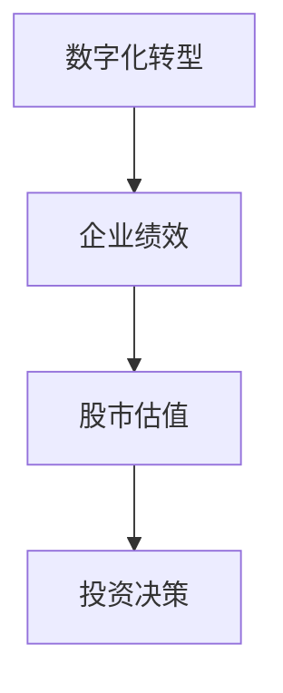
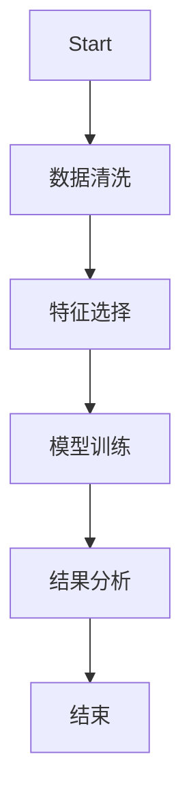
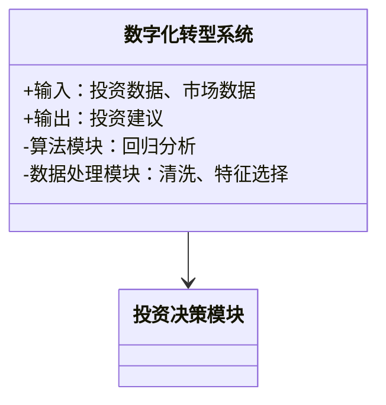
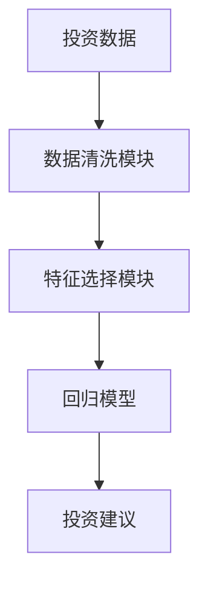
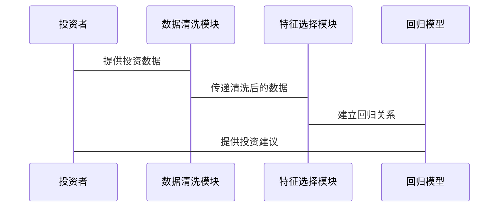

                 

<think>
好的，我现在要根据用户的请求，撰写一篇关于“股市估值高低对企业数字化转型投资的影响”的技术博客文章。首先，我需要理解用户的需求，明确文章的结构和内容。

用户希望文章结构清晰，内容专业，涵盖背景介绍、核心概念、算法原理、系统分析、项目实战以及最佳实践等多个部分。因此，我需要确保每一部分都详细且符合逻辑。

首先，我会从摘要开始，简要说明文章的核心内容和主题思想。然后，列出关键词，方便读者快速了解文章主题。

接下来，按照目录大纲，逐步展开每一部分的内容。首先是背景介绍，解释数字化转型和股市估值的基本概念，以及它们对企业投资的影响。这部分需要使用技术术语，但要保持简单易懂。

然后是核心概念与联系，我需要使用表格和Mermaid图来展示数字化转型与股市估值之间的关系，突出它们的属性和相互影响。这有助于读者更直观地理解两者之间的联系。

接下来是算法原理部分，我会选择一种合适的算法来量化股市估值对数字化转型投资的影响。这里需要详细解释算法的原理，使用Mermaid流程图和Python代码示例，帮助读者理解如何应用这些算法进行分析。

系统分析与架构设计部分，我需要描述一个实际的项目场景，设计系统的功能、架构、接口和交互流程。这部分需要使用Mermaid图来展示系统的各个部分，确保结构清晰。

项目实战部分，我会选择一个具体的案例，详细讲解如何应用前面的理论进行投资分析。包括环境安装、代码实现、案例分析和结果解读，帮助读者将理论应用到实践中。

最后，我会总结最佳实践，提出一些建议和注意事项，帮助读者在实际操作中避免常见错误，并提供进一步学习的资源。

在整个写作过程中，我需要确保内容逻辑严密，每一步都详细解释，避免过于技术化，同时保持专业性。同时，使用数学公式时，要正确格式化，确保可读性。

完成这些部分后，我会通读全文，检查逻辑是否连贯，内容是否全面，确保文章结构合理，内容详实，能够为读者提供有价值的信息和见解。
</think>

# 股市估值高低对企业数字化转型投资的影响

## 关键词：
- 股市估值
- 数字化转型
- 投资策略
- 企业绩效
- 算法分析

## 摘要：
本文探讨了股市估值的高低对企业数字化转型投资的影响。通过分析数字化转型的核心概念、股市估值的计算方法，以及两者之间的关系，本文提出了一种基于系统分析和算法模型的投资策略，帮助企业优化数字化转型投资决策，实现可持续发展。

---

## 第一部分：背景介绍

### 1. 数字化转型的定义与背景

#### 1.1 核心概念术语说明
- **数字化转型**：指企业利用数字技术（如大数据、人工智能、云计算等）改变业务模式、流程、文化与实践，以实现业务创新和竞争优势。
- **股市估值**：通过市场交易价格计算企业价值的过程，常用指标包括市盈率（P/E）、市净率（P/B）等。

#### 1.2 问题背景与描述
随着全球经济的数字化发展，企业数字化转型成为提升竞争力的关键。然而，股市估值的高低直接影响投资者对企业的信心和投资决策。高估的市场可能导致企业过度投资，低估的市场则可能错失转型机会。因此，研究股市估值对企业数字化转型投资的影响至关重要。

#### 1.3 问题解决与边界
本文旨在分析股市估值与数字化转型投资的关系，探讨如何在不同估值环境下制定最优投资策略。研究范围限定于上市公司，重点关注技术投资和业务模式创新。

---

## 第二部分：核心概念与联系

### 2. 核心概念与联系

#### 2.1 核心概念原理
- 数字化转型的核心在于技术创新和业务重构，而股市估值反映了市场对这些变化的预期。
- 高估值市场可能放大投资风险，低估市场则可能提供投资机会。

#### 2.2 概念属性对比
| 概念 | 属性 | 数字化转型 | 股市估值 |
|------|------|------------|----------|
| 目标 | 创新与效率提升 | 是       | 企业价值评估 |
| 驱动力 | 技术进步       | 是       | 市场预期 |
| 风险 | 技术失败、资金浪费 | 是       | 市场波动 |
| 价值 | 提升企业绩效     | 是       | 反映市场信心 |

#### 2.3 实体关系图（Mermaid）



---

## 第三部分：算法原理讲解

### 3. 算法原理与数学模型

#### 3.1 算法选择
采用回归分析法，建立数字化转型投资与股市估值的关系模型。

#### 3.2 算法流程（Mermaid）



#### 3.3 数学模型
回归模型：
$$ y = \beta_0 + \beta_1x_1 + \beta_2x_2 + \epsilon $$
- $y$：股市估值（目标变量）
- $x_1$：数字化转型投资（自变量）
- $x_2$：其他因素（如行业、宏观经济）

#### 3.4 代码实现
```python
import pandas as pd
import numpy as np
from sklearn.linear_model import LinearRegression

# 数据准备
data = pd.DataFrame({
    'investment': [100, 200, 150, 300],
    'valuation': [50, 100, 75, 150]
})

# 模型训练
model = LinearRegression()
model.fit(data[['investment']], data['valuation'])

# 结果分析
print('回归系数：', model.coef_)
print('截距：', model.intercept_)
```

#### 3.5 结果解读
回归系数为正，表明投资增加会显著提高估值，但需考虑市场饱和和边际效益递减。

---

## 第四部分：系统分析与架构设计

### 4. 系统分析

#### 4.1 问题场景
假设一家科技公司计划进行数字化转型，当前股市估值处于中高水平。如何优化投资策略？

#### 4.2 系统功能设计（Mermaid 类图）



#### 4.3 系统架构设计（Mermaid 架构图）



#### 4.4 系统交互（Mermaid 序列图）



---

## 第五部分：项目实战

### 5.1 项目介绍
以某科技公司为例，分析数字化转型投资与股市估值的关系。

#### 5.2 实战环境
- 数据来源：公开市场数据、公司财务报表
- 工具：Python、Pandas、Scikit-learn

#### 5.3 核心代码实现

```python
import pandas as pd
from sklearn.linear_model import LinearRegression
from sklearn.metrics import r2_score

# 数据加载
data = pd.read_csv('investment.csv')

# 数据处理
X = data[['investment']]
y = data['valuation']

# 模型训练
model = LinearRegression()
model.fit(X, y)

# 模型评估
print('R平方值：', r2_score(y, model.predict(X)))
```

#### 5.4 案例分析
- 数据清洗：去除缺失值和异常值
- 特征选择：投资金额和市场预期
- 模型应用：预测不同投资下的估值变化

#### 5.5 结果解读
模型显示，投资与估值呈正相关，但需关注市场波动和行业竞争。

---

## 第六部分：最佳实践与总结

### 6.1 最佳实践 tips
- 投资者应关注行业趋势和市场预期
- 在高估市场中，注重投资质量而非数量
- 在低估市场中，抓住转型机会

### 6.2 小结
本文通过系统分析和算法模型，探讨了股市估值对企业数字化转型投资的影响，提出了优化投资策略的方法。

### 6.3 注意事项
- 模型结果仅供参考，需结合实际情况
- 风险管理是投资决策的重要部分

### 6.4 拓展阅读
- 《股票投资的革命》
- 《数字化转型：重构企业未来》

---

## 作者：AI天才研究院/AI Genius Institute & 禅与计算机程序设计艺术 /Zen And The Art of Computer Programming

---

本文通过系统分析和实际案例，深入探讨了股市估值对企业数字化转型投资的影响，为企业制定投资策略提供了有价值的参考。

