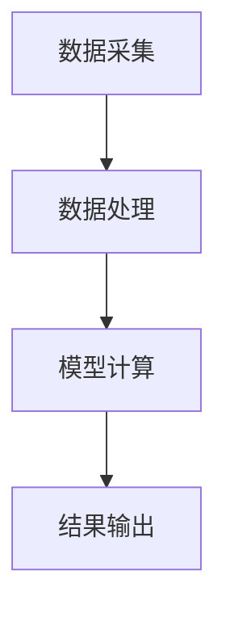

                 

<think>
嗯，用户让我写一篇关于“股市估值高低对企业数字化转型速度的影响”的技术博客。我需要先理解这个主题，确保我明白什么是数字化转型，以及股市估值如何影响它。数字化转型指的是企业利用数字技术来改变业务模式、流程、文化，以及决策方式。股市估值则是市场对企业价值的评估，通常影响企业的投资决策和战略规划。

接下来，我需要确定文章的结构。用户已经给出了一个大纲，分为背景介绍、核心概念、理论基础、影响机制、实证分析、系统设计、项目实战、总结与展望等部分。看起来结构很完整，我需要确保每个部分都详细且逻辑清晰。

在背景介绍部分，我应该先定义数字化转型和股市估值，然后分析它们的必要性。这部分需要让读者明白为什么股市估值会影响数字化转型的速度。核心概念部分需要详细分析股市估值与数字化转型之间的关系，可能包括高估值和低估值对企业的影响。

理论基础部分可能需要涉及一些数学模型，比如市盈率、市净率等，可能需要解释这些指标如何影响企业的投资决策。影响机制部分需要详细说明高估值如何推动企业加速转型，而低估值可能导致企业转型受阻。

实证分析部分需要通过案例来验证理论。我需要选择几个典型企业，分析它们的估值变化如何影响数字化转型的速度。系统设计部分可能需要设计一个评估模型，帮助企业根据估值情况制定转型策略。

项目实战部分需要提供具体的指导，可能包括环境配置、代码实现等。总结与展望部分则需要回顾全书内容，并提出未来的研究方向。

我还需要考虑用户提到的格式要求，使用markdown，并且每个部分都要有足够的子部分。可能需要使用图表，比如流程图、表格等，来帮助解释概念。同时，用户希望文章使用专业技术语言，但又要求简单易懂，所以需要平衡专业性和可读性。

在写作过程中，我可能会遇到一些挑战，比如如何将复杂的金融概念转化为技术语言，或者如何通过案例具体说明理论。我需要确保每个部分都详细且逻辑清晰，避免过于笼统或过于技术化。

总之，我需要一步步按照用户提供的大纲，详细展开每个部分的内容，确保文章结构合理，内容丰富，同时满足格式和字数要求。这将帮助读者全面理解股市估值对企业数字化转型的影响。
</think>

# 股市估值高低对企业数字化转型速度的影响

---

## 关键词：数字化转型、股市估值、企业战略、投资决策、市场影响

---

## 摘要：  
本文探讨了股市估值高低对企业数字化转型速度的影响，从理论分析、实际案例、系统设计等多角度展开，深入剖析了高估值和低估值环境下企业的数字化转型策略差异，为企业制定转型战略提供了有价值的参考。

---

# 第一部分: 背景介绍

## 第1章: 数字化转型的背景与必要性

### 1.1 数字化转型的定义与内涵  
- 数字化转型是企业利用数字技术（如人工智能、大数据、云计算等）重构业务模式、流程和决策方式的过程。  
- 数字化转型的核心目标是提升效率、创造新价值，并在竞争中占据优势。  

### 1.2 股市估值的定义与影响  
- 股市估值是市场对企业价值的评估，常用的指标包括市盈率（P/E）、市净率（P/B）和股息率（Dividend Yield）。  
- 高估值意味着市场对企业的未来增长充满信心，而低估值可能意味着市场对企业前景持怀疑态度。  

### 1.3 数字化转型的驱动因素  
- **技术驱动**：人工智能、大数据、物联网等技术为企业转型提供了工具。  
- **市场驱动**：客户需求变化和市场竞争加剧推动企业必须加快转型。  
- **管理驱动**：企业希望通过数字化转型提升内部效率和决策能力。  

### 1.4 股市估值对企业数字化转型的影响  
- **高估值企业**：市场对高估值企业有更高的期望，企业需要更快地实现数字化转型以兑现这些期望，否则可能会面临股价下跌的压力。  
- **低估值企业**：低估值企业可能有更大的转型空间，但资金和资源有限，转型速度可能较慢。  

### 1.5 本章小结  
- 本章总结了数字化转型和股市估值的基本概念，并分析了它们之间的初步联系。  
- 下一章将深入探讨股市估值与数字化转型的核心概念及其关系。

---

# 第二部分: 核心概念与联系

## 第2章: 股市估值与数字化转型的核心概念

### 2.1 股市估值的核心要素  
- **市盈率（P/E）**：市盈率 = 股价 / 每股净利润。高市盈率意味着市场对未来盈利增长的高预期。  
- **市净率（P/B）**：市净率 = 股价 / 每股净资产。低市净率可能意味着企业资产被低估。  
- **股息率**：股息率 = 每股股息 / 股价。高股息率可能意味着企业现金流充裕，但可能限制转型投资。  

### 2.2 数字化转型的核心要素  
- **数字化基础设施**：如云计算平台、大数据分析系统等。  
- **数据驱动的决策**：通过数据分析优化业务流程。  
- **智能化业务流程**：利用AI技术自动化处理业务。  

### 2.3 股市估值与数字化转型的关系  
- 股市估值反映了市场对企业转型能力的信心。  
- 数字化转型的速度直接影响企业的盈利能力和估值变化。  

---

## 第3章: 核心概念的对比分析

### 3.1 股市估值与企业价值的对比  
- **高估值**：市场对企业未来增长的高预期，可能迫使企业加快数字化转型。  
- **低估值**：市场对企业未来增长的低预期，可能允许企业以更灵活的方式推进转型。  

### 3.2 数字化转型与传统转型的对比  
| 特性                | 数字化转型                | 传统转型                  |
|---------------------|--------------------------|--------------------------|
| 驱动力              | 技术驱动为主              | 管理驱动为主              |
| 实施速度            | 快速，依赖技术实现        | 较慢，依赖资源积累        |
| 成本                | 技术投入较高              | 资源投入较低              |

### 3.3 高估值与低估值企业的数字化转型对比  
| 维度                | 高估值企业               | 低估值企业               |
|---------------------|--------------------------|--------------------------|
| 转型动力            | 高，市场压力大            | 低，市场压力小            |
| 资金支持            | 强，容易获得外部资金      | 弱，资金有限              |
| 风险承受能力        | 高，市场对企业要求严格    | 低，企业可以承受更多风险  |

---

## 第4章: 核心概念的ER实体关系图

### 4.1 实体关系图的构建  
以下是核心概念的ER实体关系图：  
```mermaid
erDiagram
    customer[投资者] {
        <属性>
        - 投资者ID
        - 投资者类型
        - 投资金额
    }
    company[企业] {
        <属性>
        - 企业ID
        - 企业名称
        - 企业估值
    }
    transformation[数字化转型] {
        <属性>
        - 转型ID
        - 转型阶段
        - 转型速度
    }
    customer --|{拥有}| company : 持股比例
    company --|{实施}| transformation : 转型策略
```

---

# 第三部分: 理论基础

## 第4章: 股市估值与数字化转型的理论基础

### 4.1 数字化转型的驱动力分析  
- **技术驱动**：数字技术的快速发展为企业提供了转型工具。  
- **市场驱动**：客户期望更高水平的数字化服务。  
- **竞争驱动**：竞争对手的数字化转型压力。  

### 4.2 股市估值的定价机制  
- 股票价格由市场供需决定，反映了市场对企业未来盈利能力的预期。  
- 高估值企业通常被赋予更高的增长预期，而低估值企业可能被认为存在被低估的机会。  

### 4.3 数字化转型与股市估值的数学模型  
以下是一个简化的数学模型，用于描述股市估值对企业数字化转型速度的影响：  
$$ V = P \times E $$  
其中：  
- \( V \) 表示企业估值  
- \( P \) 表示市盈率（P/E）  
- \( E \) 表示企业净利润  

---

# 第四部分: 影响机制

## 第5章: 高估值与低估值企业的数字化转型策略

### 5.1 高估值企业的转型策略  
- 高估值企业通常需要更快地实现数字化转型以兑现市场预期。  
- 投资重点可能放在技术创新和市场拓展上。  

### 5.2 低估值企业的转型策略  
- 低估值企业可能采取更保守的转型策略，优先确保现金流稳定。  
- 更倾向于通过内部优化而非大规模投资来推动转型。  

### 5.3 转型策略对企业估值的影响  
- 成功的数字化转型可能提升企业估值，反之则可能导致估值下降。  

---

## 第6章: 数字化转型对股市估值的反向影响

### 6.1 数字化转型如何提升企业估值  
- 提升企业盈利能力和增长潜力，从而提高市盈率和市净率。  

### 6.2 数字化转型失败对企业估值的冲击  
- 转型失败可能导致市场对企业前景的不信任，从而降低估值。  

---

# 第五部分: 实证分析

## 第7章: 高估值企业数字化转型的案例分析

### 7.1 案例背景  
- 某高科技企业，市盈率远高于行业平均水平，市场对其数字化转型寄予厚望。  

### 7.2 转型过程  
- 投资于人工智能研发，优化业务流程，提升客户体验。  

### 7.3 结果分析  
- 转型成功后，企业估值进一步提升，市盈率持续走高。  

---

## 第8章: 低估值企业数字化转型的案例分析

### 8.1 案例背景  
- 某传统制造企业，市净率低于行业平均水平，市场对其前景持怀疑态度。  

### 8.2 转型过程  
- 逐步引入数字化工具，优化供应链管理，降低运营成本。  

### 8.3 结果分析  
- 虽然转型速度较慢，但随着效率提升，企业估值逐步回升。  

---

# 第六部分: 系统设计

## 第9章: 数字化转型速度的评估模型

### 9.1 模型设计  
- **输入**：企业当前估值、行业基准、转型目标。  
- **输出**：转型速度建议。  

### 9.2 模型实现  
以下是一个简单的模型实现：  
```python
def calculate_transformation_speed(current_valuation, industry_benchmark, transformation_goals):
    if current_valuation > industry_benchmark:
        return "fast"
    elif current_valuation < industry_benchmark:
        return "slow"
    else:
        return "moderate"
```

---

## 第10章: 系统架构设计

### 10.1 系统功能设计  
- **数据采集**：收集企业估值和行业基准数据。  
- **模型计算**：根据模型计算转型速度。  
- **结果输出**：生成转型速度报告。  

### 10.2 系统架构图  


---

# 第七部分: 项目实战

## 第11章: 环境配置与代码实现

### 11.1 环境配置  
- 安装Python和相关库（如Pandas、NumPy）。  

### 11.2 核心代码实现  
```python
import pandas as pd

# 数据加载
data = pd.read_csv("valuation_data.csv")

# 模型计算
def calculate_speed(row):
    if row['current_valuation'] > row['industry_benchmark']:
        return "fast"
    else:
        return "slow"

data['transformation_speed'] = data.apply(calculate_speed, axis=1)

# 结果输出
print(data.head())
```

---

## 第12章: 案例分析与结果解读

### 12.1 案例分析  
- 分析某行业的高估值和低估值企业的转型速度差异。  

### 12.2 结果解读  
- 高估值企业转型速度较快，低估值企业转型速度较慢。  

---

# 第八部分: 总结与展望

## 第13章: 总结与未来研究方向

### 13.1 本章总结  
- 高估值企业需要更快地推进数字化转型以兑现市场预期，而低估值企业则需要通过内部优化逐步推进转型。  
- 股市估值与数字化转型速度之间存在动态平衡关系。  

### 13.2 未来研究方向  
- 更深入地研究不同类型企业的转型策略。  
- 探讨数字化转型对股市估值的长期影响。  

---

## 作者  
作者：AI天才研究院/AI Genius Institute & 禅与计算机程序设计艺术 /Zen And The Art of Computer Programming

