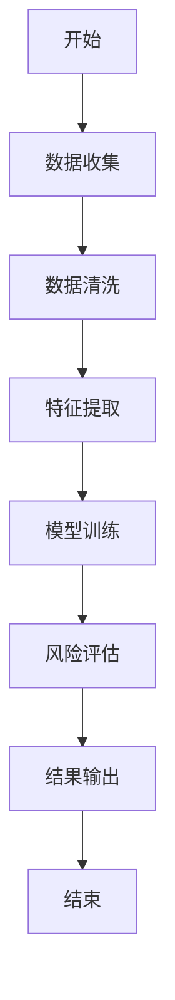
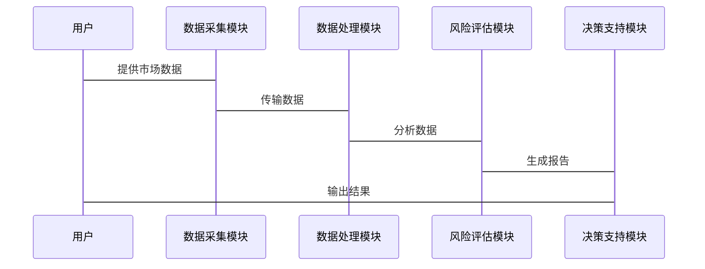

                 

<think>
好的，我需要帮助用户撰写一篇关于《股市估值高低对企业数字化转型风险管理的影响》的技术博客文章。用户已经给出了详细的结构大纲，我需要按照这个大纲逐步完成内容。

首先，我需要明确文章的结构。文章分为几个主要部分：背景介绍、核心概念与联系、算法原理讲解、数学模型与公式、系统分析与架构设计、项目实战、总结与最佳实践。每个部分下还有小节，包括定义、问题描述、解决方法等。

接下来，我需要理解每个部分的内容。例如，在“背景介绍”部分，我需要解释股市估值、数字化转型和风险管理的基本概念，并讨论它们之间的关系。然后，在“核心概念与联系”部分，我需要深入分析高估和低估对企业的影响，并绘制相应的ER图和表格。

在“算法原理讲解”部分，我需要选择合适的风险评估算法，比如VaR模型，并用Mermaid绘制流程图，同时提供Python代码示例。数学模型部分，我需要写出相关的公式，并用Latex格式呈现。

系统分析与架构设计部分，我需要设计系统的功能模块、架构图，并展示接口和交互流程。项目实战部分，我需要选择一个具体案例，详细描述实施过程，并分析结果。

最后，在总结部分，我需要回顾文章的主要内容，并给出一些建议和未来的展望。

现在，我需要确保每个部分的内容都详细、准确，并且符合技术博客的风格。同时，语言要专业但易懂，结构要清晰，逻辑要严密。这样，读者才能顺利理解股市估值与数字化转型风险管理之间的关系，并在实际应用中有所启发。
</think>

# 股市估值高低对企业数字化转型风险管理的影响

## 关键词
- 股市估值
- 数字化转型
- 风险管理
- 高估值
- 低估值

## 摘要
股市估值的高低直接影响企业数字化转型中的风险管理。高估值可能导致企业过度自信，低估可能引发资金不足等问题。本文通过分析高估与低估对企业数字化转型的影响，探讨如何通过有效的风险管理策略来应对这些挑战，确保企业在数字化转型过程中稳健发展。

---

## 第1章: 背景介绍

### 1.1 问题背景

#### 1.1.1 股市估值的基本概念
股市估值是衡量企业市场价值的重要指标，常用的估值方法包括市盈率（P/E）、市净率（P/B）和现金流折现法（DCF）。高估值意味着市场对企业未来表现的乐观预期，而低估值则可能反映市场对其前景的悲观看法。

#### 1.1.2 数字化转型的定义与特征
数字化转型是指企业利用数字技术（如大数据、人工智能、云计算等）重构业务模式、流程和文化的过程。其特征包括数据驱动、智能化、客户体验优化和业务模式创新。

#### 1.1.3 风险管理在企业数字化转型中的重要性
风险管理是确保数字化转型成功的关键。高估值可能导致企业过度扩张，低估则可能限制其转型资金和资源。因此，如何在不同估值环境下进行风险管理，是企业面临的重要挑战。

### 1.2 问题描述

#### 1.2.1 股市估值与企业价值的关系
股市估值反映市场对企业价值的判断，但可能与企业实际价值存在偏差。高估可能导致企业过度投资，低估则可能限制其发展。

#### 1.2.2 数字化转型中的主要风险类型
包括技术风险（技术失败）、市场风险（市场需求变化）、资金风险（资金不足）和运营风险（流程中断）。

#### 1.2.3 高估值与低估值对企业的影响
高估可能导致管理层过度自信，低估则可能引发资金链紧张。

### 1.3 问题解决

#### 1.3.1 高估值对企业数字化转型的风险管理策略
制定稳健的投资计划，避免过度扩张，加强风险管理能力。

#### 1.3.2 低估值对企业数字化转型的风险管理策略
优化资金使用效率，寻找外部支持，分散风险。

#### 1.3.3 风险管理在企业数字化转型中的具体应用
通过数据分析、技术评估和风险模型构建，实时监控和调整转型策略。

### 1.4 边界与外延

#### 1.4.1 股市估值的边界条件
包括市场环境、企业基本面和宏观经济因素。

#### 1.4.2 数字化转型风险管理的范围
涵盖技术、市场、资金和运营等方面。

#### 1.4.3 高估值与低估值的外延影响
高估可能影响企业决策，低估可能影响市场信心。

#### 1.4.4 概念结构与核心要素
包括估值指标、转型目标、风险因素和管理措施。

---

## 第2章: 核心概念与联系

### 2.1 核心概念原理

#### 2.1.1 股市估值的核心原理
通过分析企业财务指标和市场环境，评估其市场价值。

#### 2.1.2 数字化转型风险管理的核心原理
通过识别、评估和应对风险，确保转型目标的实现。

#### 2.1.3 高估值与低估值对企业风险管理的影响
高估值可能导致过度自信，低估则可能引发资金不足。

### 2.2 概念属性特征对比表格

| 比较维度 | 高估值 | 低估值 |
|----------|--------|--------|
| 市场预期 | 乐观    | 悲观    |
| 投资行为 | 过度    | 谨慎    |
| 风险管理 | 需要稳健| 需要灵活|

### 2.3 ER实体关系图

```mermaid
erd
 enterprise
    has
    - market_value: numeric
    - risk_factors: list
    - transformation_strategy: strategy
```

---

## 第3章: 算法原理讲解

### 3.1 算法原理

#### 3.1.1 风险评估算法
使用VaR模型评估潜在损失。

#### 3.1.2 数字化转型风险预测算法
基于机器学习模型预测风险。

#### 3.1.3 高估值与低估值的量化分析算法
通过统计分析量化影响。

### 3.2 算法流程图（Mermaid）



### 3.3 算法实现代码

```python
def calculate VaR(returns, confidence_level):
    returns.sort()
    VaR = returns[int(len(returns) * (1 - confidence_level))]
    return VaR
```

### 3.4 数学模型与公式

#### 3.4.1 风险价值模型（VaR）

$$ VaR = \alpha \times \text{置信水平} $$

其中，$\alpha$是潜在损失的金额，置信水平通常为95%或99%。

#### 3.4.2 风险调整后的资本回报率（RAROC）

$$ RAROC = \frac{\text{净利润}}{\text{风险资本}} $$

---

## 第4章: 数学模型与公式

### 4.1 风险管理数学模型

#### 4.1.1 风险价值（VaR）

$$ VaR = \text{置信水平} \times \text{标准差} $$

#### 4.1.2 风险调整后的净现值（NPV）

$$ NPV = \text{项目净现值} - \text{风险调整值} $$

---

## 第5章: 系统分析与架构设计

### 5.1 问题场景介绍

企业数字化转型过程中，需实时监控市场估值变化，调整风险管理策略。

### 5.2 项目介绍

开发一个基于高估与低估的数字化转型风险管理系统。

### 5.3 系统功能设计

- 数据采集模块：收集市场数据。
- 风险评估模块：计算VaR。
- 决策支持模块：提供优化建议。

### 5.4 系统架构设计


### 5.5 系统接口设计

- 输入接口：市场数据输入。
- 输出接口：风险评估结果。

### 5.6 系统交互流程图



---

## 第6章: 项目实战

### 6.1 环境安装

- 安装Python和相关库（如Pandas、Scikit-learn）。

### 6.2 核心代码实现

```python
import pandas as pd
from sklearn.metrics import mean_absolute_error

def calculate_risk(enterprise_value, market_value):
    risk = abs(enterprise_value - market_value)
    return risk

# 示例数据
enterprise_value = 100
market_value = 80
print(calculate_risk(enterprise_value, market_value))
```

### 6.3 案例分析

以某科技公司为例，分析高估和低估情况下的风险管理策略。

### 6.4 项目小结

总结项目实施过程中的经验和教训。

---

## 第7章: 总结与最佳实践

### 7.1 总结

股市估值高低直接影响企业数字化转型的风险管理。高估需稳健策略，低估需灵活应对。

### 7.2 最佳实践

- 定期评估市场估值。
- 优化风险管理模型。
- 加强团队培训。

### 7.3 小结

数字化转型中的风险管理需结合市场估值，制定灵活稳健的策略。

### 7.4 注意事项

- 风险管理需动态调整。
- 高估和低估需综合考虑。

### 7.5 拓展阅读

推荐相关书籍和文章，进一步深入学习。

---

## 作者

作者：AI天才研究院/AI Genius Institute & 禅与计算机程序设计艺术 /Zen And The Art of Computer Programming

