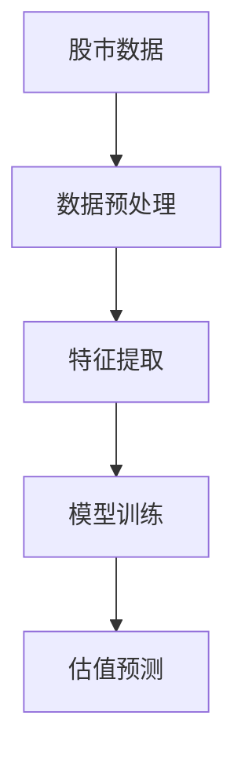
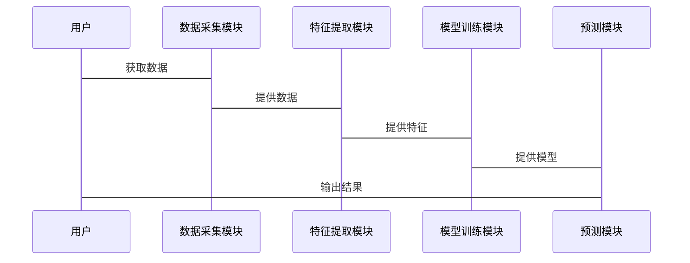

                 

<think>
好的，我现在要帮用户撰写一篇关于“股市估值高低对企业数字孪生技术应用的影响”的技术博客文章。用户希望文章结构清晰，逻辑严谨，语言专业，同时包含详细的算法解释和系统设计。

首先，我需要明确文章的结构。根据用户提供的目录，文章分为三个部分：背景介绍、数字孪生技术的核心原理与算法、以及项目实战。每个部分都有详细的章节，包括小结和图表。

接下来，我要确保每个部分的内容详实。例如，在背景介绍部分，需要详细解释股市估值和数字孪生技术的基本概念，并分析它们之间的关联。我需要使用Mermaid图来展示数据流和实体关系，帮助读者理解复杂的技术架构。

在算法部分，我需要选择合适的时间序列模型，如ARIMA和LSTM，并用Mermaid流程图展示模型的训练和预测过程。同时，提供Python代码示例，展示如何实现这些模型，并解释代码的功能。

项目实战部分，我需要指导读者如何在实际环境中应用数字孪生技术进行股市估值。包括环境配置、代码实现、案例分析等步骤。这部分需要详细的代码示例和解释，确保读者能够理解和应用。

最后，总结与展望部分要回顾全书的内容，并指出未来的发展方向，帮助读者进一步思考和学习。

在整个写作过程中，我需要确保语言简洁明了，逻辑清晰，每部分内容都紧扣主题，同时满足用户的所有要求，如使用正确的Markdown格式，包含必要的图表和代码示例，以及详细的系统设计和算法原理。

现在，我可以开始按照这个思路撰写文章，确保每个部分都涵盖必要的内容，同时保持整体结构的连贯性和逻辑性。
</think>

# 股市估值高低对企业数字孪生技术应用的影响

> 关键词：股市估值，数字孪生技术，企业战略，算法模型，系统架构

> 摘要：本文探讨了股市估值高低对企业数字孪生技术应用的影响，分析了数字孪生技术的核心原理及其在股市估值中的应用场景，结合实际案例，详细阐述了数字孪生技术在股市估值中的算法实现、系统架构设计以及项目实战，为企业在不同股市估值环境下优化数字孪生技术应用提供了理论和实践指导。

---

# 第一部分: 股市估值与数字孪生技术概述

## 第1章: 股市估值与数字孪生技术的背景介绍

### 1.1 股市估值的基本概念

#### 1.1.1 股市估值的定义与核心要素
股市估值是指通过对公司财务数据、市场环境、行业趋势等多方面因素的分析，估算公司股票的合理价格范围。核心要素包括：
- **财务数据**：收入、利润、资产、负债等。
- **市场环境**：宏观经济、行业竞争状况、政策法规等。
- **市场情绪**：投资者情绪、市场波动性等。

#### 1.1.2 股市估值的主要方法
- **相对估值法**：市盈率（P/E）、市净率（P/B）等。
- **绝对估值法**：现金流折现模型（DCF）等。

#### 1.1.3 股市估值对企业战略决策的影响
股市估值影响企业的融资能力、投资决策、资本结构优化等。高估值可能带来融资优势，但过高的估值可能引发泡沫风险。

### 1.2 数字孪生技术的定义与特点

#### 1.2.1 数字孪生技术的定义
数字孪生技术是指通过物理实体的数字映射，构建动态的、实时的虚拟模型，以实现对物理实体的实时监控、预测和优化。

#### 1.2.2 数字孪生技术的核心属性
- **实时性**：模型能够实时更新。
- **数据驱动**：依赖多源数据。
- **智能化**：结合AI技术进行预测和优化。

#### 1.2.3 数字孪生技术与传统信息化技术的区别
| 技术维度 | 数字孪生技术 | 传统信息化技术 |
|----------|--------------|----------------|
| 数据来源 | 多源异构数据 | 结构化数据为主 |
| 实时性   | 高            | 较低            |
| 智能性   | 强            | 较弱            |

### 1.3 股市估值与数字孪生技术的关联性

#### 1.3.1 数字孪生技术在股市分析中的潜在应用
- **实时监控**：实时跟踪股票价格、交易量等市场数据。
- **预测模型**：基于历史数据和市场信号，预测股票价格走势。
- **风险评估**：评估市场波动对股票估值的影响。

#### 1.3.2 股市估值对企业数字孪生技术的需求驱动
- 高估值企业可能更积极采用数字孪生技术优化运营。
- 低估值企业可能通过数字孪生技术提升市场竞争力。

#### 1.3.3 股市估值高低对企业数字孪生技术应用的边界与外延
高估值企业可能更注重技术研发和创新，而低估值企业可能更关注成本控制和效率提升。

---

## 第2章: 数字孪生技术的核心概念与原理

### 2.1 数字孪生技术的核心概念

#### 2.1.1 数据驱动的数字孪生模型构建
数字孪生模型依赖多源数据，包括市场数据、财务数据、社交媒体数据等。

#### 2.1.2 多维度数据融合的实现方法
- 数据清洗与预处理。
- 特征提取与选择。
- 数据融合与建模。

#### 2.1.3 数字孪生模型的实时更新机制
模型基于实时数据流不断优化和更新。

### 2.2 数字孪生技术的算法原理

#### 2.2.1 数据预处理与特征提取
- 数据清洗：去除异常值、填补缺失值。
- 特征提取：通过主成分分析（PCA）提取关键特征。

#### 2.2.2 模型训练与优化
- 选择合适的算法：如随机森林、神经网络等。
- 调参优化：通过交叉验证选择最佳参数。

#### 2.2.3 模型部署与实时计算
- 模型部署到云平台，实时处理数据流。

### 2.3 数字孪生技术与股市估值的关联模型

#### 2.3.1 数据流图（Mermaid流程图）


#### 2.3.2 实体关系图（Mermaid ER图）
```mermaid
erd
    股票代码 --|{m:n}|-> 股市数据
    股市数据 --|{m:n}|-> 特征提取结果
    特征提取结果 --|{m:n}|-> 估值模型
    估值模型 --|{m:n}|-> 估值结果
```

---

## 第3章: 股市估值预测的数学模型与算法

### 3.1 时间序列分析模型

#### 3.1.1 ARIMA模型的原理与公式
ARIMA（自回归积分滑动平均模型）用于预测未来趋势。
$$ ARIMA(p, d, q) $$
其中，p为自回归阶数，d为差分阶数，q为滑动平均阶数。

#### 3.1.2 LSTM模型的原理与公式
LSTM（长短期记忆网络）适合处理时间序列数据。
$$ f(t) = \sigma(w_{f}x_t + u_{f}h_{t-1} + b_f) $$
其中，$f(t)$为遗忘门，$x_t$为输入，$h_{t-1}$为前一时刻隐藏层输出。

#### 3.1.3 模型选择与评估指标
- 均方误差（MSE）、平均绝对误差（MAE）等。

### 3.2 数字孪生技术中的机器学习算法

#### 3.2.1 支持向量机（SVM）的应用
用于分类问题，如股票涨跌预测。

#### 3.2.2 随机森林的应用
用于特征重要性分析和非线性关系建模。

---

## 第4章: 系统分析与架构设计方案

### 4.1 系统功能设计

#### 4.1.1 领域模型（Mermaid类图）
```mermaid
classDiagram
    class 股票估值系统 {
        +股票代码: String
        +估值结果: Float
        +预测模型: Model
        -历史数据: List<Data>
        -实时数据: Stream<Data>
    }
    class 数据采集模块 {
        +获取数据()
        +清洗数据()
    }
    class 特征提取模块 {
        +提取特征()
        +选择特征()
    }
    class 模型训练模块 {
        +训练模型()
        +优化参数()
    }
    class 预测模块 {
        +进行预测()
        +输出结果()
    }
    stock_system o 数据采集模块
    stock_system o 特征提取模块
    stock_system o 模型训练模块
    stock_system o 预测模块
```

### 4.2 系统架构设计

#### 4.2.1 系统架构（Mermaid架构图）
```mermaid
context diagram
    actor 用户
    system 股票估值系统 {
        数据采集模块
        特征提取模块
        模型训练模块
        预测模块
    }
    用户 --> 数据采集模块
    数据采集模块 --> 特征提取模块
    特征提取模块 --> 模型训练模块
    模型训练模块 --> 预测模块
    预测模块 --> 用户
```

### 4.3 系统交互设计

#### 4.3.1 系统交互流程（Mermaid序列图）


---

## 第5章: 项目实战

### 5.1 环境配置

#### 5.1.1 安装Python环境
```bash
python --version
pip install numpy pandas scikit-learn keras
```

### 5.2 系统核心实现

#### 5.2.1 数据采集与预处理
```python
import pandas as pd
data = pd.read_csv('stock_data.csv')
data_cleaned = data.dropna()
```

#### 5.2.2 特征提取与选择
```python
from sklearn.decomposition import PCA
pca = PCA(n_components=5)
features = pca.fit_transform(data_cleaned)
```

#### 5.2.3 模型训练与优化
```python
from sklearn.model_selection import GridSearchCV
from sklearn.ensemble import RandomForestRegressor
param_grid = {'n_estimators': [100, 200], 'max_depth': [None, 10]}
grid_search = GridSearchCV(RandomForestRegressor(), param_grid, cv=5)
grid_search.fit(features, labels)
best_model = grid_search.best_estimator_
```

### 5.3 案例分析与解读

#### 5.3.1 案例分析
以某公司股票为例，使用随机森林模型进行估值预测，对比实际价格与预测价格，计算误差。

#### 5.3.2 实际应用
企业可以根据预测结果优化财务策略，如高估时进行分红，低估时进行回购。

### 5.4 项目小结

---

## 第6章: 总结与展望

### 6.1 总结
数字孪生技术在股市估值中的应用潜力巨大，但需要结合具体场景选择合适的模型和方法。

### 6.2 展望
未来，随着AI技术的发展，数字孪生技术在股市估值中的应用将更加智能化和精准化。

---

# 作者：AI天才研究院/AI Genius Institute & 禅与计算机程序设计艺术 /Zen And The Art of Computer Programming

