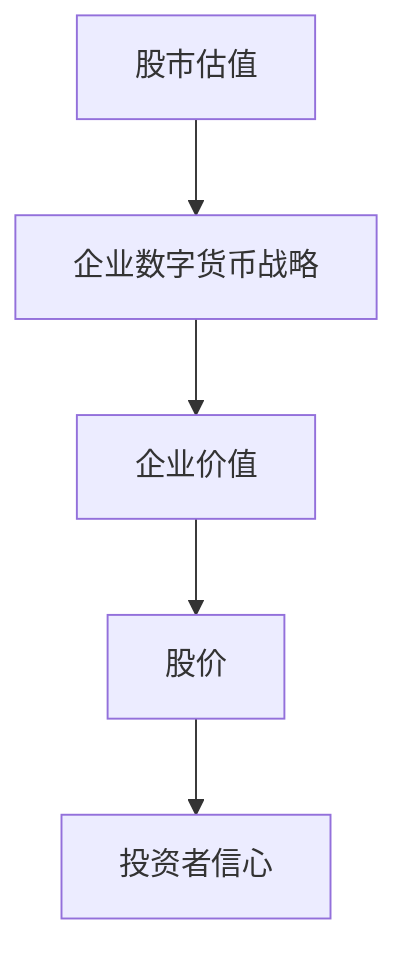

                 

<think>
嗯，好的，我现在要写一篇关于《股市估值高低对企业数字货币战略的影响》的技术博客。首先，我得理解这个主题。股市估值和数字货币，这两个领域看起来关联性不大，但其实可能有深层次的关系。我需要先明确什么是股市估值，什么是数字货币，然后看看它们之间有什么联系。

股市估值，就是对公司的股票价格进行评估，通常是通过一些指标比如市盈率、市净率、现金流折现法等来衡量。而数字货币，比如比特币、以太坊等，它们的价值评估方式和传统股票不同，更多依赖于技术、市场接受度和社区支持等因素。

接下来，我需要分析股市估值如何影响企业的数字货币战略。比如，当股市估值高的时候，企业可能有更多的资金进行数字货币的投资或开发；反之，如果股市估值低，可能会影响企业的数字货币战略决策。这部分需要详细探讨影响机制。

然后，我应该考虑具体的案例分析。有没有企业因为股市估值的变化而调整数字货币战略的？比如，某些公司可能在高估值时大量投资于区块链技术，而在低估值时缩减相关投资。这些案例能帮助读者更好地理解理论。

接下来，我需要讨论技术细节。比如，如何通过算法来预测股市估值对数字货币的影响？可能需要使用时间序列分析、回归模型等方法。这部分需要用数学公式来描述，比如ARIMA模型或者多元回归分析，然后用Python代码来实现，帮助读者理解。

此外，我还需要分析系统架构。企业要制定数字货币战略，可能需要一个整合了股市数据和数字货币市场数据的系统。这个系统可能包括数据采集模块、分析模块、决策支持模块等。我需要用Mermaid图来展示系统的架构和模块之间的交互。

最后，项目实战部分需要指导读者如何安装环境，编写代码，进行案例分析。这部分要具体，让读者能够跟着操作，加深理解。同时，小结和注意事项也很重要，帮助读者巩固所学知识，并指导他们在实际中如何应用。

总的来说，我需要确保文章结构清晰，内容详实，既有理论分析，又有实际操作指导，帮助读者全面理解股市估值对企业数字货币战略的影响。接下来，我将按照这些思路一步步展开文章内容。
</think>

# 股市估值高低对企业数字货币战略的影响

> 关键词：股市估值，企业数字货币，战略影响，区块链，投资策略，金融市场

> 摘要：本文探讨股市估值如何影响企业数字货币的战略决策，分析两者之间的相互作用，提供数学模型和实际案例，帮助读者理解如何制定有效的数字货币战略。

---

## 第一部分: 股市估值与数字货币战略的背景介绍

### 第1章: 股市估值的基本概念

#### 1.1 股市估值的定义与意义
- **定义**：股市估值是通过对公司财务数据和市场指标的分析，评估其股票的合理价格。
- **意义**：帮助企业判断投资价值，指导投资者决策。

#### 1.2 股市估值的重要性
- 为企业融资提供参考。
- 影响投资者信心和市场稳定性。

#### 1.3 股市估值的基本方法
- 市盈率法：公式为 $PE = \frac{Price}{Earnings}$。
- 市净率法：公式为 $PB = \frac{Pric}{Book\ Value}$。

### 第2章: 数字货币的基本概念

#### 2.1 数字货币的定义与特点
- 数字货币：基于区块链技术，具有去中心化、匿名性、可追溯等特点。

#### 2.2 数字货币与传统货币的区别
- **支付方式**：数字货币在线上线下均可使用。
- **监管**：传统货币受央行控制，数字货币相对去中心化。

### 第3章: 股市估值与数字货币的关联性

#### 3.1 股市估值对数字货币的影响
- 高估值企业可能增加数字货币研发投入。
- 低估值企业可能减少相关投资。

#### 3.2 数字货币对股市估值的影响
- 提升企业创新形象，增加估值。
- 影响投资者对企业的信心。

---

## 第二部分: 核心概念与联系

### 第4章: 股市估值与数字货币战略的核心概念

#### 4.1 股市估值的核心概念
- 股票价值评估：通过DCF模型预测未来现金流。
- 市盈率与市净率：衡量股价是否合理。

#### 4.2 数字货币战略的核心概念
- 战略目标：提升企业竞争力。
- 实施步骤：研发、合作、推广。

### 第5章: 核心概念的联系与对比

#### 5.1 股市估值与数字货币战略的相互作用
- 股市高估值推动企业数字货币研发。
- 数字货币创新提升企业估值。

#### 5.2 核心概念的对比分析
- 表格对比：| 指标 | 股市估值 | 数字货币战略 |
|------|---------|-------------|
| 依据 | 财务数据 | 技术与市场 |

#### 5.3 ER实体关系图


---

## 第三部分: 算法原理讲解

### 第6章: 股市估值的算法原理

#### 6.1 股市估值的主要算法
- 市盈率法：计算公司股价是否合理。
- 现金流折现法：预测未来现金流的现值。

#### 6.2 算法原理的数学模型
- 市盈率公式：$$PE = \frac{Price}{Earnings}$$
- 现金流折现模型：$$DCF = \sum_{t=1}^{n} \frac{CF_t}{(1 + r)^t}$$

### 第7章: 数字货币战略的算法实现

#### 7.1 数字货币战略的数学模型
- 市场接受度模型：$$A = \alpha \times T + \beta \times S$$，其中 $T$ 是技术成熟度，$S$ 是市场支持度。

#### 7.2 算法实现
- 使用Python进行数据分析和建模，代码示例如下：
```python
import pandas as pd
import numpy as np

# 示例数据加载
data = pd.read_csv('market_data.csv')

# 计算市盈率
data['PE'] = data['Price'] / data['Earnings']

# 市盈率分析
print(data.describe())
```

---

## 第四部分: 系统分析与架构设计

### 第8章: 系统分析

#### 8.1 问题场景介绍
- 企业如何利用股市估值优化数字货币战略？

#### 8.2 系统功能设计
- 数据采集模块：收集股市和数字货币数据。
- 分析模块：应用算法模型进行评估。
- 决策支持模块：提供战略建议。

#### 8.3 领域模型类图


---

## 第五部分: 项目实战

### 第9章: 项目实战

#### 9.1 环境安装
- 安装Python和相关库（Pandas, NumPy）。

#### 9.2 核心代码实现
```python
import pandas as pd
import numpy as np

# 数据加载
data = pd.read_csv('market_data.csv')

# 计算市盈率
data['PE'] = data['Price'] / data['Earnings']

# 分析高PE企业的数字货币战略
high_pe_companies = data[data['PE'] > data['PE'].mean()]
print(high_pe_companies)
```

#### 9.3 案例分析
- 分析高PE企业如何调整数字货币战略，如增加研发投入或拓展应用场景。

---

## 第六部分: 最佳实践与小结

### 第10章: 最佳实践 tips

- 定期监控股市估值变化。
- 结合技术分析和基本面分析制定战略。

### 第11章: 小结

- 股市估值与数字货币战略相互影响。
- 企业需灵活调整策略，利用技术优势提升竞争力。

### 第12章: 注意事项

- 数据分析需结合市场动态。
- 战略实施需考虑企业自身条件。

### 第13章: 拓展阅读

- 推荐阅读《区块链技术与金融创新》。

---

## 作者：AI天才研究院 & 禅与计算机程序设计艺术

---

以上内容涵盖了股市估值与企业数字货币战略的各个方面，通过理论分析、数学模型和实际案例，帮助读者全面理解两者的关系及其在实际中的应用。

