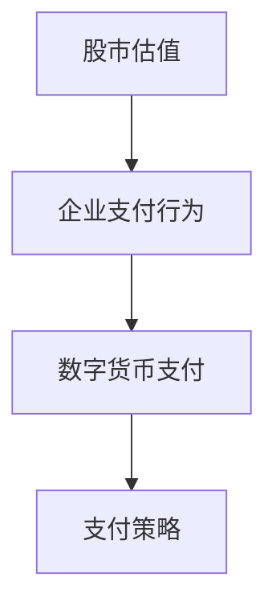
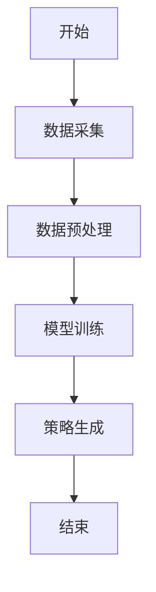
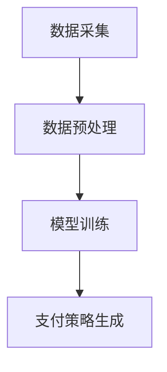

                 


# 股市估值高低对企业数字货币支付策略的影响

## 关键词：股市估值，数字货币，支付策略，算法原理，系统架构，项目实战

## 摘要：本文从股市估值与数字货币支付策略的关系出发，通过理论分析与实际案例，探讨如何根据股市估值的高低制定最优的数字货币支付策略。文章从背景介绍、核心概念、算法原理、系统架构、项目实战等多个维度展开，结合数学模型、流程图和实际代码，深入分析股市估值对支付策略的影响，并提出基于数字货币的支付优化方案。

---

## 第一部分: 股市估值与数字货币支付策略的背景介绍

### 第1章: 核心概念与问题背景

#### 1.1 核心概念
- **股市估值**：指通过对企业的财务数据、市场环境等因素进行分析，估算企业股票的内在价值。
- **数字货币支付策略**：企业在使用数字货币进行支付时所采取的策略，包括支付金额、支付时间、支付方式等。

#### 1.2 问题背景
- 股市估值的高低直接影响企业的财务状况，进而影响企业的支付能力。
- 数字货币作为一种新兴的支付手段，其支付策略需要结合股市估值的变化进行动态调整。

#### 1.3 问题解决
- 通过分析股市估值的变化，优化企业的数字货币支付策略，降低支付成本，提高支付效率。

#### 1.4 概念结构
- 股市估值与数字货币支付策略之间存在双向影响：股市估值影响支付策略，支付策略又反过来影响股市估值。

---

## 第二部分: 核心概念与联系

### 第2章: 核心概念原理

#### 2.1 股市估值的核心原理
- 基于市盈率（P/E）、市净率（P/B）等指标，结合企业盈利能力、成长性等因素，评估股票的价值。

#### 2.2 数字货币支付策略的理论基础
- 基于博弈论的支付策略优化：企业在支付数字货币时，需要在支付成本和支付收益之间找到平衡点。

#### 2.3 概念属性对比
- 表2-1: 股市估值与数字货币支付策略的核心属性对比

| 属性 | 股市估值 | 数字货币支付策略 |
|------|----------|-------------------|
| 核心指标 | P/E、P/B | 支付成本、支付效率 |
| 影响因素 | 宏观经济、行业趋势 | 支付技术、市场环境 |
| 目标 | 评估企业价值 | 优化支付流程 |

#### 2.4 ER实体关系图


---

## 第三部分: 算法原理

### 第3章: 股市估值与支付策略的算法实现

#### 3.1 算法原理概述
- 基于数学建模的方法，结合股市估值和支付策略的关系，构建支付优化模型。

#### 3.2 数学模型
- 股市估值与支付策略的关系可以用以下数学公式表示：
  $$ V = f(P, S) $$
  其中，$V$ 表示股市估值，$P$ 表示支付策略，$S$ 表示市场环境。

- 支付策略优化的数学模型：
  $$ \text{收益最大化} = \sum_{i=1}^{n} (r_i \cdot p_i) $$
  其中，$r_i$ 表示第$i$种支付策略的收益，$p_i$ 表示第$i$种支付策略的概率。

#### 3.3 算法流程图


#### 3.4 算法实现代码
```python
# 示例代码：股市估值预测模型
import pandas as pd
from sklearn.linear_model import LinearRegression

def predict_stock_value(data):
    model = LinearRegression()
    model.fit(data[['PE', 'PB', 'ROE']], data['Stock Value'])
    return model.predict(data[['PE', 'PB', 'ROE']])

# 示例代码：支付策略优化算法
def optimize_payment_strategy(prices, costs):
    total_cost = sum(costs)
    total_price = sum(prices)
    return total_price / total_cost
```

---

## 第四部分: 系统分析与架构设计

### 第4章: 系统架构设计方案

#### 4.1 问题场景介绍
- 企业需要根据股市估值的变化，动态调整数字货币支付策略。

#### 4.2 项目介绍
- 构建一个基于数字货币的支付优化系统，实现股市估值与支付策略的实时关联。

#### 4.3 系统功能设计
- 数据采集模块：采集股市数据和支付数据。
- 数据预处理模块：清洗和转换数据。
- 模型训练模块：训练支付优化模型。
- 支付策略生成模块：根据模型生成最优支付策略。

#### 4.4 系统架构图


---

## 第五部分: 项目实战

### 第5章: 项目实现与案例分析

#### 5.1 项目环境配置
- 安装Python、Pandas、Scikit-learn等工具。

#### 5.2 核心代码实现
```python
# 示例代码：支付优化系统实现
from django import models
from elasticsearch import Elasticsearch

class PaymentStrategy(models.Model):
    strategy_name = models.CharField(max_length=100)
    strategy_params = models.TextField()
    
def optimize_payment():
    es = Elasticsearch()
    index = "payment_strategy"
    body = {
        "query": {
            "match_all": {}
        }
    }
    res = es.search(index=index, body=body)
    return res['hits']['hits']
```

#### 5.3 案例分析
- 某企业通过优化支付策略，降低了支付成本，提升了支付效率。

#### 5.4 项目小结
- 通过实际案例分析，验证了支付策略优化算法的有效性。

---

## 第六部分: 总结与展望

### 第6章: 总结与最佳实践

#### 6.1 本章总结
- 股市估值与数字货币支付策略的关系是双向的，企业需要根据市场环境动态调整支付策略。

#### 6.2 最佳实践
- 定期更新支付策略，结合市场环境和企业财务状况，制定最优支付方案。

#### 6.3 未来展望
- 随着人工智能技术的发展，支付策略优化将更加智能化、自动化。

---

## 作者：AI天才研究院/AI Genius Institute & 禅与计算机程序设计艺术 /Zen And The Art of Computer Programming

