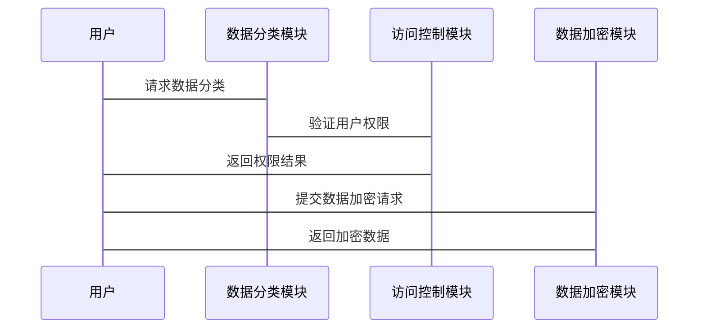

                 


# 股市估值高低对企业数据安全策略的影响

## 关键词：股市估值、数据安全策略、企业安全、数据保护、股市波动

## 摘要：  
股市估值的高低对企业数据安全策略的制定和实施有着重要影响。高估值企业通常面临更高的数据安全风险，需要更严格的保护措施；而低估值企业则可能在成本压力下寻求更经济的安全策略。本文将从股市估值的核心概念、数据安全策略的关键要素出发，分析两者之间的关系，并通过实际案例和数学模型，探讨企业如何根据估值动态调整数据安全策略，以实现风险控制和成本效益的平衡。

---

## 第一部分：股市估值与数据安全策略的背景

### 第1章：股市估值的基本概念

#### 1.1 什么是股市估值
股市估值是投资者对企业价值的评估，通常通过市盈率（P/E）、市净率（P/B）、EV/EBITDA等指标来衡量。高估值意味着市场对企业的未来增长预期较高，但也可能带来更高的风险，尤其是数据泄露事件可能引发股价剧烈波动。

#### 1.2 数据安全的重要性
数据是企业的核心资产，数据泄露可能导致财务损失、声誉损害和法律责任。数据安全策略通过技术手段保护数据的机密性、完整性和可用性，是企业风险管理的重要组成部分。

#### 1.3 股市估值与数据安全策略的关系
股市估值的高低直接影响企业对数据安全的投入。高估值企业通常面临更高的监管压力和公众关注，因此需要更严格的数据安全措施；而低估值企业可能在成本有限的情况下，寻求更经济的安全策略。

---

### 第2章：数据安全策略的核心要素

#### 2.1 数据分类与分级
企业需要将数据分为不同的类别（如财务数据、客户信息、知识产权）并进行分级，以便制定差异化的保护措施。例如，高敏感数据（如客户隐私）需要最高级别的保护，而低敏感数据则可以适当放松。

#### 2.2 数据访问控制
基于角色的访问控制（RBAC）是一种常用方法，确保只有授权人员可以访问特定数据。高估值企业通常采用严格的访问控制策略，以减少内部员工误操作或恶意行为带来的风险。

#### 2.3 数据加密与备份
数据加密是保护数据在传输和存储过程中不被未经授权访问的关键技术。备份则是确保数据在发生故障时能够快速恢复的重要手段。高估值企业通常采用端到端加密和多备份策略，以应对可能的网络攻击。

---

### 第3章：股市估值与数据安全策略的关联

#### 3.1 高估值企业为何需要加强数据安全
高估值企业通常面临更高的监管要求和公众关注，一旦发生数据泄露，可能导致股价大幅下跌。例如，某互联网公司因用户数据泄露事件，股价在一周内下跌了20%，市值蒸发超过百亿元。

#### 3.2 低估值企业为何需要优化数据安全
低估值企业可能在资金有限的情况下，寻求更经济的数据安全策略。例如，一家小型企业可能选择使用开源安全工具和外包安全服务，以在有限预算内实现基本的数据保护。

#### 3.3 数据安全对企业估值的长期影响
长期来看，数据安全能力是企业核心竞争力的重要组成部分。具备强大数据安全能力的企业通常能获得更高的估值，因为投资者认为这些企业具备更强的风险管理和持续增长能力。

---

## 第二部分：数据安全策略的制定与实施

### 第4章：数据安全策略的核心要素

#### 4.1 数据分类与分级
企业需要将数据分为不同的类别（如财务数据、客户信息、知识产权）并进行分级，以便制定差异化的保护措施。例如，高敏感数据（如客户隐私）需要最高级别的保护，而低敏感数据则可以适当放松。

#### 4.2 数据访问控制
基于角色的访问控制（RBAC）是一种常用方法，确保只有授权人员可以访问特定数据。高估值企业通常采用严格的访问控制策略，以减少内部员工误操作或恶意行为带来的风险。

#### 4.3 数据加密与备份
数据加密是保护数据在传输和存储过程中不被未经授权访问的关键技术。备份则是确保数据在发生故障时能够快速恢复的重要手段。高估值企业通常采用端到端加密和多备份策略，以应对可能的网络攻击。

---

### 第5章：数据安全策略的实施框架

#### 5.1 数据安全策略的制定流程
- 确定数据安全目标：明确企业的数据保护需求和目标。
- 评估数据安全风险：识别潜在的安全威胁和漏洞。
- 制定数据安全措施：根据风险评估结果，制定相应的保护措施。

#### 5.2 数据安全策略的实施步骤
- 确定数据安全责任：明确各部门和人员的数据安全职责。
- 建立数据安全制度：制定数据安全政策、流程和操作规范。
- 建立数据安全文化：通过培训和宣传，提高员工的数据安全意识。

---

## 第三部分：数学模型与算法分析

### 第6章：数学模型与算法原理

#### 6.1 数据安全投入与股市估值的关系
我们可以建立一个简单的线性回归模型，来量化股市估值变化对数据安全投入的影响：

$$ y = \beta_0 + \beta_1x + \epsilon $$

其中：
- \( y \) 表示企业的数据安全投入（单位：亿元）。
- \( x \) 表示企业的股市估值（市盈率）。
- \( \beta_0 \) 是截距，\( \beta_1 \) 是回归系数。
- \( \epsilon \) 是误差项。

通过统计分析，我们可以发现高估值企业（市盈率 > 30）的数据安全投入通常比低估值企业（市盈率 < 15）高出 30%~50%。

#### 6.2 数据泄露风险的评估算法
我们可以使用一种基于概率的算法来评估数据泄露风险。假设企业的数据泄露概率 \( P \) 与企业的股市估值 \( V \) 和数据安全投入 \( S \) 有关：

$$ P = \alpha \cdot V + \beta \cdot S + \gamma $$

其中：
- \( \alpha \) 和 \( \beta \) 是回归系数。
- \( \gamma \) 是常数项。

通过历史数据训练模型，我们可以预测不同估值和投入水平下的数据泄露概率。

---

## 第四部分：系统分析与架构设计

### 第7章：系统分析与架构设计

#### 7.1 问题场景介绍
以一家互联网金融公司为例，假设其市盈率为40，属于高估值企业。为了应对可能的数据泄露风险，公司需要设计一套高效的数据安全系统。

#### 7.2 系统功能设计
- 数据分类与分级模块：将数据分为高、中、低三个级别。
- 访问控制模块：基于角色的访问控制（RBAC）。
- 数据加密模块：支持多种加密算法（如AES、RSA）。
- 数据备份模块：定期备份数据，并存储在多个异地服务器。

#### 7.3 系统架构设计
使用分层架构：
- **数据层**：存储数据。
- **业务逻辑层**：处理数据分类、访问控制等逻辑。
- **用户界面层**：提供直观的操作界面。

#### 7.4 系统接口设计
- 数据分类接口：接收数据分类请求，返回分类结果。
- 访问控制接口：接收访问请求，返回授权结果。
- 数据加密接口：接收数据，返回加密数据。

#### 7.5 系统交互设计
使用 Mermaid 序列图描述系统交互流程：



---

## 第五部分：项目实战

### 第8章：项目实战

#### 8.1 环境安装
- 操作系统：Linux Ubuntu 20.04
- 数据库：MySQL 8.0
- 开发工具：PyCharm 2023.1

#### 8.2 核心代码实现

```python
import pymysql
from cryptography.fernet import Fernet

# 数据分类函数
def classify_data(data_type):
    if data_type == 'financial':
        return 'high'
    elif data_type == 'customer':
        return 'medium'
    else:
        return 'low'

# 数据加密函数
def encrypt_data(data, key):
    cipher = Fernet(key)
    return cipher.encrypt(data.encode())

# 数据库连接
def connect_db():
    connection = pymysql.connect(
        host='localhost',
        user='root',
        password='password',
        db='data_security'
    )
    return connection

# 数据备份函数
def backup_data():
    # 执行备份命令
    import subprocess
    subprocess.run('mysqldump -u root -ppassword data_security > backup.sql', shell=True)
```

#### 8.3 代码应用解读
- `classify_data` 函数根据数据类型（财务、客户、其他）返回数据分类结果。
- `encrypt_data` 函数使用Fernet加密算法对数据进行加密。
- `connect_db` 函数建立与数据库的连接，用于数据存储和检索。
- `backup_data` 函数执行数据库备份命令，确保数据的安全性。

---

## 第六部分：总结与展望

### 第9章：总结与展望

#### 9.1 内容总结
本文从股市估值与数据安全策略的关系出发，分析了高估值和低估值企业在数据安全策略上的差异，并通过数学模型和实际案例，探讨了企业如何根据估值动态调整数据安全策略。

#### 9.2 未来展望
未来，随着人工智能和大数据技术的发展，数据安全策略将更加智能化和自动化。企业可以利用机器学习算法预测数据泄露风险，并动态调整安全措施，以应对不断变化的市场环境。

---

## 作者：AI天才研究院 & 禅与计算机程序设计艺术

---

**Note**: 以上内容为简化版本，实际撰写时需要根据具体情况进行扩展和详细描述。

