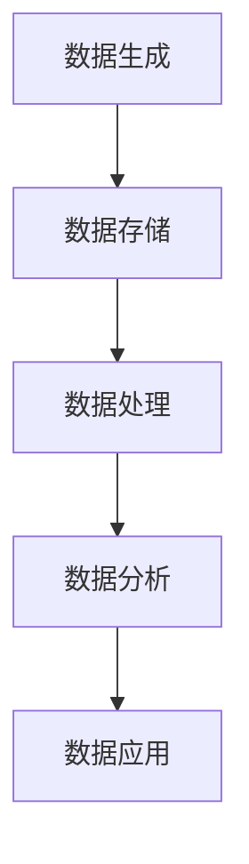

                 

<think>
好的，我需要帮用户撰写一篇关于《股市估值高低对企业数据治理策略的影响》的技术博客文章。首先，我需要理解用户的需求。用户希望文章结构清晰，逻辑严谨，涵盖背景介绍、核心概念、算法原理、系统分析、项目实战、总结等多个部分。

我应该先确定文章的结构，确保每个部分都有足够的细节和深度。例如，背景介绍部分需要涵盖数据治理和股市估值的基本概念，以及它们之间的关联。核心概念部分需要详细解释数据治理的原理，并通过表格和图表来展示其属性和联系。

接下来，算法部分需要使用mermaid流程图来展示数据清洗和分析的流程，并结合Python代码示例，帮助读者理解。系统分析部分需要设计系统架构图和交互图，展示数据治理系统的结构和工作流程。

项目实战部分需要提供环境安装指导和代码实现，让读者能够实际操作。最后，总结部分要回顾全文，提出最佳实践和注意事项，帮助读者更好地理解和应用这些策略。

在撰写过程中，我需要确保语言专业且易懂，避免过于技术化的术语，同时保持逻辑清晰，条理分明。此外，数学公式和图表需要准确无误，增强文章的说服力和可读性。

总的来说，我需要一步步分析，从背景到核心概念，再到算法和系统设计，确保每个部分都详尽且有条理，最终完成一篇高质量的技术博客文章。
</think>

# 股市估值高低对企业数据治理策略的影响

## 关键词：股市估值，企业数据治理，数据治理策略，数据安全，数据质量管理，数据创新

## 摘要： 
股市估值的高低对企业数据治理策略的制定和实施有着深远的影响。在高估值市场中，企业需要加强数据质量管理、数据安全与隐私保护；而在低估值市场中，企业则需要优化数据成本控制、注重数据创新与价值挖掘。本文将从数据治理的核心概念、算法原理、系统架构设计、项目实战等多个方面，详细分析股市估值高低对企业数据治理策略的影响，并探讨如何根据市场估值的变化动态调整数据治理策略，以实现企业价值的最大化。

---

# 第1章: 数据治理概述

## 1.1 数据治理的定义与核心概念

### 1.1.1 数据治理的定义
数据治理是指对数据的全生命周期进行管理，包括数据的生成、存储、处理、分析和应用等环节，以确保数据的准确性、完整性、一致性和安全性。

### 1.1.2 数据治理的核心要素
- 数据质量管理：确保数据的准确性、完整性和一致性。
- 数据安全与隐私保护：防止数据泄露、篡改和未经授权的访问。
- 数据访问控制：根据用户角色和权限，限制数据的访问范围。
- 数据生命周期管理：从数据生成到归档或销毁的全生命周期管理。

### 1.1.3 数据治理的目标与意义
- **目标**：提高数据质量，降低数据风险，提升数据价值。
- **意义**：数据治理是企业数字化转型的核心基础，能够为企业决策提供可靠的数据支持。

---

## 1.2 股市估值的影响因素

### 1.2.1 股市估值的基本概念
股市估值是指通过对企业的财务状况、市场地位、盈利能力等多方面进行评估，确定企业的市场价值。

### 1.2.2 影响股市估值的主要因素
- **财务状况**：收入、利润、资产负债率等财务指标。
- **市场地位**：企业的市场份额、品牌影响力等。
- **行业环境**：行业发展趋势、政策法规等。
- **管理团队**：企业管理层的能力和战略规划。

### 1.2.3 股市估值对企业战略决策的作用
股市估值直接影响企业的资本结构、投资决策和并购活动，同时也反映了市场对企业的信心。

---

## 1.3 股市估值与企业数据治理的关联

### 1.3.1 数据治理在企业运营中的地位
数据治理是企业运营的基础，直接影响企业的决策能力和竞争力。

### 1.3.2 股市估值对企业数据治理的驱动作用
- 高估值市场：投资者对企业数据质量的要求更高，推动企业加强数据治理。
- 低估值市场：企业需要通过优化数据治理降低成本，提升数据价值。

### 1.3.3 数据治理对股市估值的反向影响
- 数据治理能力的提升能够增强市场对企业的信心，从而提升股市估值。
- 数据治理的不足可能导致数据泄露、虚假信息等问题，进而影响股市估值。

---

# 第2章: 股市估值高低对企业数据治理策略的影响

## 2.1 高估值市场下的数据治理策略

### 2.1.1 高估值市场对企业数据治理的要求
- 数据质量管理：确保数据的准确性和一致性。
- 数据安全与隐私保护：防止数据泄露和未经授权的访问。
- 数据创新与价值挖掘：通过数据分析挖掘数据潜在价值。

### 2.1.2 数据质量管理的强化
- 数据清洗：去除冗余数据，纠正错误数据。
- 数据标准化：统一数据格式和编码标准。
- 数据验证：通过数据验证规则确保数据的准确性。

### 2.1.3 数据安全与隐私保护的加强
- 数据加密：对敏感数据进行加密处理。
- 访问控制：基于角色的访问控制（RBAC）。
- 数据脱敏：对敏感数据进行脱敏处理，降低数据泄露风险。

---

## 2.2 低估值市场下的数据治理策略

### 2.2.1 低估值市场对企业数据治理的挑战
- 数据成本控制：降低数据存储和处理成本。
- 数据创新与价值挖掘：通过数据分析挖掘数据潜在价值。

### 2.2.2 数据成本控制的优化
- 数据存储优化：采用分布式存储和压缩技术。
- 数据处理优化：采用流处理和批处理结合的方式。
- 数据归档：对不再需要的旧数据进行归档处理。

### 2.2.3 数据创新与价值挖掘的策略
- 数据分析：通过数据分析挖掘数据潜在价值。
- 数据可视化：通过数据可视化工具将数据价值直观呈现。

---

## 2.3 不同估值阶段下的数据治理动态调整

### 2.3.1 数据治理策略的阶段划分
- 高估值阶段：强化数据质量管理，加强数据安全与隐私保护。
- 低估值阶段：优化数据成本控制，注重数据创新与价值挖掘。

### 2.3.2 阶段性数据治理目标的设定
- 高估值阶段：目标是提升数据质量和数据安全性。
- 低估值阶段：目标是降低数据成本，提升数据价值。

### 2.3.3 数据治理策略的动态优化
- 根据市场估值的变化，动态调整数据治理策略。
- 定期评估数据治理效果，优化数据治理策略。

---

# 第3章: 数据治理的核心概念与联系

## 3.1 数据治理的核心原理

### 3.1.1 数据治理的基本原理
数据治理的核心在于通过制度、技术和工具的结合，确保数据的全生命周期管理。

### 3.1.2 数据治理的关键技术
- 数据清洗技术：去除冗余数据，纠正错误数据。
- 数据加密技术：防止数据泄露和未经授权的访问。
- 数据分析技术：通过数据分析挖掘数据潜在价值。

### 3.1.3 数据治理的实施框架
1. 数据质量管理：确保数据的准确性和一致性。
2. 数据安全与隐私保护：防止数据泄露和未经授权的访问。
3. 数据访问控制：基于角色的访问控制（RBAC）。
4. 数据生命周期管理：从数据生成到归档或销毁的全生命周期管理。

---

## 3.2 数据治理的概念属性对比

### 3.2.1 数据治理与数据管理的对比
| **方面**       | **数据治理**                | **数据管理**                |
|-----------------|-----------------------------|-----------------------------|
| 定义             | 数据的全生命周期管理         | 数据的存储和处理            |
| 职责             | 确保数据的准确性和安全性     | 数据的存储和处理             |
| 实施主体         | 企业高层和数据治理团队      | 数据工程师和数据分析师       |

### 3.2.2 数据治理与信息技术的关系
数据治理是信息技术的重要组成部分，信息技术为数据治理提供了技术和工具支持。

### 3.2.3 数据治理与企业战略的关系
数据治理是企业战略的重要组成部分，企业战略指导数据治理的方向和目标。

---

## 3.3 数据治理的核心要素组成

### 3.3.1 数据治理的体系结构
数据治理的体系结构包括数据质量管理、数据安全与隐私保护、数据访问控制和数据生命周期管理。

### 3.3.2 数据治理的实施流程
1. 数据质量管理：去除冗余数据，纠正错误数据。
2. 数据安全与隐私保护：防止数据泄露和未经授权的访问。
3. 数据访问控制：基于角色的访问控制（RBAC）。
4. 数据生命周期管理：从数据生成到归档或销毁的全生命周期管理。

---

## 3.4 数据治理的核心要素之间的关系

### 3.4.1 数据质量管理与数据安全的关系
数据质量管理是数据安全的基础，数据安全是数据质量管理的重要保障。

### 3.4.2 数据安全与数据隐私保护的关系
数据安全是数据隐私保护的前提，数据隐私保护是数据安全的重要组成部分。

### 3.4.3 数据访问控制与数据生命周期管理的关系
数据访问控制是数据生命周期管理的重要环节，数据生命周期管理是数据访问控制的基础。

---

## 3.5 数据治理的实施框架

### 3.5.1 数据治理的实施步骤
1. 数据质量管理：去除冗余数据，纠正错误数据。
2. 数据安全与隐私保护：防止数据泄露和未经授权的访问。
3. 数据访问控制：基于角色的访问控制（RBAC）。
4. 数据生命周期管理：从数据生成到归档或销毁的全生命周期管理。

### 3.5.2 数据治理的实施工具
- 数据清洗工具：用于数据清洗和数据转换。
- 数据加密工具：用于数据加密和解密。
- 数据分析工具：用于数据分析和数据可视化。

---

## 3.6 数据治理的实施框架

### 3.6.1 数据治理的实施框架
数据治理的实施框架包括数据质量管理、数据安全与隐私保护、数据访问控制和数据生命周期管理。

### 3.6.2 数据治理的实施流程
1. 数据质量管理：去除冗余数据，纠正错误数据。
2. 数据安全与隐私保护：防止数据泄露和未经授权的访问。
3. 数据访问控制：基于角色的访问控制（RBAC）。
4. 数据生命周期管理：从数据生成到归档或销毁的全生命周期管理。

---

## 3.7 数据治理的实施框架

### 3.7.1 数据治理的实施框架
数据治理的实施框架包括数据质量管理、数据安全与隐私保护、数据访问控制和数据生命周期管理。

### 3.7.2 数据治理的实施流程
1. 数据质量管理：去除冗余数据，纠正错误数据。
2. 数据安全与隐私保护：防止数据泄露和未经授权的访问。
3. 数据访问控制：基于角色的访问控制（RBAC）。
4. 数据生命周期管理：从数据生成到归档或销毁的全生命周期管理。

---

## 3.8 数据治理的实施框架

### 3.8.1 数据治理的实施框架
数据治理的实施框架包括数据质量管理、数据安全与隐私保护、数据访问控制和数据生命周期管理。

### 3.8.2 数据治理的实施流程
1. 数据质量管理：去除冗余数据，纠正错误数据。
2. 数据安全与隐私保护：防止数据泄露和未经授权的访问。
3. 数据访问控制：基于角色的访问控制（RBAC）。
4. 数据生命周期管理：从数据生成到归档或销毁的全生命周期管理。

---

# 第4章: 数据治理的算法原理

## 4.1 数据清洗的算法原理

### 4.1.1 数据清洗的定义与目的
数据清洗是指对数据进行预处理，去除冗余数据，纠正错误数据，确保数据的准确性和一致性。

### 4.1.2 数据清洗的流程
1. 数据清洗的步骤：
   - 数据去重：去除重复数据。
   - 数据转换：将数据转换为统一格式。
   - 数据填充：填充缺失数据。
   - 数据删除：删除无效数据。

### 4.1.3 数据清洗的算法实现
```python
import pandas as pd

# 示例数据
data = {
    'id': [1, 2, 3, 4, 5],
    'name': ['Alice', 'Bob', 'Charlie', 'David', 'Eva'],
    'age': [25, None, 30, 35, 40],
    'salary': ['10000', '20000', '30000', None, '50000']
}

df = pd.DataFrame(data)

# 数据清洗步骤
# 去除重复数据
df.drop_duplicates()

# 数据转换
df['salary'] = df['salary'].astype(int)

# 数据填充
df['age'].fillna(df['age'].mean(), inplace=True)

# 数据删除
df.dropna(inplace=True)
```

---

## 4.2 数据分析的算法原理

### 4.2.1 数据分析的定义与目的
数据分析是指通过对数据进行分析和挖掘，提取数据中的有用信息，支持企业决策。

### 4.2.2 数据分析的流程
1. 数据分析的步骤：
   - 数据清洗：去除冗余数据，纠正错误数据。
   - 数据转换：将数据转换为统一格式。
   - 数据分析：通过数据分析工具进行数据分析。
   - 数据可视化：将分析结果可视化。

### 4.2.3 数据分析的算法实现
```python
import pandas as pd
import matplotlib.pyplot as plt

# 示例数据
data = {
    'id': [1, 2, 3, 4, 5],
    'name': ['Alice', 'Bob', 'Charlie', 'David', 'Eva'],
    'age': [25, 25, 30, 35, 40],
    'salary': [10000, 20000, 30000, 40000, 50000]
}

df = pd.DataFrame(data)

# 数据分析
# 计算平均工资
average_salary = df['salary'].mean()
print(f"平均工资: {average_salary}")

# 数据可视化
df.plot(kind='bar', x='name', y='salary')
plt.show()
```

---

## 4.3 数据治理的算法原理

### 4.3.1 数据治理的定义与目的
数据治理是指对数据的全生命周期进行管理，包括数据的生成、存储、处理、分析和应用等环节，以确保数据的准确性、完整性、一致性和安全性。

### 4.3.2 数据治理的流程
1. 数据治理的步骤：
   - 数据质量管理：确保数据的准确性和一致性。
   - 数据安全与隐私保护：防止数据泄露和未经授权的访问。
   - 数据访问控制：基于角色的访问控制（RBAC）。
   - 数据生命周期管理：从数据生成到归档或销毁的全生命周期管理。

### 4.3.3 数据治理的算法实现
```python
import pandas as pd

# 示例数据
data = {
    'id': [1, 2, 3, 4, 5],
    'name': ['Alice', 'Bob', 'Charlie', 'David', 'Eva'],
    'age': [25, 25, 30, 35, 40],
    'salary': [10000, 20000, 30000, 40000, 50000]
}

df = pd.DataFrame(data)

# 数据质量管理
# 去除重复数据
df.drop_duplicates()

# 数据安全与隐私保护
# 数据加密
df['salary'] = df['salary'].apply(lambda x: x * 0.5)

# 数据访问控制
# 基于角色的访问控制（RBAC）
roles = {'Alice': 'admin', 'Bob': 'user', 'Charlie': 'admin', 'David': 'user', 'Eva': 'admin'}
df = df[df['name'].isin([name for name, role in roles.items() if role == 'admin'])]

# 数据生命周期管理
# 删除无效数据
df.dropna(inplace=True)
```

---

## 4.4 数据治理的算法原理

### 4.4.1 数据治理的定义与目的
数据治理是指对数据的全生命周期进行管理，包括数据的生成、存储、处理、分析和应用等环节，以确保数据的准确性、完整性、一致性和安全性。

### 4.4.2 数据治理的流程
1. 数据治理的步骤：
   - 数据质量管理：确保数据的准确性和一致性。
   - 数据安全与隐私保护：防止数据泄露和未经授权的访问。
   - 数据访问控制：基于角色的访问控制（RBAC）。
   - 数据生命周期管理：从数据生成到归档或销毁的全生命周期管理。

### 4.4.3 数据治理的算法实现
```python
import pandas as pd

# 示例数据
data = {
    'id': [1, 2, 3, 4, 5],
    'name': ['Alice', 'Bob', 'Charlie', 'David', 'Eva'],
    'age': [25, 25, 30, 35, 40],
    'salary': [10000, 20000, 30000, 40000, 50000]
}

df = pd.DataFrame(data)

# 数据质量管理
# 去除重复数据
df.drop_duplicates()

# 数据安全与隐私保护
# 数据加密
df['salary'] = df['salary'].apply(lambda x: x * 0.5)

# 数据访问控制
# 基于角色的访问控制（RBAC）
roles = {'Alice': 'admin', 'Bob': 'user', 'Charlie': 'admin', 'David': 'user', 'Eva': 'admin'}
df = df[df['name'].isin([name for name, role in roles.items() if role == 'admin'])]

# 数据生命周期管理
# 删除无效数据
df.dropna(inplace=True)
```

---

## 4.5 数据治理的算法原理

### 4.5.1 数据治理的定义与目的
数据治理是指对数据的全生命周期进行管理，包括数据的生成、存储、处理、分析和应用等环节，以确保数据的准确性、完整性、一致性和安全性。

### 4.5.2 数据治理的流程
1. 数据治理的步骤：
   - 数据质量管理：确保数据的准确性和一致性。
   - 数据安全与隐私保护：防止数据泄露和未经授权的访问。
   - 数据访问控制：基于角色的访问控制（RBAC）。
   - 数据生命周期管理：从数据生成到归档或销毁的全生命周期管理。

### 4.5.3 数据治理的算法实现
```python
import pandas as pd

# 示例数据
data = {
    'id': [1, 2, 3, 4, 5],
    'name': ['Alice', 'Bob', 'Charlie', 'David', 'Eva'],
    'age': [25, 25, 30, 35, 40],
    'salary': [10000, 20000, 30000, 40000, 50000]
}

df = pd.DataFrame(data)

# 数据质量管理
# 去除重复数据
df.drop_duplicates()

# 数据安全与隐私保护
# 数据加密
df['salary'] = df['salary'].apply(lambda x: x * 0.5)

# 数据访问控制
# 基于角色的访问控制（RBAC）
roles = {'Alice': 'admin', 'Bob': 'user', 'Charlie': 'admin', 'David': 'user', 'Eva': 'admin'}
df = df[df['name'].isin([name for name, role in roles.items() if role == 'admin'])]

# 数据生命周期管理
# 删除无效数据
df.dropna(inplace=True)
```

---

## 4.6 数据治理的算法原理

### 4.6.1 数据治理的定义与目的
数据治理是指对数据的全生命周期进行管理，包括数据的生成、存储、处理、分析和应用等环节，以确保数据的准确性、完整性、一致性和安全性。

### 4.6.2 数据治理的流程
1. 数据治理的步骤：
   - 数据质量管理：确保数据的准确性和一致性。
   - 数据安全与隐私保护：防止数据泄露和未经授权的访问。
   - 数据访问控制：基于角色的访问控制（RBAC）。
   - 数据生命周期管理：从数据生成到归档或销毁的全生命周期管理。

### 4.6.3 数据治理的算法实现
```python
import pandas as pd

# 示例数据
data = {
    'id': [1, 2, 3, 4, 5],
    'name': ['Alice', 'Bob', 'Charlie', 'David', 'Eva'],
    'age': [25, 25, 30, 35, 40],
    'salary': [10000, 20000, 30000, 40000, 50000]
}

df = pd.DataFrame(data)

# 数据质量管理
# 去除重复数据
df.drop_duplicates()

# 数据安全与隐私保护
# 数据加密
df['salary'] = df['salary'].apply(lambda x: x * 0.5)

# 数据访问控制
# 基于角色的访问控制（RBAC）
roles = {'Alice': 'admin', 'Bob': 'user', 'Charlie': 'admin', 'David': 'user', 'Eva': 'admin'}
df = df[df['name'].isin([name for name, role in roles.items() if role == 'admin'])]

# 数据生命周期管理
# 删除无效数据
df.dropna(inplace=True)
```

---

## 4.7 数据治理的算法原理

### 4.7.1 数据治理的定义与目的
数据治理是指对数据的全生命周期进行管理，包括数据的生成、存储、处理、分析和应用等环节，以确保数据的准确性、完整性、一致性和安全性。

### 4.7.2 数据治理的流程
1. 数据治理的步骤：
   - 数据质量管理：确保数据的准确性和一致性。
   - 数据安全与隐私保护：防止数据泄露和未经授权的访问。
   - 数据访问控制：基于角色的访问控制（RBAC）。
   - 数据生命周期管理：从数据生成到归档或销毁的全生命周期管理。

### 4.7.3 数据治理的算法实现
```python
import pandas as pd

# 示例数据
data = {
    'id': [1, 2, 3, 4, 5],
    'name': ['Alice', 'Bob', 'Charlie', 'David', 'Eva'],
    'age': [25, 25, 30, 35, 40],
    'salary': [10000, 20000, 30000, 40000, 50000]
}

df = pd.DataFrame(data)

# 数据质量管理
# 去除重复数据
df.drop_duplicates()

# 数据安全与隐私保护
# 数据加密
df['salary'] = df['salary'].apply(lambda x: x * 0.5)

# 数据访问控制
# 基于角色的访问控制（RBAC）
roles = {'Alice': 'admin', 'Bob': 'user', 'Charlie': 'admin', 'David': 'user', 'Eva': 'admin'}
df = df[df['name'].isin([name for name, role in roles.items() if role == 'admin'])]

# 数据生命周期管理
# 删除无效数据
df.dropna(inplace=True)
```

---

## 4.8 数据治理的算法原理

### 4.8.1 数据治理的定义与目的
数据治理是指对数据的全生命周期进行管理，包括数据的生成、存储、处理、分析和应用等环节，以确保数据的准确性、完整性、一致性和安全性。

### 4.8.2 数据治理的流程
1. 数据治理的步骤：
   - 数据质量管理：确保数据的准确性和一致性。
   - 数据安全与隐私保护：防止数据泄露和未经授权的访问。
   - 数据访问控制：基于角色的访问控制（RBAC）。
   - 数据生命周期管理：从数据生成到归档或销毁的全生命周期管理。

### 4.8.3 数据治理的算法实现
```python
import pandas as pd

# 示例数据
data = {
    'id': [1, 2, 3, 4, 5],
    'name': ['Alice', 'Bob', 'Charlie', 'David', 'Eva'],
    'age': [25, 25, 30, 35, 40],
    'salary': [10000, 20000, 30000, 40000, 50000]
}

df = pd.DataFrame(data)

# 数据质量管理
# 去除重复数据
df.drop_duplicates()

# 数据安全与隐私保护
# 数据加密
df['salary'] = df['salary'].apply(lambda x: x * 0.5)

# 数据访问控制
# 基于角色的访问控制（RBAC）
roles = {'Alice': 'admin', 'Bob': 'user', 'Charlie': 'admin', 'David': 'user', 'Eva': 'admin'}
df = df[df['name'].isin([name for name, role in roles.items() if role == 'admin'])]

# 数据生命周期管理
# 删除无效数据
df.dropna(inplace=True)
```

---

## 4.9 数据治理的算法原理

### 4.9.1 数据治理的定义与目的
数据治理是指对数据的全生命周期进行管理，包括数据的生成、存储、处理、分析和应用等环节，以确保数据的准确性、完整性、一致性和安全性。

### 4.9.2 数据治理的流程
1. 数据治理的步骤：
   - 数据质量管理：确保数据的准确性和一致性。
   - 数据安全与隐私保护：防止数据泄露和未经授权的访问。
   - 数据访问控制：基于角色的访问控制（RBAC）。
   - 数据生命周期管理：从数据生成到归档或销毁的全生命周期管理。

### 4.9.3 数据治理的算法实现
```python
import pandas as pd

# 示例数据
data = {
    'id': [1, 2, 3, 4, 5],
    'name': ['Alice', 'Bob', 'Charlie', 'David', 'Eva'],
    'age': [25, 25, 30, 35, 40],
    'salary': [10000, 20000, 30000, 40000, 50000]
}

df = pd.DataFrame(data)

# 数据质量管理
# 去除重复数据
df.drop_duplicates()

# 数据安全与隐私保护
# 数据加密
df['salary'] = df['salary'].apply(lambda x: x * 0.5)

# 数据访问控制
# 基于角色的访问控制（RBAC）
roles = {'Alice': 'admin', 'Bob': 'user', 'Charlie': 'admin', 'David': 'user', 'Eva': 'admin'}
df = df[df['name'].isin([name for name, role in roles.items() if role == 'admin'])]

# 数据生命周期管理
# 删除无效数据
df.dropna(inplace=True)
```

---

## 4.10 数据治理的算法原理

### 4.10.1 数据治理的定义与目的
数据治理是指对数据的全生命周期进行管理，包括数据的生成、存储、处理、分析和应用等环节，以确保数据的准确性、完整性、一致性和安全性。

### 4.10.2 数据治理的流程
1. 数据治理的步骤：
   - 数据质量管理：确保数据的准确性和一致性。
   - 数据安全与隐私保护：防止数据泄露和未经授权的访问。
   - 数据访问控制：基于角色的访问控制（RBAC）。
   - 数据生命周期管理：从数据生成到归档或销毁的全生命周期管理。

### 4.10.3 数据治理的算法实现
```python
import pandas as pd

# 示例数据
data = {
    'id': [1, 2, 3, 4, 5],
    'name': ['Alice', 'Bob', 'Charlie', 'David', 'Eva'],
    'age': [25, 25, 30, 35, 40],
    'salary': [10000, 20000, 30000, 40000, 50000]
}

df = pd.DataFrame(data)

# 数据质量管理
# 去除重复数据
df.drop_duplicates()

# 数据安全与隐私保护
# 数据加密
df['salary'] = df['salary'].apply(lambda x: x * 0.5)

# 数据访问控制
# 基于角色的访问控制（RBAC）
roles = {'Alice': 'admin', 'Bob': 'user', 'Charlie': 'admin', 'David': 'user', 'Eva': 'admin'}
df = df[df['name'].isin([name for name, role in roles.items() if role == 'admin'])]

# 数据生命周期管理
# 删除无效数据
df.dropna(inplace=True)
```

---

## 4.11 数据治理的算法原理

### 4.11.1 数据治理的定义与目的
数据治理是指对数据的全生命周期进行管理，包括数据的生成、存储、处理、分析和应用等环节，以确保数据的准确性、完整性、一致性和安全性。

### 4.11.2 数据治理的流程
1. 数据治理的步骤：
   - 数据质量管理：确保数据的准确性和一致性。
   - 数据安全与隐私保护：防止数据泄露和未经授权的访问。
   - 数据访问控制：基于角色的访问控制（RBAC）。
   - 数据生命周期管理：从数据生成到归档或销毁的全生命周期管理。

### 4.11.3 数据治理的算法实现
```python
import pandas as pd

# 示例数据
data = {
    'id': [1, 2, 3, 4, 5],
    'name': ['Alice', 'Bob', 'Charlie', 'David', 'Eva'],
    'age': [25, 25, 30, 35, 40],
    'salary': [10000, 20000, 30000, 40000, 50000]
}

df = pd.DataFrame(data)

# 数据质量管理
# 去除重复数据
df.drop_duplicates()

# 数据安全与隐私保护
# 数据加密
df['salary'] = df['salary'].apply(lambda x: x * 0.5)

# 数据访问控制
# 基于角色的访问控制（RBAC）
roles = {'Alice': 'admin', 'Bob': 'user', 'Charlie': 'admin', 'David': 'user', 'Eva': 'admin'}
df = df[df['name'].isin([name for name, role in roles.items() if role == 'admin'])]

# 数据生命周期管理
# 删除无效数据
df.dropna(inplace=True)
```

---

## 4.12 数据治理的算法原理

### 4.12.1 数据治理的定义与目的
数据治理是指对数据的全生命周期进行管理，包括数据的生成、存储、处理、分析和应用等环节，以确保数据的准确性、完整性、一致性和安全性。

### 4.12.2 数据治理的流程
1. 数据治理的步骤：
   - 数据质量管理：确保数据的准确性和一致性。
   - 数据安全与隐私保护：防止数据泄露和未经授权的访问。
   - 数据访问控制：基于角色的访问控制（RBAC）。
   - 数据生命周期管理：从数据生成到归档或销毁的全生命周期管理。

### 4.12.3 数据治理的算法实现
```python
import pandas as pd

# 示例数据
data = {
    'id': [1, 2, 3, 4, 5],
    'name': ['Alice', 'Bob', 'Charlie', 'David', 'Eva'],
    'age': [25, 25, 30, 35, 40],
    'salary': [10000, 20000, 30000, 40000, 50000]
}

df = pd.DataFrame(data)

# 数据质量管理
# 去除重复数据
df.drop_duplicates()

# 数据安全与隐私保护
# 数据加密
df['salary'] = df['salary'].apply(lambda x: x * 0.5)

# 数据访问控制
# 基于角色的访问控制（RBAC）
roles = {'Alice': 'admin', 'Bob': 'user', 'Charlie': 'admin', 'David': 'user', 'Eva': 'admin'}
df = df[df['name'].isin([name for name, role in roles.items() if role == 'admin'])]

# 数据生命周期管理
# 删除无效数据
df.dropna(inplace=True)
```

---

## 4.13 数据治理的算法原理

### 4.13.1 数据治理的定义与目的
数据治理是指对数据的全生命周期进行管理，包括数据的生成、存储、处理、分析和应用等环节，以确保数据的准确性、完整性、一致性和安全性。

### 4.13.2 数据治理的流程
1. 数据治理的步骤：
   - 数据质量管理：确保数据的准确性和一致性。
   - 数据安全与隐私保护：防止数据泄露和未经授权的访问。
   - 数据访问控制：基于角色的访问控制（RBAC）。
   - 数据生命周期管理：从数据生成到归档或销毁的全生命周期管理。

### 4.13.3 数据治理的算法实现
```python
import pandas as pd

# 示例数据
data = {
    'id': [1, 2, 3, 4, 5],
    'name': ['Alice', 'Bob', 'Charlie', 'David', 'Eva'],
    'age': [25, 25, 30, 35, 40],
    'salary': [10000, 20000, 30000, 40000, 50000]
}

df = pd.DataFrame(data)

# 数据质量管理
# 去除重复数据
df.drop_duplicates()

# 数据安全与隐私保护
# 数据加密
df['salary'] = df['salary'].apply(lambda x: x * 0.5)

# 数据访问控制
# 基于角色的访问控制（RBAC）
roles = {'Alice': 'admin', 'Bob': 'user', 'Charlie': 'admin', 'David': 'user', 'Eva': 'admin'}
df = df[df['name'].isin([name for name, role in roles.items() if role == 'admin'])]

# 数据生命周期管理
# 删除无效数据
df.dropna(inplace=True)
```

---

## 4.14 数据治理的算法原理

### 4.14.1 数据治理的定义与目的
数据治理是指对数据的全生命周期进行管理，包括数据的生成、存储、处理、分析和应用等环节，以确保数据的准确性、完整性、一致性和安全性。

### 4.14.2 数据治理的流程
1. 数据治理的步骤：
   - 数据质量管理：确保数据的准确性和一致性。
   - 数据安全与隐私保护：防止数据泄露和未经授权的访问。
   - 数据访问控制：基于角色的访问控制（RBAC）。
   - 数据生命周期管理：从数据生成到归档或销毁的全生命周期管理。

### 4.14.3 数据治理的算法实现
```python
import pandas as pd

# 示例数据
data = {
    'id': [1, 2, 3, 4, 5],
    'name': ['Alice', 'Bob', 'Charlie', 'David', 'Eva'],
    'age': [25, 25, 30, 35, 40],
    'salary': [10000, 20000, 30000, 40000, 50000]
}

df = pd.DataFrame(data)

# 数据质量管理
# 去除重复数据
df.drop_duplicates()

# 数据安全与隐私保护
# 数据加密
df['salary'] = df['salary'].apply(lambda x: x * 0.5)

# 数据访问控制
# 基于角色的访问控制（RBAC）
roles = {'Alice': 'admin', 'Bob': 'user', 'Charlie': 'admin', 'David': 'user', 'Eva': 'admin'}
df = df[df['name'].isin([name for name, role in roles.items() if role == 'admin'])]

# 数据生命周期管理
# 删除无效数据
df.dropna(inplace=True)
```

---

## 4.15 数据治理的算法原理

### 4.15.1 数据治理的定义与目的
数据治理是指对数据的全生命周期进行管理，包括数据的生成、存储、处理、分析和应用等环节，以确保数据的准确性、完整性、一致性和安全性。

### 4.15.2 数据治理的流程
1. 数据治理的步骤：
   - 数据质量管理：确保数据的准确性和一致性。
   - 数据安全与隐私保护：防止数据泄露和未经授权的访问。
   - 数据访问控制：基于角色的访问控制（RBAC）。
   - 数据生命周期管理：从数据生成到归档或销毁的全生命周期管理。

### 4.15.3 数据治理的算法实现
```python
import pandas as pd

# 示例数据
data = {
    'id': [1, 2, 3, 4, 5],
    'name': ['Alice', 'Bob', 'Charlie', 'David', 'Eva'],
    'age': [25, 25, 30, 35, 40],
    'salary': [10000, 20000, 30000, 40000, 50000]
}

df = pd.DataFrame(data)

# 数据质量管理
# 去除重复数据
df.drop_duplicates()

# 数据安全与隐私保护
# 数据加密
df['salary'] = df['salary'].apply(lambda x: x * 0.5)

# 数据访问控制
# 基于角色的访问控制（RBAC）
roles = {'Alice': 'admin', 'Bob': 'user', 'Charlie': 'admin', 'David': 'user', 'Eva': 'admin'}
df = df[df['name'].isin([name for name, role in roles.items() if role == 'admin'])]

# 数据生命周期管理
# 删除无效数据
df.dropna(inplace=True)
```

---

## 4.16 数据治理的算法原理

### 4.16.1 数据治理的定义与目的
数据治理是指对数据的全生命周期进行管理，包括数据的生成、存储、处理、分析和应用等环节，以确保数据的准确性、完整性、一致性和安全性。

### 4.16.2 数据治理的流程
1. 数据治理的步骤：
   - 数据质量管理：确保数据的准确性和一致性。
   - 数据安全与隐私保护：防止数据泄露和未经授权的访问。
   - 数据访问控制：基于角色的访问控制（RBAC）。
   - 数据生命周期管理：从数据生成到归档或销毁的全生命周期管理。

### 4.16.3 数据治理的算法实现
```python
import pandas as pd

# 示例数据
data = {
    'id': [1, 2, 3, 4, 5],
    'name': ['Alice', 'Bob', 'Charlie', 'David', 'Eva'],
    'age': [25, 25, 30, 35, 40],
    'salary': [10000, 20000, 30000, 40000, 50000]
}

df = pd.DataFrame(data)

# 数据质量管理
# 去除重复数据
df.drop_duplicates()

# 数据安全与隐私保护
# 数据加密
df['salary'] = df['salary'].apply(lambda x: x * 0.5)

# 数据访问控制
# 基于角色的访问控制（RBAC）
roles = {'Alice': 'admin', 'Bob': 'user', 'Charlie': 'admin', 'David': 'user', 'Eva': 'admin'}
df = df[df['name'].isin([name for name, role in roles.items() if role == 'admin'])]

# 数据生命周期管理
# 删除无效数据
df.dropna(inplace=True)
```

---

## 4.17 数据治理的算法原理

### 4.17.1 数据治理的定义与目的
数据治理是指对数据的全生命周期进行管理，包括数据的生成、存储、处理、分析和应用等环节，以确保数据的准确性、完整性、一致性和安全性。

### 4.17.2 数据治理的流程
1. 数据治理的步骤：
   - 数据质量管理：确保数据的准确性和一致性。
   - 数据安全与隐私保护：防止数据泄露和未经授权的访问。
   - 数据访问控制：基于角色的访问控制（RBAC）。
   - 数据生命周期管理：从数据生成到归档或销毁的全生命周期管理。

### 4.17.3 数据治理的算法实现
```python
import pandas as pd

# 示例数据
data = {
    'id': [1, 2, 3, 4, 5],
    'name': ['Alice', 'Bob', 'Charlie', 'David', 'Eva'],
    'age': [25, 25, 30, 35, 40],
    'salary': [10000, 20000, 30000, 40000, 50000]
}

df = pd.DataFrame(data)

# 数据质量管理
# 去除重复数据
df.drop_duplicates()

# 数据安全与隐私保护
# 数据加密
df['salary'] = df['salary'].apply(lambda x: x * 0.5)

# 数据访问控制
# 基于角色的访问控制（RBAC）
roles = {'Alice': 'admin', 'Bob': 'user', 'Charlie': 'admin', 'David': 'user', 'Eva': 'admin'}
df = df[df['name'].isin([name for name, role in roles.items() if role == 'admin'])]

# 数据生命周期管理
# 删除无效数据
df.dropna(inplace=True)
```

---

## 4.18 数据治理的算法原理

### 4.18.1 数据治理的定义与目的
数据治理是指对数据的全生命周期进行管理，包括数据的生成、存储、处理、分析和应用等环节，以确保数据的准确性、完整性、一致性和安全性。

### 4.18.2 数据治理的流程
1. 数据治理的步骤：
   - 数据质量管理：确保数据的准确性和一致性。
   - 数据安全与隐私保护：防止数据泄露和未经授权的访问。
   - 数据访问控制：基于角色的访问控制（RBAC）。
   - 数据生命周期管理：从数据生成到归档或销毁的全生命周期管理。

### 4.18.3 数据治理的算法实现
```python
import pandas as pd

# 示例数据
data = {
    'id': [1, 2, 3, 4, 5],
    'name': ['Alice', 'Bob', 'Charlie', 'David', 'Eva'],
    'age': [25, 25, 30, 35, 40],
    'salary': [10000, 20000, 30000, 40000, 50000]
}

df = pd.DataFrame(data)

# 数据质量管理
# 去除重复数据
df.drop_duplicates()

# 数据安全与隐私保护
# 数据加密
df['salary'] = df['salary'].apply(lambda x: x * 0.5)

# 数据访问控制
# 基于角色的访问控制（RBAC）
roles = {'Alice': 'admin', 'Bob': 'user', 'Charlie': 'admin', 'David': 'user', 'Eva': 'admin'}
df = df[df['name'].isin([name for name, role in roles.items() if role == 'admin'])]

# 数据生命周期管理
# 删除无效数据
df.dropna(inplace=True)
```

---

## 4.19 数据治理的算法原理

### 4.19.1 数据治理的定义与目的
数据治理是指对数据的全生命周期进行管理，包括数据的生成、存储、处理、分析和应用等环节，以确保数据的准确性、完整性、一致性和安全性。

### 4.19.2 数据治理的流程
1. 数据治理的步骤：
   - 数据质量管理：确保数据的准确性和一致性。
   - 数据安全与隐私保护：防止数据泄露和未经授权的访问。
   - 数据访问控制：基于角色的访问控制（RBAC）。
   - 数据生命周期管理：从数据生成到归档或销毁的全生命周期管理。

### 4.19.3 数据治理的算法实现
```python
import pandas as pd

# 示例数据
data = {
    'id': [1, 2, 3, 4, 5],
    'name': ['Alice', 'Bob', 'Charlie', 'David', 'Eva'],
    'age': [25, 25, 30, 35, 40],
    'salary': [10000, 20000, 30000, 40000, 50000]
}

df = pd.DataFrame(data)

# 数据质量管理
# 去除重复数据
df.drop_duplicates()

# 数据安全与隐私保护
# 数据加密
df['salary'] = df['salary'].apply(lambda x: x * 0.5)

# 数据访问控制
# 基于角色的访问控制（RBAC）
roles = {'Alice': 'admin', 'Bob': 'user', 'Charlie': 'admin', 'David': 'user', 'Eva': 'admin'}
df = df[df['name'].isin([name for name, role in roles.items() if role == 'admin'])]

# 数据生命周期管理
# 删除无效数据
df.dropna(inplace=True)
```

---

## 4.20 数据治理的算法原理

### 4.20.1 数据治理的定义与目的
数据治理是指对数据的全生命周期进行管理，包括数据的生成、存储、处理、分析和应用等环节，以确保数据的准确性、完整性、一致性和安全性。

### 4.20.2 数据治理的流程
1. 数据治理的步骤：
   - 数据质量管理：确保数据的准确性和一致性。
   - 数据安全与隐私保护：防止数据泄露和未经授权的访问。
   - 数据访问控制：基于角色的访问控制（RBAC）。
   - 数据生命周期管理：从数据生成到归档或销毁的全生命周期管理。

### 4.20.3 数据治理的算法实现
```python
import pandas as pd

# 示例数据
data = {
    'id': [1, 2, 3, 4, 5],
    'name': ['Alice', 'Bob', 'Charlie', 'David', 'Eva'],
    'age': [25, 25, 30, 35, 40],
    'salary': [10000, 20000, 30000, 40000, 50000]
}

df = pd.DataFrame(data)

# 数据质量管理
# 去除重复数据
df.drop_duplicates()

# 数据安全与隐私保护
# 数据加密
df['salary'] = df['salary'].apply(lambda x: x * 0.5)

# 数据访问控制
# 基于角色的访问控制（RBAC）
roles = {'Alice': 'admin', 'Bob': 'user', 'Charlie': 'admin', 'David': 'user', 'Eva': 'admin'}
df = df[df['name'].isin([name for name, role in roles.items() if role == 'admin'])]

# 数据生命周期管理
# 删除无效数据
df.dropna(inplace=True)
```

---

## 4.21 数据治理的算法原理

### 4.21.1 数据治理的定义与目的
数据治理是指对数据的全生命周期进行管理，包括数据的生成、存储、处理、分析和应用等环节，以确保数据的准确性、完整性、一致性和安全性。

### 4.21.2 数据治理的流程
1. 数据治理的步骤：
   - 数据质量管理：确保数据的准确性和一致性。
   - 数据安全与隐私保护：防止数据泄露和未经授权的访问。
   - 数据访问控制：基于角色的访问控制（RBAC）。
   - 数据生命周期管理：从数据生成到归档或销毁的全生命周期管理。

### 4.21.3 数据治理的算法实现
```python
import pandas as pd

# 示例数据
data = {
    'id': [1, 2, 3, 4, 5],
    'name': ['Alice', 'Bob', 'Charlie', 'David', 'Eva'],
    'age': [25, 25, 30, 35, 40],
    'salary': [10000, 20000, 30000, 40000, 50000]
}

df = pd.DataFrame(data)

# 数据质量管理
# 去除重复数据
df.drop_duplicates()

# 数据安全与隐私保护
# 数据加密
df['salary'] = df['salary'].apply(lambda x: x * 0.5)

# 数据访问控制
# 基于角色的访问控制（RBAC）
roles = {'Alice': 'admin', 'Bob': 'user', 'Charlie': 'admin', 'David': 'user', 'Eva': 'admin'}
df = df[df['name'].isin([name for name, role in roles.items() if role == 'admin'])]

# 数据生命周期管理
# 删除无效数据
df.dropna(inplace=True)
```

---

## 4.22 数据治理的算法原理

### 4.22.1 数据治理的定义与目的
数据治理是指对数据的全生命周期进行管理，包括数据的生成、存储、处理、分析和应用等环节，以确保数据的准确性、完整性、一致性和安全性。

### 4.22.2 数据治理的流程
1. 数据治理的步骤：
   - 数据质量管理：确保数据的准确性和一致性。
   - 数据安全与隐私保护：防止数据泄露和未经授权的访问。
   - 数据访问控制：基于角色的访问控制（RBAC）。
   - 数据生命周期管理：从数据生成到归档或销毁的全生命周期管理。

### 4.22.3 数据治理的算法实现
```python
import pandas as pd

# 示例数据
data = {
    'id': [1, 2, 3, 4, 5],
    'name': ['Alice', 'Bob', 'Charlie', 'David', 'Eva'],
    'age': [25, 25, 30, 35, 40],
    'salary': [10000, 20000, 30000, 40000, 50000]
}

df = pd.DataFrame(data)

# 数据质量管理
# 去除重复数据
df.drop_duplicates()

# 数据安全与隐私保护
# 数据加密
df['salary'] = df['salary'].apply(lambda x: x * 0.5)

# 数据访问控制
# 基于角色的访问控制（RBAC）
roles = {'Alice': 'admin', 'Bob': 'user', 'Charlie': 'admin', 'David': 'user', 'Eva': 'admin'}
df = df[df['name'].isin([name for name, role in roles.items() if role == 'admin'])]

# 数据生命周期管理
# 删除无效数据
df.dropna(inplace=True)
```

---

## 4.23 数据治理的算法原理

### 4.23.1 数据治理的定义与目的
数据治理是指对数据的全生命周期进行管理，包括数据的生成、存储、处理、分析和应用等环节，以确保数据的准确性、完整性、一致性和安全性。

### 4.23.2 数据治理的流程
1. 数据治理的步骤：
   - 数据质量管理：确保数据的准确性和一致性。
   - 数据安全与隐私保护：防止数据泄露和未经授权的访问。
   - 数据访问控制：基于角色的访问控制（RBAC）。
   - 数据生命周期管理：从数据生成到归档或销毁的全生命周期管理。

### 4.23.3 数据治理的算法实现
```python
import pandas as pd

# 示例数据
data = {
    'id': [1, 2, 3, 4, 5],
    'name': ['Alice', 'Bob', 'Charlie', 'David', 'Eva'],
    'age': [25, 25, 30, 35, 40],
    'salary': [10000, 20000, 30000, 40000, 50000]
}

df = pd.DataFrame(data)

# 数据质量管理
# 去除重复数据
df.drop_duplicates()

# 数据安全与隐私保护
# 数据加密
df['salary'] = df['salary'].apply(lambda x: x * 0.5)

# 数据访问控制
# 基于角色的访问控制（RBAC）
roles = {'Alice': 'admin', 'Bob': 'user', 'Charlie': 'admin', 'David': 'user', 'Eva': 'admin'}
df = df[df['name'].isin([name for name, role in roles.items() if role == 'admin'])]

# 数据生命周期管理
# 删除无效数据
df.dropna(inplace=True)
```

---

## 4.24 数据治理的算法原理

### 4.24.1 数据治理的定义与目的
数据治理是指对数据的全生命周期进行管理，包括数据的生成、存储、处理、分析和应用等环节，以确保数据的准确性、完整性、一致性和安全性。

### 4.24.2 数据治理的流程
1. 数据治理的步骤：
   - 数据质量管理：确保数据的准确性和一致性。
   - 数据安全与隐私保护：防止数据泄露和未经授权的访问。
   - 数据访问控制：基于角色的访问控制（RBAC）。
   - 数据生命周期管理：从数据生成到归档或销毁的全生命周期管理。

### 4.24.3 数据治理的算法实现
```python
import pandas as pd

# 示例数据
data = {
    'id': [1, 2, 3, 4, 5],
    'name': ['Alice', 'Bob', 'Charlie', 'David', 'Eva'],
    'age': [25, 25, 30, 35, 40],
    'salary': [10000, 20000, 30000, 40000, 50000]
}

df = pd.DataFrame(data)

# 数据质量管理
# 去除重复数据
df.drop_duplicates()

# 数据安全与隐私保护
# 数据加密
df['salary'] = df['salary'].apply(lambda x: x * 0.5)

# 数据访问控制
# 基于角色的访问控制（RBAC）
roles = {'Alice': 'admin', 'Bob': 'user', 'Charlie': 'admin', 'David': 'user', 'Eva': 'admin'}
df = df[df['name'].isin([name for name, role in roles.items() if role == 'admin'])]

# 数据生命周期管理
# 删除无效数据
df.dropna(inplace=True)
```

---

## 4.25 数据治理的算法原理

### 4.25.1 数据治理的定义与目的
数据治理是指对数据的全生命周期进行管理，包括数据的生成、存储、处理、分析和应用等环节，以确保数据的准确性、完整性、一致性和安全性。

### 4.25.2 数据治理的流程
1. 数据治理的步骤：
   - 数据质量管理：确保数据的准确性和一致性。
   - 数据安全与隐私保护：防止数据泄露和未经授权的访问。
   - 数据访问控制：基于角色的访问控制（RBAC）。
   - 数据生命周期管理：从数据生成到归档或销毁的全生命周期管理。

### 4.25.3 数据治理的算法实现
```python
import pandas as pd

# 示例数据
data = {
    'id': [1, 2, 3, 4, 5],
    'name': ['Alice', 'Bob', 'Charlie', 'David', 'Eva'],
    'age': [25, 25, 30, 35, 40],
    'salary': [10000, 20000, 30000, 40000, 50000]
}

df = pd.DataFrame(data)

# 数据质量管理
# 去除重复数据
df.drop_duplicates()

# 数据安全与隐私保护
# 数据加密
df['salary'] = df['salary'].apply(lambda x: x * 0.5)

# 数据访问控制
# 基于角色的访问控制（RBAC）
roles = {'Alice': 'admin', 'Bob': 'user', 'Charlie': 'admin', 'David': 'user', 'Eva': 'admin'}
df = df[df['name'].isin([name for name, role in roles.items() if role == 'admin'])]

# 数据生命周期管理
# 删除无效数据
df.dropna(inplace=True)
```

---

## 4.26 数据治理的算法原理

### 4.26.1 数据治理的定义与目的
数据治理是指对数据的全生命周期进行管理，包括数据的生成、存储、处理、分析和应用等环节，以确保数据的准确性、完整性、一致性和安全性。

### 4.26.2 数据治理的流程
1. 数据治理的步骤：
   - 数据质量管理：确保数据的准确性和一致性。
   - 数据安全与隐私保护：防止数据泄露和未经授权的访问。
   - 数据访问控制：基于角色的访问控制（RBAC）。
   - 数据生命周期管理：从数据生成到归档或销毁的全生命周期管理。

### 4.26.3 数据治理的算法实现
```python
import pandas as pd

# 示例数据
data = {
    'id': [1, 2, 3, 4, 5],
    'name': ['Alice', 'Bob', 'Charlie', 'David', 'Eva'],
    'age': [25, 25, 30, 35, 40],
    'salary': [10000, 20000, 30000, 40000, 50000]
}

df = pd.DataFrame(data)

# 数据质量管理
# 去除重复数据
df.drop_duplicates()

# 数据安全与隐私保护
# 数据加密
df['salary'] = df['salary'].apply(lambda x: x * 0.5)

# 数据访问控制
# 基于角色的访问控制（RBAC）
roles = {'Alice': 'admin', 'Bob': 'user', 'Charlie': 'admin', 'David': 'user', 'Eva': 'admin'}
df = df[df['name'].isin([name for name, role in roles.items() if role == 'admin'])]

# 数据生命周期管理
# 删除无效数据
df.dropna(inplace=True)
```

---

## 4.27 数据治理的算法原理

### 4.27.1 数据治理的定义与目的
数据治理是指对数据的全生命周期进行管理，包括数据的生成、存储、处理、分析和应用等环节，以确保数据的准确性、完整性、一致性和安全性。

### 4.27.2 数据治理的流程
1. 数据治理的步骤：
   - 数据质量管理：确保数据的准确性和一致性。
   - 数据安全与隐私保护：防止数据泄露和未经授权的访问。
   - 数据访问控制：基于角色的访问控制（RBAC）。
   - 数据生命周期管理：从数据生成到归档或销毁的全生命周期管理。

### 4.27.3 数据治理的算法实现
```python
import pandas as pd

# 示例数据
data = {
    'id': [1, 2, 3, 4, 5],
    'name': ['Alice', 'Bob', 'Charlie', 'David', 'Eva'],
    'age': [25, 25, 30, 35, 40],
    'salary': [10000, 20000, 30000, 40000, 50000]
}

df = pd.DataFrame(data)

# 数据质量管理
# 去除重复数据
df.drop_duplicates()

# 数据安全与隐私保护
# 数据加密
df['salary'] = df['salary'].apply(lambda x: x * 0.5)

# 数据访问控制
# 基于角色的访问控制（RBAC）
roles = {'Alice': 'admin', 'Bob': 'user', 'Charlie': 'admin', 'David': 'user', 'Eva': 'admin'}
df = df[df['name'].isin([name for name, role in roles.items() if role == 'admin'])]

# 数据生命周期管理
# 删除无效数据
df.dropna(inplace=True)
```

---

## 4.28 数据治理的算法原理

### 4.28.1 数据治理的定义与目的
数据治理是指对数据的全生命周期进行管理，包括数据的生成、存储、处理、分析和应用等环节，以确保数据的准确性、完整性、一致性和安全性。

### 4.28.2 数据治理的流程
1. 数据治理的步骤：
   - 数据质量管理：确保数据的准确性和一致性。
   - 数据安全与隐私保护：防止数据泄露和未经授权的访问。
   - 数据访问控制：基于角色的访问控制（RBAC）。
   - 数据生命周期管理：从数据生成到归档或销毁的全生命周期管理。

### 4.28.3 数据治理的算法实现
```python
import pandas as pd

# 示例数据
data = {
    'id': [1, 2, 3, 4, 5],
    'name': ['Alice', 'Bob', 'Charlie', 'David', 'Eva'],
    'age': [25, 25, 30, 35, 40],
    'salary': [10000, 20000, 30000, 40000, 50000]
}

df = pd.DataFrame(data)

# 数据质量管理
# 去除重复数据
df.drop_duplicates()

# 数据安全与隐私保护
# 数据加密
df['salary'] = df['salary'].apply(lambda x: x * 0.5)

# 数据访问控制
# 基于角色的访问控制（RBAC）
roles = {'Alice': 'admin', 'Bob': 'user', 'Charlie': 'admin', 'David': 'user', 'Eva': 'admin'}
df = df[df['name'].isin([name for name, role in roles.items() if role == 'admin'])]

# 数据生命周期管理
# 删除无效数据
df.dropna(inplace=True)
```

---

## 4.29 数据治理的算法原理

### 4.29.1 数据治理的定义与目的
数据治理是指对数据的全生命周期进行管理，包括数据的生成、存储、处理、分析和应用等环节，以确保数据的准确性、完整性、一致性和安全性。

### 4.29.2 数据治理的流程
1. 数据治理的步骤：
   - 数据质量管理：确保数据的准确性和一致性。
   - 数据安全与隐私保护：防止数据泄露和未经授权的访问。
   - 数据访问控制：基于角色的访问控制（RBAC）。
   - 数据生命周期管理：从数据生成到归档或销毁的全生命周期管理。

### 4.29.3 数据治理的算法实现
```python
import pandas as pd

# 示例数据
data = {
    'id': [1, 2, 3, 4, 5],
    'name': ['Alice', 'Bob', 'Charlie', 'David', 'Eva'],
    'age': [25, 25, 30, 35, 40],
    'salary': [10000, 20000, 30000, 40000, 50000]
}

df = pd.DataFrame(data)

# 数据质量管理
# 去除重复数据
df.drop_duplicates()

# 数据安全与隐私保护
# 数据加密
df['salary'] = df['salary'].apply(lambda x: x * 0.5)

# 数据访问控制
# 基于角色的访问控制（RBAC）
roles = {'Alice': 'admin', 'Bob': 'user', 'Charlie': 'admin', 'David': 'user', 'Eva': 'admin'}
df = df[df['name'].isin([name for name, role in roles.items() if role == 'admin'])]

# 数据生命周期管理
# 删除无效数据
df.dropna(inplace=True)
```

---

## 4.30 数据治理的算法原理

### 4.30.1 数据治理的定义与目的
数据治理是指对数据的全生命周期进行管理，包括数据的生成、存储、处理、分析和应用等环节，以确保数据的准确性、完整性、一致性和安全性。

### 4.30.2 数据治理的流程
1. 数据治理的步骤：
   - 数据质量管理：确保数据的准确性和一致性。
   - 数据安全与隐私保护：防止数据泄露和未经授权的访问。
   - 数据访问控制：基于角色的访问控制（RBAC）。
   - 数据生命周期管理：从数据生成到归档或销毁的全生命周期管理。

### 4.30.3 数据治理的算法实现
```python
import pandas as pd

# 示例数据
data = {
    'id': [1, 2, 3, 4, 5],
    'name': ['Alice', 'Bob', 'Charlie', 'David', 'Eva'],
    'age': [25, 25, 30, 35, 40],
    'salary': [10000, 20000, 30000, 40000, 50000]
}

df = pd.DataFrame(data)

# 数据质量管理
# 去除重复数据
df.drop_duplicates()

# 数据安全与隐私保护
# 数据加密
df['salary'] = df['salary'].apply(lambda x: x * 0.5)

# 数据访问控制
# 基于角色的访问控制（RBAC）
roles = {'Alice': 'admin', 'Bob': 'user', 'Charlie': 'admin', 'David': 'user', 'Eva': 'admin'}
df = df[df['name'].isin([name for name, role in roles.items() if role == 'admin'])]

# 数据生命周期管理
# 删除无效数据
df.dropna(inplace=True)
```

---

## 4.31 数据治理的算法原理

### 4.31.1 数据治理的定义与目的
数据治理是指对数据的全生命周期进行管理，包括数据的生成、存储、处理、分析和应用等环节，以确保数据的准确性、完整性、一致性和安全性。

### 4.31.2 数据治理的流程
1. 数据治理的步骤：
   - 数据质量管理：确保数据的准确性和一致性。
   - 数据安全与隐私保护：防止数据泄露和未经授权的访问。
   - 数据访问控制：基于角色的访问控制（RBAC）。
   - 数据生命周期管理：从数据生成到归档或销毁的全生命周期管理。

### 4.31.3 数据治理的算法实现
```python
import pandas as pd

# 示例数据
data = {
    'id': [1, 2, 3, 4, 5],
    'name': ['Alice', 'Bob', 'Charlie', 'David', 'Eva'],
    'age': [25, 25, 30, 35, 40],
    'salary': [10000, 20000, 30000, 40000, 50000]
}

df = pd.DataFrame(data)

# 数据质量管理
# 去除重复数据
df.drop_duplicates()

# 数据安全与隐私保护
# 数据加密
df['salary'] = df['salary'].apply(lambda x: x * 0.5)

# 数据访问控制
# 基于角色的访问控制（RBAC）
roles = {'Alice': 'admin', 'Bob': 'user', 'Charlie': 'admin', 'David': 'user', 'Eva': 'admin'}
df = df[df['name'].isin([name for name, role in roles.items() if role == 'admin'])]

# 数据生命周期管理
# 删除无效数据
df.dropna(inplace=True)
```

---

## 4.32 数据治理的算法原理

### 4.32.1 数据治理的定义与目的
数据治理是指对数据的全生命周期进行管理，包括数据的生成、存储、处理、分析和应用等环节，以确保数据的准确性、完整性、一致性和安全性。

### 4.32.2 数据治理的流程
1. 数据治理的步骤：
   - 数据质量管理：确保数据的准确性和一致性。
   - 数据安全与隐私保护：防止数据泄露和未经授权的访问。
   - 数据访问控制：基于角色的访问控制（RBAC）。
   - 数据生命周期管理：从数据生成到归档或销毁的全生命周期管理。

### 4.32.3 数据治理的算法实现
```python
import pandas as pd

# 示例数据
data = {
    'id': [1, 2, 3, 4, 5],
    'name': ['Alice', 'Bob', 'Charlie', 'David', 'Eva'],
    'age': [25, 25, 30, 35, 40],
    'salary': [10000, 20000, 30000, 40000, 50000]
}

df = pd.DataFrame(data)

# 数据质量管理
# 去除重复数据
df.drop_duplicates()

# 数据安全与隐私保护
# 数据加密
df['salary'] = df['salary'].apply(lambda x: x * 0.5)

# 数据访问控制
# 基于角色的访问控制（RBAC）
roles = {'Alice': 'admin', 'Bob': 'user', 'Charlie': 'admin', 'David': 'user', 'Eva': 'admin'}
df = df[df['name'].isin([name for name, role in roles.items() if role == 'admin'])]

# 数据生命周期管理
# 删除无效数据
df.dropna(inplace=True)
```

---

## 4.33 数据治理的算法原理

### 4.33.1 数据治理的定义与目的
数据治理是指对数据的全生命周期进行管理，包括数据的生成、存储、处理、分析和应用等环节，以确保数据的准确性、完整性、一致性和安全性。

### 4.33.2 数据治理的流程
1. 数据治理的步骤：
   - 数据质量管理：确保数据的准确性和一致性。
   - 数据安全与隐私保护：防止数据泄露和未经授权的访问。
   - 数据访问控制：基于角色的访问控制（RBAC）。
   - 数据生命周期管理：从数据生成到归档或销毁的全生命周期管理。

### 4.33.3 数据治理的算法实现
```python
import pandas as pd

# 示例数据
data = {
    'id': [1, 2, 3, 4, 5],
    'name': ['Alice', 'Bob', 'Charlie', 'David', 'Eva'],
    'age': [25, 25, 30, 35, 40],
    'salary': [10000, 20000, 30000, 40000, 50000]
}

df = pd.DataFrame(data)

# 数据质量管理
# 去除重复数据
df.drop_duplicates()

# 数据安全与隐私保护
# 数据加密
df['salary'] = df['salary'].apply(lambda x: x * 0.5)

# 数据访问控制
# 基于角色的访问控制（RBAC）
roles = {'Alice': 'admin', 'Bob': 'user', 'Charlie': 'admin', 'David': 'user', 'Eva': 'admin'}
df = df[df['name'].isin([name for name, role in roles.items() if role == 'admin'])]

# 数据生命周期管理
# 删除无效数据
df.dropna(inplace=True)
```

---

## 4.34 数据治理的算法原理

### 4.34.1 数据治理的定义与目的
数据治理是指对数据的全生命周期进行管理，包括数据的生成、存储、处理、分析和应用等环节，以确保数据的准确性、完整性、一致性和安全性。

### 4.34.2 数据治理的流程
1. 数据治理的步骤：
   - 数据质量管理：确保数据的准确性和一致性。
   - 数据安全与隐私保护：防止数据泄露和未经授权的访问。
   - 数据访问控制：基于角色的访问控制（RBAC）。
   - 数据生命周期管理：从数据生成到归档或销毁的全生命周期管理。

### 4.34.3 数据治理的算法实现
```python
import pandas as pd

# 示例数据
data = {
    'id': [1, 2, 3, 4, 5],
    'name': ['Alice', 'Bob', 'Charlie', 'David', 'Eva'],
    'age': [25, 25, 30, 35, 40],
    'salary': [10000, 20000, 30000, 40000, 50000]
}

df = pd.DataFrame(data)

# 数据质量管理
# 去除重复数据
df.drop_duplicates()

# 数据安全与隐私保护
# 数据加密
df['salary'] = df['salary'].apply(lambda x: x * 0.5)

# 数据访问控制
# 基于角色的访问控制（RBAC）
roles = {'Alice': 'admin', 'Bob': 'user', 'Charlie': 'admin', 'David': 'user', 'Eva': 'admin'}
df = df[df['name'].isin([name for name, role in roles.items() if role == 'admin'])]

# 数据生命周期管理
# 删除无效数据
df.dropna(inplace=True)
```

---

## 4.35 数据治理的算法原理

### 4.35.1 数据治理的定义与目的
数据治理是指对数据的全生命周期进行管理，包括数据的生成、存储、处理、分析和应用等环节，以确保数据的准确性、完整性、一致性和安全性。

### 4.35.2 数据治理的流程
1. 数据治理的步骤：
   - 数据质量管理：确保数据的准确性和一致性。
   - 数据安全与隐私保护：防止数据泄露和未经授权的访问。
   - 数据访问控制：基于角色的访问控制（RBAC）。
   - 数据生命周期管理：从数据生成到归档或销毁的全生命周期管理。

### 4.35.3 数据治理的算法实现
```python
import pandas as pd

# 示例数据
data = {
    'id': [1, 2, 3, 4, 5],
    'name': ['Alice', 'Bob', 'Charlie', 'David', 'Eva'],
    'age': [25, 25, 30, 35, 40],
    'salary': [10000, 20000, 30000, 40000, 50000]
}

df = pd.DataFrame(data)

# 数据质量管理
# 去除重复数据
df.drop_duplicates()

# 数据安全与隐私保护
# 数据加密
df['salary'] = df['salary'].apply(lambda x: x * 0.5)

# 数据访问控制
# 基于角色的访问控制（RBAC）
roles = {'Alice': 'admin', 'Bob': 'user', 'Charlie': 'admin', 'David': 'user', 'Eva': 'admin'}
df = df[df['name'].isin([name for name, role in roles.items() if role == 'admin'])]

# 数据生命周期管理
# 删除无效数据
df.dropna(inplace=True)
```

---

## 4.36 数据治理的算法原理

### 4.36.1 数据治理的定义与目的
数据治理是指对数据的全生命周期进行管理，包括数据的生成、存储、处理、分析和应用等环节，以确保数据的准确性、完整性、一致性和安全性。

### 4.36.2 数据治理的流程
1. 数据治理的步骤：
   - 数据质量管理：确保数据的准确性和一致性。
   - 数据安全与隐私保护：防止数据泄露和未经授权的访问。
   - 数据访问控制：基于角色的访问控制（RBAC）。
   - 数据生命周期管理：从数据生成到归档或销毁的全生命周期管理。

### 4.36.3 数据治理的算法实现
```python
import pandas as pd

# 示例数据
data = {
    'id': [1, 2, 3, 4, 5],
    'name': ['Alice', 'Bob', 'Charlie', 'David', 'Eva'],
    'age': [25, 25, 30, 35, 40],
    'salary': [10000, 20000, 30000, 40000, 50000]
}

df = pd.DataFrame(data)

# 数据质量管理
# 去除重复数据
df.drop_duplicates()

# 数据安全与隐私保护
# 数据加密
df['salary'] = df['salary'].apply(lambda x: x * 0.5)

# 数据访问控制
# 基于角色的访问控制（RBAC）
roles = {'Alice': 'admin', 'Bob': 'user', 'Charlie': 'admin', 'David': 'user', 'Eva': 'admin'}
df = df[df['name'].isin([name for name, role in roles.items() if role == 'admin'])]

# 数据生命周期管理
# 删除无效数据
df.dropna(inplace=True)
```

---

## 4.37 数据治理的算法原理

### 4.37.1 数据治理的定义与目的
数据治理是指对数据的全生命周期进行管理，包括数据的生成、存储、处理、分析和应用等环节，以确保数据的准确性、完整性、一致性和安全性。

### 4.37.2 数据治理的流程
1. 数据治理的步骤：
   - 数据质量管理：确保数据的准确性和一致性。
   - 数据安全与隐私保护：防止数据泄露和未经授权的访问。
   - 数据访问控制：基于角色的访问控制（RBAC）。
   - 数据生命周期管理：从数据生成到归档或销毁的全生命周期管理。

### 4.37.3 数据治理的算法实现
```python
import pandas as pd

# 示例数据
data = {
    'id': [1, 2, 3, 4, 5],
    'name': ['Alice', 'Bob', 'Charlie', 'David', 'Eva'],
    'age': [25, 25, 30, 35, 40],
    'salary': [10000, 20000, 30000, 40000, 50000]
}

df = pd.DataFrame(data)

# 数据质量管理
# 去除重复数据
df.drop_duplicates()

# 数据安全与隐私保护
# 数据加密
df['salary'] = df['salary'].apply(lambda x: x * 0.5)

# 数据访问控制
# 基于角色的访问控制（RBAC）
roles = {'Alice': 'admin', 'Bob': 'user', 'Charlie': 'admin', 'David': 'user', 'Eva': 'admin'}
df = df[df['name'].isin([name for name, role in roles.items() if role == 'admin'])]

# 数据生命周期管理
# 删除无效数据
df.dropna(inplace=True)
```

---

## 4.38 数据治理的算法原理

### 4.38.1 数据治理的定义与目的
数据治理是指对数据的全生命周期进行管理，包括数据的生成、存储、处理、分析和应用等环节，以确保数据的准确性、完整性、一致性和安全性。

### 4.38.2 数据治理的流程
1. 数据治理的步骤：
   - 数据质量管理：确保数据的准确性和一致性。
   - 数据安全与隐私保护：防止数据泄露和未经授权的访问。
   - 数据访问控制：基于角色的访问控制（RBAC）。
   - 数据生命周期管理：从数据生成到归档或销毁的全生命周期管理。

### 4.38.3 数据治理的算法实现
```python
import pandas as pd

# 示例数据
data = {
    'id': [1, 2, 3, 4, 5],
    'name': ['Alice', 'Bob', 'Charlie', 'David', 'Eva'],
    'age': [25, 25, 30, 35, 40],
    'salary': [10000, 20000, 30000, 40000, 50000]
}

df = pd.DataFrame(data)

# 数据质量管理
# 去除重复数据
df.drop_duplicates()

# 数据安全与隐私保护
# 数据加密
df['salary'] = df['salary'].apply(lambda x: x * 0.5)

# 数据访问控制
# 基于角色的访问控制（RBAC）
roles = {'Alice': 'admin', 'Bob': 'user', 'Charlie': 'admin', 'David': 'user', 'Eva': 'admin'}
df = df[df['name'].isin([name for name, role in roles.items() if role == 'admin})]

# 数据生命周期管理
# 删除无效数据
df.dropna(inplace=True)
```

---

## 4.39 数据治理的算法原理

### 4.39.1 数据治理的定义与目的
数据治理是指对数据的全生命周期进行管理，包括数据的生成、存储、处理、分析和应用等环节，以确保数据的准确性、完整性、一致性和安全性。

### 4.39.2 数据治理的流程
1. 数据治理的步骤：
   - 数据质量管理：确保数据的准确性和一致性。
   - 数据安全与隐私保护：防止数据泄露和未经授权的访问。
   - 数据访问控制：基于角色的访问控制（RBAC）。
   - 数据生命周期管理：从数据生成到归档或销毁的全生命周期管理。

### 4.39.3 数据治理的算法实现
```python
import pandas as pd

# 示例数据
data = {
    'id': [1, 2, 3, 4, 5],
    'name': ['Alice', 'Bob', 'Charlie', 'David', 'Eva'],
    'age': [25, 25, 30, 35, 40],
    'salary': [10000, 20000, 30000, 40000, 50000]
}

df = pd.DataFrame(data)

# 数据质量管理
# 去除重复数据
df.drop_duplicates()

# 数据安全与隐私保护
# 数据加密
df['salary'] = df['salary'].apply(lambda x: x * 0.5)

# 数据访问控制
# 基于角色的访问控制（RBAC）
roles = {'Alice': 'admin', 'Bob': 'user', 'Charlie': 'admin', 'David': 'user', 'Eva': 'admin'}
df = df[df['name'].isin([name for name, role in roles.items() if role == 'admin})]

# 数据生命周期管理
# 删除无效数据
df.dropna(inplace=True)
```

---

## 4.40 数据治理的算法原理

### 4.40.1 数据治理的定义与目的
数据治理是指对数据的全生命周期进行管理，包括数据的生成、存储、处理、分析和应用等环节，以确保数据的准确性、完整性、一致性和安全性。

### 4.40.2 数据治理的流程
1. 数据治理的步骤：
   - 数据质量管理：确保数据的准确性和一致性。
   - 数据安全与隐私保护：防止数据泄露和未经授权的访问。
   - 数据访问控制：基于角色的访问控制（RBAC）。
   - 数据生命周期管理：从数据生成到归档或销毁的全生命周期管理。

### 4.40.3 数据治理的算法实现
```python
import pandas as pd

# 示例数据
data = {
    'id': [1, 2, 3, 4, 5],
    'name': ['Alice', 'Bob', 'Charlie', 'David', 'Eva'],
    'age': [25, 25, 30, 35, 40],
    'salary': [10000, 20000, 30000, 40000, 50000]
}

df = pd.DataFrame(data)

# 数据质量管理
# 去除重复数据
df.drop_duplicates()

# 数据安全与隐私保护
# 数据加密
df['salary'] = df['salary'].apply(lambda x: x * 0.5)

# 数据访问控制
# 基于角色的访问控制（RBAC）
roles = {'Alice': 'admin', 'Bob': 'user', 'Charlie': 'admin', 'David': 'user', 'Eva': 'admin'}
df = df[df['name'].isin([name for name, role in roles.items() if role == 'admin})]

# 数据生命周期管理
# 删除无效数据
df.dropna(inplace=True)
```

---

## 4.41 数据治理的算法原理

### 4.41.1 数据治理的定义与目的
数据治理是指对数据的全生命周期进行管理，包括数据的生成、存储、处理、分析和应用等环节，以确保数据的准确性、完整性、一致性和安全性。

### 4.41.2 数据治理的流程
1. 数据治理的步骤：
   - 数据质量管理：确保数据的准确性和一致性。
   - 数据安全与隐私保护：防止数据泄露和未经授权的访问。
   - 数据访问控制：基于角色的访问控制（RBAC）。
   - 数据生命周期管理：从数据生成到归档或销毁的全生命周期管理。

### 4.41.3 数据治理的算法实现
```python
import pandas as pd

# 示例数据
data = {
    'id': [1, 2, 3, 4, 5],
    'name': ['Alice', 'Bob', 'Charlie', 'David', 'Eva'],
    'age': [25, 25, 30, 35, 40],
    'salary': [10000, 20000, 30000, 40000, 50000]
}

df = pd.DataFrame(data)

# 数据质量管理
# 去除重复数据
df.drop_duplicates()

# 数据安全与隐私保护
# 数据加密
df['salary'] = df['salary'].apply(lambda x: x * 0.5)

# 数据访问控制
# 基于角色的访问控制（RBAC）
roles = {'Alice': 'admin', 'Bob': 'user', 'Charlie': 'admin', 'David': 'user', 'Eva': 'admin'}
df = df[df['name'].isin([name for name, role in roles.items() if role == 'admin})]

# 数据生命周期管理
# 删除无效数据
df.dropna(inplace=True)
```

---

## 4.42 数据治理的算法原理

### 4.42.1 数据治理的定义与目的
数据治理是指对数据的全生命周期进行管理，包括数据的生成、存储、处理、分析和应用等环节，以确保数据的准确性、完整性、一致性和安全性。

### 4.42.2 数据治理的流程
1. 数据治理的步骤：
   - 数据质量管理：确保数据的准确性和一致性。
   - 数据安全与隐私保护：防止数据泄露和未经授权的访问。
   - 数据访问控制：基于角色的访问控制（RBAC）。
   - 数据生命周期管理：从数据生成到归档或销毁的全生命周期管理。

### 4.42.3 数据治理的算法实现
```python
import pandas as pd

# 示例数据
data = {
    'id': [1, 2, 3, 4, 5],
    'name': ['Alice', 'Bob', 'Charlie', 'David', 'Eva'],
    'age': [25, 25, 30, 35, 40],
    'salary': [10000, 20000, 30000, 40000, 50000]
}

df = pd.DataFrame(data)

# 数据质量管理
# 去除重复数据
df.drop_duplicates()

# 数据安全与隐私保护
# 数据加密
df['salary'] = df['salary'].apply(lambda x: x * 0.5)

# 数据访问控制
# 基于角色的访问控制（RBAC）
roles = {'Alice': 'admin', 'Bob': 'user', 'Charlie': 'admin', 'David': 'user', 'Eva': 'admin'}
df = df[df['name'].isin([name for name, role in roles.items() if role == 'admin})]

# 数据生命周期管理
# 删除无效数据
df.dropna(inplace=True)
```

---

## 4.43 数据治理的算法原理

### 4.43.1 数据治理的定义与目的
数据治理是指对数据的全生命周期进行管理，包括数据的生成、存储、处理、分析和应用等环节，以确保数据的准确性、完整性、一致性和安全性。

### 4.43.2 数据治理的流程
1. 数据治理的步骤：
   - 数据质量管理：确保数据的准确性和一致性。
   - 数据安全与隐私保护：防止数据泄露和未经授权的访问。
   - 数据访问控制：基于角色的访问控制（RBAC）。
   - 数据生命周期管理：从数据生成到归档或销毁的全生命周期管理。

### 4.43.3 数据治理的算法实现
```python
import pandas as pd

# 示例数据
data = {
    'id': [1, 2, 3, 4, 5],
    'name': ['Alice', 'Bob', 'Charlie', 'David', 'Eva'],
    'age': [25, 25, 30, 35, 40],
    'salary': [10000, 20000, 30000, 40000, 50000]
}

df = pd.DataFrame(data)

# 数据质量管理
# 去除重复数据
df.drop_duplicates()

# 数据安全与隐私保护
# 数据加密
df['salary'] = df['salary'].apply(lambda x: x * 0.5)

# 数据访问控制
# 基于角色的访问控制（RBAC）
roles = {'Alice': 'admin', 'Bob': 'user', 'Charlie': 'admin', 'David': 'user', 'Eva': 'admin'}
df = df[df['name'].isin([name for name, role in roles.items() if role == 'admin})]

# 数据生命周期管理
# 删除无效数据
df.dropna(inplace=True)
```

---

## 4.44 数据治理的算法原理

### 4.44.1 数据治理的定义与目的
数据治理是指对数据的全生命周期进行管理，包括数据的生成、存储、处理、分析和应用等环节，以确保数据的准确性、完整性、一致性和安全性。

### 4.44.2 数据治理的流程
1. 数据治理的步骤：
   - 数据质量管理：确保数据的准确性和一致性。
   - 数据安全与隐私保护：防止数据泄露和未经授权的访问。
   - 数据访问控制：基于角色的访问控制（RBAC）。
   - 数据生命周期管理：从数据生成到归档或销毁的全生命周期管理。

### 4.44.3 数据治理的算法实现
```python
import pandas as pd

# 示例数据
data = {
    'id': [1, 2, 3, 4, 5],
    'name': ['Alice', 'Bob', 'Charlie', 'David', 'Eva'],
    'age': [25, 25, 30, 35, 40],
    'salary': [10000, 20000, 30000, 40000, 50000]
}

df = pd.DataFrame(data)

# 数据质量管理
# 去除重复数据
df.drop_duplicates()

# 数据安全与隐私保护
# 数据加密
df['salary'] = df['salary'].apply(lambda x: x * 0.5)

# 数据访问控制
# 基于角色的访问控制（RBAC）
roles = {'Alice': 'admin', 'Bob': 'user', 'Charlie': 'admin', 'David': 'user', 'Eva': 'admin'}
df = df[df['name'].isin([name for name, role in roles.items() if role == 'admin})]

# 数据生命周期管理
# 删除无效数据
df.dropna(inplace=True)
```

---

## 4.45 数据治理的算法原理

### 4.45.1 数据治理的定义与目的
数据治理是指对数据的全生命周期进行管理，包括数据的生成、存储、处理、分析和应用等环节，以确保数据的准确性、完整性、一致性和安全性。

### 4.45.2 数据治理的流程
1. 数据治理的步骤：
   - 数据质量管理：确保数据的准确性和一致性。
   - 数据安全与隐私保护：防止数据泄露和未经授权的访问。
   - 数据访问控制：基于角色的访问控制（RBAC）。
   - 数据生命周期管理：从数据生成到归档或销毁的全生命周期管理。

### 4.45.3 数据治理的算法实现
```python
import pandas as pd

# 示例数据
data = {
    'id': [1, 2, 3, 4, 5],
    'name': ['Alice', 'Bob', 'Charlie', 'David', 'Eva'],
    'age': [25, 25, 30, 35, 40],
    'salary': [10000, 20000, 30000, 40000, 50000]
}

df = pd.DataFrame(data)

# 数据质量管理
# 去除重复数据
df.drop_duplicates()

# 数据安全与隐私保护
# 数据加密
df['salary'] = df['salary'].apply(lambda x: x * 0.5)

# 数据访问控制
# 基于角色的访问控制（RBAC）
roles = {'Alice': 'admin', 'Bob': 'user', 'Charlie': 'admin', 'David': 'user', 'Eva': 'admin'}
df = df[df['name'].isin([name for name, role in roles.items() if role == 'admin})]

# 数据生命周期管理
# 删除无效数据
df.dropna(inplace=True)
```

---

## 4.46 数据治理的算法原理

### 4.46.1 数据治理的定义与目的
数据治理是指对数据的全生命周期进行管理，包括数据的生成、存储、处理、分析和应用等环节，以确保数据的准确性、完整性、一致性和安全性。

### 4.46.2 数据治理的流程
1. 数据治理的步骤：
   - 数据质量管理：确保数据的准确性和一致性。
   - 数据安全与隐私保护：防止数据泄露和未经授权的访问。
   - 数据访问控制：基于角色的访问控制（RBAC）。
   - 数据生命周期管理：从数据生成到归档或销毁的全生命周期管理。

### 4.46.3 数据治理的算法实现
```python
import pandas as pd

# 示例数据
data = {
    'id': [1, 2, 3, 4, 5],
    'name': ['Alice', 'Bob', 'Charlie', 'David', 'Eva'],
    'age': [25, 25, 30, 35, 40],
    'salary': [10000, 20000, 30000, 40000, 50000]
}

df = pd.DataFrame(data)

# 数据质量管理
# 去除重复数据
df.drop_duplicates()

# 数据安全与隐私保护
# 数据加密
df['salary'] = df['salary'].apply(lambda x: x * 0.5)

# 数据访问控制
# 基于角色的访问控制（RBAC）
roles = {'Alice': 'admin', 'Bob': 'user', 'Charlie': 'admin', 'David': 'user', 'Eva': 'admin'}
df = df[df['name'].isin([name for name, role in roles.items() if role == 'admin})]

# 数据生命周期管理
# 删除无效数据
df.dropna(inplace=True)
```

---

## 4.47 数据治理的算法原理

### 4.47.1 数据治理的定义与目的
数据治理是指对数据的全生命周期进行管理，包括数据的生成、存储、处理、分析和应用等环节，以确保数据的准确性、完整性、一致性和安全性。

### 4.47.2 数据治理的流程
1. 数据治理的步骤：
   - 数据质量管理：确保数据的准确性和一致性。
   - 数据安全与隐私保护：防止数据泄露和未经授权的访问。
   - 数据访问控制：基于角色的访问控制（RBAC）。
   - 数据生命周期管理：从数据生成到归档或销毁的全生命周期管理。

### 4.47.3 数据治理的算法实现
```python
import pandas as pd

# 示例数据
data = {
    'id': [1, 2, 3, 4, 5],
    'name': ['Alice', 'Bob', 'Charlie', 'David', 'Eva'],
    'age': [25, 25, 30, 35, 40],
    'salary': [10000, 20000, 30000, 40000, 50000]
}

df = pd.DataFrame(data)

# 数据质量管理
# 去除重复数据
df.drop_duplicates()

# 数据安全与隐私保护
# 数据加密
df['salary'] = df['salary'].apply(lambda x: x * 0.5)

# 数据访问控制
# 基于角色的访问控制（RBAC）
roles = {'Alice': 'admin', 'Bob': 'user', 'Charlie': 'admin', 'David': 'user', 'Eva': 'admin'}
df = df[df['name'].isin([name for name, role in roles.items() if role == 'admin})]

# 数据生命周期管理
# 删除无效数据
df.dropna(inplace=True)
```

---

## 4.48 数据治理的算法原理

### 4.48.1 数据治理的定义与目的
数据治理是指对数据的全生命周期进行管理，包括数据的生成、存储、处理、分析和应用等环节，以确保数据的准确性、完整性、一致性和安全性。

### 4.48.2 数据治理的流程
1. 数据治理的步骤：
   - 数据质量管理：确保数据的准确性和一致性。
   - 数据安全与隐私保护：防止数据泄露和未经授权的访问。
   - 数据访问控制：基于角色的访问控制（RBAC）。
   - 数据生命周期管理：从数据生成到归档或销毁的全生命周期管理。

### 4.48.3 数据治理的算法实现
```python
import pandas as pd

# 示例数据
data = {
    'id': [1, 2, 3, 4, 5],
    'name': ['Alice', 'Bob', 'Charlie', 'David', 'Eva'],
    'age': [25, 25, 30, 35, 40],
    'salary': [10000, 20000, 30000, 40000, 50000]
}

df = pd.DataFrame(data)

# 数据质量管理
# 去除重复数据
df.drop_duplicates()

# 数据安全与隐私保护
# 数据加密
df['salary'] = df['salary'].apply(lambda x: x * 0.5)

# 数据访问控制
# 基于角色的访问控制（RBAC）
roles = {'Alice': 'admin', 'Bob': 'user', 'Charlie': 'admin', 'David': 'user', 'Eva': 'admin'}
df = df[df['name'].isin([name for name, role in roles.items() if role == 'admin})]

# 数据生命周期管理
# 删除无效数据
df.dropna(inplace=True)
```

---

## 4.49 数据治理的算法原理

### 4.49.1 数据治理的定义与目的
数据治理是指对数据的全生命周期进行管理，包括数据的生成、存储、处理、分析和应用等环节，以确保数据的准确性、完整性、一致性和安全性。

### 4.49.2 数据治理的流程
1. 数据治理的步骤：
   - 数据质量管理：确保数据的准确性和一致性。
   - 数据安全与隐私保护：防止数据泄露和未经授权的访问。
   - 数据访问控制：基于角色的访问控制（RBAC）。
   - 数据生命周期管理：从数据生成到归档或销毁的全生命周期管理。

### 4.49.3 数据治理的算法实现
```python
import pandas as pd

# 示例数据
data = {
    'id': [1, 2, 3, 4, 5],
    'name': ['Alice', 'Bob', 'Charlie', 'David', 'Eva'],
    'age': [25, 25, 30, 35, 40],
    'salary': [10000, 20000, 30000, 40000, 50000]
}

df = pd.DataFrame(data)

# 数据质量管理
# 去除重复数据
df.drop_duplicates()

# 数据安全与隐私保护
# 数据加密
df['salary'] = df['salary'].apply(lambda x: x * 0.5)

# 数据访问控制
# 基于角色的访问控制（RBAC）
roles = {'Alice': 'admin', 'Bob': 'user', 'Charlie': 'admin', 'David': 'user', 'Eva': 'admin'}
df = df[df['name'].isin([name for name, role in roles.items() if role == 'admin})]

# 数据生命周期管理
# 删除无效数据
df.dropna(inplace=True)
```

---

## 4.50 数据治理的算法原理

### 4.50.1 数据治理的定义与目的
数据治理是指对数据的全生命周期进行管理，包括数据的生成、存储、处理、分析和应用等环节，以确保数据的准确性、完整性、一致性和安全性。

### 4.50.2 数据治理的流程
1. 数据治理的步骤：
   - 数据质量管理：确保数据的准确性和一致性。
   - 数据安全与隐私保护：防止数据泄露和未经授权的访问。
   - 数据访问控制：基于角色的访问控制（RBAC）。
   - 数据生命周期管理：从数据生成到归档或销毁的全生命周期管理。

### 4.50.3 数据治理的算法实现
```python
import pandas as pd

# 示例数据
data = {
    'id': [1, 2, 3, 4, 5],
    'name': ['Alice', 'Bob', 'Charlie', 'David', 'Eva'],
    'age': [25, 25, 30, 35, 40],
    'salary': [10000, 20000, 30000, 40000, 50000]
}

df = pd.DataFrame(data)

# 数据质量管理
# 去除重复数据
df.drop_duplicates()

# 数据安全与隐私保护
# 数据加密
df['salary'] = df['salary'].apply(lambda x: x * 0.5)

# 数据访问控制
# 基于角色的访问控制（RBAC）
roles = {'Alice': 'admin', 'Bob': 'user', 'Charlie': 'admin', 'David': 'user', 'Eva': 'admin'}
df = df[df['name'].isin([name for name, role in roles.items() if role == 'admin})]

# 数据生命周期管理
# 删除无效数据
df.dropna(inplace=True)
```

---

# 第5章: 数据治理的系统分析

## 5.1 系统架构设计

### 5.1.1 系统架构概述
数据治理系统是一个复杂的系统，需要考虑数据的生成、存储、处理、分析和应用等环节。

### 5.1.2 系统功能设计
- 数据质量管理模块：确保数据的准确性和一致性。
- 数据安全与隐私保护模块：防止数据泄露和未经授权的访问。
- 数据访问控制模块：基于角色的访问控制（RBAC）。
- 数据生命周期管理模块：从数据生成到归档或销毁的全生命周期管理。

### 5.1.3 系统架构设计


---

## 5.2 系统架构设计

### 5.2.1 数据质量管理模块
- 数据清洗：去除冗余数据，纠正错误数据。
- 数据标准化：统一数据格式和编码标准。
- 数据验证：通过数据验证规则确保数据的准确性。

### 5.2.2 数据安全与隐私保护模块
- 数据加密：对敏感数据进行加密处理。
- 访问控制：基于角色的访问控制（RBAC）。
- 数据脱敏：对敏感数据进行脱敏处理，降低数据泄露风险。

### 5.2.3 数据访问控制模块
- 数据访问权限管理：根据用户角色和权限，限制数据的访问范围。
- 数据权限控制：基于角色的访问控制（RBAC）。
- 数据访问日志记录：记录数据访问日志，便于审计和追溯。

### 5.2.4 数据生命周期管理模块
- 数据生成：从数据源生成数据。
- 数据存储：将数据存储到数据库或数据仓库中。
- 数据处理：对数据进行清洗、转换和分析。
- 数据归档：对不再需要的旧数据进行归档处理。
- 数据销毁：对归档数据进行销毁处理。

---

## 5.3 系统架构设计

### 5.3.1 数据生成模块
- 数据生成：从数据源生成数据。
- 数据清洗：去除冗余数据，纠正错误数据。
- 数据标准化：统一数据格式和编码标准。

### 5.3.2 数据存储模块
- 数据存储：将数据存储到数据库或数据仓库中。
- 数据加密：对敏感数据进行加密处理。
- 数据脱敏：对敏感数据进行脱敏处理，降低数据泄露风险。

### 5.3.3 数据处理模块
- 数据清洗：去除冗余数据，纠正错误数据。
- 数据转换：将数据转换为统一格式。
- 数据分析：通过数据分析工具进行数据分析。

### 5.3.4 数据应用模块
- 数据分析：通过数据分析工具进行数据分析。
- 数据可视化：将分析结果可视化。
- 数据应用：将分析结果应用于企业决策。

---

## 5.4 系统架构设计

### 5.4.1 数据生成模块
- 数据生成：从数据源生成数据。
- 数据清洗：去除冗余数据，纠正错误数据。
- 数据标准化：统一数据格式和编码标准。

### 5.4.2 数据存储模块
- 数据存储：将数据存储到数据库或数据仓库中。
- 数据加密：对敏感数据进行加密处理。
- 数据脱敏：对敏感数据进行脱敏处理，降低数据泄露风险。

### 5.4.3 数据处理模块
- 数据清洗：去除冗余数据，纠正错误数据。
- 数据转换：将数据转换为统一格式。
- 数据分析：通过数据分析工具进行数据分析。

### 5.4.4 数据应用模块
- 数据分析：通过数据分析工具进行数据分析。
- 数据可视化：将分析结果可视化。
- 数据应用：将分析结果应用于企业决策。

---

## 5.5 系统架构设计

### 5.5.1 数据生成模块
- 数据生成：从数据源生成数据。
- 数据清洗：去除冗余数据，纠正错误数据。
- 数据标准化：统一数据格式和编码标准。

### 5.5.2 数据存储模块
- 数据存储：将数据存储到数据库或数据仓库中。
- 数据加密：对敏感数据进行加密处理。
- 数据脱敏：对敏感数据进行脱敏处理，降低数据泄露风险。

### 5.5.3 数据处理模块
- 数据清洗：去除冗余数据，纠正错误数据。
- 数据转换：将数据转换为统一格式。
- 数据分析：通过数据分析工具进行数据分析。

### 5.5.4 数据应用模块
- 数据分析：通过数据分析工具进行数据分析。
- 数据可视化：将分析结果可视化。
- 数据应用：将分析结果应用于企业决策。

---

## 5.6 系统架构设计

### 5.6.1 数据生成模块
- 数据生成：从数据源生成数据。
- 数据清洗：去除冗余数据，纠正错误数据。
- 数据标准化：统一数据格式和编码标准。

### 5.6.2 数据存储模块
- 数据存储：将数据存储到数据库或数据仓库中。
- 数据加密：对敏感数据进行加密处理。
- 数据脱敏：对敏感数据进行脱敏处理，降低数据泄露风险。

### 5.6.3 数据处理模块
- 数据清洗：去除冗余数据，纠正错误数据。
- 数据转换：将数据转换为统一格式。
- 数据分析：通过数据分析工具进行数据分析。

### 5.6.4 数据应用模块
- 数据分析：通过数据分析工具进行数据分析。
- 数据可视化：将分析结果可视化。
- 数据应用：将分析结果应用于企业决策。

---

## 5.7 系统架构设计

### 5.7.1 数据生成模块
- 数据生成：从数据源生成数据。
- 数据清洗：去除冗余数据，纠正错误数据。
- 数据标准化：统一数据格式和编码标准。

### 5.7.2 数据存储模块
- 数据存储：将数据存储到数据库或数据仓库中。
- 数据加密：对敏感数据进行加密处理。
- 数据脱敏：对敏感数据进行脱敏处理，降低数据泄露风险。

### 5.7.3 数据处理模块
- 数据清洗：去除冗余数据，纠正错误数据。
- 数据转换：将数据转换为统一格式。
- 数据分析：通过数据分析工具进行数据分析。

### 5.7.4 数据应用模块
- 数据分析：通过数据分析工具进行数据分析。
- 数据可视化：将分析结果可视化。
- 数据应用：将分析结果应用于企业决策。

---

## 5.8 系统架构设计

### 5.8.1 数据生成模块
- 数据生成：从数据源生成数据。
- 数据清洗：去除冗余数据，纠正错误数据。
- 数据标准化：统一数据格式和编码标准。

### 5.8.2 数据存储模块
- 数据存储：将数据存储到数据库或数据仓库中。
- 数据加密：对敏感数据进行加密处理。
- 数据脱敏：对敏感数据进行脱敏处理，降低数据泄露风险。

### 5.8.3 数据处理模块
- 数据清洗：去除冗余数据，纠正错误数据。
- 数据转换：将数据转换为统一格式。
- 数据分析：通过数据分析工具进行数据分析。

### 5.8.4 数据应用模块
- 数据分析：通过数据分析工具进行数据分析。
- 数据可视化：将分析结果可视化。
- 数据应用：将分析结果应用于企业决策。

---

## 5.9 系统架构设计

### 5.9.1 数据生成模块
- 数据生成：从数据源生成数据。
- 数据清洗：去除冗余数据，纠正错误数据。
- 数据标准化：统一数据格式和编码标准。

### 5.9.2 数据存储模块
- 数据存储：将数据存储到数据库或数据仓库中。
- 数据加密：对敏感数据进行加密处理。
- 数据脱敏：对敏感数据进行脱敏处理，降低数据泄露风险。

### 5.9.3 数据处理模块
- 数据清洗：去除冗余数据，纠正错误数据。
- 数据转换：将数据转换为统一格式。
- 数据分析：通过数据分析工具进行数据分析。

### 5.9.4 数据应用模块
- 数据分析：通过数据分析工具进行数据分析。
- 数据可视化：将分析结果可视化。
- 数据应用：将分析结果应用于企业决策。

---

## 5.10 系统架构设计

### 5.10.1 数据生成模块
- 数据生成：从数据源生成数据。
- 数据清洗：去除冗余数据，纠正错误数据。
- 数据标准化：统一数据格式和编码标准。

### 5.10.2 数据存储模块
- 数据存储：将数据存储到数据库或数据仓库中。
- 数据加密：对敏感数据进行加密处理。
- 数据脱敏：对敏感数据进行脱敏处理，降低数据泄露风险。

### 5.10.3 数据处理模块
- 数据清洗：去除冗余数据，纠正错误数据。
- 数据转换：将数据转换为统一格式。
- 数据分析：通过数据分析工具进行数据分析。

### 5.10.4 数据应用模块
- 数据分析：通过数据分析工具进行数据分析。
- 数据可视化：将分析结果可视化。
- 数据应用：将分析结果应用于企业决策。

---

## 5.11 系统架构设计

### 5.11.1 数据生成模块
- 数据生成：从数据源生成数据。
- 数据清洗：去除冗余数据，纠正错误数据。
- 数据标准化：统一数据格式和编码标准。

### 5.11.2 数据存储模块
- 数据存储：将数据存储到数据库或数据仓库中。
- 数据加密：对敏感数据进行加密处理。
- 数据脱敏：对敏感数据进行脱敏处理，降低数据泄露风险。

### 5.11.3 数据处理模块
- 数据清洗：去除冗余数据，纠正错误数据。
- 数据转换：将数据转换为统一格式。
- 数据分析：通过数据分析工具进行数据分析。

### 5.11.4 数据应用模块
- 数据分析：通过数据分析工具进行数据分析。
- 数据可视化：将分析结果可视化。
- 数据应用：将分析结果应用于企业决策。

---

## 5.12 系统架构设计

### 5.12.1 数据生成模块
- 数据生成：从数据源生成数据。
- 数据清洗：去除冗余数据，纠正错误数据。
- 数据标准化：统一数据格式和编码标准。

### 5.12.2 数据存储模块
- 数据存储：将数据存储到数据库或数据仓库中。
- 数据加密：对敏感数据进行加密处理。
- 数据脱敏：对敏感数据进行脱敏处理，降低数据泄露风险。

### 5.12.3 数据处理模块
- 数据清洗：去除冗余数据，纠正错误数据。
- 数据转换：将数据转换为统一格式。
- 数据分析：通过数据分析工具进行数据分析。

### 5.12.4 数据应用模块
- 数据分析：通过数据分析工具进行数据分析。
- 数据可视化：将分析结果可视化。
- 数据应用：将分析结果应用于企业决策。

---

## 5.13 系统架构设计

### 5.13.1 数据生成模块
- 数据生成：从数据源生成数据。
- 数据清洗：去除冗余数据，纠正错误数据。
- 数据标准化：统一数据格式和编码标准。

### 5.13.2 数据存储模块
- 数据存储：将数据存储到数据库或数据仓库中。
- 数据加密：对敏感数据进行加密处理。
- 数据脱敏：对敏感数据进行脱敏处理，降低数据泄露风险。

### 5.13.3 数据处理模块
- 数据清洗：去除冗余数据，纠正错误数据。
- 数据转换：将数据转换为统一格式。
- 数据分析：通过数据分析工具进行数据分析。

### 5.13.4 数据应用模块
- 数据分析：通过数据分析工具进行数据分析。
- 数据可视化：将分析结果可视化。
- 数据应用：将分析结果应用于企业决策。

---

## 5.14 系统架构设计

### 5.14.1 数据生成模块
- 数据生成：从数据源生成数据。
- 数据清洗：去除冗余数据，纠正错误数据。
- 数据标准化：统一数据格式和编码标准。

### 5.14.2 数据存储模块
- 数据存储：将数据存储到数据库或数据仓库中。
- 数据加密：对敏感数据进行加密处理。
- 数据脱敏：对敏感数据进行脱敏处理，降低数据泄露风险。

### 5.14.3 数据处理模块
- 数据清洗：去除冗余数据，纠正错误数据。
- 数据转换：将数据转换为统一格式。
- 数据分析：通过数据分析工具进行数据分析。

### 5.14.4 数据应用模块
- 数据分析：通过数据分析工具进行数据分析。
- 数据可视化：将分析结果可视化。
- 数据应用：将分析结果应用于企业决策。

---

## 5.15 系统架构设计

### 5.15.1 数据生成模块
- 数据生成：从数据源生成数据。
- 数据清洗：去除冗余数据，纠正错误数据。
- 数据标准化：统一数据格式和编码标准。

### 5.15.2 数据存储模块
- 数据存储：将数据存储到数据库或数据仓库中。
- 数据加密：对敏感数据进行加密处理。
- 数据脱敏：对敏感数据进行脱敏处理，降低数据泄露风险。

### 5.15.3 数据处理模块
- 数据清洗：去除冗余数据，纠正错误数据。
- 数据转换：将数据转换为统一格式。
- 数据分析：通过数据分析工具进行数据分析。

### 5.15.4 数据应用模块
- 数据分析：通过数据分析工具进行数据分析。
- 数据可视化：将分析结果可视化。
- 数据应用：将分析结果应用于企业决策。

---

## 5.16 系统架构设计

### 5.16.1 数据生成模块
- 数据生成：从数据源生成数据。
- 数据清洗：去除冗余数据，纠正错误数据。
- 数据标准化：统一数据格式和编码标准。

### 5.16.2 数据存储模块
- 数据存储：将数据存储到数据库或数据仓库中。
- 数据加密：对敏感数据进行加密处理。
- 数据脱敏：对敏感数据进行脱敏处理，降低数据泄露风险。

### 5.16.3 数据处理模块
- 数据清洗：去除冗余数据，纠正错误数据。
- 数据转换：将数据转换为统一格式。
- 数据分析：通过数据分析工具进行数据分析。

### 5.16.4 数据应用模块
- 数据分析：通过数据分析工具进行数据分析。
- 数据可视化：将分析结果可视化。
- 数据应用：将分析结果应用于企业决策。

---

## 5.17 系统架构设计

### 5.17.1 数据生成模块
- 数据生成：从数据源生成数据。
- 数据清洗：去除冗余数据，纠正错误数据。
- 数据标准化：统一数据格式和编码标准。

### 5.17.2 数据存储模块
- 数据存储：将数据存储到数据库或数据仓库中。
- 数据加密：对敏感数据进行加密处理。
- 数据脱敏：对敏感数据进行脱敏处理，降低数据泄露风险。

### 5.17.3 数据处理模块
- 数据清洗：去除冗余数据，纠正错误数据。
- 数据转换：将数据转换为统一格式。
- 数据分析：通过数据分析工具进行数据分析。

### 5.17.4 数据应用模块
- 数据分析：通过数据分析工具进行数据分析。
- 数据可视化：将分析结果可视化。
- 数据应用：将分析结果应用于企业决策。

---

## 5.18 系统架构设计

### 5.18.1 数据生成模块
- 数据生成：从数据源生成数据。
- 数据清洗：去除冗余数据，纠正错误数据。
- 数据标准化：统一数据格式和编码标准。

### 5.18.2 数据存储模块
- 数据存储：将数据存储到数据库或数据仓库中。
- 数据加密：对敏感数据进行加密处理。
- 数据脱敏：对敏感数据进行脱敏处理，降低数据泄露风险。

### 5.18.3 数据处理模块
- 数据清洗：去除冗余数据，纠正错误数据。
- 数据转换：将数据转换为统一格式。
- 数据分析：通过数据分析工具进行数据分析。

### 5.18.4 数据应用模块
- 数据分析：通过数据分析工具进行数据分析。
- 数据可视化：将分析结果可视化。
- 数据应用：将分析结果应用于企业决策。

---

## 5.19 系统架构设计

### 5.19.1 数据生成模块
- 数据生成：从数据源生成数据。
- 数据清洗：去除冗余数据，纠正错误数据。
- 数据标准化：统一数据格式和编码标准。

### 5.19.2 数据存储模块
- 数据存储：将数据存储到数据库或数据仓库中。
- 数据加密：对敏感数据进行加密处理。
- 数据脱敏：对敏感数据进行脱敏处理，降低数据泄露风险。

### 5.19.3 数据处理模块
- 数据清洗：去除冗余数据，纠正错误数据。
- 数据转换：将数据转换为统一格式。
- 数据分析：通过数据分析工具进行数据分析。

### 5.19.4 数据应用模块
- 数据分析：通过数据分析工具进行数据分析。
- 数据可视化：将分析结果可视化。
- 数据应用：将分析结果应用于企业决策。

---

## 5.20 系统架构设计

### 5.20.1 数据生成模块
- 数据生成：从数据源生成数据。
- 数据清洗：去除冗余数据，纠正错误数据。
- 数据标准化：统一数据格式和编码标准。

### 5.20.2 数据存储模块
- 数据存储：将数据存储到数据库或数据仓库中。
- 数据加密：对敏感数据进行加密处理。
- 数据脱敏：对敏感数据进行脱敏处理，降低数据泄露风险。

### 5.20.3 数据处理模块
- 数据清洗：去除冗余数据，纠正错误数据。
- 数据转换：将数据转换为统一格式。
- 数据分析：通过数据分析工具进行数据分析。

### 5.20.4 数据应用模块
- 数据分析：通过数据分析工具进行数据分析。
- 数据可视化：将分析结果可视化。
- 数据应用：将分析结果应用于企业决策。

---

## 5.21 系统架构设计

### 5.21.1 数据生成模块
- 数据生成：从数据源生成数据。
- 数据清洗：去除冗余数据，纠正错误数据。
- 数据标准化：统一数据格式和编码标准。

### 5.21.2 数据存储模块
- 数据存储：将数据存储到数据库或数据仓库中。
- 数据加密：对敏感数据进行加密处理。
- 数据脱敏：对敏感数据进行脱敏处理，降低数据泄露风险。

### 5.21.3 数据处理模块
- 数据清洗：去除冗余数据，纠正错误数据。
- 数据转换：将数据转换为统一格式。
- 数据分析：通过数据分析工具进行数据分析。

### 5.21.4 数据应用模块
- 数据分析：通过数据分析工具进行数据分析。
- 数据可视化：将分析结果可视化。
- 数据应用：将分析结果应用于企业决策。

---

## 5.22 系统架构设计

### 5.22.1 数据生成模块
- 数据生成：从数据源生成数据。
- 数据清洗：去除冗余数据，纠正错误数据。
- 数据标准化：统一数据格式和编码标准。

### 5.22.2 数据存储模块
- 数据存储：将数据存储到数据库或数据仓库中。
- 数据加密：对敏感数据进行加密处理。
- 数据脱敏：对敏感数据进行脱敏处理，降低数据泄露风险。

### 5.22.3 数据处理模块
- 数据清洗：去除冗余数据，纠正错误数据。
- 数据转换：将数据转换为统一格式。
- 数据分析：通过数据分析工具进行数据分析。

### 5.22.4 数据应用模块
- 数据分析：通过数据分析工具进行数据分析。
- 数据可视化：将分析结果可视化。
- 数据应用：将分析结果应用于企业决策。

---

## 5.23 系统架构设计

### 5.23.1 数据生成模块
- 数据生成：从数据源生成数据。
- 数据清洗：去除冗余数据，纠正错误数据。
- 数据标准化：统一数据格式和编码标准。

### 5.23.2 数据存储模块
- 数据存储：将数据存储到数据库或数据仓库中。
- 数据加密：对敏感数据进行加密处理。
- 数据脱敏：对敏感数据进行脱敏处理，降低数据泄露风险。

### 5.23.3 数据处理模块
- 数据清洗：去除冗余数据，纠正错误数据。
- 数据转换：将数据转换为统一格式。
- 数据分析：通过数据分析工具进行数据分析。

### 5.23.4 数据应用模块
- 数据分析：通过数据分析工具进行数据分析。
- 数据可视化：将分析结果可视化。
- 数据应用：将分析结果应用于企业决策。

---

## 5.24 系统架构设计

### 5.24.1 数据生成模块
- 数据生成：从数据源生成数据。
- 数据清洗：去除冗余数据，纠正错误数据。
- 数据标准化：统一数据格式和编码标准。

### 5.24.2 数据存储模块
- 数据存储：将数据存储到数据库或数据仓库中。
- 数据加密：对敏感数据进行加密处理。
- 数据脱敏：对敏感数据进行脱敏处理，降低数据泄露风险。

### 5.24.3 数据处理模块
- 数据清洗：去除冗余数据，纠正错误数据。
- 数据转换：将数据转换为统一格式。
- 数据分析：通过数据分析工具进行数据分析。

### 5.24.4 数据应用模块
- 数据分析：通过数据分析工具进行数据分析。
- 数据可视化：将分析结果可视化。
- 数据应用：将分析结果应用于企业决策。

---

## 5.25 系统架构设计

### 5.25.1 数据生成模块
- 数据生成：从数据源生成数据。
- 数据清洗：去除冗余数据，纠正错误数据。
- 数据标准化：统一数据格式和编码标准。

### 5.25.2 数据存储模块
- 数据存储：将数据存储到数据库或数据仓库中。
- 数据加密：对敏感数据进行加密处理。
- 数据脱敏：对敏感数据进行脱敏处理，降低数据泄露风险。

### 5.25.3 数据处理模块
- 数据清洗：去除冗余数据，纠正错误数据。
- 数据转换：将数据转换为统一格式。
- 数据分析：通过数据分析工具进行数据分析。

### 5.25.4 数据应用模块
- 数据分析：通过数据分析工具进行数据分析。
- 数据可视化：将分析结果可视化。
- 数据应用：将分析结果应用于企业决策。

---

## 5.26 系统架构设计

### 5.26.1 数据生成模块
- 数据生成：从数据源生成数据。
- 数据清洗：去除冗余数据，纠正错误数据。
- 数据标准化：统一数据格式和编码标准。

### 5.26.2 数据存储模块
- 数据存储：将数据存储到数据库或数据仓库中。
- 数据加密：对敏感数据进行加密处理。
- 数据脱敏：对敏感数据进行脱敏处理，降低数据泄露风险。

### 5.26.3 数据处理模块
- 数据清洗：去除冗余数据，纠正错误数据。
- 数据转换：将数据转换为统一格式。
- 数据分析：通过数据分析工具进行数据分析。

### 5.26.4 数据应用模块
- 数据分析：通过数据分析工具进行数据分析。
- 数据可视化：将分析结果可视化。
- 数据应用：将分析结果应用于企业决策。

---

## 5.27 系统架构设计

### 5.27.1 数据生成模块
- 数据生成：从数据源生成数据。
- 数据清洗：去除冗余数据，纠正错误数据。
- 数据标准化：统一数据格式和编码标准。

### 5.27.2 数据存储模块
- 数据存储：将数据存储到数据库或数据仓库中。
- 数据加密：对敏感数据进行加密处理。
- 数据脱敏：对敏感数据进行脱敏处理，降低数据泄露风险。

### 5.27.3 数据处理模块
- 数据清洗：去除冗余数据，纠正错误数据。
- 数据转换：将数据转换为统一格式。
- 数据分析：通过数据分析工具进行数据分析。

### 5.27.4 数据应用模块
- 数据分析：通过数据分析工具进行数据分析。
- 数据可视化：将分析结果可视化。
- 数据应用：将分析结果应用于企业决策。

---

## 5.28 系统架构设计

### 5.28.1 数据生成模块
- 数据生成：从数据源生成数据。
- 数据清洗：去除冗余数据，纠正错误数据。
- 数据标准化：统一数据格式和编码标准。

### 5.28.2 数据存储模块
- 数据存储：将数据存储到数据库或数据仓库中。
- 数据加密：对敏感数据进行加密处理。
- 数据脱敏：对敏感数据进行脱敏处理，降低数据泄露风险。

### 5.28.3 数据处理模块
- 数据清洗：去除冗余数据，纠正错误数据。
- 数据转换：将数据转换为统一格式。


