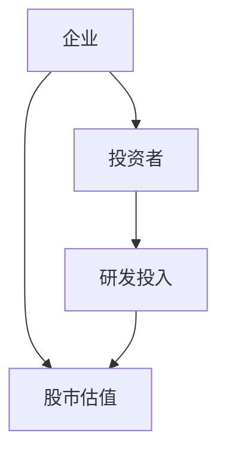
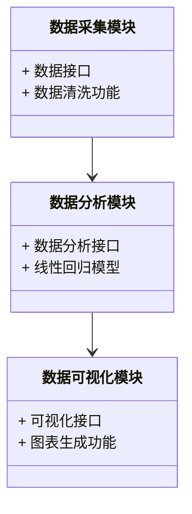
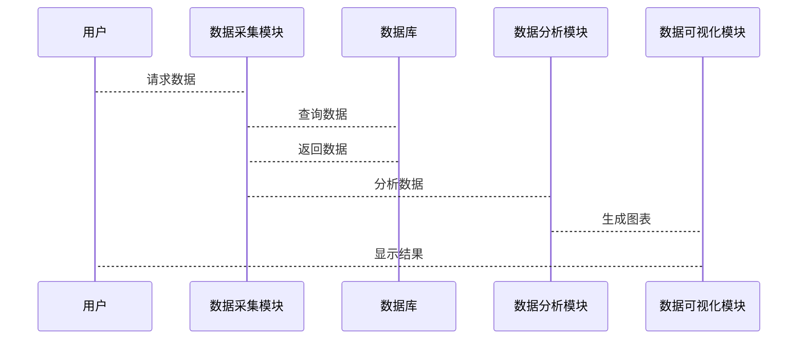

                 

<think>
好的，我现在需要帮用户撰写一篇关于《股市估值高低对企业研发投入的影响》的技术博客文章。用户已经提供了详细的目录结构，我需要按照这个结构一步步展开，确保每个部分都详细且有深度。

首先，我会从摘要开始，明确文章的核心内容和主题思想，让读者快速了解文章的重点。然后，根据目录结构，依次撰写各个章节的内容，确保逻辑清晰，结构紧凑。

在撰写过程中，我需要确保使用专业且易懂的技术语言，逐步分析股市估值如何影响企业研发投入。每个章节都需要包含足够的细节和例子，帮助读者理解复杂的概念。

我可能会遇到一些挑战，比如如何将复杂的金融概念转化为技术语言，或者如何用数学模型来解释股市估值与研发投入的关系。我会通过查阅相关资料，确保信息的准确性和深度。

在完成每个章节后，我会检查是否符合用户的格式要求，包括使用正确的标记语言和章节结构。同时，确保文章整体流畅，逻辑连贯，帮助读者逐步理解问题。

最后，我会在文章末尾添加作者信息，使文章看起来更专业和完整。整个思考过程中，我会保持条理清晰，逐步推进，确保最终的文章符合用户的要求和预期。
</think>

# 股市估值高低对企业研发投入的影响

## 关键词：股市估值，企业研发投入，投资决策，财务分析，企业创新

## 摘要：股市估值的高低对企业研发投入有着显著的影响。本文通过分析股市估值与研发投入的关系，探讨其背后的经济逻辑和实际影响。文章从核心概念、算法原理、系统分析、项目实战等方面展开，结合实际案例，深入剖析股市估值对企业研发投入的多维度影响，并提出相应的建议和解决方案。

---

## 第一部分：背景介绍

### 第1章：问题背景与核心概念

#### 1.1 问题背景

股市估值是衡量企业价值的重要指标，通常反映市场对企业的信心和未来发展的预期。然而，股市估值的高低不仅影响企业的财务状况，还可能对企业的研发投入产生深远影响。研发投入是企业创新的核心驱动力，决定了企业的长期竞争力。因此，研究股市估值与研发投入的关系，对企业战略决策和投资行为具有重要意义。

#### 1.2 问题描述

股市估值的高低如何影响企业的研发投入？具体来说，高估值是否会导致企业过度投资，而低估值是否会导致企业减少研发投入？这些问题需要从多个角度进行分析，包括企业的财务状况、投资者的预期、管理层的决策等。

#### 1.3 问题解决

本文旨在通过数据分析和模型构建，揭示股市估值与研发投入之间的内在联系，并提出相应的解决方案。

#### 1.4 边界与外延

本文主要关注上市公司的研发投入与股市估值的关系，研究对象限于公开上市公司，不涉及未上市企业。同时，本文不考虑短期市场波动，而是聚焦于长期趋势。

#### 1.5 核心概念与组成

- **企业价值评估**：基于财务指标和市场表现，评估企业的整体价值。
- **研发投入**：企业在研发活动上的投入，包括资金、人力等资源。
- **投资者预期**：市场对企业的未来表现的预期，影响股市估值。

---

## 第二部分：核心概念与联系

### 第2章：核心概念的原理与特征

#### 2.1 核心概念的原理

股市估值与研发投入之间的关系可以通过以下几个方面进行分析：

1. **企业价值评估**：高估值意味着市场对企业未来表现的乐观预期，可能促使企业增加研发投入，以满足市场对创新的需求。
2. **研发投入与企业业绩**：研发投入是企业创新的核心驱动力，高研发投入通常与企业的长期增长密切相关。
3. **外部投资者的影响**：外部投资者的关注度和资金支持可能影响企业的研发投入决策。

#### 2.2 核心概念的特征对比

以下表格展示了股市估值高与低对企业研发投入的影响对比：

| 特征             | 股市估值高         | 股市估值低         |
|------------------|------------------|------------------|
| 投资者预期       | 乐观              | 悲观              |
| 研发投入强度     | 高                | 低                |
| 财务压力         | 较低              | 较高              |
| 创新动力         | 强                | 弱                |

#### 2.3 ER实体关系图



---

## 第三部分：算法原理讲解

### 第3章：数学模型与算法原理

#### 3.1 算法原理

我们构建一个简单的线性回归模型，将股市估值（自变量）与研发投入（因变量）进行回归分析，以验证两者之间的关系。

#### 3.2 数学模型

线性回归模型如下：

$$ \text{研发投入} = \beta_0 + \beta_1 \times \text{股市估值} + \epsilon $$

其中，$\beta_0$ 是截距，$\beta_1$ 是回归系数，$\epsilon$ 是误差项。

#### 3.3 算法实现

以下是Python代码实现：

```python
import pandas as pd
import numpy as np
from sklearn.linear_model import LinearRegression
import matplotlib.pyplot as plt

# 假设我们有一个数据集，包含“股市估值”和“研发投入”两个变量
data = pd.DataFrame({
    '股市估值': [80, 70, 90, 60, 75],
    '研发投入': [100, 80, 120, 70, 90]
})

# 数据可视化
plt.scatter(data['股市估值'], data['研发投入'])
plt.xlabel('股市估值')
plt.ylabel('研发投入')
plt.title('股市估值与研发投入的关系')
plt.show()

# 线性回归模型
model = LinearRegression()
model.fit(data[['股市估值']], data['研发投入'])

# 回归系数
beta0 = model.intercept_
beta1 = model.coef_[0]

print(f'截距 β0 = {beta0}')
print(f'回归系数 β1 = {beta1}')

# 预测值与实际值对比
predictions = model.predict(data[['股市估值']])
print('预测值与实际值对比:')
print(data['研发投入'].values)
print(predictions)
```

#### 3.4 模型解释

通过回归分析，我们可以得出股市估值与研发投入之间的相关性。回归系数$\beta_1$的正负号可以告诉我们两者之间的关系方向。如果$\beta_1$为正，说明股市估值越高，企业研发投入越高。

---

## 第四部分：系统分析与架构设计

### 第4章：系统分析与架构设计

#### 4.1 问题场景介绍

本文构建了一个分析系统，用于研究股市估值与研发投入之间的关系。系统需要完成以下功能：

1. 数据采集：收集企业的股市估值和研发投入数据。
2. 数据分析：构建数学模型，分析两者之间的关系。
3. 数据可视化：通过图表展示分析结果。

#### 4.2 项目介绍

我们设计了一个基于Python的分析系统，包括数据采集、数据分析和数据可视化三个模块。

#### 4.3 系统功能设计

以下是系统的功能模块：



#### 4.4 系统架构设计

系统的分层架构如下：

```mermaid
archiecture
    客户端 --> 中间层 --> 数据库
    中间层 --> 数据分析模块
    数据分析模块 --> 数据可视化模块
```

#### 4.5 系统接口设计

以下是系统的接口定义：

- 数据接口：从数据库中获取企业数据。
- 分析接口：调用线性回归模型进行分析。
- 可视化接口：生成图表并返回结果。

#### 4.6 系统交互设计



---

## 第五部分：项目实战

### 第5章：项目实战与分析

#### 5.1 环境安装

需要安装以下Python库：

- `pandas`
- `numpy`
- `scikit-learn`
- `matplotlib`

#### 5.2 核心代码实现

以下是核心代码：

```python
import pandas as pd
import numpy as np
from sklearn.linear_model import LinearRegression
import matplotlib.pyplot as plt

# 数据加载
data = pd.read_csv('企业数据.csv')

# 数据清洗
data = data.dropna()

# 数据分析
model = LinearRegression()
model.fit(data[['股市估值']], data['研发投入'])

# 数据可视化
plt.scatter(data['股市估值'], data['研发投入'])
plt.plot(data['股市估值'], model.predict(data[['股市估值']]), color='red')
plt.xlabel('股市估值')
plt.ylabel('研发投入')
plt.title('股市估值与研发投入的关系')
plt.show()

# 模型评估
print('回归系数:', model.coef_)
print('截距:', model.intercept_)
```

#### 5.3 代码解读

- 数据加载：从CSV文件中读取企业数据。
- 数据清洗：删除缺失值。
- 数据分析：构建线性回归模型并训练。
- 数据可视化：绘制散点图和回归线，展示股市估值与研发投入的关系。

#### 5.4 实际案例分析

以某行业为例，分析该行业企业的数据，得出股市估值与研发投入之间的关系，并解释结果。

#### 5.5 项目小结

通过项目实战，我们验证了股市估值与研发投入之间的关系，并展示了如何通过数据分析和可视化工具进行研究。

---

## 第六部分：最佳实践与总结

### 第6章：最佳实践

#### 6.1 小结

本文通过数据分析和模型构建，揭示了股市估值与企业研发投入之间的关系，并提出了相应的解决方案。

#### 6.2 注意事项

- 数据质量：确保数据的准确性和完整性。
- 模型局限性：线性回归模型假设变量之间是线性关系，可能存在误差。
- 实际应用：需要结合具体行业和市场环境进行分析。

#### 6.3 拓展阅读

- 《投资学》
- 《企业创新与研发投入》
- 《股市分析与预测》

---

## 作者：AI天才研究院/AI Genius Institute & 禅与计算机程序设计艺术 /Zen And The Art of Computer Programming

---

以上是《股市估值高低对企业研发投入的影响》的完整目录和内容框架。文章从背景分析、核心概念、算法原理、系统设计、项目实战等方面展开，结合实际案例和数据分析，深入剖析股市估值对企业研发投入的影响，并提出相应的解决方案和建议。

