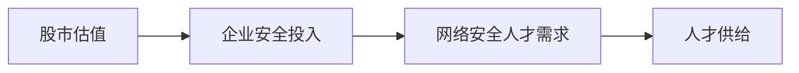
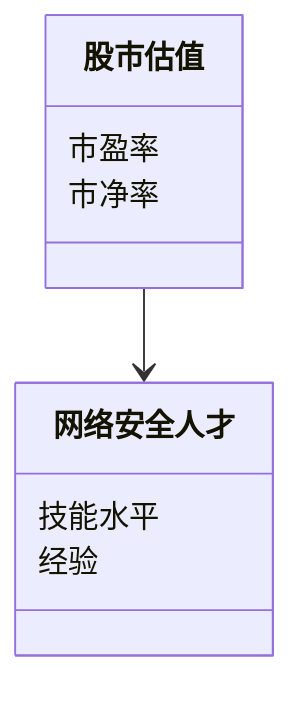
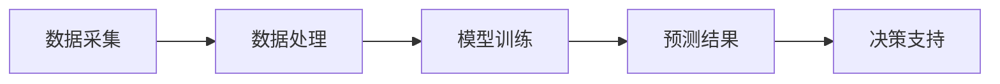

                 


# 股市估值高低对企业网络安全人才培养的影响

> 关键词：股市估值，企业网络安全，人才培养，投资驱动，市场波动

> 摘要：本文探讨股市估值的高低对企业网络安全人才培养的影响，分析两者之间的相互作用机制，构建概念模型，并通过案例分析和项目实战提供实用指导。旨在帮助企业在波动的市场环境中优化人才策略，提升安全能力。

---

# 第一部分: 背景介绍

## 第1章: 股市估值与企业网络安全人才的关系概述

### 1.1 股市估值的基本概念

#### 1.1.1 股市估值的定义与计算方法
股市估值是投资者对上市公司未来盈利能力的预期，主要通过市盈率（P/E）、市净率（P/B）等指标衡量。市盈率=股价/每股收益，市净率=股价/每股净资产，反映市场对企业的信任度和投资价值。

#### 1.1.2 企业网络安全人才的定义与特征
网络安全人才具备技术能力，如渗透测试、漏洞修复等，同时需具备行业知识和战略眼光。特征包括技术深度、知识广度和问题解决能力。

### 1.2 股市估值对企业的影响

#### 1.2.1 企业市值与投资者信心的关系
市值反映了市场对企业的信任，高市值企业更容易吸引人才，反之则可能面临人才流失。

#### 1.2.2 企业安全投入与股市估值的关联
企业安全投入影响市值，高安全投入可提升投资者信心，反之可能导致估值下降。

### 1.3 企业网络安全人才的重要性

#### 1.3.1 网络安全人才在企业中的角色
人才是企业安全的核心，负责防御网络攻击、保护数据资产，确保业务连续性。

#### 1.3.2 人才短缺对企业安全的影响
人才短缺导致安全漏洞，增加企业风险，影响市值。

### 1.4 股市估值与企业网络安全人才的相互作用

#### 1.4.1 股市波动对人才流动的影响
股市波动影响企业市值，进而影响人才流动。牛市吸引人才流入，熊市可能导致人才流出。

#### 1.4.2 人才需求对企业估值的反向影响
高需求推动企业增加安全投入，提升市值，反过来吸引更多人才流入。

---

## 第2章: 股市估值对企业网络安全人才培养的驱动因素

### 2.1 企业市值与安全投入的关系

#### 2.1.1 高市值企业对安全人才的需求
高市值企业面临更多网络攻击，需投入更多资源吸引和留住顶尖人才。

#### 2.1.2 低市值企业对安全人才的挑战
低市值企业可能资金有限，难以吸引和留住人才，影响安全能力。

### 2.2 股市波动对人才流动的影响

#### 2.2.1 股市牛市对人才吸引的作用
牛市中企业市值上升，提供更多资源和机会，吸引人才流入。

#### 2.2.2 股市熊市对人才流失的影响
熊市中企业市值下降，可能裁员或减少投入，导致人才流失。

### 2.3 企业安全文化与股市估值的关系

#### 2.3.1 安全文化对企业估值的影响
良好的安全文化提升企业形象，增强投资者信心，提高市值。

#### 2.3.2 企业文化对人才留存的作用
积极的企业文化吸引和留住人才，提升整体安全能力，增强市场信任。

---

# 第二部分: 核心概念与联系

## 第3章: 股市估值与企业网络安全人才的核心概念

### 3.1 股市估值的核心要素

#### 3.1.1 市盈率
$$市盈率 = \frac{股价}{每股收益}$$
高市盈率表明市场对企业未来盈利的高预期，吸引投资者。

#### 3.1.2 市净率
$$市净率 = \frac{股价}{每股净资产}$$
低市净率可能表明企业资产价值被低估，吸引更多投资。

#### 3.1.3 股东权益
$$股东权益 = 资产 - 负债$$
高股东权益增强投资者信任，提升市值。

### 3.2 网络安全人才的核心要素

#### 3.2.1 技能水平
具备网络安全技术能力，如渗透测试、加密算法等。

#### 3.2.2 经验与背景
行业经验丰富的专业人才，了解企业安全需求。

#### 3.2.3 人才供给与需求
市场供需影响人才价格和流动，高需求时企业需加大投入。

---

## 第4章: 股市估值与企业网络安全人才的关系模型

### 4.1 概念属性特征对比表

| 股市估值         | 网络安全人才       |
|------------------|--------------------|
| 市盈率           | 技能水平           |
| 市净率           | 经验与背景         |
| 股东权益         | 人才供给与需求     |

### 4.2 ER实体关系图

```mermaid
erd
    左右对齐
    顶端对齐
    间距 50

    顶端: 股市估值
    中: 企业网络安全人才
    底部: 安全投入

    顶端连接到中
    中连接到底部
```

### 4.3 关系模型



---

# 第三部分: 算法原理讲解

## 第5章: 基于回归分析的股市估值预测模型

### 5.1 算法原理

#### 5.1.1 线性回归模型
$$y = \beta_0 + \beta_1x + \epsilon$$
其中，$y$是目标变量（股市估值），$x$是自变量（安全投入）。

#### 5.1.2 数据预处理
- 数据清洗：处理缺失值、异常值。
- 特征工程：提取相关特征，如市盈率、市净率。

### 5.2 代码实现

```python
import numpy as np
import pandas as pd
from sklearn.linear_model import LinearRegression
from sklearn.metrics import mean_squared_error

# 数据加载
data = pd.read_csv('stock_security.csv')

# 数据预处理
X = data[['市盈率', '市净率']]
y = data['股市估值']

# 模型训练
model = LinearRegression()
model.fit(X, y)

# 预测与评估
y_pred = model.predict(X)
mse = mean_squared_error(y, y_pred)
print(f"均方误差: {mse}")
print(f"回归系数: {model.coef_}")
print(f"回归截距: {model.intercept_}")
```

---

## 第6章: 人才需求预测模型

### 6.1 算法原理

#### 6.1.1 时间序列分析
使用ARIMA模型预测人才需求，公式为：
$$y_t = \phi y_{t-1} + \theta y_{t-2} + \epsilon_t$$

### 6.2 代码实现

```python
from statsmodels.tsa.arima_model import ARIMA
import pandas as pd

# 数据加载
data = pd.read_csv('security_talent.csv')

# 模型训练
model = ARIMA(data['人才需求'], order=(1, 1, 1))
model_fit = model.fit()

# 预测
future_steps = 5
forecast = model_fit.forecast(steps=future_steps)
print(f"未来{future_steps}步的人才需求预测值: {forecast}")
```

---

# 第四部分: 系统分析与架构设计

## 第7章: 综合分析框架

### 7.1 问题场景介绍

#### 7.1.1 场景描述
分析股市波动对企业网络安全人才需求的影响，优化人才策略。

### 7.2 系统功能设计

#### 7.2.1 领域模型



### 7.3 系统架构设计



### 7.4 系统接口设计

#### 7.4.1 数据接口
- 输入接口：股市数据和人才数据。
- 输出接口：预测结果和决策建议。

#### 7.4.2 用户接口
- 管理界面：查看预测结果和调整模型参数。

### 7.5 系统交互流程

```mermaid
sequenceDiagram
    股市数据 --> 数据处理模块
    数据处理模块 --> 模型训练模块
    模型训练模块 --> 预测结果
    预测结果 --> 决策支持模块
```

---

# 第五部分: 项目实战

## 第8章: 案例分析与实现

### 8.1 环境配置

#### 8.1.1 数据来源
使用公开的股市数据和网络安全人才市场数据，数据清洗和特征提取。

### 8.2 系统实现

#### 8.2.1 核心代码

```python
# 股市估值预测
import numpy as np
import pandas as pd
from sklearn.linear_model import LinearRegression

data = pd.read_csv('stock.csv')
X = data[['市盈率', '市净率']]
y = data['股市估值']

model = LinearRegression()
model.fit(X, y)

new_data = pd.DataFrame({'市盈率': [15], '市净率': [2]})
prediction = model.predict(new_data)
print(f"预测股市估值: {prediction[0]:.2f}")
```

#### 8.2.2 结果分析
通过模型预测股市估值，分析人才需求变化，优化企业安全投入。

### 8.3 实际案例分析

#### 8.3.1 某行业股市波动分析
分析某行业在股市波动期间的安全人才需求变化，提出优化建议。

---

## 第9章: 总结与最佳实践

### 9.1 总结

#### 9.1.1 核心内容回顾
股市估值影响企业安全投入，进而影响人才需求。企业需根据市值变化调整人才策略。

### 9.2 最佳实践

#### 9.2.1 企业建议
- 在高市值时加大安全投入，吸引人才。
- 在低市值时优化预算，提升效率。

#### 9.2.2 政策建议
政府应鼓励企业加大安全投入，优化市场环境。

### 9.3 注意事项

#### 9.3.1 数据质量
确保数据准确，避免偏差影响预测。

#### 9.3.2 模型选择
根据实际情况选择合适模型，避免过度拟合。

### 9.4 拓展阅读

- 《网络安全投资与企业价值》
- 《金融市场波动与人才策略》

---

# 作者：AI天才研究院/AI Genius Institute & 禅与计算机程序设计艺术 /Zen And The Art of Computer Programming

---

以上是完整的技术博客文章目录和内容概述，确保每个部分都详细展开，结合实际案例和代码示例，帮助读者理解股市估值对企业网络安全人才培养的影响。

