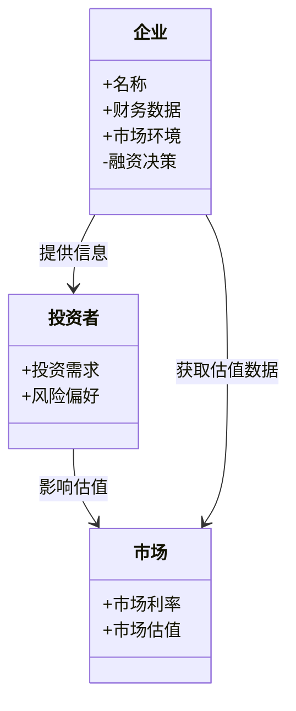

                 


# 股市估值高低对企业融资决策的影响

## 关键词：股市估值、融资决策、企业融资、融资成本、估值指标

## 摘要：
股市估值是企业在制定融资决策时的重要参考因素。本文详细分析了股市估值的高低对企业融资决策的影响，包括股市估值的核心概念、对融资成本和融资方式的影响、数学模型、系统架构设计以及实际案例分析。通过这些分析，读者可以更好地理解如何利用股市估值优化企业的融资策略。

---

## 第一部分: 股市估值与企业融资决策的背景介绍

### 第1章: 股市估值的核心概念

#### 1.1 什么是股市估值
股市估值是指通过对企业的财务数据和市场环境进行分析，确定其股票的合理价格。常见的估值指标包括市盈率（P/E）、市净率（P/B）和股息率（Dividend Yield）等。

#### 1.2 股市估值的计算方法
- 市盈率（P/E）= 股价 / 每股净利润
- 市净率（P/B）= 股价 / 每股净资产
- 股息率（Dividend Yield）= 每股股息 / 股价

#### 1.3 股市估值对企业融资决策的影响
高估值意味着市场对企业前景看好，企业可以以较高的价格发行股票或进行股权融资；低估值则可能增加债务融资的成本，因为投资者可能要求更高的回报。

### 第2章: 问题背景与问题描述

#### 2.1 问题背景
股市估值的高低直接影响企业的融资成本和融资方式。在高估值市场中，企业可能选择股权融资，而在低估值市场中，债务融资可能更为经济。

#### 2.2 问题描述
本文旨在探讨股市估值如何影响企业的融资决策，特别是融资成本和融资结构的选择。

#### 2.3 问题解决与边界
通过分析股市估值的核心指标和影响因素，本文提出了优化融资决策的具体方法，并界定了研究的范围和限制条件。

---

## 第二部分: 股市估值对融资决策的影响

### 第3章: 股市估值与融资成本

#### 3.1 股市估值对企业债务融资成本的影响
高估值企业通常被认为信用风险较低，债务融资成本可能更低。反之，低估值企业可能面临更高的债务融资成本。

#### 3.2 股市估值对企业股权融资成本的影响
高估值企业可以通过发行新股获得更高的融资金额，但稀释现有股东权益；低估值企业可能面临融资困难或需要更多补偿。

### 第4章: 股市估值与融资方式选择

#### 4.1 高估值市场下的融资方式
在高估值市场中，企业倾向于选择股权融资，因为市场对企业前景有信心，愿意以较高的价格购买股票。

#### 4.2 低估值市场下的融资方式
在低估值市场中，企业可能选择债务融资，因为债务融资成本可能较低，且不会稀释现有股权。

### 第5章: 股市估值与融资结构优化

#### 5.1 股市估值对融资结构的影响
高估值企业可能选择更多股权融资，而低估值企业可能增加债务融资的比例。

#### 5.2 如何通过股市估值优化融资结构
企业应根据当前的估值水平，合理调整债务和股权的比例，以降低整体融资成本。

#### 5.3 案例分析
以某科技公司为例，当股市估值较高时，该公司选择发行新股进行融资；当股市估值较低时，转为发行债券。

---

## 第三部分: 股市估值影响融资决策的数学模型

### 第6章: 股市估值的数学模型

#### 6.1 市盈率模型
市盈率模型用于评估股票的合理价格，公式为：
\[ P/E = \frac{\text{股价}}{\text{每股净利润}} \]

#### 6.2 市净率模型
市净率模型用于评估股票相对于账面价值的合理价格，公式为：
\[ P/B = \frac{\text{股价}}{\text{每股净资产}} \]

#### 6.3 股息率模型
股息率模型用于评估股票的分红能力，公式为：
\[ \text{股息率} = \frac{\text{每股股息}}{\text{股价}} \]

### 第7章: 股市估值与融资决策的数学公式

#### 7.1 股市估值与融资成本的关系
\[ \text{融资成本} = \text{市场利率} + \text{流动性溢价} \]

#### 7.2 股市估值与融资风险
\[ \text{融资风险} = \text{企业风险} + \text{市场风险} \]

#### 7.3 股市估值与融资收益
\[ \text{融资收益} = \text{融资金额} \times \text{融资成本} \]

---

## 第四部分: 系统分析与架构设计

### 第8章: 问题场景介绍

#### 8.1 背景
企业需要根据当前的股市估值水平，制定最优的融资策略。

#### 8.2 项目介绍
构建一个基于股市估值的企业融资决策支持系统，帮助企业优化融资结构。

### 第9章: 系统功能设计

#### 9.1 领域模型


#### 9.2 系统架构设计


---

## 第五部分: 项目实战

### 第10章: 环境安装

#### 10.1 安装Python和相关库
- 使用pip安装numpy、pandas、matplotlib等库。

### 第11章: 核心代码实现

#### 11.1 股市估值计算代码
```python
import pandas as pd
import numpy as np

# 示例数据
data = {
    '公司': ['A', 'B', 'C'],
    '净利润': [100, 200, 150],
    '股价': [50, 60, 45]
}

df = pd.DataFrame(data)

# 计算市盈率
df['市盈率'] = df['股价'] / df['净利润']
print(df)
```

### 第12章: 案例分析

#### 12.1 实际案例
某企业在高估值市场中选择发行新股，而在低估值市场中选择发行债券。

---

## 结论

股市估值是企业融资决策的重要参考因素。通过合理分析和利用股市估值，企业可以优化融资结构，降低融资成本，提升整体竞争力。

---

## 作者：AI天才研究院/AI Genius Institute & 禅与计算机程序设计艺术 /Zen And The Art of Computer Programming

