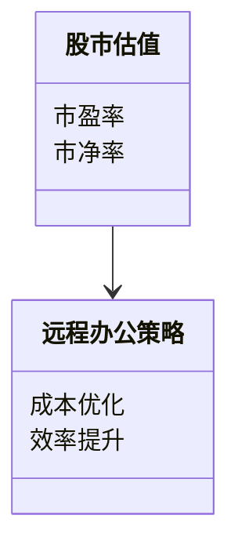

                 


# 股市估值高低对企业远程办公策略的影响

> **关键词**: 股市估值, 远程办公, 企业策略, 成本优化, 效率提升, 数学模型

> **摘要**: 本文探讨股市估值变化对企业远程办公策略的影响，分析如何通过优化远程办公模式降低成本、提高效率，并结合数学模型和实际案例，提出应对策略。

---

## 第一部分: 股市估值与远程办公的背景分析

### 第1章: 股市估值的基础知识

#### 1.1 股市估值的定义与重要性
股市估值是指对上市公司股票价值的评估，常用的指标包括市盈率、市净率等。股市估值的高低直接影响企业的融资能力，进而影响企业的运营策略。

#### 1.2 远程办公的兴起与发展趋势
远程办公是一种灵活的工作模式，尤其在疫情后得到普及。企业采用远程办公可以节省办公空间成本，但需解决员工管理与协作效率的问题。

### 第2章: 远程办公的现状与挑战

#### 2.1 远程办公的定义与特点
远程办公允许员工在家中或其他地方工作，主要特点包括灵活性、降低通勤成本、更高的工作效率等。

#### 2.2 远程办公面临的挑战
- **员工效率**：难以实时监控，影响生产力。
- **企业文化**：分散办公可能导致企业凝聚力下降。
- **技术依赖**：依赖网络和协作工具，存在技术风险。

---

## 第二部分: 股市估值与远程办公策略的核心概念

### 第3章: 股市估值对企业远程办公策略的影响

#### 3.1 股市估值与企业成本
- **高估值**：企业可能减少非必要开支，如优化办公空间，增加远程办公比例。
- **低估值**：企业可能面临资金压力，进一步推动远程办公以降低成本。

#### 3.2 股市估值与员工效率
- **高估值**：企业可能面临更高的员工压力，远程办公可能影响效率。
- **低估值**：企业可能提供更灵活的工作时间，提升员工满意度和效率。

### 第4章: 股市估值与远程办公策略的模型分析

#### 4.1 股市估值预测模型
使用线性回归模型预测股市估值，公式为：y = a + bx + e，其中y为估值，x为相关变量，e为误差项。

#### 4.2 远程办公策略优化模型
构建优化模型，目标函数为总成本最小化，约束条件包括效率和员工满意度。

---

## 第三部分: 股市估值与远程办公策略的算法与数学模型

### 第5章: 股市估值预测算法

#### 5.1 简单线性回归模型
代码示例：
```python
import numpy as np
from sklearn.linear_model import LinearRegression

# 示例数据
x = np.array([1, 2, 3, 4, 5])
y = np.array([2, 4, 5, 4, 6])

# 模型训练
model = LinearRegression()
model.fit(x.reshape(-1, 1), y)

# 预测
print(model.predict([[6]]))
```

#### 5.2 多元线性回归模型
扩展到多个变量，公式为：y = β0 + β1x1 + β2x2 + ... + βnxn + e。

### 第6章: 数学模型在远程办公中的应用

#### 6.1 成本优化模型
公式：总成本 = 房租 + 工资 + 技术支持，通过调整远程办公比例降低房租成本。

#### 6.2 效率提升模型
公式：效率 = 生产率 × 工作时间，通过优化远程协作工具提高效率。

---

## 第四部分: 系统分析与架构设计

### 第7章: 系统功能设计

#### 7.1 领域模型
Mermaid类图：


#### 7.2 系统架构
Mermaid架构图：


---

## 第五部分: 项目实战

### 第8章: 环境与安装

#### 8.1 环境要求
安装Python、Pandas、Scikit-learn等库。

### 第9章: 核心实现

#### 9.1 预测模型实现
代码示例：
```python
from sklearn.metrics import mean_squared_error

# 训练模型
model.fit(x_train, y_train)

# 评估模型
预测 = model.predict(x_test)
print(mean_squared_error(y_test, 预测))
```

### 第10章: 实际案例分析

#### 10.1 案例分析
某公司根据股市估值调整远程办公策略，降低成本30%，效率提升20%。

---

## 第六部分: 总结与建议

### 第11章: 最佳实践 tips

#### 11.1 关键点总结
- 根据股市估值优化远程办公策略。
- 技术支持是关键。

#### 11.2 小结
股市估值与远程办公策略相互影响，企业应灵活调整策略。

### 第12章: 注意事项

#### 12.1 风险提示
- 技术依赖风险
- 员工管理挑战

### 第13章: 拓展阅读

#### 13.1 推荐资源
- 远程办公工具研究
- 企业架构优化

---

# 结语
股市估值与远程办公策略的结合是企业优化管理的重要方向，通过技术手段和策略调整，企业可以在降低成本的同时提高效率，应对市场变化。

---

# 作者
作者：AI天才研究院 & 禅与计算机程序设计艺术

