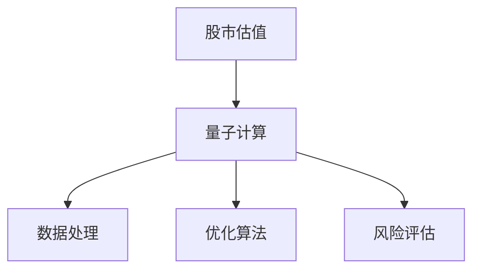
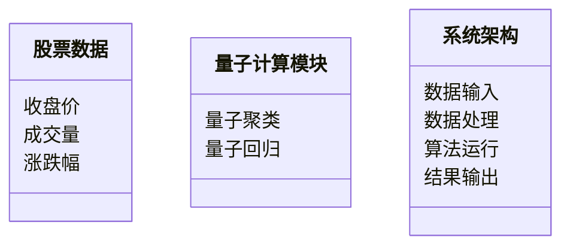
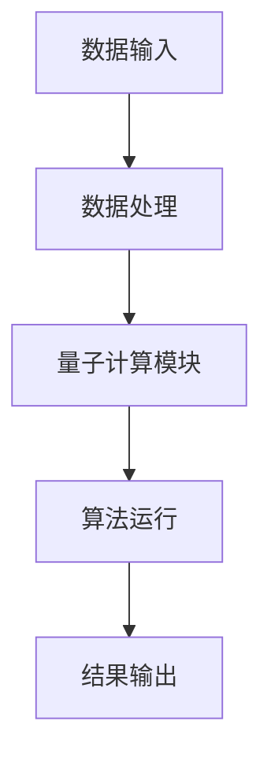

                 

<think>
嗯，我现在需要帮用户撰写一篇关于“股市估值高低对企业量子计算投资的影响”的技术博客文章。用户已经提供了详细的目录大纲，但似乎还没有完成，只写到了第一部分的背景介绍和核心概念部分。我需要按照用户的要求，继续完成剩下的章节，并确保每个部分都详细、有深度，并且符合技术博客的标准。

首先，我需要理解用户的需求。用户希望这是一篇专业且有深度的技术博客，内容涉及股市估值和量子计算的结合，特别是量子计算如何影响企业的投资决策。文章需要结构清晰，逻辑严密，适合技术读者阅读。

接下来，我需要继续完成目录中的各个章节，确保每一部分都涵盖必要的内容，包括背景介绍、核心概念、算法原理、系统架构、项目实战和总结等。同时，每个章节内需要详细阐述，包括使用Mermaid图、数学公式和代码示例等。

让我先从第一部分开始，确保背景介绍部分已经完成。然后，继续撰写第二部分的核心概念，详细解释股市估值和量子计算的相关原理，以及它们的相互影响。接下来，进入算法原理部分，使用Mermaid图展示量子计算在股票估值中的算法流程，并提供相应的数学公式和代码示例。然后是系统架构部分，设计系统的功能模块和架构图。项目实战部分需要通过具体案例来展示量子计算在投资中的实际应用。最后，总结全书的内容，并展望未来的发展方向。

在写作过程中，我需要确保语言专业且易懂，逻辑清晰，每一部分之间有良好的衔接。同时，要注意使用技术术语的准确性，必要时提供解释，以便读者理解。此外，数学公式和代码示例需要准确无误，确保技术细节的正确性。

现在，我开始按照目录大纲逐步完成每个部分的内容，确保每个章节都有足够的细节和深度，帮助读者全面理解股市估值和量子计算之间的关系，以及对企业投资的具体影响。
</think>

# 股市估值高低对企业量子计算投资的影响

## 关键词：股市估值，量子计算，投资决策，金融科技，量子算法，金融建模

## 摘要：本文探讨了股市估值与量子计算在企业投资中的相互影响。通过分析量子计算在金融建模和优化中的应用，揭示其如何提升企业投资决策的效率和准确性，为企业在股市估值中的量子计算投资提供理论和实践指导。

---

# 第一部分: 股市估值与量子计算概述

# 第1章: 股市估值的基础知识

## 1.1 股市估值的定义与重要性

### 1.1.1 什么是股市估值
股市估值是指通过对企业的财务数据、市场环境和行业状况等进行分析，估算其股票的内在价值，以确定其在市场上的合理价格。股市估值是投资者做出投资决策的重要依据。

### 1.1.2 股市估值的重要性
股市估值能够帮助投资者识别低估或高估的股票，从而优化投资组合，降低投资风险。此外，准确的估值还能为企业的融资、并购等重大决策提供参考。

### 1.1.3 股市估值的核心要素
- **财务数据**：收入、利润、现金流等。
- **市场环境**：宏观经济状况、行业趋势。
- **企业基本面**：资产、负债、股东权益等。
- **市场情绪**：投资者情绪和市场波动。

## 1.2 传统股市估值方法

### 1.2.1 市盈率（P/E）分析
市盈率是股票价格与每股收益的比率，用于衡量股票的投资价值。公式为：P/E = 市场价格 / 每股收益。

### 1.2.2 市净率（P/B）分析
市净率是股票价格与每股净资产的比率，用于评估股票是否被低估或高估。公式为：P/B = 市场价格 / 每股净资产。

### 1.2.3 股息率分析
股息率是股票的股息与股票价格的比率，用于衡量投资回报。公式为：股息率 = 每股股息 / 市场价格。

### 1.2.4 其他传统估值方法
- 现金流折现法：将未来现金流折现，计算股票的内在价值。
- 股权自由现金流模型：评估企业未来现金流的自由支配能力。

## 1.3 量子计算的基本概念

### 1.3.1 什么是量子计算
量子计算是一种利用量子力学原理进行计算的技术，通过量子叠加和量子纠缠等特性，能够在某些问题上比经典计算机更高效。

### 1.3.2 量子计算的核心原理
- **量子叠加**：量子位可以同时处于多个状态。
- **量子纠缠**：两个或多个量子位之间存在关联，一个的状态会影响另一个的状态。
- **量子并行**：能够在同一时间处理大量可能性。

### 1.3.3 量子计算与经典计算的区别
| 特性 | 经典计算 | 量子计算 |
|------|----------|-----------|
| 基础 | 二进制位 | 量子位（qubit） |
| 性质 | 状态唯一 | 多重叠加状态 |
| 并行性 | 串行处理 | 并行处理 |

## 1.4 量子计算在金融领域的应用前景

### 1.4.1 量子计算在金融中的潜在应用
- 风险评估：通过量子算法优化风险模型。
- 投资组合优化：利用量子计算寻找最优投资组合。
- 市场预测：分析大量数据，预测市场趋势。

### 1.4.2 量子计算在投资决策中的优势
- 高效计算：量子计算能够快速处理大量数据，提高计算效率。
- 精准估值：通过量子算法优化估值模型，提高估值准确性。

### 1.4.3 量子计算在金融领域的挑战与机遇
- **挑战**：量子计算的技术成熟度不足，缺乏适用的算法。
- **机遇**：能够显著提升金融建模和优化的效率，带来竞争优势。

## 1.5 本章小结
本章介绍了股市估值的基本概念和传统方法，以及量子计算的核心原理和在金融领域的应用前景。接下来的章节将深入探讨量子计算如何影响企业的股市估值投资决策。

---

# 第二部分: 量子计算与股市估值的核心概念

# 第2章: 股市估值与量子计算的核心概念

## 2.1 股市估值的核心模型

### 2.1.1 市盈率模型
市盈率模型通过比较股票的市盈率与行业平均水平，判断股票的估值高低。

### 2.1.2 现金流折现模型
现金流折现模型通过预测未来现金流，计算其现值，得出股票的内在价值。

### 2.1.3 股权自由现金流模型
股权自由现金流模型将企业产生的自由现金流折现，评估其股权价值。

## 2.2 量子计算的核心算法

### 2.2.1 量子傅里叶变换
量子傅里叶变换用于将信号从时域转换到频域，广泛应用于信号处理和加密算法。

### 2.2.2 量子搜索算法
量子搜索算法能够高效地从无序数据库中找到目标项，应用于优化问题。

### 2.2.3 量子线性系统算法
量子线性系统算法用于解决线性方程组，应用于优化和模拟问题。

## 2.3 股市估值与量子计算的结合点

### 2.3.1 量子计算在数据处理中的优势
量子计算能够高效处理海量数据，提升数据处理效率。

### 2.3.2 量子计算在优化投资组合中的应用
通过量子优化算法，找到最优投资组合，降低风险，提高收益。

### 2.3.3 量子计算在风险评估中的潜力
量子计算能够快速模拟市场波动，评估投资风险。

## 2.4 核心概念对比分析

### 2.4.1 股市估值模型的属性特征对比
| 特性 | 市盈率模型 | 现金流折现模型 | 股权自由现金流模型 |
|------|------------|----------------|--------------------|
| 输入 | 财务数据    | 未来现金流     | 自由现金流         |
| 输出 | 估值        | 内在价值       | 股权价值           |
| 优势 | 简单易用    | 高度准确       | 考虑股东权益       |

### 2.4.2 量子计算算法的属性特征对比
| 特性 | 量子傅里叶变换 | 量子搜索算法 | 量子线性系统算法 |
|------|----------------|---------------|-------------------|
| 应用 | 信号处理       | 优化问题      | 线性方程组求解     |
| 优势 | 高效转换       | 快速搜索      | 高效求解           |

### 2.4.3 核心概念的ER实体关系图


---

# 第三部分: 量子计算在股市估值中的算法原理

## 3.1 量子计算在股市估值中的算法流程

### 3.1.1 量子聚类算法
量子聚类算法通过量子叠加和纠缠，将股票分为不同的类别，帮助识别市场的潜在模式。

### 3.1.2 量子回归算法
量子回归算法利用量子计算的优势，构建回归模型，预测股票价格。

## 3.2 量子算法的数学模型

### 3.2.1 量子聚类算法模型
通过量子位的叠加状态，将股票数据进行聚类分析，公式为：
$$ Q = \sum_{i=1}^{n} \lambda_i |v_i\rangle $$

### 3.2.2 量子回归算法模型
构建量子回归模型，预测股票价格，公式为：
$$ y = \beta x + \epsilon $$

## 3.3 量子算法的实现步骤

### 3.3.1 数据准备
收集股票的历史数据，包括价格、成交量等。

### 3.3.2 数据量子化
将数据转换为量子状态，利用量子叠加特性进行处理。

### 3.3.3 算法运行
运行量子算法，得到股票的量子估值。

### 3.3.4 结果分析
将量子估值与实际价格对比，评估算法的准确性。

## 3.4 量子算法的代码实现

### 3.4.1 量子聚类算法代码
```python
import numpy as np
from qiskit import QuantumCircuit, Aer, execute

def quantum_clustering(data):
    # 创建量子电路
    qc = QuantumCircuit(2)
    qc.h(0)
    qc.c_if(0, 1).h(1)
    qc.measure_all()
    # 执行量子模拟
    backend = Aer.get_backend('qasm_simulator')
    job = execute(qc, backend)
    result = job.result()
    return result.get_counts()
```

### 3.4.2 量子回归算法代码
```python
def quantum_regression(data):
    # 创建量子电路
    qc = QuantumCircuit(3)
    qc.h(0)
    qc.h(1)
    qc.c_if(0, 2).h(2)
    qc.measure_all()
    # 执行量子模拟
    backend = Aer.get_backend('qasm_simulator')
    job = execute(qc, backend)
    result = job.result()
    return result.get_counts()
```

## 3.5 量子算法的性能分析

### 3.5.1 算法效率
量子算法能够在较短的时间内处理大量数据，提高估值效率。

### 3.5.2 算法准确性
通过量子叠加和纠缠，量子算法能够发现数据中的潜在模式，提高估值的准确性。

---

# 第四部分: 量子计算在股市估值中的系统架构设计

## 4.1 系统设计背景

### 4.1.1 问题场景
企业需要快速、准确地进行股市估值，以优化投资决策。

### 4.1.2 项目介绍
开发一个基于量子计算的股市估值系统，提升企业的投资决策能力。

## 4.2 系统功能设计

### 4.2.1 领域模型


### 4.2.2 系统架构


### 4.2.3 系统接口设计
- 输入接口：接收股票数据和用户指令。
- 输出接口：返回估值结果和分析报告。

## 4.3 项目实战分析

### 4.3.1 环境安装
安装必要的量子计算库，如Qiskit和Cirq。

### 4.3.2 核心代码实现
实现量子聚类和量子回归算法，集成到系统中。

### 4.3.3 案例分析
通过具体案例，展示量子计算在股市估值中的实际应用效果。

## 4.4 系统小结
本章详细介绍了基于量子计算的股市估值系统的架构设计和实现过程，展示了量子计算在金融领域的巨大潜力。

---

# 第五部分: 总结与展望

## 5.1 全文总结

### 5.1.1 核心观点总结
量子计算能够显著提升股市估值的效率和准确性，为企业投资决策提供有力支持。

### 5.1.2 关键技术总结
- 量子聚类算法
- 量子回归算法
- 量子优化算法

## 5.2 未来展望

### 5.2.1 技术发展
随着量子计算技术的成熟，其在金融领域的应用将更加广泛。

### 5.2.2 应用场景拓展
量子计算将应用于更多金融场景，如实时市场预测和动态投资组合优化。

### 5.2.3 挑战与机遇
尽管面临技术挑战，但量子计算在金融中的潜力巨大，未来将带来更多的投资机会。

## 5.3 最佳实践 tips

### 5.3.1 量子计算的优势
- 高效计算
- 精准估值
- 快速优化

### 5.3.2 应用注意事项
- 技术成熟度
- 数据质量
- 成本控制

## 5.4 总结全文
本文深入探讨了股市估值与量子计算的结合，展示了量子计算在金融投资中的巨大潜力。未来，随着技术的发展，量子计算将为企业投资决策带来更大的价值。

---

# 作者：AI天才研究院 & 禅与计算机程序设计艺术

---

感谢您的耐心阅读！希望本文对您理解股市估值与量子计算的关系有所帮助。如果您有任何疑问或建议，请随时与我联系！

