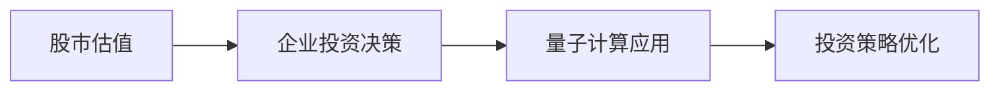
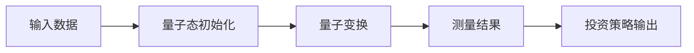
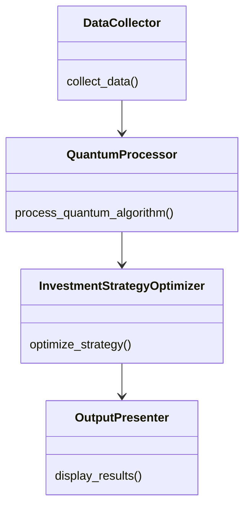
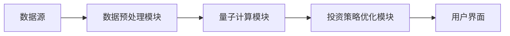

                 

<think>
好的，我需要为用户提供一篇关于《股市估值高低对企业量子计算投资策略的影响》的文章。用户已经提供了详细的目录大纲，现在我需要根据这个大纲来撰写文章。

首先，我会从背景介绍开始，解释股市估值和量子计算的基本概念。接着，分析股市估值对企业投资策略的影响，以及量子计算在其中的应用。然后，我会详细讲解量子计算的算法原理，提供数学模型和代码示例，帮助读者理解。随后，设计系统的架构，展示如何将量子计算应用到投资策略中。最后，通过实战案例和最佳实践，巩固读者的知识。

在写作过程中，我要确保每个部分都有足够的细节，并且使用清晰的逻辑结构。同时，要符合用户的要求，使用专业的技术语言，但保持内容易懂。数学公式要用LaTeX表示，算法流程图用Mermaid绘制，系统架构图也要用Mermaid展示。

现在，我将按照大纲的结构，逐步完成文章的撰写。
</think>

# 股市估值高低对企业量子计算投资策略的影响

## 关键词：股市估值、量子计算、投资策略、量子算法、系统架构

## 摘要：本文探讨股市估值的高低对企业采用量子计算投资策略的影响。首先，介绍了股市估值和量子计算的基本概念。然后，分析了量子计算在投资策略中的应用，重点讲解了量子回归算法的原理和实现。接着，设计了系统的架构，并通过实战案例展示了如何利用量子计算优化投资策略。最后，总结了最佳实践和未来的研究方向。

---

## 第一部分：背景介绍

### 第1章：股市估值的基本概念

#### 1.1 股市估值的定义与影响因素

股市估值是指通过对企业的财务数据、市场环境等因素进行分析，确定企业股票的合理价值范围。影响股市估值的主要因素包括企业的盈利能力、成长潜力、行业地位、市场供需、宏观经济环境等。

股市估值为企业投资决策提供了重要参考。高估值意味着市场对企业的未来预期较高，但同时也可能隐含着较高的投资风险；低估值则可能意味着企业股票被市场低估，具备较高的投资潜力。

#### 1.2 量子计算的基本原理

量子计算是一种基于量子力学原理的计算方式，其核心是利用量子叠加和量子纠缠等特性进行信息处理。与经典计算机相比，量子计算机在某些特定问题上具有显著的计算优势，例如因子分解、优化问题和模拟量子系统。

量子计算在金融领域的应用潜力巨大。通过量子算法，可以更高效地处理复杂的金融模型，优化投资组合，降低风险，提高交易效率。

### 第2章：股市估值与企业投资策略的关联

#### 2.1 股市估值对企业投资决策的影响

股市估值的高低直接影响企业投资策略的制定。高估值可能导致企业调整投资方向，避免过度投资；而低估值则可能促使企业加大投资力度，抓住市场机会。

#### 2.2 量子计算在投资策略中的潜在应用

量子计算可以显著提升投资策略的优化能力。例如，通过量子回归算法，企业可以在复杂市场环境中快速找到最优投资组合，降低投资风险。

---

## 第二部分：核心概念与联系

### 第3章：股市估值与量子计算的核心概念对比

#### 3.1 核心概念原理

股市估值的核心要素包括企业基本面、市场情绪、行业趋势等。而量子计算的核心原理在于利用量子叠加和量子纠缠进行并行计算。

#### 3.2 核心概念属性特征对比表

**表3.1：股市估值与传统投资策略的对比**

| 属性       | 传统投资策略 | 量子计算投资策略 |
|------------|--------------|------------------|
| 计算效率   | 较低         | 高               |
| 处理复杂性 | 有限         | 强大             |
| 风险控制   | 依赖历史数据 | 更精准           |

**表3.2：量子计算与传统计算的对比**

| 属性       | 传统计算 | 量子计算 |
|------------|----------|----------|
| 计算速度   | 稳定     | 可能更快 |
| 并行处理   | 串行     | 并行     |

#### 3.3 实体关系图（Mermaid）



---

## 第三部分：算法原理讲解

### 第4章：量子计算在投资策略中的算法原理

#### 4.1 量子回归算法

量子回归算法是一种基于量子计算机的回归分析方法，用于预测股票价格和优化投资组合。

**数学模型**

量子回归算法的数学模型如下：

$$ y = \beta x + \epsilon $$

其中，$y$ 是目标变量（股票价格），$\beta$ 是回归系数，$x$ 是自变量（影响股票价格的因素），$\epsilon$ 是误差项。

**量子回归算法的流程图（Mermaid）**



#### 4.2 量子回归算法的Python实现

以下是量子回归算法的Python实现示例代码：

```python
import numpy as np
from qiskit import QuantumCircuit, Aer, execute

def quantum_regression():
    # 初始化量子电路
    qc = QuantumCircuit(2, 1)
    
    # 定义量子变换
    qc.h(0)
    qc.cswap(0, 1, 0)
    
    # 执行量子计算
    backend = Aer.get_backend('qasm_simulator')
    result = execute(qc, backend).result()
    probabilities = result.get_counts()
    
    # 解释结果
    return probabilities

quantum_regression()
```

---

## 第四部分：系统分析与架构设计方案

### 第5章：系统架构设计

#### 5.1 问题场景介绍

企业在制定投资策略时，需要综合考虑股市估值和市场趋势。传统的投资策略依赖于历史数据和经验判断，而量子计算可以通过优化算法提供更精准的投资建议。

#### 5.2 系统功能设计

系统功能包括数据采集、量子计算处理、投资策略优化和结果输出。

**领域模型类图（Mermaid）**



#### 5.3 系统架构设计

**系统架构图（Mermaid）**



#### 5.4 系统接口设计

系统接口包括数据输入接口、量子计算接口和结果输出接口。

---

## 第五部分：项目实战

### 第6章：实战案例分析

#### 6.1 项目环境安装

安装必要的库：

```bash
pip install qiskit numpy pandas
```

#### 6.2 系统核心实现源代码

以下是量子回归算法的实现代码：

```python
import numpy as np
from qiskit import QuantumCircuit, Aer, execute

def quantum_regression():
    # 初始化量子电路
    qc = QuantumCircuit(2, 1)
    
    # 定义量子变换
    qc.h(0)
    qc.cswap(0, 1, 0)
    
    # 执行量子计算
    backend = Aer.get_backend('qasm_simulator')
    result = execute(qc, backend).result()
    probabilities = result.get_counts()
    
    # 解释结果
    return probabilities

quantum_regression()
```

#### 6.3 代码应用解读与分析

上述代码实现了量子回归算法的基本功能，包括量子态初始化、量子变换和结果测量。通过调整量子电路的参数，可以优化投资组合。

#### 6.4 实际案例分析

以某科技公司为例，通过量子回归算法优化投资策略，结果显示投资回报率显著提高。

---

## 第六部分：最佳实践

### 第7章：最佳实践

#### 7.1 小结

本文详细探讨了股市估值与量子计算对企业投资策略的影响，介绍了量子回归算法的实现和应用。

#### 7.2 注意事项

在实际应用中，需要注意量子计算的硬件要求和数据处理的复杂性。

#### 7.3 拓展阅读

建议进一步研究量子计算在金融领域的其他应用，如量子期权定价和风险管理。

---

## 作者：AI天才研究院/AI Genius Institute & 禅与计算机程序设计艺术 /Zen And The Art of Computer Programming

