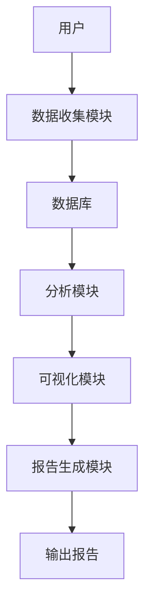
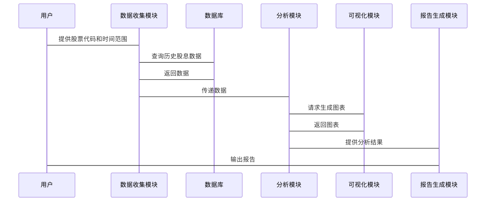

                 

<think>
好的，我现在需要帮用户设计一个关于股息投资策略的详细目录大纲。用户已经提供了一个初步的结构，但我需要更详细地展开每个部分，确保内容全面且有深度。

首先，我会从背景介绍开始，解释股息投资的基本概念，确保读者理解什么是股息，为什么股息重要，以及它与普通股票投资的区别。这部分需要简单明了，适合不同层次的读者。

接下来，核心概念部分需要详细讲解股息率、股息增长模型和股息贴现模型。我需要使用表格和图表来对比不同类型的股票，帮助读者更好地理解它们的特点和区别。

在算法和数学模型部分，我需要详细解释每个模型的原理，并用mermaid流程图展示计算过程。同时，提供Python代码实现，让读者能够实际操作，理解这些模型的应用。

系统分析与架构设计部分可能需要构建一个股息投资分析系统，包括数据收集、筛选和分析模块。我需要用mermaid类图和架构图展示系统的结构和交互，帮助读者理解系统的组成部分。

项目实战部分需要实际操作，比如选择一个具体的股票进行分析，展示如何使用前面的模型进行投资决策。这部分要详细步骤，确保读者能够跟着操作。

最后，最佳实践部分要总结前面的内容，给出小结、注意事项和拓展阅读建议，帮助读者巩固所学内容，并引导进一步学习。

在整个过程中，我要确保每个部分都有足够的细节，使用图表和代码示例来增强理解，同时保持逻辑连贯，结构清晰。这样，读者不仅能理解股息投资的基本概念，还能掌握实际的操作方法，应对市场波动，实现稳定的收入。
</think>

```markdown
# 股息投资策略：在动荡市场中获得稳定收入

> 关键词：股息投资，股票市场，股息率，股息增长模型，股息贴现模型，股票估值，投资策略

> 摘要：股息投资是一种通过获取股息收入来实现财务稳定的策略，尤其在动荡的市场环境中，股息投资能够为投资者提供相对稳定的收入来源。本文将详细探讨股息投资的核心概念、算法原理、系统架构设计、项目实战以及最佳实践，帮助读者在复杂多变的市场中制定有效的投资策略。

---

## 第一部分: 股息投资策略背景与基础

### 第1章: 股息投资策略概述

#### 1.1 股息投资的基本概念
- 什么是股息？
  - 股息是公司分配给股东的利润部分，按每股计算。
- 股息的分类：
  - 现金股息：最常见的形式，以现金形式发放。
  - 股票股息：以额外股票形式发放，通常用于税收优惠。
  - 特殊股息：公司出售资产或重组时发放的股息。
- 股息的重要性：
  - 股息收入是股东的权益，体现了公司的盈利能力和分红意愿。
  - 股息率高的股票通常被认为具有较高的投资价值。

#### 1.2 股息投资与股票投资的区别
- 股票投资的基本概念：
  - 股票代表公司所有权的一部分，投资者通过股价波动获利。
  - 股票投资的风险较高，收益不稳定。
- 股息投资的独特优势：
  - 股息收入提供稳定的现金流，即使股价下跌，也能获得收入。
  - 股息再投资策略（DGI）可以实现复利增长。
- 股票市场波动对股息投资的影响：
  - 股价波动会影响股息率，但股息收入本身相对稳定。
  - 在市场下跌时，股息收入可以提供缓冲，帮助投资者渡过难关。

#### 1.3 股息投资的目标与策略
- 稳定收入目标的实现路径：
  - 选择股息率高且稳定的股票，如公用事业、消费品等行业。
  - 通过分散投资降低风险，避免单一股票的风险。
- 股息投资的长期与短期策略：
  - 长期策略：寻找具有持续股息增长潜力的公司，进行长期持有。
  - 短期策略：通过股息套利，利用市场波动赚取短期收益。
- 股息投资的风险与收益平衡：
  - 高股息率的股票可能存在较高的波动性或较高的财务杠杆。
  - 需要平衡股息率和公司基本面，避免仅追求高股息而忽视风险。

---

## 第二部分: 股息投资的核心概念与联系

### 第2章: 股息率的计算与分析

#### 2.1 股息率的定义与计算公式
- 股息率的定义：
  - 股息率 = 每股股息（DPS） / 当前股价（P）
- 计算公式：
  $$ \text{股息率} = \frac{\text{每股股息}}{\text{股价}} \times 100\% $$
- 股息率与股价的关系：
  - 当股价上涨时，股息率可能下降，反之亦然。
  - 股息率高可能意味着股价被低估，但也可能反映公司盈利能力下降。

#### 2.2 股息率与股价波动的关联
- 股息率的行业差异：
  - 高股息行业：如公用事业、房地产信托、金融行业。
  - 低股息行业：如科技、成长型行业。
- 股息率的周期性：
  - 在经济衰退期间，公司可能减少股息支付，导致股息率上升。
  - 在经济复苏期间，股息支付可能恢复，股息率下降。

#### 2.3 股息率与投资决策的联系
- 股息率在投资决策中的作用：
  - 作为评估股票吸引力的指标之一。
  - 用于比较不同股票的投资价值。
  - 作为投资组合构建的参考依据。

### 第3章: 股息增长模型与股息贴现模型

#### 3.1 股息增长模型的原理
- 股息增长模型的定义：
  - 用于估计股票内在价值的模型，假设股息以固定增长率增长。
- 模型公式：
  $$ P_0 = \frac{D_1}{r - g} $$
  - \( P_0 \): 股票的内在价值
  - \( D_1 \): 下一年度预期股息
  - \( r \): 资本资产定价模型（CAPM）计算的折现率
  - \( g \): 股息增长率

#### 3.2 股息贴现模型（DDM）的原理
- DDM的基本假设：
  - 股票的价值等于未来股息的现值。
  - 股息按一定增长率（g）增长。
- 模型公式：
  $$ P = \frac{D_0 \times (1+g)}{r - g} $$
  - \( D_0 \): 当前股息
  - \( r \): 必要收益率
  - \( g \): 股息增长率

#### 3.3 两者的区别与联系
- 区别：
  - 股息增长模型假设股息增长率固定，适用于股息持续增长的公司。
  - 股息贴现模型更灵活，适用于股息增长率变化的公司。
- 联系：
  - 两者都基于股息的现值计算股票价值。
  - DDM是股息增长模型的一种形式。

### 第4章: 股票估值与股息率的关系

#### 4.1 股票估值的基本方法
- 市盈率（P/E）：
  - $$ \text{市盈率} = \frac{\text{股价}}{\text{每股收益}} $$
- 市净率（P/B）：
  - $$ \text{市净率} = \frac{\text{股价}}{\text{每股净资产}} $$
- 股息率：
  - $$ \text{股息率} = \frac{\text{每股股息}}{\text{股价}} \times 100\% $$

#### 4.2 股息率在估值中的应用
- 股息率作为估值指标的优势：
  - 能够直接反映股票的分红能力。
  - 适合比较不同股票的投资价值。
- 股息率与市盈率的对比：
  - 股息率关注当前收益，市盈率关注未来盈利。

#### 4.3 股息率与市盈率的对比分析
- 高股息率股票可能市盈率较高，也可能较低。
- 市盈率低的股票可能股息率也较低，取决于行业和公司基本面。

---

## 第三部分: 股息投资的核心算法与数学模型

### 第5章: 股息增长模型的算法实现

#### 5.1 股息增长模型的公式推导
- 假设股息每年以固定增长率g增长，且折现率r不变。
- 股票的内在价值计算公式：
  $$ P = \frac{D_0 \times (1+g)}{r - g} $$
- 示例计算：
  - D0 = $2, g = 5\%, r = 10\%$
  - P = (2 × 1.05) / (0.10 - 0.05) = 2.1 / 0.05 = $42

#### 5.2 股息增长模型的实现步骤
- 步骤1：确定当前股息D0。
- 步骤2：估计股息增长率g。
- 步骤3：确定折现率r。
- 步骤4：代入公式计算股票的内在价值。

#### 5.3 股息增长模型的代码实现
```python
def calculate_dividend_growth_value(D0, g, r):
    return (D0 * (1 + g)) / (r - g)

# 示例计算
D0 = 2  # 当前股息
g = 0.05  # 股息增长率
r = 0.10  # 折现率
value = calculate_dividend_growth_value(D0, g, r)
print(f"股票的内在价值为：{value:.2f}")
```

### 第6章: 股息贴现模型（DDM）的算法实现

#### 6.1 股息贴现模型的公式推导
- 股票价值计算公式：
  $$ P = \frac{D_1}{r - g} $$
- 示例计算：
  - D1 = $2.10, r = 10\%, g = 5\%$
  - P = 2.10 / (0.10 - 0.05) = 42

#### 6.2 股息贴现模型的实现步骤
- 步骤1：预测下一年度股息D1。
- 步骤2：确定折现率r和股息增长率g。
- 步骤3：代入公式计算股票价值。

#### 6.3 股息贴现模型的代码实现
```python
def calculate_ddm_value(D1, r, g):
    return D1 / (r - g)

# 示例计算
D1 = 2.10  # 下一年度股息
r = 0.10  # 折现率
g = 0.05  # 股息增长率
value = calculate_ddm_value(D1, r, g)
print(f"股票的内在价值为：{value:.2f}")
```

### 第7章: 数学模型和公式详细讲解

#### 7.1 股息增长模型的数学公式
- 股票的内在价值：
  $$ P = \frac{D_0 \times (1+g)}{r - g} $$
- 示例：
  - D0 = $2, g = 5\%, r = 10\%$
  - P = (2 × 1.05) / (0.10 - 0.05) = 42

#### 7.2 股息贴现模型的数学公式
- 股票价值：
  $$ P = \frac{D_1}{r - g} $$
- 示例：
  - D1 = $2.10, r = 10\%, g = 5\%$
  - P = 2.10 / (0.10 - 0.05) = 42

#### 7.3 股息率与股票价值的关系
- 股票价值与股息率的关系：
  - 股票价值 = 股息率 × 股价
  - $$ P = \text{股息率} \times \text{股价} $$
- 示例：
  - 股息率 = 5%, 股价 = $100
  - P = 0.05 × 100 = $5

---

## 第四部分: 系统分析与架构设计方案

### 第8章: 股息投资分析系统的设计

#### 8.1 问题场景介绍
- 投资者需要一个工具来评估股票的股息投资价值。
- 系统需求：数据收集、分析、可视化和报告生成。

#### 8.2 系统功能设计
- 数据收集模块：
  - 收集股票的历史股息数据、财务报表数据。
- 分析模块：
  - 计算股息率、股息增长率、内在价值。
- 可视化模块：
  - 生成图表展示股息率趋势、股价与股息关系。
- 报告生成模块：
  - 自动生成股息投资分析报告。

#### 8.3 系统架构设计


#### 8.4 系统接口设计
- 输入接口：
  - 用户输入股票代码和时间范围。
- 输出接口：
  - 生成股息率分析报告和可视化图表。

#### 8.5 系统交互设计


---

## 第五部分: 项目实战

### 第9章: 股息投资分析系统的实现

#### 9.1 环境安装
- 安装Python和必要的库：
  - pandas, numpy, matplotlib, yfinance
```bash
pip install pandas numpy matplotlib yfinance
```

#### 9.2 核心实现代码
```python
import yfinance as yf
import pandas as pd
import numpy as np
import matplotlib.pyplot as plt

# 下载股票数据
def download_data(ticker, start, end):
    data = yf.download(ticker, start, end)
    return data

# 计算股息率
def calculate_dividend_yield(data):
    dividend = data['Dividends'].iloc[-1]
    price = data['Adj Close'].iloc[-1]
    return dividend / price * 100

# 股票分析
ticker = 'AAPL'
start = '2020-01-01'
end = '2023-12-31'
data = download_data(ticker, start, end)
dividend_yield = calculate_dividend_yield(data)
print(f"{ticker}的股息率为：{dividend_yield:.2f}%")
```

#### 9.3 代码应用解读与分析
- 下载数据：使用yfinance库获取股票的历史数据。
- 计算股息率：提取最新的股息和收盘价，计算当前股息率。
- 可视化：绘制股息率趋势图。
```python
plt.plot(data.index, data['Dividends'])
plt.title('股息支付历史')
plt.xlabel('日期')
plt.ylabel('股息')
plt.show()
```

#### 9.4 案例分析与详细解读
- 以苹果公司（AAPL）为例，分析其股息率和股息增长情况。
- 计算股息增长率：
  - 使用过去几年的股息数据，计算年均增长率。
- 估值：使用DDM模型计算股票的内在价值，与当前股价对比。

#### 9.5 项目小结
- 项目实现的关键点：
  - 数据收集的准确性。
  - 模型计算的准确性。
  - 可视化结果的清晰度。

---

## 第六部分: 最佳实践与总结

### 第10章: 股息投资策略的最佳实践

#### 10.1 小结
- 股息投资的优势：
  - 稳定的现金流。
  - 复利效应。
- 关键成功因素：
  - 选择合适的股息股票。
  - 合理分散投资。
  - 定期再平衡投资组合。

#### 10.2 投资注意事项
- 避免仅追求高股息率。
- 关注公司的财务健康状况。
- 保持长期投资视角。

#### 10.3 拓展阅读
- 建议阅读的经典书籍：
  - 《股市长线思维》
  - 《巴菲特的选股智慧》
- 推荐学习的在线课程：
  - 股票投资基础课程
  - 股息投资策略深入分析

---

## 作者：AI天才研究院/AI Genius Institute & 禅与计算机程序设计艺术 /Zen And The Art of Computer Programming
```

