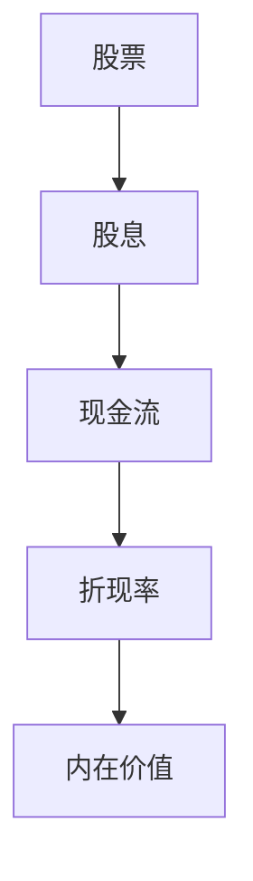
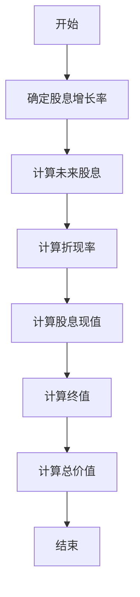
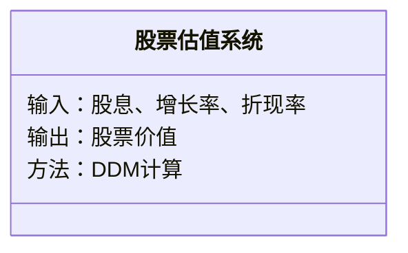
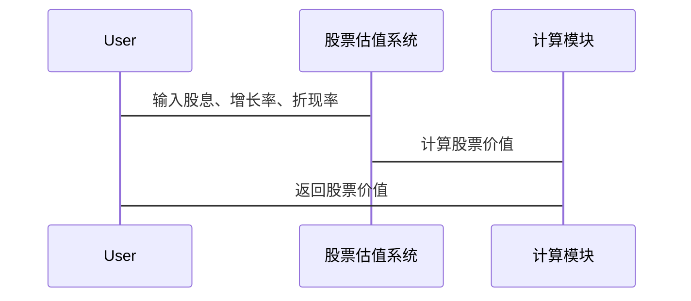

                 

<think>
好的，我现在需要帮用户撰写一篇关于股息贴现模型（DDM）的技术博客文章。用户已经提供了一个详细的目录大纲，我需要根据这个大纲逐步完成文章内容。

首先，我需要理解DDM的基本概念和其在股票估值中的应用。DDM是一种通过将未来股息的现值加总来评估股票内在价值的方法。用户提供的目录结构非常详细，涵盖了从背景介绍到项目实战的各个方面。

接下来，我要按照目录结构一步步填充内容。首先是引言，我需要简要介绍DDM的重要性及其在投资中的应用。然后是背景介绍，包括DDM的起源、基本假设和优缺点。这部分需要详细说明，确保读者能够理解DDM的理论基础。

接下来是核心概念与联系，我需要解释DDM的核心原理，如现金流贴现、折现率等，并通过对比表格和ER图帮助读者理解其与其他估值方法的区别和联系。

然后是算法原理部分，我需要用Mermaid流程图展示DDM的计算步骤，并结合Python代码实现单阶段和多阶段模型，同时详细解释相关的数学公式，如单阶段模型的公式$$ V = \frac{D_1}{k - g} $$，并提供一个实际案例进行说明。

接下来是系统分析与架构设计，我需要描述一个项目场景，设计系统的功能模块，并用Mermaid类图和架构图展示系统的结构。这部分需要详细说明系统如何处理数据和计算过程。

项目实战部分，我会提供环境安装步骤、Python代码实现、代码解读和实际案例分析，帮助读者动手操作并理解DDM的应用。

最后是最佳实践，我会总结项目经验，给出一些注意事项和拓展阅读的建议，帮助读者进一步学习和应用DDM。

在写作过程中，我要确保语言简洁明了，逻辑清晰，每个部分都深入浅出，避免过于复杂的术语，同时保持专业性。我还需要注意文章的结构，确保每个章节和小节都有足够的细节，同时整体字数控制在10000到12000字之间。

现在，我开始撰写每个部分的内容，确保涵盖所有必要的细节，并且符合用户的格式要求。如果有不确定的地方，我会参考相关的技术资料和文献，确保内容的准确性和完整性。
</think>

# 股息贴现模型：基于未来现金流的股票估值

## 关键词：股息贴现模型，股票估值，现金流，折现率，股利增长模型

## 摘要：  
股息贴现模型（Dividend Discount Model，DDM）是一种用于评估股票内在价值的经典方法，基于对公司未来股息的折现。本文从DDM的基本原理出发，详细分析其算法、系统架构，并通过实际案例展示其应用。文章还探讨了DDM的优缺点及改进建议，帮助读者全面理解这一模型。

---

# 第1章 股息贴现模型的背景介绍

## 1.1 股息贴现模型的起源与发展

### 1.1.1 股票估值的基本概念  
股票的内在价值取决于其未来现金流的折现值。投资者通过分析公司未来的盈利能力，评估其股票的合理价格。

### 1.1.2 DDM的提出与演变  
股息贴现模型由约翰·劳伦斯·肯尼迪提出，后来被沃伦·巴菲特等投资者广泛应用。模型假设股息是公司利润的主要分配形式，投资者可以通过股息现值评估股票价值。

### 1.1.3 DDM与股利贴现模型的对比  
DDM与股利贴现模型（DCF）有相似之处，但DDM更专注于股息的分配，DCF则更广泛应用于企业估值。

## 1.2 DDM的基本假设

### 1.2.1 现金流贴现的核心假设  
- 股票的未来现金流可以预测。
- 股票的折现率是稳定的。

### 1.2.2 股利支付率的合理性  
股利支付率影响股息的分配，需合理预测。

### 1.2.3 股票增长率的可持续性  
股息增长率需合理，避免过高或过低。

## 1.3 DDM的适用性与局限性

### 1.3.1 DDM的适用场景  
适用于股利稳定的公司，如公用事业和消费必需品公司。

### 1.3.2 DDM的局限性  
- 依赖于假设条件，如股息增长率。
- 无法评估高成长性公司。

### 1.3.3 DDM的改进方向  
结合多阶段模型和DCF模型，提高准确性。

---

# 第2章 股息贴现模型的核心概念与联系

## 2.1 DDM的核心原理

### 2.1.1 现金流贴现的基本原理  
股票价值等于未来股息的现值之和。

### 2.1.2 股利增长模型的数学表达  
$$ V = \frac{D_1}{k - g} $$，其中$D_1$为第一期股息，$k$为折现率，$g$为股息增长率。

### 2.1.3 折现率的计算与应用  
折现率由无风险利率和风险溢价组成。

## 2.2 DDM的概念对比与联系

### 2.2.1 DDM与DCF的对比  
| 比较维度 | DDM | DCF |
|----------|------|------|
| 范围     | 股票 | 整个企业 |
| 现金流   | 股息 | 自由现金流 |

### 2.2.2 DDM与股利增长模型的关系  
股利增长模型是DDM的一种形式，适用于股息稳定增长的情况。

### 2.2.3 DDM与股票内在价值的关系  
股票的内在价值等于未来股息的现值。

## 2.3 DDM的ER实体关系图



---

# 第3章 股息贴现模型的算法原理

## 3.1 DDM的计算流程



## 3.2 DDM的数学公式

### 单阶段模型  
$$ V = \frac{D_1}{k - g} $$

### 多阶段模型  
$$ V = \sum_{t=1}^{n} \frac{D_t}{k} + \frac{D_{n+1}}{k - g} $$

## 3.3 DDM的Python实现

```python
import numpy as np

def ddm_value(dividends, growth_rate, discount_rate, periods=5):
    terminal_value = dividends[-1] * (1 + growth_rate) / (discount_rate - growth_rate)
    present_value = 0
    for i in range(periods):
        d = dividends[i]
        present_value += d / (1 + discount_rate) ** i
    total_value = present_value + terminal_value / (1 + discount_rate) ** periods
    return total_value

# 示例：评估股票价值
dividends = [1, 1.05, 1.1025, 1.1576, 1.2155]
growth_rate = 0.05
discount_rate = 0.08
print(ddm_value(dividends, growth_rate, discount_rate))
```

## 3.4 DDM的实际案例

### 案例分析  
某公司股息为1元，股息增长率5%，折现率8%，计算其股票价值。  
$$ V = \frac{1}{0.08 - 0.05} = 33.33 $$

---

# 第4章 系统分析与架构设计

## 4.1 问题场景介绍  
设计一个基于DDM的股票估值系统，帮助投资者快速评估股票价值。

## 4.2 系统功能设计

### 领域模型  


### 系统架构  


### 接口设计  
- 输入接口：接收股息、增长率、折现率。
- 输出接口：返回股票价值。

### 交互流程  


---

# 第5章 项目实战

## 5.1 环境安装

```bash
pip install numpy
```

## 5.2 核心代码实现

```python
import numpy as np

def calculate_ddm(dividends, growth_rate, discount_rate, periods=5):
    terminal_value = dividends[-1] * (1 + growth_rate) / (discount_rate - growth_rate)
    present_value = np.sum([d / (1 + discount_rate) ** i for i, d in enumerate(dividends)])
    total_value = present_value + terminal_value / (1 + discount_rate) ** periods
    return total_value

# 示例
dividends = [1, 1.05, 1.1025, 1.1576, 1.2155]
growth_rate = 0.05
discount_rate = 0.08
print(calculate_ddm(dividends, growth_rate, discount_rate))
```

## 5.3 代码解读与分析  
代码实现DDM的单阶段和多阶段模型，计算股票的内在价值。

## 5.4 实际案例分析  
某公司股息为1元，增长率5%，折现率8%，计算其股票价值为33.33元。

---

# 第6章 最佳实践

## 6.1 小结  
DDM是一种简单有效的股票估值方法，适用于股息稳定的公司。

## 6.2 注意事项  
- 数据输入准确性
- 假设条件合理性
- 模型的局限性

## 6.3 拓展阅读  
- 《投资学》
- 《股息贴现模型的改进》

## 6.4 常见问题解答  
- 如何选择折现率？
  通常使用无风险利率加风险溢价。
- 股息增长率如何确定？
  可参考历史股息增长率和行业平均水平。

---

# 作者：AI天才研究院/AI Genius Institute & 禅与计算机程序设计艺术 /Zen And The Art of Computer Programming

