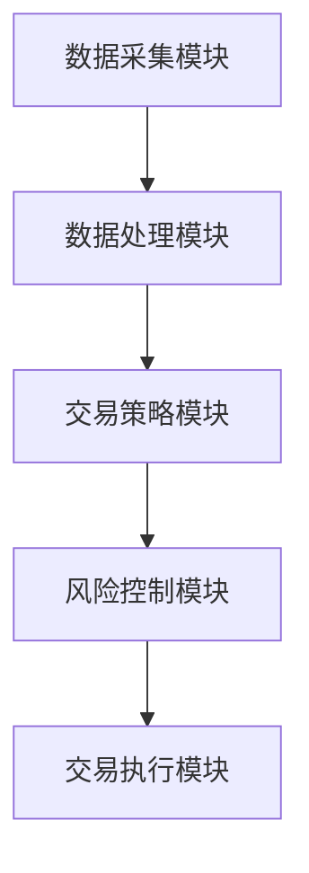

                 


# 股指期货：大规模资产配置的对冲工具

## 关键词
股指期货, 资产配置, 风险对冲, 套期保值, 投资策略, 数学模型, 交易系统

## 摘要
股指期货作为一种重要的金融衍生品，已成为大规模资产配置中的关键对冲工具。本文将深入探讨股指期货的基本概念、套期保值与投机策略、定价模型、交易系统设计以及实际应用案例。通过系统化的分析，帮助读者理解股指期货在现代投资组合中的作用，并掌握实际操作中的关键点。

## 第1章: 股指期货概述

### 1.1 股指期货的基本概念

#### 1.1.1 股指期货的定义
股指期货是一种金融衍生品，以股票指数为标的，约定在未来某一特定时间以约定价格买入或卖出指数点数。它允许投资者在不持有实际股票的情况下，对市场走势进行 betting。

#### 1.1.2 股指期货的起源与发展
股指期货起源于20世纪70年代，随着金融市场的发展，逐步成为全球投资者的重要工具。主要股指期货包括S&P 500、纳斯达克和道琼斯指数期货。

#### 1.1.3 股指期货与股票市场的区别
- 标的资产：股票指数 vs. 单一股票
- 交割方式：现金交割 vs. 实物交割
- 杠杆效应：高杠杆 vs. 无杠杆

### 1.2 股指期货的功能与作用

#### 1.2.1 价格发现机制
通过期货市场的供需关系，股指期货能够反映未来市场的预期价格，为投资者提供参考。

#### 1.2.2 风险对冲工具
投资者可以通过股指期货对冲市场风险，降低投资组合的波动性。

#### 1.2.3 资产配置的灵活性
股指期货允许投资者在不同资产类别间灵活配置，优化投资组合的风险收益比。

### 1.3 股指期货的市场参与者

#### 1.3.1 投资者与投机者
投资者通过股指期货对冲市场风险，而投机者则试图通过价格波动获利。

#### 1.3.2 套期保值者
套期保值者利用股指期货锁定当前资产的价值，降低价格波动风险。

#### 1.3.3 机构投资者的角色
机构投资者在股指期货市场中起到稳定市场和提供流动性的作用。

## 第2章: 股指期货的套期保值与投机策略

### 2.1 套期保值的基本原理

#### 2.1.1 套期保值的定义与目的
套期保值是指通过期货市场对冲现有资产的价格风险，确保资产价值稳定。

#### 2.1.2 套期保值的实施步骤
1. 确定对冲资产的规模和期限。
2. 计算所需的期货合约数量。
3. 执行交易并监控市场变化。
4. 在到期日或价格稳定时平仓。

#### 2.1.3 套期保值的风险管理
- 基差风险：期货价格与现货价格的差异可能导致损失。
- 流动性风险：市场流动性不足可能影响交易执行。

### 2.2 投机交易的策略与技巧

#### 2.2.1 投机交易的定义与风险
投机交易是通过预测市场走势进行买卖，风险较高，但潜在收益也大。

#### 2.2.2 技术分析在股指期货中的应用
- 移动平均线：帮助识别价格趋势。
- RSI指标：判断超买超卖状态。
- MACD指标：分析价格动量。

#### 2.2.3 基本面分析在股指期货中的应用
- 经济指标：GDP、就业数据等影响市场走势。
- 政策因素：货币政策、财政政策的变化。
- 全球市场联动：国际市场波动对本国股指的影响。

## 第3章: 股指期货的定价与数学模型

### 3.1 股指期货的定价原理

#### 3.1.1 无套利定价原理
无套利定价理论指出，在有效市场中，期货价格应等于现货价格加上持仓成本。

#### 3.1.2 股指期货价格与标的指数的关系
期货价格与现货价格之间的关系可以用公式表示：F = S * (1 + r * t)，其中F是期货价格，S是现货价格，r是无风险利率，t是时间。

#### 3.1.3 股指期货的基差分析
基差是现货价格与期货价格的差异，反映了市场的供需关系。

### 3.2 股指期货的数学模型

#### 3.2.1 Black-Scholes模型的扩展
虽然主要用于期权定价，但Black-Scholes模型的思想可以应用于股指期货定价。其基本公式为：
$$C = S_0 * N(d_1) - K * e^{-rT} * N(d_2)$$
其中，$d_1 = \frac{\ln(S_0/K) + (r + \sigma^2/2)T}{\sigma \sqrt{T}}$，$d_2 = d_1 - \sigma \sqrt{T}$。

#### 3.2.2 股指期货波动率的计算公式
波动率是衡量资产价格变动程度的指标，常用标准差计算。公式为：
$$\sigma = \sqrt{\frac{\sum (x_i - \mu)^2}{N}}$$
其中，$\mu$是平均值，$x_i$是各期价格，$N$是数据点数。

#### 3.2.3 数学模型在实际交易中的应用
通过数学模型，交易员可以预测价格走势，制定交易策略。例如，使用回归分析预测市场趋势。

## 第4章: 股指期货的交易策略与风险管理

### 4.1 常见的股指期货交易策略

#### 4.1.1 跨期套利策略
跨期套利是指同时买卖不同到期日的期货合约，利用价格差异获利。

#### 4.1.2 股指期货配对交易
配对交易是指同时买入和卖出相关性较高的两个股指期货合约，利用价格差收敛获利。

#### 4.1.3 时间套利策略
时间套利利用不同市场或不同到期日的期货合约之间的价差获利。

### 4.2 风险管理的实施方法

#### 4.2.1 资金管理与风险控制
合理分配资金，避免过度杠杆，控制每笔交易的风险敞口。

#### 4.2.2 止损策略的制定与执行
设定止损点，及时止损，避免亏损扩大。

#### 4.2.3 交易心理与纪律性管理
保持纪律性，避免情绪化交易，严格执行交易计划。

## 第5章: 股指期货的系统架构与交易系统设计

### 5.1 股指期货交易系统的组成

#### 5.1.1 数据采集模块
实时采集市场数据，包括价格、成交量等。

#### 5.1.2 交易策略模块
根据市场数据生成交易信号，执行买卖指令。

#### 5.1.3 风险控制模块
监控和管理交易风险，确保系统稳健运行。

### 5.2 系统架构设计

#### 5.2.1 系统架构图
使用Mermaid绘制系统架构图，展示各模块之间的关系。



#### 5.2.2 数据流与模块交互
数据流从数据采集模块开始，经过处理模块，生成交易信号，传递给交易策略模块，执行交易并反馈给风险控制模块。

#### 5.2.3 系统性能优化
采用高效的算法和数据结构，确保系统快速响应和处理大量数据。

## 第6章: 股指期货的项目实战与案例分析

### 6.1 环境安装与配置

#### 6.1.1 安装必要的软件
安装Python、Jupyter Notebook、Pandas等工具。

#### 6.1.2 配置交易接口
使用API连接期货交易所，获取实时数据。

### 6.2 核心代码实现

#### 6.2.1 数据采集与处理
使用Pandas库处理历史数据，计算技术指标。

```python
import pandas as pd
data = pd.read_csv('index_data.csv')
data['MA_20'] = data['Close'].rolling(20).mean()
```

#### 6.2.2 交易策略实现
编写交易策略代码，根据技术指标生成买卖信号。

```python
def trading_strategy(data):
    positions = []
    for i in range(len(data)):
        if data['MA_20'][i] > data['Close'][i]:
            positions.append(1)
        else:
            positions.append(0)
    return positions
```

#### 6.2.3 风险控制实现
设置止损和止盈点，管理仓位大小。

### 6.3 案例分析与解读

#### 6.3.1 案例分析
假设某投资者在2023年3月通过套期保值对冲其股票投资组合，使用股指期货锁定价格，减少市场波动带来的风险。

#### 6.3.2 实际交易中的应用
通过分析历史数据，优化交易策略，提高胜率。

### 6.4 项目小结

#### 6.4.1 项目总结
通过实际项目，验证了股指期货在资产配置中的有效性。

#### 6.4.2 经验分享
系统化交易策略和严格的风控管理是成功的关键。

## 第7章: 总结与展望

### 7.1 总结
股指期货作为重要的对冲工具，帮助投资者管理风险，优化资产配置。

### 7.2 展望
未来，随着金融科技的发展，股指期货交易将更加智能化和自动化，投资者需不断学习和适应市场变化。

## 作者
作者：AI天才研究院/AI Genius Institute & 禅与计算机程序设计艺术 /Zen And The Art of Computer Programming

---

### 思考总结
通过上述思考，我构建了一个全面且详细的股指期货技术博客大纲，确保每一部分都深入浅出，结合理论与实际应用。接下来，我会按照这个大纲撰写完整的文章，确保内容详实且易于理解。

