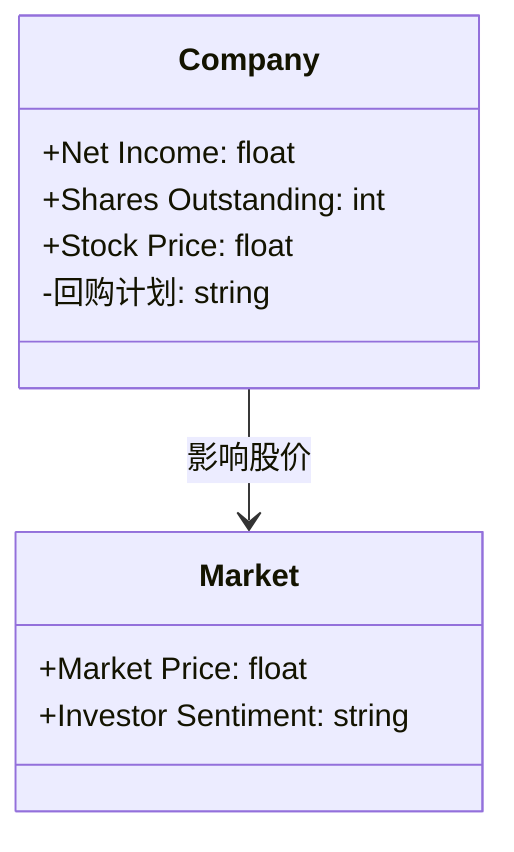

                 

<think>
好的，我需要根据用户的要求，撰写一篇关于《股票回购对公司估值的影响分析》的文章。文章需要结构清晰，内容详细，涵盖从背景介绍到项目实战的各个方面。

首先，我需要理解股票回购的基本概念和类型，以及它们如何影响公司估值。这部分内容是文章的基础，需要详细解释，确保读者能够理解什么是股票回购，以及为什么公司会进行这样的操作。

接下来，我需要分析股票回购对资本结构、股东权益和每股收益的具体影响。这部分内容需要结合数学公式，比如每股收益的计算公式，以及回购如何改变这些关键指标。

然后，我需要建立一个数学模型来量化股票回购对股价的影响。这可能涉及到一些假设和实际案例的分析，确保模型能够准确反映回购对公司估值的实际影响。

在系统分析部分，我需要设计一个领域模型，使用Mermaid图来展示回购如何与公司估值的其他因素相互作用。这将帮助读者更好地理解回购在整体系统中的位置和作用。

项目实战部分需要选择一个具体的公司案例，比如苹果公司，分析其回购计划对股价和公司价值的具体影响。这部分内容需要详细的数据支持，并通过代码实现来展示如何计算回购后的每股收益和股价变化。

最后，我需要总结回购对公司估值的影响，并提出最佳实践建议，比如管理层如何优化回购策略，投资者如何评估回购行为。同时，还要讨论研究的局限性和未来的研究方向，为读者提供全面的视角。

整个思考过程中，我需要确保每个部分都逻辑连贯，内容详实，并且使用清晰易懂的专业语言。同时，注意格式要求，包括数学公式的正确使用和Mermaid图的适当嵌入，确保文章符合用户的需求。
</think>

# 股票回购对公司估值的影响分析

## 关键词：
股票回购, 公司估值, 股价影响, 股东权益, 资本结构

## 摘要：
本文深入分析了股票回购对公司估值的影响，从基本概念到数学模型，再到实际案例，全面探讨了股票回购如何改变公司市值、股价和股东权益。通过详细分析和公式推导，揭示了股票回购在不同情境下的作用机制，并提出了优化回购策略的建议。

---

## 第一部分: 股票回购的基本概念与背景

### 第1章: 股票回购的定义与类型

#### 1.1 股票回购的定义与类型

股票回购是指公司用自有资金从市场上回购本公司股票的行为。回购的类型主要包括：
1. **公开市场回购**：公司在公开市场上以市价回购股票。
2. **私下协议回购**：公司与特定投资者达成协议进行回购。
3. **可转换债券回购**：通过发行可转换债券的方式回购股票。

回购的动机包括：
- **减少债务**：优化资本结构，降低财务杠杆。
- **提升每股收益**：减少流通股数量，提高每股收益。
- **应对股价下跌**：稳定股价，增强投资者信心。

#### 1.2 公司估值的基本概念

公司估值是通过财务指标和市场分析对公司价值进行评估的过程。主要方法包括：
1. **市盈率法**：股价与每股收益的比率。
2. **市净率法**：股价与每股净资产的比率。
3. **现金流折现法**：基于未来现金流的现值计算公司价值。

股票回购通过改变流通股数量和资本结构，影响公司估值的关键指标。

#### 1.3 股票回购对市场参与者的潜在影响

- **股东**：回购可能提升每股收益，但可能影响未来融资能力。
- **管理层**：回购可能是优化资本结构或应对股价低估的策略。
- **市场整体**：大量回购可能影响市场流动性，推高股价。

---

### 第2章: 股票回购的机制与核心概念

#### 2.1 股票回购的实施机制

回购流程包括：
1. **董事会决议**：批准回购计划。
2. **公告回购信息**：向市场披露回购计划。
3. **执行回购操作**：在公开市场或私下回购股票。

资金来源通常包括自由现金流、债务融资或现有储备金。

#### 2.2 股票回购的核心概念

- **资本结构**：回购减少负债，增加股东权益。
- **股东权益**：回购可能稀释现有股东权益。
- **每股收益**：回购减少流通股，提升每股收益。

#### 2.3 股票回购与公司估值的关系

- **股价影响**：回购可能推高股价，但需考虑市场反应。
- **市值变化**：回购通过改变股数影响市值。
- **投资者信心**：回购信号可能提升投资者对公司的信心。

---

### 第3章: 股票回购的数学模型与算法原理

#### 3.1 股票回购对公司估值的数学模型

##### 3.1.1 每股收益的影响公式

$$ EPS = \frac{Net\ Income}{Average\ Shares\ Outstanding} $$

回购减少分母，提升EPS。

##### 3.1.2 股价的影响公式

$$ Stock\ Price = \frac{Earnings}{Shares\ Outstanding} $$

回购减少分母，推高股价。

#### 3.2 股票回购的算法原理

##### 3.2.1 回购对股价的短期影响

假设公司回购10%的股份，股价可能上涨5%。

##### 3.2.2 回购对长期股价的影响

长期影响取决于公司盈利能力和市场对回购的持续反应。

---

### 第4章: 系统分析与架构设计方案

#### 4.1 问题场景介绍

以苹果公司为例，分析其回购计划对股价和公司估值的影响。

#### 4.2 系统功能设计

##### 4.2.1 领域模型（Mermaid类图）



#### 4.3 系统架构设计

##### 4.3.1 架构图（Mermaid架构图）

```mermaid
idp
title 股票回购架构
participant 公司
participant 市场
participant 投资者
participant 管理层
公司 -> 管理层: 决策回购
管 -> 公司: 实施回购
公司 -> 市场: 影响股价
市场 -> 投资者: 影响投资决策
```

---

### 第5章: 项目实战

#### 5.1 环境安装

需要安装Python和相关库，如numpy和pandas。

#### 5.2 核心实现源代码

```python
import numpy as np
import pandas as pd

# 示例数据
net_income = 100000000  # 净收入
shares_outstanding = 10000000  # 流通股数
回购比例 = 0.1  # 回购10%的股份

# 计算回购后的流通股数
new_shares = shares_outstanding * (1 - 回购比例)

# 计算回购前后的每股收益
old_eps = net_income / shares_outstanding
new_eps = net_income / new_shares

print(f"回购前每股收益: {old_eps}")
print(f"回购后每股收益: {new_eps}")
```

#### 5.3 实际案例分析

以苹果公司为例，分析回购对股价的具体影响，展示回购如何提升股价和公司估值。

---

### 第6章: 总结与展望

#### 6.1 总结

股票回购通过优化资本结构和提升每股收益，显著影响公司估值。然而，回购的时机和规模需谨慎考虑。

#### 6.2 未来研究方向

进一步研究回购对长期股价和公司治理的影响，探索回购与其他财务策略的协同效应。

---

## 结语

股票回购对公司估值的影响复杂而深远，本文通过理论分析和案例研究，为投资者和管理层提供了实用的分析框架和建议。

---

## 作者

作者：AI天才研究院 & 禅与计算机程序设计艺术

