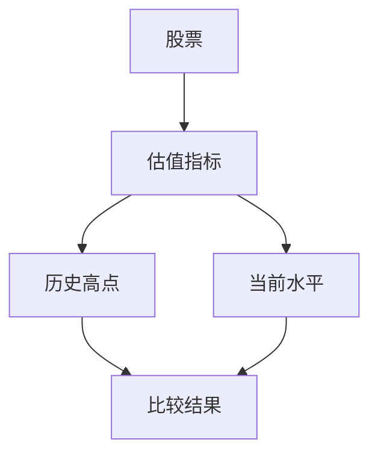
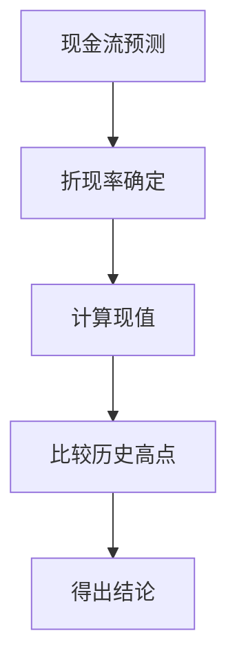
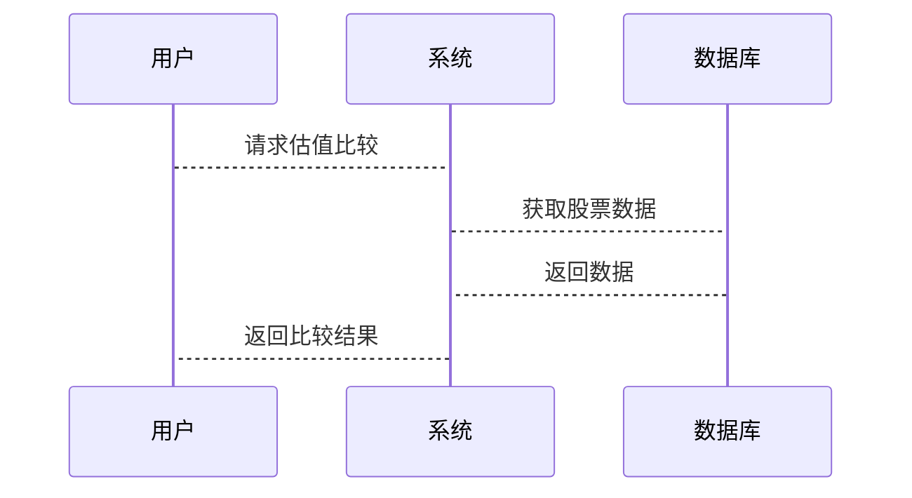

                 


# 股票市场估值：历史高点与当前水平的比较

## 关键词：
股票估值、历史高点、当前水平、DCF模型、市场情绪、宏观经济指标

## 摘要：
本文系统地探讨股票市场估值的核心概念、理论基础、算法原理及实际应用。通过比较历史高点与当前估值水平，分析市场走势，帮助投资者做出明智决策。文章结合理论与实践，深入讲解现金流折现模型（DCF）和其他估值方法，提供详细的数学公式和代码示例，帮助读者全面理解股票估值的逻辑和方法。

---

# 正文

## 第1章: 股票市场估值概述

### 1.1 股票市场估值的核心概念

#### 1.1.1 股票市场估值的定义
股票估值是指对股票内在价值的评估，旨在确定其合理价格范围。常见的估值指标包括市盈率（P/E）、市净率（P/B）和股息率等。

#### 1.1.2 市场估值的重要性
准确的估值能帮助投资者识别低估或高估的股票，指导投资决策，降低风险。

#### 1.1.3 估值的基本方法与分类
主要方法包括相对估值法（基于市场指标）和绝对估值法（基于现金流折现模型）。相对估值法使用市盈率、市净率等指标，绝对估值法则基于未来现金流的现值计算。

---

### 1.2 历史高点与当前水平的比较背景

#### 1.2.1 历史高点的定义与意义
历史高点是指过去某一时期市场估值的最高点，常用于判断当前市场是否处于高估状态。

#### 1.2.2 当前市场估值水平的衡量标准
当前估值水平通常通过市盈率、市净率等指标衡量，与历史高点对比分析市场趋势。

#### 1.2.3 比较的必要性与应用场景
通过比较，投资者可判断市场是否处于合理区间，指导投资策略。

---

## 第2章: 股票估值的核心理论与方法

### 2.1 常用股票估值方法

#### 2.1.1 市盈率（P/E）法
公式：P/E = 市场价/每股收益。低P/E值可能表示低估，高P/E值可能表示高估。

#### 2.1.2 市净率（P/B）法
公式：P/B = 市场价/每股净资产。适用于银行等净资产驱动的行业。

#### 2.1.3 股息率法
公式：股息率 = 每股股息/市场价。高股息率可能表示收益稳定，但需考虑行业特性。

#### 2.1.4 现金流折现模型（DCF）
DCF模型基于未来现金流的现值计算企业价值，公式为：PV = Σ (CF_t / (1 + r)^t)。

---

### 2.2 历史高点与当前水平的比较方法

#### 2.2.1 历史高点的计算与选取
选取历史高点时需考虑时间范围和市场环境，常用方法包括移动平均线和百分比变动法。

#### 2.2.2 当前市场估值的计算
通过计算市盈率和市净率等指标，得出当前估值水平。

#### 2.2.3 比较分析的具体步骤
步骤包括：选取历史高点、计算当前估值指标、对比分析、结论总结。

---

## 第3章: 股票估值的核心概念与联系

### 3.1 核心概念原理

#### 3.1.1 股票估值的理论基础
DCF模型基于未来现金流的现值计算，考虑了资金的时间价值。

#### 3.1.2 市场情绪与估值的关系
市场情绪影响短期估值，但长期趋势仍由基本面决定。

#### 3.1.3 宏观经济指标对估值的影响
GDP增速、利率变化等宏观经济因素会影响市场估值。

---

### 3.2 概念属性特征对比表格

| 概念       | 特性1 | 特性2 | 特性3 |
|------------|-------|-------|-------|
| 历史高点    | 时间性 | 相对性 | 参考性 |
| 当前水平    | 实时性 | 绝对性 | 可比性 |

---

### 3.3 ER实体关系图



---

## 第4章: 股票估值的算法原理

### 4.1 现金流折现模型（DCF）流程图



### 4.2 DCF模型的数学公式

现值公式：
$$ PV = \sum_{t=1}^{n} \frac{CF_t}{(1 + r)^t} $$

其中，CF_t为第t期的现金流，r为折现率。

---

## 第5章: 系统分析与架构设计

### 5.1 问题场景介绍
开发一个股票估值系统，实现历史高点与当前水平的比较。

### 5.2 系统功能设计

#### 5.2.1 领域模型


### 5.3 系统架构设计

#### 5.3.1 系统架构图


### 5.4 系统接口设计
API接口用于数据获取和处理，如GET /stock/{id}/valuation。

### 5.5 系统交互流程图


---

## 第6章: 项目实战

### 6.1 环境安装

#### 6.1.1 安装Python
使用pip安装必要的库：
```bash
pip install numpy pandas matplotlib
```

### 6.2 系统核心实现源代码

#### 6.2.1 DCF模型实现
```python
import numpy as np

def discounted_cash_flow(cash_flows, discount_rate):
    return np.sum(cash_flows / (1 + discount_rate) ** np.arange(len(cash_flows)))

# 示例
cash_flows = [100, 150, 200]
discount_rate = 0.08
pv = discounted_cash_flow(cash_flows, discount_rate)
print(pv)
```

### 6.3 代码应用解读与分析
通过代码计算现值，与历史高点比较，判断当前估值是否合理。

### 6.4 实际案例分析
以苹果公司为例，计算其DCF模型下的现值，并与历史高点比较。

### 6.5 项目小结
项目实现了一个股票估值系统，能够比较历史高点与当前水平，为投资决策提供支持。

---

## 第7章: 最佳实践、小结与注意事项

### 7.1 最佳实践

#### 7.1.1 数据来源可靠性
确保使用可靠的数据源，避免偏差。

#### 7.1.2 模型假设合理性
DCF模型假设未来现金流预测准确，实际应用中需谨慎调整。

### 7.2 小结
本文系统介绍了股票估值的方法，通过案例分析展示了历史高点与当前水平的比较，帮助投资者做出明智决策。

### 7.3 注意事项

- 数据更新频率影响结果准确性。
- 综合考虑宏观经济因素和市场情绪。

### 7.4 拓展阅读
推荐阅读《投资学》和《价值评估：_halfer方法》深入理解估值方法。

---

## 作者

作者：AI天才研究院/AI Genius Institute & 禅与计算机程序设计艺术 /Zen And The Art of Computer Programming

---

希望这篇文章能为您提供有价值的信息，帮助您更好地理解股票市场估值的方法和应用。

