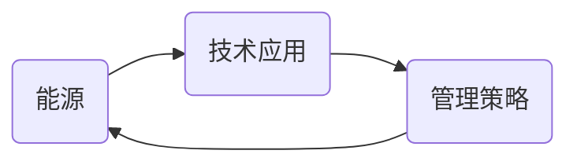
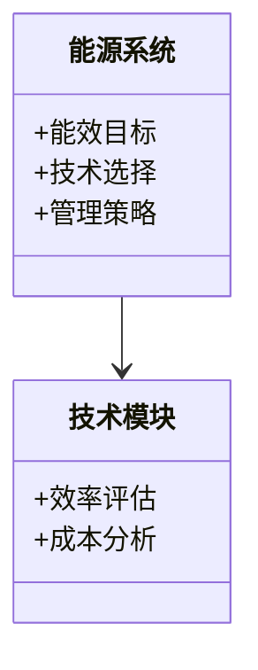

                 


# 能源效率提升技术的投资价值评估

> 关键词：能源效率，投资价值，技术分析，经济模型，可持续发展

> 摘要：能源效率的提升是实现可持续发展的重要途径。本文通过分析能源效率提升技术的核心原理、经济模型和实际应用，系统地评估了这些技术的投资价值。结合数学模型、算法流程和系统架构设计，本文为企业和技术决策者提供了科学的参考依据。

---

## 第一部分：能源效率提升技术的背景与核心概念

### 第1章：能源效率提升技术的背景与问题描述

#### 1.1 能源效率提升的背景与意义

当前，全球能源消耗持续增长，而化石能源的枯竭和环境问题日益严重。能源效率的提升不仅是应对气候变化的关键策略，也是实现可持续发展的必要条件。通过提高能源利用效率，可以减少对化石能源的依赖，降低碳排放，从而推动绿色经济发展。

能源效率提升的意义在于：

- **资源节约**：减少能源消耗，延缓化石能源枯竭。
- **成本降低**：通过技术优化，降低能源使用成本。
- **环境改善**：减少污染物排放，缓解环境压力。

#### 1.2 能源效率提升的技术挑战

当前能源效率提升面临的技术挑战主要包括：

1. **技术局限性**：传统能源技术效率较低，难以满足现代需求。
2. **技术升级的必要性**：新型技术虽效率高，但投资成本较高，且需要克服技术瓶颈。
3. **效率与经济性的平衡**：在提升效率的同时，需考虑技术的经济可行性。

#### 1.3 能源效率提升的核心要素

能源效率提升的核心要素包括：

- **能源转换效率**：衡量能源利用效率的标准。
- **技术与管理的结合**：通过技术创新和管理优化实现效率提升。
- **核心概念的结构化分析**：系统化分析能源效率的关键因素。

---

### 第2章：能源效率提升技术的核心概念与联系

#### 2.1 能源效率提升技术的核心原理

能源效率提升技术的核心原理基于以下几个方面：

1. **能效优化的数学模型**：通过建立数学模型，分析不同技术对能效的影响。
2. **技术与经济性的平衡**：综合考虑技术的投资成本和运营成本。

#### 2.2 能源效率提升技术的系统架构

能源效率提升系统的架构设计包括：

- **ER实体关系图**：展示能源、技术、管理之间的关系。


- **系统功能设计**：通过领域模型类图展示系统的主要功能模块。


#### 2.3 技术与经济性的综合分析

技术对比分析表格如下：

| 技术类型 | 能效提升 | 投资成本 | 维护成本 |
|----------|----------|----------|----------|
| 传统技术 | 低       | 低       | 高       |
| 新型技术 | 高       | 高       | 低       |

---

## 第二部分：能源效率提升技术的算法原理

### 第3章：能源效率提升技术的算法原理

#### 3.1 能源效率提升的数学模型

能效优化的线性回归模型如下：

$$ y = \beta_0 + \beta_1x + \epsilon $$

其中，$y$为能效，$x$为技术变量，$\beta$为系数。

#### 3.2 投资价值评估的算法流程

算法流程如下：


核心代码实现：

```python
import pandas as pd
import numpy as np
from sklearn.linear_model import LinearRegression

# 数据准备
data = pd.DataFrame({
    '技术变量': [1, 2, 3, 4, 5],
    '能效': [2, 3, 4, 5, 6]
})

# 建立模型
model = LinearRegression()
model.fit(data[['技术变量']], data['能效'])

# 预测结果
print(model.predict([[6]]))
```

---

## 第三部分：能源效率提升技术的系统分析与架构设计

### 第4章：能源效率提升技术的系统分析

#### 4.1 项目背景介绍

能源效率提升项目通常涉及多个领域，包括工业、建筑和交通等。本项目旨在通过技术创新和管理优化，提升能源使用效率，降低成本。

#### 4.2 系统功能设计

系统功能设计包括：

- 数据采集模块：收集能源消耗数据。
- 能效分析模块：分析能效并提出优化建议。
- 管理模块：制定和调整管理策略。

系统架构设计：


#### 4.3 系统接口设计

系统接口设计包括：

- 数据接口：与数据源连接。
- 用户接口：供用户查看分析结果。
- 管理接口：供管理员调整参数。

---

## 第四部分：能源效率提升技术的项目实战

### 第5章：项目实战

#### 5.1 环境安装

安装所需的环境包括：

- Python 3.8+
- Pandas、NumPy、Scikit-learn库

#### 5.2 核心代码实现

核心代码如下：

```python
import pandas as pd
from sklearn.linear_model import LinearRegression

# 数据准备
data = pd.read_csv('energy_data.csv')

# 建立模型
model = LinearRegression()
model.fit(data[['技术变量']], data['能效'])

# 保存模型
import joblib
joblib.dump(model, 'energy_efficiency_model.pkl')
```

#### 5.3 实际案例分析

通过具体案例分析，验证模型的预测能力。例如，假设某企业采用新型技术后，能效提升了10%，投资成本增加了20%，但维护成本降低了15%。模型预测显示，长期来看，新型技术的投资回报更高。

---

## 第五部分：总结与展望

### 第6章：总结与展望

#### 6.1 总结

能源效率提升技术的投资价值评估是一个复杂但重要的过程。通过建立数学模型、分析技术经济性、设计合理的系统架构，可以有效提升能源效率，降低成本。

#### 6.2 展望

未来，随着人工智能和大数据技术的发展，能源效率提升技术将更加智能化和精准化。投资价值评估也将更加依赖数据驱动的决策，为企业提供更有力的支持。

---

## 作者信息

作者：AI天才研究院/AI Genius Institute & 禅与计算机程序设计艺术 /Zen And The Art of Computer Programming

