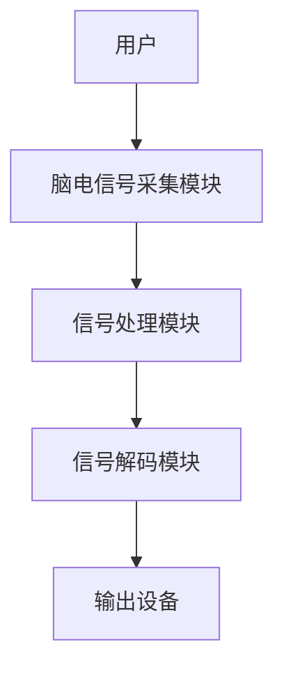
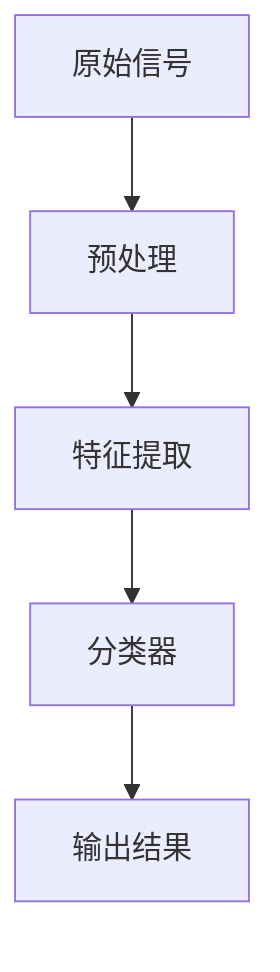

                 

# 脑机接口技术的发展前景与伦理考量

## 关键词：脑机接口、神经工程、人工智能、医疗健康、隐私安全、伦理学

## 摘要：脑机接口（BCI）技术作为连接人类大脑与外部设备的桥梁，正在迅速发展。本文将深入探讨脑机接口的核心技术、应用场景及其带来的伦理挑战，分析其发展前景，并提出相应的解决方案。

---

# 第一部分: 脑机接口技术的发展背景与核心概念

## 第1章: 脑机接口技术的背景介绍

### 1.1 脑机接口技术的定义与核心概念

脑机接口（Brain-Computer Interface，BCI）是一种通过采集和分析大脑神经信号，直接将人的意图转化为外部设备动作的技术。它不需要依赖于传统的身体运动，而是通过解读大脑活动来实现人与机器的交互。

#### 1.1.1 脑机接口技术的定义

脑机接口技术是一种通过采集和分析大脑神经信号，将人的意图转化为外部设备动作的技术。它主要依赖于神经科学、计算机科学和工程学的交叉应用。

#### 1.1.2 脑机接口的核心要素与组成

脑机接口系统通常包括以下几个核心要素：
1. **信号采集模块**：用于采集大脑神经信号，通常通过电极或其他传感器实现。
2. **信号处理模块**：对采集到的信号进行预处理、特征提取和分类。
3. **解码器**：将特征信号转换为控制指令，驱动外部设备。
4. **输出设备**：执行解码器生成的指令，如机器人手臂、计算机光标等。

#### 1.1.3 脑机接口的分类与应用场景

脑机接口可以分为侵入式和非侵入式两类：
- **侵入式BCI**：通过植入大脑内部的电极采集信号，精度高但风险大，主要用于医疗领域。
- **非侵入式BCI**：通过头皮电极或其他外部传感器采集信号，风险较低，适用于科研和民用领域。

应用场景包括医疗康复、娱乐、教育、军事等领域。

### 1.2 脑机接口技术的历史发展与现状

#### 1.2.1 脑机接口技术的发展历程

- **20世纪50年代**：初步研究，主要集中在神经信号的记录和分析。
- **20世纪70年代**：非侵入式脑机接口的概念提出。
- **20世纪90年代**：侵入式脑机接口的首次成功实验。
- **21世纪**：脑机接口技术快速发展，应用场景不断拓展。

#### 1.2.2 当前技术的主要特点

- **高精度**：侵入式技术的信号采集精度更高。
- **非侵入式技术的便捷性**：无需手术，适合大规模应用。
- **智能化**：结合人工智能技术，提升解码算法的性能。

#### 1.2.3 脑机接口技术的未来趋势

- **高集成化**：设备小型化、便携化。
- **智能化**：结合AI技术，实现更精准的意图识别。
- **多模态融合**：结合其他生物信号，提升系统的稳定性和准确性。

---

## 第2章: 脑机接口技术的核心概念与联系

### 2.1 脑机接口技术的核心原理

#### 2.1.1 神经信号的采集与处理

- **采集方法**：EEG（脑电图）、EMG（肌电图）等。
- **预处理**：去除噪声，提取有用信号。

#### 2.1.2 信号的特征提取与分类

- **特征提取**：利用小波变换、时频分析等方法提取信号特征。
- **分类算法**：支持向量机（SVM）、随机森林等。

#### 2.1.3 信号的解码与输出控制

- **解码算法**：将特征信号映射为控制指令。
- **输出控制**：驱动外部设备执行动作。

### 2.2 脑机接口技术的系统架构

#### 2.2.1 系统组成与功能模块划分

- **信号采集模块**：采集神经信号。
- **信号处理模块**：预处理、特征提取、分类。
- **解码器**：生成控制指令。
- **输出设备**：执行动作。

#### 2.2.2 系统的输入输出关系

- **输入**：神经信号。
- **输出**：设备动作。

#### 2.2.3 系统的性能评估指标

- **准确率**：解码的准确性。
- **响应时间**：系统反应速度。

### 2.3 脑机接口技术的实体关系图

---

## 第3章: 脑机接口技术的算法原理

### 3.1 神经信号的采集与处理

#### 3.1.1 信号采集方法

- **EEG采集**：通过头皮电极采集脑电信号。
- **EMG采集**：通过表面电极采集肌肉电信号。

#### 3.1.2 信号预处理流程

- **去除噪声**：滤波、去噪。
- **数据分割**：将信号分割成小段进行处理。

#### 3.1.3 常见的信号处理算法

- **傅里叶变换**：将时域信号转换为频域信号。
- **小波变换**：用于信号的时频分析。

### 3.2 信号特征提取与分类

#### 3.2.1 常见的特征提取方法

- **时域特征**：均值、方差、峰峰值等。
- **频域特征**：功率谱、频率分布等。

#### 3.2.2 分类算法的选择与优化

- **支持向量机（SVM）**：适用于小样本数据。
- **随机森林**：适用于高维数据。

#### 3.2.3 算法流程图（Mermaid）

### 3.3 信号解码与输出控制

#### 3.3.1 解码算法的选择

- **线性回归**：简单但不够准确。
- **非线性回归**：适用于复杂关系。

#### 3.3.2 输出控制的实现方式

- **脉冲控制**：直接驱动设备。
- **连续控制**：实现更精细的操作。

#### 3.3.3 解码算法的数学模型

$$ y = f(x) $$

---

## 第4章: 脑机接口技术的数学模型与公式

### 4.1 神经信号的数学建模

#### 4.1.1 常见的神经信号模型

- **线性模型**：假设信号是线性的。
- **非线性模型**：考虑信号的非线性特性。

#### 4.1.2 神经信号的数学表达式

$$ E(t) = A \sin(\omega t + \phi) $$

### 4.2 信号处理算法的数学基础

#### 4.2.1 傅里叶变换的公式

$$ X(f) = \int_{-\infty}^{\infty} x(t) e^{-j2\pi f t} dt $$

### 4.3 分类算法的数学模型

#### 4.3.1 支持向量机的数学表达

$$ \text{minimize} \quad \frac{1}{2} \|\mathbf{w}\|^2 + C \sum_{i=1}^n \xi_i $$

---

# 第二部分: 脑机接口技术的伦理考量与未来发展

## 第5章: 脑机接口技术的伦理考量

### 5.1 脑机接口技术的隐私问题

- **数据泄露风险**：神经信号可能泄露个人隐私。
- **数据保护措施**：加密技术的应用。

### 5.2 脑机接口技术的责任与监管

- **责任归属**：技术故障时的责任划分。
- **监管框架**：制定相关法律法规。

### 5.3 脑机接口技术的伦理争议

- **人机界限**：人类意识与机器控制的界限。
- **道德风险**：技术滥用的可能性。

---

## 第6章: 脑机接口技术的发展前景

### 6.1 脑机接口技术的技术挑战

- **信号干扰**：环境噪声的影响。
- **设备兼容性**：不同设备的互联互通。

### 6.2 脑机接口技术的未来趋势

- **高集成化**：设备小型化、智能化。
- **智能化**：结合AI技术，实现更精准的意图识别。

---

# 作者：AI天才研究院/AI Genius Institute & 禅与计算机程序设计艺术 /Zen And The Art of Computer Programming

---

这篇博客文章从脑机接口技术的基本概念出发，逐步深入探讨其核心技术、应用场景、伦理考量及未来发展方向，为读者提供了全面的视角和深入的分析。

