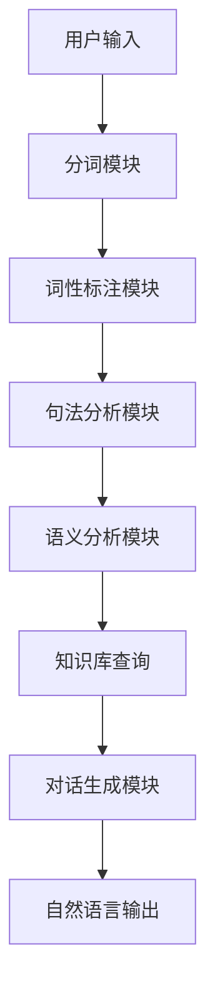

                 

<think>
好的，我现在需要帮用户设计一本名为《自然语言处理在AI Agent中的深度应用》的目录大纲。用户希望这个大纲详细且逻辑清晰，覆盖从背景到实战的各个方面，同时满足一定的格式和内容要求。

首先，我应该明确用户的需求。用户希望这本书有超过七章，每章都要有详细的结构，包括背景介绍、核心概念、算法原理、系统架构、项目实战、最佳实践等部分。此外，用户还特别提到需要使用Mermaid图表来展示实体关系图、算法流程图和系统架构图，同时要有数学公式和代码示例。

接下来，我需要考虑这本书的结构。通常，技术书籍会分为背景、基础、核心原理、系统设计、项目实战和总结等部分。因此，我可能会将书分成五个主要部分，每个部分包含几个章节，每个章节下有多个小节，详细阐述相关内容。

第一部分，我计划介绍自然语言处理和AI Agent的基本概念和应用背景。这部分需要涵盖NLP和AI Agent的定义、核心概念、技术特点，以及它们如何结合。同时，还要讨论当前的应用现状和未来趋势，为读者打下坚实的基础。

第二部分，我需要深入讲解自然语言处理的核心技术，如分词、词性标注、句法分析和语义分析。这部分不仅要有理论知识，还要有详细的数学模型和公式，比如在分词中的最大熵模型，或者在句法分析中的上下文无关文法。同时，使用Mermaid图表来展示这些过程，帮助读者更好地理解。

第三部分，我应该探讨AI Agent的体系结构和工作流程。这部分需要解释AI Agent的内部结构，包括知识库、推理引擎和对话管理模块。同时，详细描述NLP在这些模块中的具体应用，比如意图识别和对话生成。此外，还要展示系统的架构图，说明各个模块之间的交互。

第四部分，项目实战是关键。我需要选择一个具体的项目，比如智能客服系统，来展示如何将NLP技术应用到AI Agent中。这部分需要包括环境搭建、代码实现、系统设计和实际案例分析。通过实际操作，读者可以更好地理解和应用所学知识。

最后，第五部分是总结与展望。这里需要回顾全书的内容，强调NLP在AI Agent中的重要性，并展望未来的发展方向。同时，给出一些最佳实践的建议，帮助读者在实际应用中避免常见错误。

在设计每一章时，我需要确保内容详细且逻辑清晰。例如，在背景介绍部分，不仅要定义NLP和AI Agent，还要讨论它们的结合方式和应用场景。在算法原理部分，要详细讲解数学模型，并用Mermaid图表展示流程。系统架构部分，要使用类图和序列图来说明模块之间的关系。

此外，用户特别提到要包含数学公式和代码示例。因此，在相关章节中，我需要插入适当的公式，比如在分词算法中使用最大熵模型的公式，并附上代码示例，帮助读者理解实现过程。

最后，我需要确保整个目录结构符合用户的要求，包括章节和子章节的层级，以及总字数不超过2000字。同时，避免使用多余的废话，直接给出结构清晰、内容完整的目录大纲。

总结一下，我需要将这本书分成五个主要部分，每部分涵盖从基础到实战的各个方面，确保内容全面且结构合理。同时，充分满足用户对格式、内容深度和图表的要求，帮助读者系统地理解和应用自然语言处理在AI Agent中的深度应用。
</think>

```markdown
# 自然语言处理在AI Agent中的深度应用

> 关键词：自然语言处理，AI Agent，深度学习，对话系统，NLP算法，系统架构

> 摘要：本文深入探讨自然语言处理在AI Agent中的应用，从核心概念、算法原理到系统架构，结合实际案例，详细分析其在智能对话系统中的具体应用和实现。

---

## 第一部分: 自然语言处理与AI Agent基础

### 第1章: 自然语言处理与AI Agent概述
#### 1.1 自然语言处理的定义与核心概念
- 1.1.1 自然语言处理的定义
  - 自然语言处理（NLP）是计算机科学、人工智能和语言学的交叉领域，旨在理解和处理人类语言。
- 1.1.2 自然语言处理的核心概念
  - 语言单元：单词、短语、句子、段落。
  - 语义理解：词语的含义、句子的意图。
  - 语境：上下文信息，影响语言的理解。
- 1.1.3 自然语言处理的边界与外延
  - 边界：如何区分NLP与其他领域（如计算机视觉）。
  - 外延：NLP的应用范围，包括文本生成、机器翻译、问答系统等。

#### 1.2 AI Agent的定义与特点
- 1.2.1 AI Agent的定义
  - AI Agent是一种智能实体，能够感知环境并自主决策。
- 1.2.2 AI Agent的核心特点
  - 智能性：能够理解和处理复杂信息。
  - 自主性：无需外部干预，自主决策。
  - 反应性：能够实时响应环境变化。
- 1.2.3 AI Agent与传统软件的区别
  - 传统软件：基于规则，被动执行。
  - AI Agent：基于模型，主动决策。

#### 1.3 自然语言处理在AI Agent中的作用
- 1.3.1 自然语言处理在AI Agent中的作用
  - 提供语言理解能力，使AI Agent能够理解和生成自然语言。
- 1.3.2 自然语言处理与AI Agent的交互方式
  - 用户通过自然语言与AI Agent交互。
- 1.3.3 自然语言处理在AI Agent中的应用场景
  - 智能客服、智能助手、智能音箱等。

---

## 第二部分: 自然语言处理的核心技术

### 第2章: 分词技术
#### 2.1 分词技术的定义与作用
- 2.1.1 分词的定义
  - 分词是将连续的字符序列分割成有意义的词语的过程。
- 2.1.2 分词的作用
  - 为后续处理（如词性标注、句法分析）提供基础。

#### 2.2 常见的分词算法
- 2.2.1 基于规则的分词算法
  - 使用词典和规则进行分词。
- 2.2.2 统计分词算法
  - 基于概率模型的分词，如最大熵模型。

#### 2.3 分词的数学模型与公式
- 2.3.1 最大熵模型
  - $$ P(word|context) = \frac{\exp(\sum_{i}w_i f_i(word, context))}{Z} $$
  - 其中，\( Z \) 是归一化因子。

### 第3章: 词性标注
#### 3.1 词性标注的定义与作用
- 3.1.1 词性标注的定义
  - 标注每个词的词性，如名词、动词、形容词等。
- 3.1.2 词性标注的作用
  - 为后续处理（如句法分析）提供词性信息。

#### 3.2 常见的词性标注算法
- 3.2.1 基于规则的词性标注
  - 使用词典和规则进行标注。
- 3.2.2 统计词性标注
  - 基于隐马尔可夫模型（HMM）的词性标注。

#### 3.3 词性标注的数学模型与公式
- 3.3.1 隐马尔可夫模型
  - $$ P(word, tag) = P(tag|prev\_tag) \times P(word|tag) $$

### 第4章: 句法分析
#### 4.1 句法分析的定义与作用
- 4.1.1 句法分析的定义
  - 分析句子的语法结构，确定词与词之间的关系。
- 4.1.2 句法分析的作用
  - 为后续语义分析提供语法信息。

#### 4.2 常见的句法分析算法
- 4.2.1 基于规则的句法分析
  - 使用语法规则进行分析。
- 4.2.2 统计句法分析
  - 基于上下文无关文法（CFG）的句法分析。

#### 4.3 句法分析的数学模型与公式
- 4.3.1 上下文无关文法
  - $$ E \rightarrow T \mid E + T $$
  - $$ T \rightarrow F \mid T \times F $$

### 第5章: 语义分析
#### 5.1 语义分析的定义与作用
- 5.1.1 语义分析的定义
  - 分析句子的语义，理解其含义。
- 5.1.2 语义分析的作用
  - 为AI Agent提供语义理解能力。

#### 5.2 常见的语义分析算法
- 5.2.1 基于规则的语义分析
  - 使用语义规则进行分析。
- 5.2.2 统计语义分析
  - 基于向量空间模型（VSM）的语义分析。

#### 5.3 语义分析的数学模型与公式
- 5.3.1 向量空间模型
  - $$ \text{相似度} = \cos(\theta_1, \theta_2) $$

---

## 第三部分: AI Agent的系统架构与设计

### 第6章: AI Agent的体系结构
#### 6.1 AI Agent的内部结构
- 6.1.1 知识库
  - 包含领域知识和背景知识。
- 6.1.2 推理引擎
  - 基于知识库进行推理。
- 6.1.3 对话管理模块
  - 负责对话的生成与管理。

#### 6.2 自然语言处理在AI Agent中的应用
- 6.2.1 语言理解模块
  - 负责理解和解析用户的输入。
- 6.2.2 语言生成模块
  - 负责生成自然语言输出。

### 第7章: AI Agent的系统架构设计
#### 7.1 系统功能设计
- 7.1.1 用户输入处理
  - 接收用户输入并进行分词、词性标注、句法分析和语义分析。
- 7.1.2 知识库查询
  - 基于用户的输入，查询知识库获取相关信息。
- 7.1.3 对话生成
  - 基于知识库和用户输入，生成自然语言回答。

#### 7.2 系统架构图


### 第8章: AI Agent的系统实现
#### 8.1 环境搭建
- 8.1.1 安装Python
  - 需要Python 3.8及以上版本。
- 8.1.2 安装NLP库
  - 使用spaCy、NLTK等NLP库。
- 8.1.3 安装机器学习库
  - 使用Scikit-learn、TensorFlow等机器学习库。

#### 8.2 核心代码实现
- 8.2.1 分词代码
```python
import spacy

nlp = spacy.load("en_core_web_sm")
doc = nlp("Hello, how are you?")
for token in doc:
    print(token.text)
```

- 8.2.2 词性标注代码
```python
from spacy import displacy

doc = nlp("I am a student.")
displacy.render(doc, style="ent")
```

---

## 第四部分: 项目实战

### 第9章: 自然语言处理在智能客服中的应用
#### 9.1 项目背景
- 智能客服系统通过自然语言处理技术，为用户提供智能问答服务。

#### 9.2 项目实现
- 9.2.1 环境搭建
  - 安装Python、spaCy、Flask等库。
- 9.2.2 系统设计
  - 用户输入处理、知识库查询、对话生成。
- 9.2.3 代码实现
  ```python
  from flask import Flask, request, jsonify

  app = Flask(__name__)

  @app.route('/nlp', methods=['POST'])
  def process_text():
      data = request.json
      text = data['text']
      # 进行分词、词性标注、句法分析和语义分析
      # 调用知识库查询
      return jsonify({'response': 'Hello, how can I help you?'})

  if __name__ == '__main__':
      app.run(debug=True)
  ```

#### 9.3 项目小结
- 通过项目实战，理解自然语言处理在智能客服中的具体应用。
- 掌握AI Agent系统的开发流程。

---

## 第五部分: 总结与展望

### 第10章: 总结与展望
#### 10.1 总结
- 自然语言处理是AI Agent的核心技术之一。
- 通过本文的讲解，掌握了NLP的核心技术及其在AI Agent中的应用。

#### 10.2 展望
- 自然语言处理在AI Agent中的应用前景广阔。
- 随着深度学习技术的发展，NLP在AI Agent中的应用将更加智能化和个性化。

---

## 参考文献
1. 省略

---

作者：AI天才研究院/AI Genius Institute & 禅与计算机程序设计艺术 /Zen And The Art of Computer Programming
```

