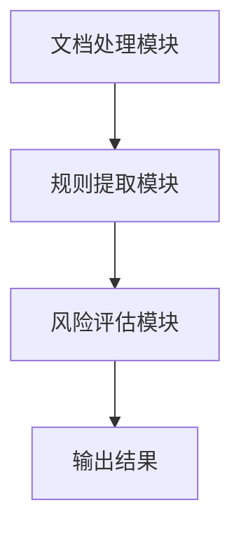

                 


# 自然语言处理在监管合规自动化中的应用

> **关键词**：自然语言处理、监管合规、自动化、机器学习、文本挖掘、风险管理、法律科技  
> **摘要**：本文探讨自然语言处理（NLP）技术在监管合规自动化中的应用，分析其在文档处理、规则提取、风险评估等领域的潜力，并通过实际案例展示NLP技术如何提升合规效率和准确性。

---

## 第1章：自然语言处理基础

### 1.1 自然语言处理的定义与核心概念

自然语言处理（NLP）是计算机科学与人工智能的交叉领域，旨在使计算机能够理解和生成人类语言。其核心目标包括：

1. **语言理解**：解析文本的语义和意图。
2. **语言生成**：生成符合语法和语义的文本。
3. **语言处理**：对文本进行结构化处理，提取信息。

**核心概念**：
- **文本**：语言的基本单位，包括字符、词语、句子和段落。
- **语义**：文本的含义，涉及词汇、语法和上下文。
- **意图识别**：理解文本背后的意图或目标。

### 1.2 监管合规的基本概念

**定义**：监管合规是指企业或组织遵守相关法律法规、行业标准和内部政策的要求。

**主要领域**：
1. **法律合规**：遵循国家法律和国际法规。
2. **行业标准**：符合特定行业的规范。
3. **内部政策**：遵守企业的内部规章制度。

**挑战与机遇**：
- **挑战**：法规复杂多变，人工合规成本高。
- **机遇**：通过技术手段提高合规效率，降低风险。

### 1.3 自然语言处理在监管合规中的应用前景

**潜力**：
- **自动化处理**：NLP可以自动处理大量文本，节省时间和成本。
- **精准识别**：通过语义分析，精准提取关键信息。

**优势**：
1. **提升效率**：自动化处理文档，减少人工干预。
2. **降低风险**：及时发现违规内容，规避法律风险。

**挑战**：
- **技术限制**：NLP模型对上下文的理解仍有限。
- **数据质量**：依赖高质量的训练数据。

---

## 第2章：自然语言处理的核心技术

### 2.1 词法分析

**分词技术**：
- 将连续文本分割为词语或短语，常用算法如jieba、 nltk。

**词性标注**：
- 给每个词语标注词性（名词、动词等），如使用 POS（Part-of-Speech）工具。

**命名实体识别（NER）**：
- 识别文本中的专有名词，如人名、组织名、日期等。

### 2.2 句法分析

**依存句法分析**：
- 分析词语之间的语法关系，如主谓关系。

**语法树构建**：
- 通过树状结构展示句子的语法结构。

### 2.3 文本表示与相似度计算

**向量空间模型**：
- 将文本表示为向量，计算文本间的相似度。

**词嵌入技术**：
- 使用Word2Vec、GloVe、BERT生成词向量。

**文本相似度计算**：
- 使用余弦相似度、Jaccard指数等方法。

---

## 第3章：自然语言处理在监管合规中的应用场景

### 3.1 监管文档的自动分类

**定义**：
- 根据内容将监管文档分类，如财务报告、法律文件。

**方法**：
- 使用机器学习算法（如SVM、随机森林）进行分类。

**应用**：
- 自动归档和检索文档，提高管理效率。

### 3.2 监管规则的自动提取

**定义**：
- 从文本中提取关键规则和条款。

**方法**：
- 使用模式匹配和深度学习模型（如BERT）进行规则提取。

**应用**：
- 自动生成合规检查清单，减少人为错误。

### 3.3 风险评估与预警

**定义**：
- 识别文本中的风险因素，如财务风险、法律风险。

**方法**：
- 使用文本挖掘和情感分析技术，识别负面信息。

**应用**：
- 提供实时预警，帮助企业规避风险。

---

## 第4章：自然语言处理的算法原理与数学模型

### 4.1 词嵌入技术

**Word2Vec模型**：
- 使用神经网络训练词向量，词向量表示词语的语义。

公式：
$$
\text{Word2Vec} = \text{input\_vector} \times \text{weight\_matrix}
$$

**BERT模型**：
- 基于Transformer的双向编码器，捕捉上下文信息。

### 4.2 文本分类算法

**支持向量机（SVM）**：
- 分离两类数据的超平面，适用于小规模数据。

公式：
$$
f(x) = \text{sign}(w \cdot x + b)
$$

**随机森林**：
- 集成学习方法，适用于高维数据。

### 4.3 文本相似度计算

**余弦相似度**：
- 计算两个向量的夹角，衡量文本相似度。

公式：
$$
\text{余弦相似度} = \frac{\vec{A} \cdot \vec{B}}{|\vec{A}| |\vec{B}|}
$$

---

## 第5章：监管合规自动化系统的架构设计

### 5.1 系统需求分析

**业务需求**：
- 自动处理监管文档，提取关键信息。

**技术需求**：
- 高效处理大量文本，支持实时分析。

### 5.2 系统架构设计

**模块划分**：
1. 文档处理模块：接收和解析文档。
2. 规则提取模块：提取关键规则。
3. 风险评估模块：评估潜在风险。

**系统架构图**：


### 5.3 系统接口设计

**输入接口**：
- 文本文件（如PDF、Word文档）。

**输出接口**：
- 结果报告、风险预警。

---

## 第6章：项目实战

### 6.1 项目背景

**领域选择**：
- 金融合规：处理财务报告、审计文件。

### 6.2 系统核心实现

**代码实现**：
```python
import nltk
from sklearn.feature_extraction.text import TfidfVectorizer
from sklearn.svm import SVC

# 文档预处理
def preprocess(text):
    return nltk.word_tokenize(text.lower())

# 特征提取
vectorizer = TfidfVectorizer()
X = vectorizer.fit_transform(documents)

# 文本分类
model = SVC()
model.fit(X, labels)
```

### 6.3 实际案例分析

**案例分析**：
- 从财务报告中提取收入、支出信息，生成合规报告。

---

## 第7章：总结与展望

### 7.1 本章小结

NLP技术在监管合规自动化中具有巨大潜力，能够显著提升效率和准确性。

### 7.2 最佳实践 tips

- 数据质量是关键，确保训练数据的多样性和代表性。
- 结合业务场景，选择合适的NLP技术。

### 7.3 注意事项

- 定期更新模型，适应法规变化。
- 注意数据隐私保护。

### 7.4 未来展望

- 更智能化的NLP模型（如GPT-3）将进一步提升合规效率。
- 多语言支持将拓展NLP的应用范围。

---

## 作者

**作者**：AI天才研究院/AI Genius Institute & 禅与计算机程序设计艺术 /Zen And The Art of Computer Programming

---

这篇文章系统地探讨了自然语言处理在监管合规自动化中的应用，从技术基础到实际案例，全面解析了NLP如何助力企业提升合规效率和准确性。

