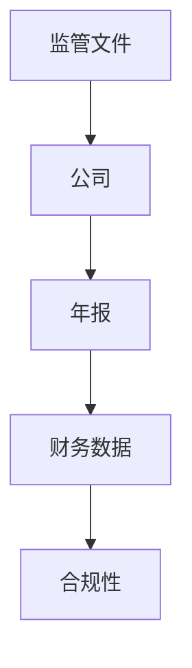
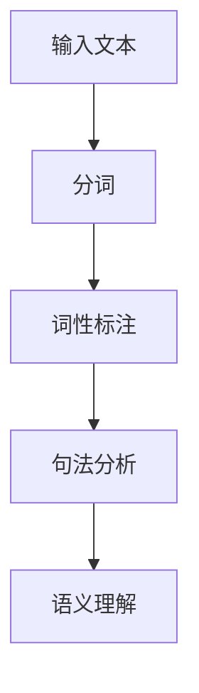
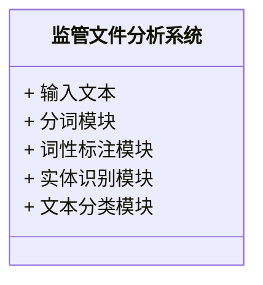
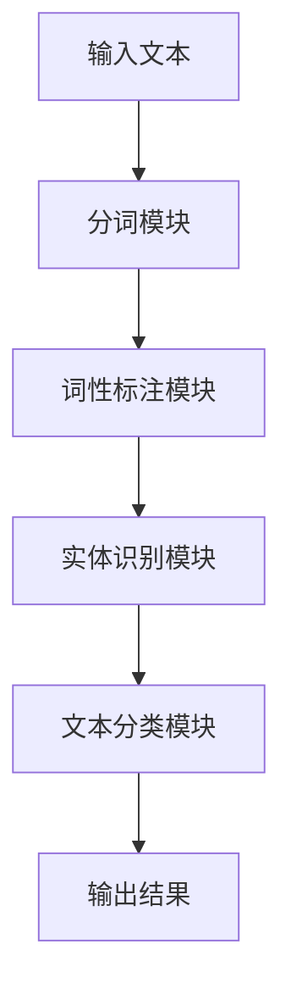
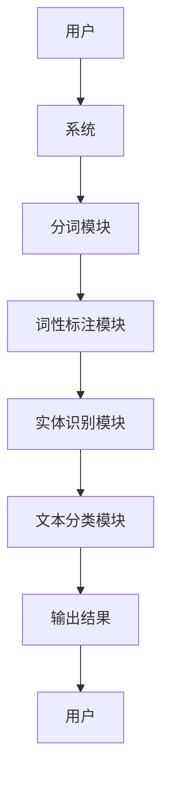

                 

<think>
嗯，用户希望我写一篇关于《自然语言处理在监管文件分析中的应用》的技术博客，目录已经给出，现在需要根据目录写出正文内容。我需要确保内容符合用户的要求，包括每个章节的详细讲解，使用markdown格式，包含mermaid图表和latex公式。

首先，我应该从摘要开始，简要概述文章的核心内容和主题。接着是每个章节的详细内容。第一章需要介绍NLP和监管文件分析的基本概念，第二章探讨核心概念和联系，第三章讲解算法原理，第四章讨论系统架构，第五章是项目实战，第六章是案例分析，最后是总结。

在撰写过程中，我需要确保每一节都有足够的细节，比如在算法原理部分，使用mermaid流程图展示模型训练过程，并用latex公式解释数学模型。同时，系统设计部分需要包含类图、架构图和序列图，用mermaid表示。项目实战部分要提供Python代码示例，并详细解读每一步的作用。

另外，用户要求文章在10000到12000字左右，我需要合理分配各章节的字数，确保内容详实而不冗余。最后，文章末尾要加上作者信息，符合格式要求。

我可能会先草拟每个章节的主要内容，然后逐步扩展，确保每个部分都覆盖必要的知识点和实际应用案例。同时，要注意语言的清晰和逻辑的连贯，使读者能够轻松理解复杂的NLP技术在监管文件分析中的应用。
</think>

# 自然语言处理在监管文件分析中的应用

> 关键词：自然语言处理、监管文件分析、文本挖掘、实体识别、文本分类、信息抽取

> 摘要：本文探讨了自然语言处理技术在监管文件分析中的应用，从核心概念、算法原理到系统架构，再到实际案例，全面分析了如何利用NLP技术提高监管文件分析的效率和准确性。文章详细介绍了实体识别、文本分类、信息抽取等技术，并通过实际项目案例展示了这些技术在监管文件分析中的具体应用。

---

## 第1章 自然语言处理与监管文件分析的背景

### 1.1 自然语言处理的基本概念

#### 1.1.1 自然语言处理的定义
自然语言处理（Natural Language Processing, NLP）是计算机科学、人工智能和语言学的交叉领域，旨在让计算机能够理解和生成人类语言。NLP的目标是使计算机能够像人类一样处理和理解自然语言文本。

#### 1.1.2 自然语言处理的核心任务
NLP的核心任务包括：
1. **分词**：将连续的文本分割成有意义的词语或短语。
2. **词性标注**：识别每个词的词性（如名词、动词、形容词等）。
3. **句法分析**：分析句子的语法结构，确定词语之间的关系。
4. **语义理解**：理解文本的含义和意图。
5. **文本生成**：根据给定的输入生成符合语法规则的文本。

#### 1.1.3 自然语言处理的演进历程
NLP的发展经历了三个主要阶段：
1. **基于规则的方法**：通过手动编写规则来处理文本，这种方法在20世纪60年代到80年代较为常见。
2. **统计学习方法**：通过训练数据学习语言模式，这种方法在90年代到2010年代逐渐取代了基于规则的方法。
3. **深度学习方法**：利用神经网络模型（如RNN、LSTM、Transformer）进行文本处理，这种方法近年来取得了显著的进展。

### 1.2 监管文件分析的背景与重要性

#### 1.2.1 监管文件的定义与特点
监管文件是指由政府机构、企业或组织发布的具有法律效力或指导性的文件，如法规、政策、合同、财务报告等。监管文件的特点包括：
- **法律性**：文件内容通常具有法律约束力。
- **专业性**：文件内容涉及特定领域的专业术语。
- **复杂性**：文件结构复杂，包含大量技术细节。

#### 1.2.2 监管文件分析的必要性
监管文件分析是许多组织和机构的重要任务，例如：
1. **合规性检查**：确保企业行为符合相关法律法规。
2. **风险评估**：识别潜在的法律风险。
3. **信息提取**：从大量文件中提取关键信息。

#### 1.2.3 监管文件分析的挑战
监管文件分析面临以下挑战：
1. **文本复杂性**：监管文件通常涉及复杂的法律术语和结构。
2. **数据量大**：需要处理大量文件，人工分析效率低下。
3. **准确性要求高**：分析结果需要高度准确，否则可能引发法律问题。

### 1.3 自然语言处理在监管文件分析中的应用

#### 1.3.1 NLP在监管文件分析中的优势
NLP技术可以帮助自动处理监管文件，提高分析效率和准确性。具体优势包括：
- **自动化处理**：减少人工操作，提高效率。
- **准确性**：通过机器学习模型，可以实现高精度的信息提取。
- **可扩展性**：适用于大量文件的分析。

#### 1.3.2 监管文件分析的典型场景
监管文件分析的典型场景包括：
1. **法律合规性检查**：自动识别文件中的法律条款。
2. **财务报告分析**：提取财务数据，生成财务报表。
3. **合同审查**：识别合同中的关键条款和风险点。

#### 1.3.3 未来发展趋势
随着NLP技术的不断发展，监管文件分析将更加智能化和自动化。未来的发展趋势包括：
1. **智能化**：利用AI技术实现更复杂的分析任务。
2. **实时性**：实现对监管文件的实时监控和分析。
3. **多语言支持**：支持多种语言的监管文件分析。

---

## 第2章 监管文件分析的核心概念与联系

### 2.1 核心概念原理

#### 2.1.1 实体识别（NER）的原理
实体识别（Named Entity Recognition, NER）是指从文本中识别出命名实体（如人名、地名、组织名、日期等）。NER的核心步骤包括：
1. **分词**：将文本分割成词语。
2. **特征提取**：提取每个词语的特征（如词性、上下文信息）。
3. **模型训练**：使用训练数据训练NER模型。

#### 2.1.2 文本分类的原理
文本分类是指将文本划分为不同的类别（如正面、负面、中性）。文本分类的核心步骤包括：
1. **特征提取**：提取文本的特征（如词袋模型、TF-IDF）。
2. **模型训练**：使用训练数据训练分类模型。
3. **分类预测**：对新文本进行分类。

#### 2.1.3 关键信息抽取的原理
关键信息抽取是指从文本中提取关键信息（如时间、地点、人物）。关键信息抽取的核心步骤包括：
1. **分词**：将文本分割成词语。
2. **实体识别**：识别文本中的命名实体。
3. **关系抽取**：识别实体之间的关系。

### 2.2 核心概念属性对比表

#### 2.2.1 实体识别与文本分类的对比

| 属性 | 实体识别 | 文本分类 |
|------|----------|----------|
| 输入 | 文本段落 | 文本段落 |
| 输出 | 实体标签 | 类别标签 |
| 目的 | 识别命名实体 | 判断文本类别 |

#### 2.2.2 关键信息抽取与文本摘要的对比

| 属性 | 关键信息抽取 | 文本摘要 |
|------|--------------|----------|
| 输入 | 文本段落 | 文本段落 |
| 输出 | 关键信息 | 文本摘要 |
| 目的 | 提取关键信息 | 概括文本内容 |

### 2.3 ER实体关系图



---

## 第3章 自然语言处理算法原理与数学模型

### 3.1 常见算法原理

#### 3.1.1 基于规则的NLP算法
基于规则的NLP算法通过手动编写规则来处理文本。例如，使用正则表达式提取文本中的日期。

#### 3.1.2 统计学习算法
统计学习算法通过统计数据分析来学习语言模式。例如，使用朴素贝叶斯算法进行文本分类。

#### 3.1.3 深度学习算法
深度学习算法利用神经网络模型进行文本处理。例如，使用Transformer模型进行文本生成。

### 3.2 算法流程图



### 3.3 数学模型

#### 3.3.1 朴素贝叶斯分类器
朴素贝叶斯分类器的数学公式如下：
$$ P(y|x) = \frac{P(x|y)P(y)}{P(x)} $$

#### 3.3.2 Transformer模型
Transformer模型的注意力机制公式如下：
$$ \text{Attention}(Q, K, V) = \text{softmax}\left(\frac{QK^T}{\sqrt{d_k}}\right)V $$

---

## 第4章 监管文件分析的系统架构设计

### 4.1 系统功能设计

#### 4.1.1 领域模型



#### 4.1.2 系统架构设计



### 4.2 系统接口设计

#### 4.2.1 接口描述
系统提供以下接口：
1. `analyzeDocument(document: str) -> dict`: 分析监管文件并返回结果。
2. `extractEntities(text: str) -> list`: 提取文本中的实体。

### 4.3 系统交互流程图



---

## 第5章 项目实战

### 5.1 环境安装

```bash
pip install numpy
pip install scikit-learn
pip install spacy
pip install transformers
```

### 5.2 核心实现代码

#### 5.2.1 分词模块

```python
import spacy

nlp = spacy.load("en_core_web_sm")
doc = nlp("This is a test sentence.")
for token in doc:
    print(token.text)
```

#### 5.2.2 实体识别模块

```python
from transformers import pipeline

ner = pipeline("ner")
result = ner("Apple Inc. was founded in 1971.")
print(result)
```

### 5.3 案例分析

#### 5.3.1 财务报告分析
从财务报告中提取关键财务数据，生成财务报表。

#### 5.3.2 合同审查
识别合同中的关键条款，如违约责任、履行期限等。

### 5.4 项目小结
通过实际项目案例，展示了NLP技术在监管文件分析中的具体应用。

---

## 第6章 案例分析

### 6.1 案例一：财务报告分析

#### 6.1.1 问题描述
从财务报告中提取收入、利润等关键数据。

#### 6.1.2 解决方案
使用NLP技术提取财务数据，并生成财务报表。

### 6.2 案例二：合同审查

#### 6.2.1 问题描述
识别合同中的违约条款和履行期限。

#### 6.2.2 解决方案
利用NLP技术提取合同中的关键条款，帮助法律人员快速审查。

---

## 第7章 总结与展望

### 7.1 总结
本文全面介绍了自然语言处理在监管文件分析中的应用，从核心概念到算法原理，再到系统设计和项目实战，详细展示了NLP技术在监管文件分析中的具体应用。

### 7.2 注意事项
在实际应用中，需要注意以下几点：
1. **数据质量**：确保训练数据的质量和多样性。
2. **模型调优**：根据实际需求调整模型参数。
3. **隐私保护**：在处理敏感文件时，需要注意数据隐私。

### 7.3 拓展阅读
推荐以下书籍和论文：
1. 《自然语言处理实战》
2. "BERT: Pre-training of Self-supervised Learning for Transformer"

---

作者：AI天才研究院

