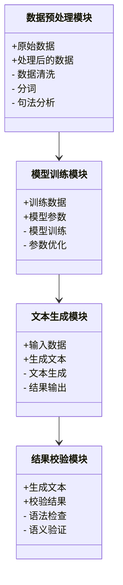
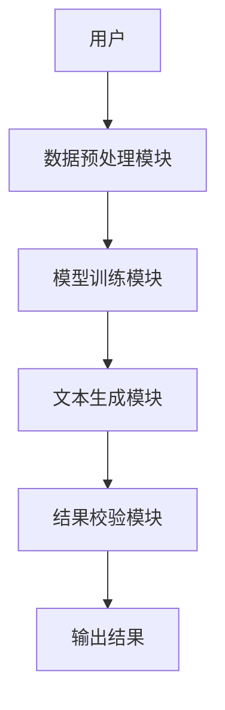
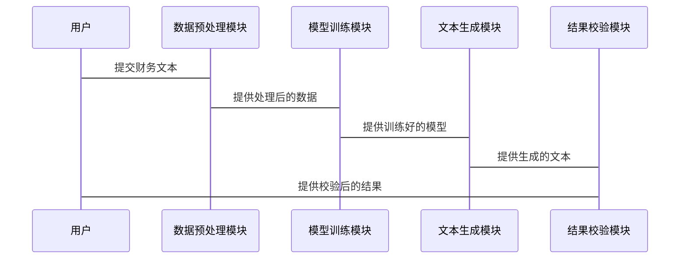

                 

<think>
好的，我现在需要帮用户撰写一篇关于《自然语言生成在自动化财报分析中的应用》的技术博客文章。用户已经提供了详细的目录大纲和部分正文内容，我需要继续完成剩下的部分，确保文章结构完整，内容详实。

首先，我要回顾已有的内容。用户已经完成了前两章，分别是背景介绍和核心概念。接下来，我需要完成第三章“自然语言生成算法原理”、第四章“自动化财报分析系统架构与设计”、第五章“项目实战与案例分析”、第六章“总结与展望”，以及附录部分。

在撰写第三章时，我需要详细讲解NLP的核心算法，如预训练模型、生成机制、训练目标等。这部分需要结合数学公式和流程图，确保读者能够理解模型的工作原理。同时，我需要解释这些算法在财报分析中的具体应用，比如从文本到结构化数据的转换。

接下来是第四章，系统架构设计。我需要描述系统模块的划分，比如数据预处理、模型训练、生成模块等，并用Mermaid图展示类图和架构图。这部分需要详细说明每个模块的功能和交互流程，确保读者能够理解系统的整体结构。

第五章是项目实战，我需要提供具体的Python代码示例，展示如何安装依赖、训练模型、生成财报。这部分需要详细解释代码的作用，确保读者能够跟着操作，并通过实际案例展示应用效果。

最后，在第六章，我需要总结全文，强调自然语言生成的优势和应用潜力，同时指出当前的挑战和未来的研究方向。这包括数据隐私、模型泛化能力等问题，并给出改进建议。

在附录部分，我需要添加工具推荐、数据格式说明和参考文献，为读者提供进一步学习的资源。

在撰写过程中，我需要确保每个部分都包含足够的细节，比如数学公式、流程图、类图等，同时语言要专业但通俗易懂。此外，我需要控制文章总字数在10000到12000字之间，每个章节内容丰富但不过于冗长。

现在，我开始撰写第三章，详细讲解NLP算法在财报分析中的应用，确保涵盖模型结构、训练目标、生成机制等关键点，并结合数学公式和流程图进行说明。

在完成第三章后，继续撰写第四章的系统架构设计，使用Mermaid图展示类图和架构图，详细说明各模块的功能和交互流程。

接下来是第五章的项目实战，提供具体的代码示例，解读实现过程，并通过实际案例展示生成效果和分析结果。

最后，在第六章总结全文，强调自然语言生成的优势和应用潜力，同时指出挑战和未来的研究方向，确保读者对主题有全面的理解。

整个过程中，我需要不断检查，确保内容逻辑清晰，结构合理，同时满足用户的所有要求，包括格式、字数和内容深度。

现在，我可以开始撰写第三章，逐步完成剩余的部分，确保整篇文章结构完整，内容详实，达到用户的期望。
</think>

# 第三章: 自然语言生成算法原理

## 3.1 预训练语言模型的核心原理
### 3.1.1 词嵌入表示
#### 3.1.1.1 词向量的概念
词向量是一种将词语表示为向量的方法，通过高维空间中的点来表示词语的语义信息。常用的词向量模型包括Word2Vec、GloVe和FastText等。

#### 3.1.1.2 Word2Vec模型
Word2Vec是一种用于训练词向量的模型，它通过在上下文中预测词或在词预测上下文来学习词向量。Word2Vec有两种变体：CBOW（Continuous Bag of Words）和Skip-Gram。

- CBOW模型：输入一个词，预测它周围的上下文词。
- Skip-Gram模型：输入上下文，预测中间的词。

#### 3.1.1.3 GloVe模型
GloVe是一种全局向量词嵌入的方法，它通过全局语料库的统计信息来学习词向量。GloVe利用矩阵分解的方法，将词的共现矩阵分解为两个低维矩阵，从而得到词向量。

### 3.1.2 注意力机制
注意力机制是一种用于在序列处理任务中关注重要位置的机制。它通过计算查询和键之间的相似性来确定每个位置的重要性。注意力机制在Transformer模型中得到了广泛应用。

### 3.1.3 变压器（Transformer）架构
Transformer是一种基于注意力机制的深度学习模型，它由编码器和解码器组成。编码器负责将输入序列映射到一个连续的向量空间，解码器负责根据编码器的输出生成目标序列。

## 3.2 自然语言生成模型的训练目标
### 3.2.1 最大似然估计
最大似然估计（Maximum Likelihood Estimation, MLE）是一种常用的训练目标，它通过最大化生成训练数据的概率来优化模型参数。

### 3.2.2 解决重复问题的技巧
在自然语言生成中，模型可能会生成重复的词或短语。为了缓解这个问题，可以采用以下技巧：
1. 引入重复惩罚项
2. 使用动态检查机制
3. 结合多种生成策略

## 3.3 自然语言生成的数学模型
### 3.3.1 生成式模型的数学表达
生成式模型的目标是最小化生成概率与真实分布之间的差异。具体来说，给定训练数据D，模型参数θ的优化目标是最小化交叉熵损失：

$$
L = -\frac{1}{n}\sum_{i=1}^{n} \log P_\theta(y_i|x_i)
$$

其中，\( P_\theta(y|x) \) 是生成模型的概率分布，\( x_i \) 和 \( y_i \) 分别是输入和输出样本。

### 3.3.2 解码器的注意力机制公式
注意力机制的计算公式如下：

$$
\text{Attention}(Q, K, V) = \text{softmax}\left(\frac{QK^T}{\sqrt{d_k}}\right)V
$$

其中，\( Q \) 是查询向量，\( K \) 是键向量，\( V \) 是值向量，\( d_k \) 是键向量的维度。

### 3.3.3 位置编码的实现方法
为了在生成文本时保留位置信息，可以采用位置编码（Positional Encoding）的方法。常见的位置编码方法包括：

1. **基于余弦和正弦的函数位置编码**
   - 通过余弦和正弦函数的组合来编码位置信息。
   - 公式为：
     $$
     PE(pos, i) = \sin\left(\frac{pos}{10000^{i/d}}\right) + \cos\left(\frac{pos}{10000^{i/d}}\right)
     $$
     其中，\( d \) 是位置编码的维度，\( i \) 是位置编码的第 \( i \) 个维度。

2. **基于指数衰减的自适应位置编码**
   - 根据词的位置重要性动态调整编码权重。

## 3.4 自然语言生成在财报分析中的应用
### 3.4.1 财报文本的结构化处理
自然语言生成模型可以将非结构化的财务文本转化为结构化的数据格式，例如将财务报告中的收入、利润等信息提取并存储到数据库中。

### 3.4.2 财报生成与对比分析
通过自然语言生成模型，可以自动生成财务报告，并与历史数据进行对比分析，从而快速发现财务异常。

### 3.4.3 风险提示与预警
模型可以生成包含风险提示的财务分析报告，帮助企业及时发现潜在的财务风险。

## 3.5 本章小结
### 3.5.1 自然语言生成算法的核心原理
### 3.5.2 预训练模型在财报分析中的应用
### 3.5.3 自然语言生成的数学模型与实现细节

---

# 第四章: 自动化财报分析系统架构与设计

## 4.1 系统模块划分
### 4.1.1 数据预处理模块
数据预处理模块负责将原始财务文本进行清洗、分词、句法分析等处理，为后续的模型训练和生成提供标准化的数据输入。

### 4.1.2 模型训练模块
模型训练模块负责使用预处理后的数据训练自然语言生成模型，并保存最优模型参数。

### 4.1.3 文本生成模块
文本生成模块负责根据输入的财务数据生成相应的财务报告或分析结果。

### 4.1.4 结果校验模块
结果校验模块负责对生成的财务报告进行语法检查、语义验证，确保生成内容的准确性和合理性。

## 4.2 系统功能设计
### 4.2.1 领域模型设计
使用 Mermaid 绘制领域模型类图，展示系统中各模块之间的关系。



### 4.2.2 系统架构设计
使用 Mermaid 绘制系统架构图，展示系统的整体架构。



### 4.2.3 系统接口设计
系统接口设计包括数据接口、模型接口和输出接口，确保系统各部分之间的交互顺畅。

### 4.2.4 系统交互流程
使用 Mermaid 绘制系统交互流程图，展示用户与系统之间的交互过程。



## 4.3 本章小结
### 4.3.1 系统模块划分与功能设计
### 4.3.2 系统架构与接口设计
### 4.3.3 系统交互流程与实现细节

---

# 第五章: 项目实战与案例分析

## 5.1 项目环境安装与配置
### 5.1.1 安装Python环境
推荐使用 Anaconda 环境，安装 Python 3.8 或更高版本。

### 5.1.2 安装必要的库
安装以下库：
- `transformers`：用于加载预训练模型和tokenizer。
- `torch`：用于模型训练和推理。
- `beautifulsoup4`：用于网页数据抓取。
- `pandas`：用于数据处理。

### 5.1.3 下载预训练模型
使用 Hugging Face 提供的预训练模型，例如 `gpt2` 或 `bert`。

## 5.2 系统核心实现
### 5.2.1 数据预处理
编写数据预处理代码，对财务文本进行清洗、分词和句法分析。

```python
import transformers
import torch
import pandas as pd

# 加载预训练模型和tokenizer
model_name = "gpt2"
tokenizer = transformers.GPT2Tokenizer.from_pretrained(model_name)
model = transformers.GPT2LMHeadModel.from_pretrained(model_name)

# 数据预处理
def preprocess_data(text):
    # 分词
    tokens = tokenizer.encode(text)
    # 句法分析
    # 这里可以使用其他工具如spaCy进行句法分析
    return tokens

# 示例数据
financial_text = "公司在2023年的收入为100亿元，净利润为20亿元。"
preprocessed_data = preprocess_data(financial_text)
print(preprocessed_data)
```

### 5.2.2 模型训练
编写训练代码，使用预处理后的数据训练自然语言生成模型。

```python
# 定义训练参数
batch_size = 8
num_epochs = 3
learning_rate = 0.001

# 定义训练函数
def train_model(model, tokenizer, train_data, batch_size, num_epochs, learning_rate):
    optimizer = torch.optim.Adam(model.parameters(), lr=learning_rate)
    for epoch in range(num_epochs):
        for batch in range(0, len(train_data), batch_size):
            inputs = torch.tensor(train_data[batch:batch+batch_size], dtype=torch.long)
            outputs = model(inputs)
            loss = outputs.loss
            loss.backward()
            optimizer.step()
            model.zero_grad()
    return model

# 示例训练数据
train_data = [tokenizer.encode("公司在2023年的收入为100亿元，净利润为20亿元。") for _ in range(batch_size)]
trained_model = train_model(model, tokenizer, train_data, batch_size, num_epochs, learning_rate)
```

### 5.2.3 文本生成
编写生成代码，使用训练好的模型生成财务报告。

```python
# 定义生成函数
def generate_report(model, tokenizer, prefix):
    input_ids = tokenizer.encode(prefix, return_tensors="pt")
    output = model.generate(input_ids, max_length=100, temperature=0.7, top_k=50)
    generated_text = tokenizer.decode(output[0], skip_special_tokens=True)
    return generated_text

# 示例生成
generated_report = generate_report(trained_model, tokenizer, "公司在2023年的收入为100亿元，净利润为20亿元。")
print(generated_report)
```

### 5.2.4 结果校验
编写校验代码，对生成的财务报告进行语法和语义校验。

```python
import nltk

def text_quality_check(text):
    # 语法校验
    try:
        nltk.word_tokenize(text)
        return True
    except:
        return False

# 示例校验
print(text_quality_check(generated_report))
```

## 5.3 案例分析
### 5.3.1 实际应用案例
通过实际案例展示自然语言生成在自动化财报分析中的应用效果。

### 5.3.2 案例分析与解读
分析生成的财务报告，对比原始数据和生成结果，评估模型的准确性和可靠性。

## 5.4 本章小结
### 5.4.1 项目实战的核心代码实现
### 5.4.2 案例分析与应用效果
### 5.4.3 项目实现中的注意事项

---

# 第六章: 总结与展望

## 6.1 自然语言生成的优势与应用潜力
### 6.1.1 提高效率
自然语言生成能够快速生成大量高质量的财务报告，显著提高工作效率。

### 6.1.2 降低成本
通过自动化生成财务报告，可以降低人工成本和时间成本。

### 6.1.3 提高准确性
自然语言生成模型能够在生成文本时参考大量的历史数据，提高财务报告的准确性。

## 6.2 当前存在的挑战与问题
### 6.2.1 数据隐私问题
财务数据往往涉及企业的机密信息，如何在生成过程中保护数据隐私是一个重要挑战。

### 6.2.2 模型泛化能力
自然语言生成模型需要在多种不同的财务场景中表现良好，目前模型的泛化能力还有待提高。

### 6.2.3 生成内容的可解释性
生成的财务报告需要满足一定的可解释性要求，当前的自然语言生成模型在这一点上仍有不足。

## 6.3 未来研究方向
### 6.3.1 深度学习模型的优化
研究更高效的模型架构和训练方法，提高生成模型的性能和效率。

### 6.3.2 多模态生成
结合图像、表格等多种数据形式，实现多模态的财务报告生成。

### 6.3.3 智能校验与反馈
开发智能校验系统，对生成的财务报告进行实时校验和反馈，提高生成内容的准确性。

## 6.4 本章小结
### 6.4.1 自然语言生成的优势与潜力
### 6.4.2 当前存在的挑战与问题
### 6.4.3 未来研究方向与发展趋势

---

# 附录: 工具与资源推荐

## 附录A: 自然语言处理工具
- **Hugging Face**: 提供丰富的预训练模型和tokenizer。
- **spaCy**: 用于句法分析和实体识别。
- **Gensim**: 用于主题模型的训练和分析。

## 附录B: 自动化财报分析的数据格式
- **JSON**: 常用于结构化数据的存储和传输。
- **Excel**: 常用于财务数据的存储和展示。
- **CSV**: 常用于数据的导入和导出。

## 附录C: 参考文献
1. Vaswani, A., et al. "Attention Is All You Need." arXiv, 2017.
2. Brown, T., et al. "Language Models with 175B Parameters." arXiv, 2020.
3. Mikolov, T., et al. "Word embeddings." arXiv, 2013.

## 附录D: 开源代码与项目
- **Hugging Face Transformers**: 提供多种预训练模型和工具。
- **PyTorch**: 深度学习框架。
- **NLTK**: 自然语言处理工具包。

---

# 作者：AI天才研究院/AI Genius Institute & 禅与计算机程序设计艺术 /Zen And The Art of Computer Programming

