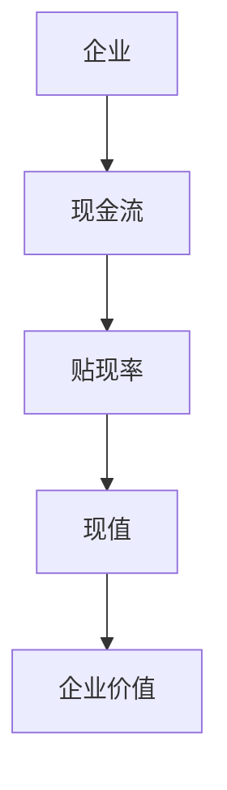
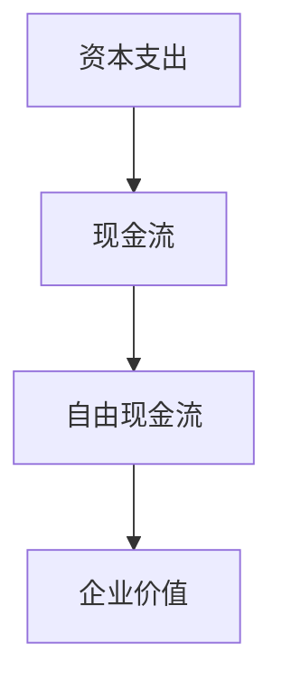
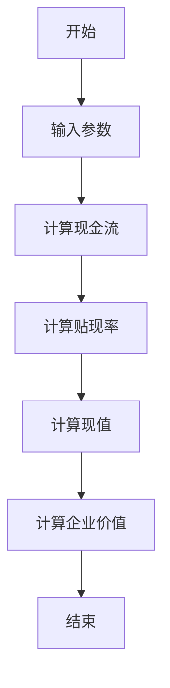

                 


# 自由现金流贴现：考虑资本支出的估值模型

## 关键词：自由现金流贴现模型，资本支出，企业估值，WACC，DCF模型

## 摘要

自由现金流贴现模型（Discounted Cash Flow，DCF）是企业估值领域的重要工具，尤其在考虑资本支出时更具实用价值。本文详细讲解了自由现金流贴现模型的理论基础、数学公式、算法原理，以及在实际企业估值中的应用。通过分析资本支出对现金流的影响，结合具体案例和代码实现，帮助读者掌握这一模型的核心思想和应用技巧。

---

# 第一部分: 自由现金流贴现模型基础

## 第1章: 自由现金流贴现模型概述

### 1.1 自由现金流贴现模型的背景与意义

#### 1.1.1 什么是自由现金流贴现模型

自由现金流贴现模型（DCF模型）是一种用于估计企业内在价值的方法。其核心思想是将企业未来现金流折现到现值，以确定企业的公允价值。DCF模型广泛应用于企业并购、上市定价、投资决策等领域。

#### 1.1.2 自由现金流贴现模型的应用场景

- 企业整体估值
- 并购评估
- 股权定价
- 投资决策分析

#### 1.1.3 自由现金流贴现模型的核心思想

DCF模型基于以下假设：
- 企业的价值来源于其未来产生的现金流。
- 这些现金流需要根据适当的贴现率（如WACC）折现到现值。

### 1.2 资本支出与自由现金流的关系

#### 1.2.1 资本支出的定义与分类

资本支出（Capital Expenditure，CapEx）是指企业在设备、设施、技术等长期资产上的投资。资本支出可以分为以下几类：
- 维持性资本支出：用于维持现有生产能力的支出。
- 扩张性资本支出：用于扩大生产能力的支出。

#### 1.2.2 自由现金流与资本支出的关系

自由现金流（Free Cash Flow，FCF）是指企业在扣除资本支出和其他必要支出后，可以自由分配的现金流。公式为：
$$ FCF = \text{EBITDA} - \text{折旧与摊销} - \text{资本支出} $$

#### 1.2.3 资本支出对估值的影响

资本支出的增加会减少当前的现金流，但可能提高未来的现金流。因此，在DCF模型中，资本支出需要在计算自由现金流时被扣除，并在后续现金流预测中被考虑进去。

---

## 第2章: 自由现金流贴现模型的数学基础

### 2.1 现值计算公式

#### 2.1.1 现值的基本概念

现值（Present Value，PV）是指未来现金流在当前时点的等值价值。现值的计算公式为：
$$ PV = \frac{CF}{(1 + r)^n} $$
其中：
- $CF$ 为第 $n$ 年的现金流
- $r$ 为贴现率
- $n$ 为时间周期

#### 2.1.2 永续期与稳定期的现金流假设

在DCF模型中，通常假设企业在稳定期后的现金流将以恒定增长率增长。永续期现金流的现值可以通过永续年金公式计算：
$$ PV_{\text{永续}} = \frac{CF_{\text{稳定}}}{r - g} $$
其中：
- $CF_{\text{稳定}}$ 为稳定期的现金流
- $g$ 为现金流增长率

### 2.2 贴现率的确定

#### 2.2.1 贴现率的定义与选择

贴现率通常选择加权平均资本成本（WACC）作为贴现率。WACC的计算公式为：
$$ WACC = w_d \cdot k_d + w_l \cdot k_l \cdot (1 - t) $$
其中：
- $w_d$ 为债务权重
- $k_d$ 为债务成本
- $w_l$ 为股权权重
- $k_l$ 为股权成本
- $t$ 为税率

### 2.3 自由现金流贴现模型的公式推导

自由现金流贴现模型的总价值可以表示为：
$$ \text{企业价值} = \sum_{t=1}^{n} \frac{CF_t}{(1 + r)^t} + \frac{TV}{(1 + r)^n} $$
其中：
- $CF_t$ 为第 $t$ 年的自由现金流
- $TV$ 为永续期的终值
- $r$ 为贴现率

---

## 第3章: 自由现金流贴现模型的核心概念与联系

### 3.1 自由现金流贴现模型的实体关系图

以下是一个简单的实体关系图，展示了自由现金流贴现模型的核心要素：


### 3.2 资本支出与现金流的关系

资本支出对现金流的影响可以通过以下关系图表示：


---

## 第4章: 自由现金流贴现模型的算法原理

### 4.1 算法流程图

以下是一个自由现金流贴现模型的算法流程图：


### 4.2 代码实现

以下是一个简单的自由现金流贴现模型的Python代码实现：
```python
def discounted_cash_flow_model(free_cash_flow, discount_rate, growth_rate, terminal_value):
    present_value = 0
    for year in range(1, 10):
        cash_flow = free_cash_flow * (1 + growth_rate) ** (year - 1)
        present_value += cash_flow / (1 + discount_rate) ** year
    present_value += terminal_value / (1 + discount_rate) ** 10
    return present_value

# 示例数据
free_cash_flow = 100
discount_rate = 0.08
growth_rate = 0.02
terminal_value = 2000

enterprise_value = discounted_cash_flow_model(free_cash_flow, discount_rate, growth_rate, terminal_value)
print(f"企业价值为：{enterprise_value:.2f}")
```

---

## 第5章: 系统分析与架构设计方案

### 5.1 问题场景介绍

假设我们希望对一家制造企业进行估值，需要考虑其资本支出和未来现金流。

### 5.2 系统功能设计

- 输入参数：自由现金流、贴现率、增长

