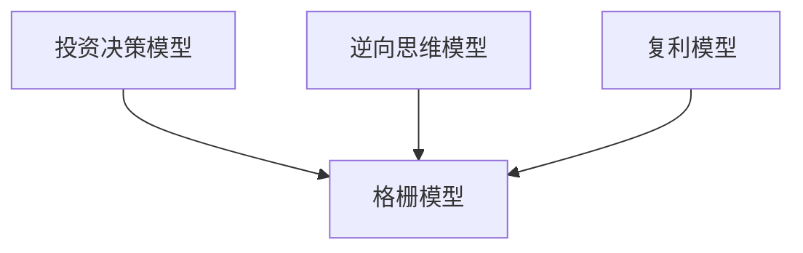
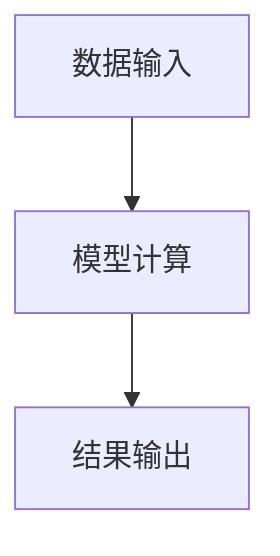

                 


# 芒格的"mental models"在人工智能辅助决策系统中的应用

> 关键词：芒格的"mental models"，人工智能，辅助决策系统，决策模型，系统架构

> 摘要：本文探讨了芒格的“mental models”如何在人工智能辅助决策系统中应用，通过详细分析各个模型的特点和相互关系，结合实际案例，展示了如何将这些模型融入AI系统，提升决策效率和准确性。文章还讨论了系统的算法原理、架构设计和实现方法，为读者提供全面的技术指导。

---

## 第1章 芒格的"mental models"概述

### 1.1 芒格"mental models"的核心概念

#### 1.1.1 "mental models"的定义与背景
芒格的“mental models”是一种跨学科的思维模型，帮助决策者在复杂问题中做出更明智的选择。这些模型包括投资决策模型、逆向思维模型、复利模型和格栅模型等，每个模型都有其独特的属性和应用场景。

#### 1.1.2 芒格"mental models"的特点
- **多学科性**：结合心理学、经济学、统计学等多个学科的知识。
- **实用性**：提供可操作的决策框架。
- **系统性**：各模型之间相互关联，形成完整的决策体系。

#### 1.1.3 芒格"mental models"与决策的关系
通过这些模型，决策者能够更好地识别问题、分析风险，并制定有效的解决方案。

### 1.2 AI辅助决策系统的定义与特点

#### 1.2.1 AI辅助决策系统的定义
AI辅助决策系统是利用人工智能技术，通过数据分析和模型推理，帮助用户做出决策的系统。

#### 1.2.2 AI辅助决策系统的分类
- **基于规则的系统**：通过预定义的规则进行决策。
- **基于机器学习的系统**：利用数据训练模型，预测结果。
- **基于自然语言处理的系统**：通过理解文本提供决策建议。

#### 1.2.3 AI辅助决策系统的应用领域
包括金融投资、医疗诊断、商业策略制定等领域。

### 1.3 芒格"mental models"与AI辅助决策系统的结合

#### 1.3.1 结合的背景与意义
随着AI技术的发展，将芒格的思维模型融入AI系统，可以提升决策的逻辑性和全面性。

#### 1.3.2 结合的必要性与可行性
- **必要性**：传统AI系统可能缺乏对复杂情境的深度理解，而芒格模型提供了多维度的视角。
- **可行性**：通过算法和数据建模，可以将这些模型转化为可计算的决策规则。

#### 1.3.3 结合的应用前景
在金融投资、风险管理等领域具有广泛的应用潜力。

### 1.4 本章小结
本章介绍了芒格的“mental models”及其在AI辅助决策系统中的应用背景和意义，为后续章节的深入分析奠定了基础。

---

## 第2章 芒格"mental models"的核心模型分析

### 2.1 芒格"mental models"的主要模型

#### 2.1.1 投资决策模型
通过分析财务数据和市场趋势，评估投资风险和收益。

#### 2.1.2 逆向思维模型
从反方向思考问题，寻找潜在的风险和机会。

#### 2.1.3 复利模型
通过复利效应，评估长期投资的收益。

#### 2.1.4 格栅模型
将多个模型结合起来，形成一个综合的决策框架。

### 2.2 各模型的特点与应用场景

#### 2.2.1 投资决策模型的特点
- **数据驱动**：依赖大量历史数据进行分析。
- **风险评估**：能够识别潜在风险点。

#### 2.2.2 逆向思维模型的特点
- **创新性**：能够发现传统方法难以察觉的机会。
- **防御性**：帮助识别潜在威胁。

#### 2.2.3 复利模型的特点
- **长期视角**：适合评估长期投资回报。
- **稳定性**：能够预测不同市场条件下的收益表现。

#### 2.2.4 格栅模型的特点
- **综合性**：整合多个模型的优势。
- **灵活性**：适用于不同类型的决策问题。

### 2.3 模型之间的关系与整体架构

#### 2.3.1 模型之间的关系
图1展示了各个模型之间的关系，其中格栅模型作为整体架构的核心，整合了其他模型的优势。



#### 2.3.2 模型的整体架构
通过将多个模型结合，形成一个综合的决策支持系统，能够提供更全面的分析和建议。

### 2.4 本章小结
本章详细分析了芒格“mental models”的核心模型及其特点，为后续章节的系统设计奠定了基础。

---

## 第3章 AI辅助决策系统的算法原理与数学模型

### 3.1 常见的AI辅助决策算法

#### 3.1.1 逻辑回归算法
用于分类问题，例如预测客户是否购买产品。

#### 3.1.2 支持向量机算法
适用于小样本数据的分类和回归问题。

#### 3.1.3 随机森林算法
通过集成学习提高模型的准确性和鲁棒性。

#### 3.1.4 神经网络算法
适用于复杂模式识别和非线性关系建模。

### 3.2 各算法的优缺点分析

#### 3.2.1 逻辑回归算法的优缺点
- **优点**：简单易实现，适合线性分类。
- **缺点**：对非线性关系处理能力有限。

#### 3.2.2 支持向量机算法的优缺点
- **优点**：适合小样本数据，泛化能力强。
- **缺点**：计算复杂度较高。

#### 3.2.3 随机森林算法的优缺点
- **优点**：高准确性和鲁棒性，适合复杂数据。
- **缺点**：计算资源消耗较大。

#### 3.2.4 神经网络算法的优缺点
- **优点**：能力强，适用于复杂问题。
- **缺点**：需要大量数据，计算资源消耗大。

### 3.3 算法选择与优化策略

#### 3.3.1 算法选择的依据
根据数据特征和问题类型选择合适的算法。

#### 3.3.2 算法优化方法
- **参数调优**：通过网格搜索优化模型参数。
- **特征选择**：去除冗余特征，提高模型效率。

### 3.4 本章小结
本章分析了常见的AI辅助决策算法及其优缺点，强调了算法选择和优化的重要性。

---

## 第4章 系统设计与实现

### 4.1 系统功能设计

#### 4.1.1 功能模块划分
- **数据输入模块**：接收输入数据。
- **模型计算模块**：执行决策模型计算。
- **结果输出模块**：展示决策结果。

#### 4.1.2 功能流程设计
图2展示了系统的主要功能流程。



### 4.2 系统架构设计

#### 4.2.1 分层架构设计
系统分为数据层、算法层和应用层，每一层都有明确的功能划分。

#### 4.2.2 模块化设计
通过模块化设计，提高系统的可维护性和扩展性。

### 4.3 系统实现与优化

#### 4.3.1 环境配置
- **Python版本**：3.8及以上
- **依赖库安装**：安装numpy、pandas、scikit-learn等库。

#### 4.3.2 核心代码实现
以下是一个简单的决策模型实现示例：

```python
import numpy as np
from sklearn import svm

# 数据预处理
X = np.array([[...], [...]])  # 特征数据
y = np.array([...])            # 标签数据

# 模型训练
model = svm.SVC()
model.fit(X, y)

# 预测
new_data = np.array([[...]])  # 新的输入数据
prediction = model.predict(new_data)
```

### 4.4 本章小结
本章详细描述了系统的功能设计、架构设计和实现过程，为实际应用提供了参考。

---

## 第5章 项目实战与案例分析

### 5.1 项目背景与需求分析

#### 5.1.1 项目背景
以某金融公司为例，需要构建一个基于芒格模型的AI辅助投资决策系统。

#### 5.1.2 项目需求
- 实现投资决策模型和逆向思维模型的集成。
- 提供用户友好的交互界面。

### 5.2 项目实施步骤

#### 5.2.1 数据收集与清洗
收集历史投资数据，并进行数据清洗和预处理。

#### 5.2.2 模型训练与优化
训练投资决策模型，并通过网格搜索优化模型参数。

#### 5.2.3 系统集成与测试
将模型集成到系统中，并进行功能测试和性能优化。

### 5.3 实际案例分析

#### 5.3.1 案例背景
某投资者考虑投资科技公司，使用AI系统进行决策支持。

#### 5.3.2 系统输出结果
系统分析后，建议投资，并预测潜在风险。

### 5.4 本章小结
本章通过实际案例展示了如何将芒格模型应用到AI辅助决策系统中，验证了系统的有效性和实用性。

---

## 第6章 总结与展望

### 6.1 全文总结
本文详细探讨了芒格的“mental models”在AI辅助决策系统中的应用，分析了各模型的特点，并展示了系统的实现过程。

### 6.2 未来展望
随着AI技术的不断发展，芒格模型在决策系统中的应用将更加广泛，未来可以进一步研究模型的优化和创新。

### 6.3 注意事项与最佳实践
- **数据质量**：确保数据的准确性和完整性。
- **模型维护**：定期更新模型，适应市场变化。
- **用户教育**：提升用户对系统使用的认知和技能。

### 6.4 拓展阅读
推荐阅读芒格的《穷查理宝典》和相关的人工智能书籍，以深入理解“mental models”和AI技术的结合。

---

## 作者：AI天才研究院 & 禅与计算机程序设计艺术

---

通过以上结构，文章详细探讨了芒格的“mental models”在人工智能辅助决策系统中的应用，从理论到实践，为读者提供了全面的技术指导。

