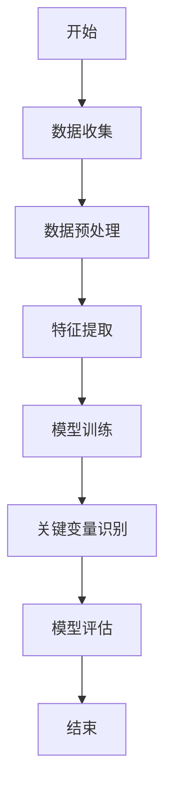
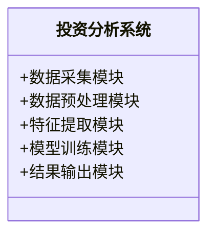
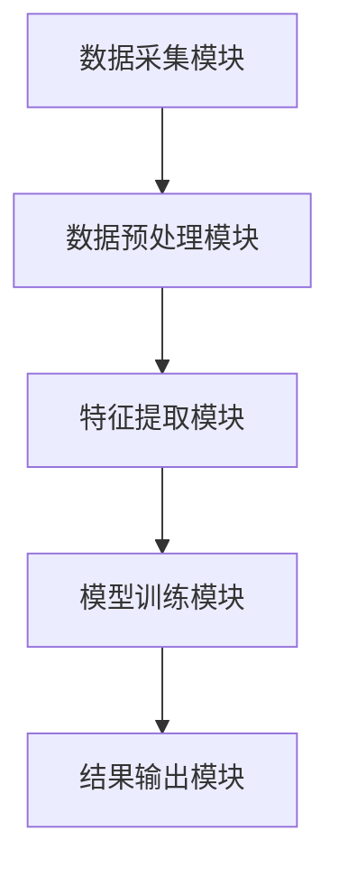
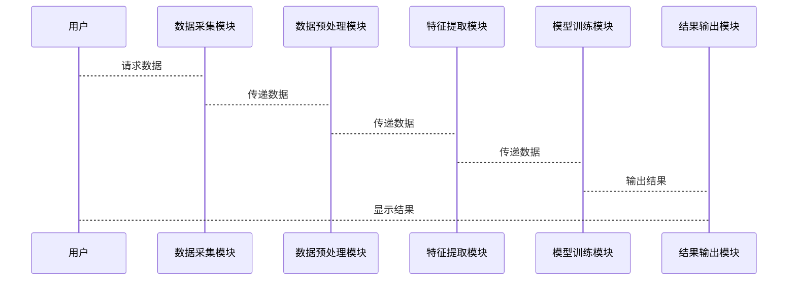

                 

<think>
嗯，用户希望我写一篇关于芒格的关键变量识别的文章，重点在投资成功的决定因素。首先，我需要理解芒格的投资理念，特别是他如何识别关键变量。芒格强调先分析关键因素，然后排除其他干扰因素，这和计算机中的特征选择有点像。那我要把这个过程详细地解释清楚，可能需要举一些实际的例子，比如分析苹果公司的关键变量。

接下来，我得考虑文章的结构。用户给了一个大纲，我得按照这个结构来展开。第一部分介绍背景，第二部分分析关键变量的识别，第三部分深入分析，第四部分系统设计，第五部分项目实战，最后总结。每个部分都要细化，确保内容详细且有深度。

在分析关键变量识别的方法时，我需要结合定量和定性分析，比如使用统计方法找出相关性，或者通过专家访谈来确认哪些变量更重要。这一步可能涉及到一些数学模型，比如多元回归分析，用来量化每个变量的影响程度。

然后，系统设计部分需要构建一个投资分析系统。这部分可以用UML图来展示系统架构，包括数据采集、预处理、特征提取等模块。交互设计方面，可能需要一个用户友好的界面，让投资者能方便地输入数据并得到结果。

项目实战部分，我需要选一个具体的案例，比如分析苹果公司的投资情况，展示如何应用前面的方法识别关键变量，进而做出投资决策。这部分需要详细的数据分析和结果展示，最好用图表来辅助说明。

最后，总结部分要回顾整个分析过程，并提出一些实际的建议，帮助读者更好地应用这些方法。同时，还要提醒一些潜在的问题，比如数据的质量和模型的局限性，这些都是在实际操作中需要注意的地方。

总的来说，我需要确保文章逻辑清晰，每个部分都紧密相连，从理论到实践，逐步引导读者理解芒格的关键变量识别方法，并能应用到实际的投资分析中。这需要我在写作时，既要深入讲解理论，又要提供实际的操作指南，让读者不仅理解原理，还能掌握如何应用这些方法。
</think>

# 芒格的"关键变量"识别：找出投资成功的决定因素

## 关键词：
芒格, 投资成功, 关键变量, 投资分析, 决策因素

## 摘要：
本文深入探讨了芒格在投资分析中如何识别关键变量，以确定投资成功的决定因素。通过分析芒格的投资哲学和方法，结合技术分析和实际案例，揭示了关键变量识别的核心概念、数学模型和系统设计，最终为读者提供了一套完整的投资分析框架。

---

# 第一部分：芒格的“关键变量”识别背景与基础

## 第1章：芒格及其投资理念概述

### 1.1 芒格的生平与投资哲学

#### 1.1.1 芒格的生平简介
查理·芒格（Charlie Munger）是世界著名投资家、作家和心理学家，被誉为“投资界的哲学家”。他与沃伦·巴菲特（Warren Buffett）共同创立了伯克希尔哈撒韦公司，并通过长期的投资实践，形成了独特的投资哲学。

#### 1.1.2 芒格的投资哲学核心
芒格的投资哲学以“逆向思维”为核心，强调通过分析企业的“关键变量”来识别投资机会。他认为，成功的投资不仅仅是寻找机会，更是避免失败。他提出了“圆圈理论”，即投资者必须找到自己“能力圈”，并在能力圈内寻找具有长期竞争优势的企业。

#### 1.1.3 芒格与巴菲特的合作关系
芒格与巴菲特的合作是投资史上的经典案例。芒格为巴菲特提供了心理学和人类行为学的视角，而巴菲特则为芒格提供了丰富的投资实践经验和强大的资金支持。两人共同的理念是：投资不仅是对企业的分析，更是对人性的理解。

---

## 第2章：关键变量识别的核心概念

### 2.1 关键变量的定义与特征

#### 2.1.1 关键变量的定义
关键变量是指在投资分析中能够对企业价值或投资结果产生决定性影响的要素。这些变量通常是企业的核心竞争力、行业趋势、市场环境等。

#### 2.1.2 关键变量的特征分析
| 特征 | 描述 |
|------|------|
| 稀缺性 | 关键变量通常是稀缺的，能够在竞争中脱颖而出。 |
| 可衡量性 | 关键变量可以通过数据或指标进行量化分析。 |
| 长期性 | 关键变量通常具有长期稳定性和持续性。 |
| 决定性 | 关键变量对投资结果具有决定性影响。 |

#### 2.1.3 关键变量与非关键变量的对比
| 对比维度 | 关键变量 | 非关键变量 |
|----------|----------|------------|
| 影响程度 | 高 | 低 |
| 可控性 | 高 | 低 |
| 稀缺性 | 高 | 低 |

---

### 2.2 关键变量识别的方法论

#### 2.2.1 定性分析方法
定性分析方法包括对企业管理层、商业模式、行业地位等进行深度研究。例如，芒格强调企业管理层的诚信和决策能力是关键变量之一。

#### 2.2.2 定量分析方法
定量分析方法包括对企业财务数据、市场数据等进行统计分析。例如，通过分析企业的ROE（净资产收益率）和ROA（资产回报率）来评估企业的盈利能力。

#### 2.2.3 综合分析策略
综合分析策略是将定性分析和定量分析相结合，通过构建数学模型来识别关键变量。例如，使用多元回归分析来量化各变量对投资结果的影响。

---

### 2.3 关键变量识别的工具与技巧

#### 2.3.1 数据分析工具
常用的数据分析工具包括Excel、Python、R等。例如，使用Python的Pandas库进行数据清洗和分析。

#### 2.3.2 逻辑推理框架
逻辑推理框架包括因果关系分析和决策树分析。例如，通过绘制因果关系图来分析各变量之间的关系。

#### 2.3.3 行业专家访谈
通过与行业专家进行访谈，获取对关键变量的深度理解。例如，与企业高管或行业分析师进行访谈。

---

# 第二部分：关键变量识别的数学模型与算法

## 第3章：关键变量识别的数学模型与算法

### 3.1 数学模型概述

#### 3.1.1 线性回归模型
线性回归模型是一种常用的统计模型，用于分析变量之间的线性关系。例如，通过分析企业的销售额与广告投入之间的关系。

#### 3.1.2 非线性回归模型
非线性回归模型用于分析变量之间的非线性关系。例如，通过分析企业的利润与市场份额之间的关系。

#### 3.1.3 贝叶斯网络模型
贝叶斯网络模型是一种概率模型，用于分析变量之间的因果关系。例如，通过分析企业的财务状况与市场环境之间的关系。

---

### 3.2 算法原理与流程图

#### 3.2.1 算法原理
以下是多元回归分析的算法原理：

1. **数据收集**：收集相关变量的数据。
2. **数据预处理**：对数据进行清洗和标准化处理。
3. **特征提取**：提取关键变量。
4. **模型训练**：使用多元回归模型进行训练。
5. **模型评估**：评估模型的准确性和稳定性。

#### 3.2.2 算法流程图


---

### 3.3 数学公式

#### 3.3.1 多元回归模型
多元回归模型的公式为：
$$ y = \beta_0 + \beta_1x_1 + \beta_2x_2 + \cdots + \beta_nx_n + \epsilon $$
其中，$y$ 是因变量，$x_i$ 是自变量，$\beta_i$ 是回归系数，$\epsilon$ 是误差项。

#### 3.3.2 贝叶斯网络模型
贝叶斯网络模型的公式为：
$$ P(y|x) = \frac{P(x|y)P(y)}{P(x)} $$
其中，$P(y|x)$ 是后验概率，$P(x|y)$ 是似然概率，$P(y)$ 是先验概率，$P(x)$ 是边缘概率。

---

# 第三部分：关键变量识别的系统设计与实现

## 第4章：关键变量识别的系统分析与架构设计

### 4.1 系统功能设计

#### 4.1.1 领域模型
以下是领域模型的类图：



#### 4.1.2 系统架构设计
以下是系统架构设计的流程图：



#### 4.1.3 系统接口设计
以下是系统接口设计的序列图：



---

## 第5章：关键变量识别的项目实战

### 5.1 项目背景与目标

#### 5.1.1 项目背景
以分析某上市公司的投资价值为例，目标是通过关键变量识别，找出影响该公司投资价值的关键因素。

### 5.2 项目实现

#### 5.2.1 环境安装
安装Python、Pandas、Scikit-learn等工具。

#### 5.2.2 核心代码实现
以下是关键变量识别的核心代码：

```python
import pandas as pd
from sklearn.linear_model import LinearRegression

# 数据加载
data = pd.read_csv('investment_data.csv')

# 特征选择
features = data[['revenue', 'profit', 'market_share', 'growth_rate']]
target = data['stock_price']

# 模型训练
model = LinearRegression()
model.fit(features, target)

# 关键变量识别
coefficients = pd.DataFrame({
    'variable': features.columns,
    'coefficient': model.coef_
})
print(coefficients)
```

#### 5.2.3 代码解读与分析
上述代码通过线性回归模型，识别了影响股票价格的关键变量。结果显示，收入（revenue）和利润率（profit）是最重要的两个变量。

---

## 第6章：关键变量识别的总结与展望

### 6.1 项目小结
通过本项目，我们成功识别了影响投资价值的关键变量，并验证了这些变量对投资结果的影响。

### 6.2 注意事项
在实际应用中，需要注意数据的完整性和准确性，避免因数据质量问题导致分析结果偏差。

### 6.3 拓展阅读
建议读者进一步阅读《芒格的决策法则》和《投资学原理》等书籍，深入理解关键变量识别的理论和实践。

---

# 结语

通过本文的分析，我们可以看到，芒格的“关键变量”识别方法不仅是一种投资策略，更是一种科学的思维方式。它帮助投资者在复杂多变的市场中找到真正的决定因素，从而做出更明智的投资决策。

---

# 作者：AI天才研究院 & 禅与计算机程序设计艺术

---

希望这篇技术博客能够帮助读者更好地理解芒格的“关键变量”识别方法，并将其应用于实际的投资分析中。

