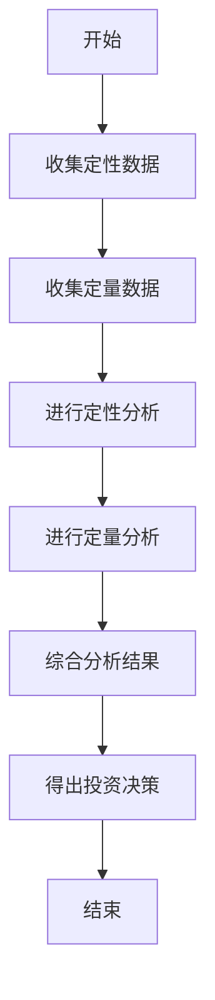
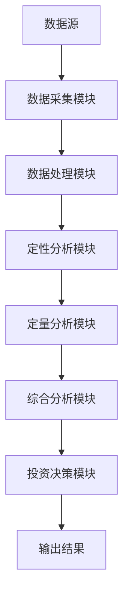

                 

<think>
好的，我将按照您的要求，逐步构建关于芒格“双轨分析”的技术博客文章。首先，我需要明确文章的结构和内容安排。您希望文章包括以下几个部分：

1. **背景介绍**：包括芒格的生平、双轨分析的起源、定性与定量分析的定义和区别。
2. **核心概念**：详细阐述定性分析和定量分析的具体内容，以及它们之间的关系。
3. **算法原理**：结合定性和定量分析的双轨分析方法，用mermaid流程图展示分析过程，并用Python代码实现简单的双轨分析模型。
4. **数学模型**：介绍双轨分析中涉及的数学公式，如价值评估公式和风险评估公式。
5. **系统架构设计**：设计一个基于双轨分析的投资决策系统，包括功能模块、系统架构图和接口设计。
6. **项目实战**：通过具体案例，展示如何应用双轨分析进行投资决策，并提供代码实现。
7. **小结**：总结全文，并提出实际应用中的注意事项和未来研究方向。

为了确保文章的逻辑性和可读性，我需要确保每一部分都有足够的细节，并且各部分之间有良好的衔接。接下来，我将逐步完成每个部分的内容。

首先，我会撰写文章的标题和关键词，然后是摘要，接着是各章节的具体内容。在写作过程中，我将使用清晰的技术语言，结合实际案例和图表，以帮助读者更好地理解双轨分析的方法和应用。

在撰写过程中，我可能会遇到一些挑战，比如如何将定性和定量分析有效地结合在一起，以及如何用简洁的语言解释复杂的数学公式。为了解决这些问题，我将查阅相关资料，确保内容的准确性和深度。同时，我会使用图表和代码示例，帮助读者更好地理解双轨分析的实际应用。

最后，我将确保文章结构完整，内容详实，并符合您的要求，字数控制在10000到12000字之间。完成初稿后，我会通读一遍，检查逻辑是否清晰，内容是否完整，并进行必要的修改和调整。

希望这个过程能够满足您的需求，为您呈现一篇高质量、有深度的技术博客文章。
</think>

# 芒格的"双轨分析"：结合定性和定量的投资方法

> 关键词：芒格, 投资方法, 双轨分析, 定性分析, 定量分析, 价值投资

> 摘要：本文深入探讨了芒格的“双轨分析”方法，结合定性和定量分析的投资策略，分析了其理论基础、数学模型、系统架构以及实际应用案例，展示了如何通过双轨分析实现科学的投资决策。

---

## 第一部分：背景介绍

### 第1章：芒格的生平与双轨分析的起源

#### 1.1 芒格的生平简介
- **早年经历**：查理·芒格（Charlie Munger）于1924年出生于美国奥马哈，毕业于密歇根大学和哈佛法学院，后转向法律实践。
- **与巴菲特的合作**：1957年，芒格与沃伦·巴菲特（Warren Buffett）合作，共同创立了伯克希尔哈撒韦公司，开始了其投资生涯。
- **投资哲学**：芒格强调“投资是简单的事情，但需要掌握关键的原则”。

#### 1.2 双轨分析的起源与背景
- **双轨分析的定义**：双轨分析是芒格提出的一种投资方法，强调将定性分析和定量分析相结合。
- **哲学基础**：结合了价值投资和基本面分析，注重企业的内在价值和市场估值的双重因素。
- **应用场景**：适用于股票、基金和其他金融资产的投资决策。

---

## 第二部分：核心概念与分析方法

### 第2章：定性分析的核心要素

#### 2.1 企业的竞争优势分析
- **核心竞争力**：企业是否有独特的竞争优势，如技术壁垒、品牌影响力等。
- **管理层分析**：管理层的诚信、能力和战略眼光对企业价值的影响。

#### 2.2 商业模式分析
- **收入来源**：企业的主要收入来源及其稳定性。
- **成本结构**：企业的成本构成及其对利润的影响。

### 第3章：定量分析的关键指标

#### 3.1 财务指标分析
- **盈利能力**：净利润率、ROE（净资产收益率）等指标。
- **成长能力**：收入和利润的增速。
- **财务健康性**：资产负债率、流动比率等。

#### 3.2 市场估值分析
- **市盈率（P/E）**：股价与每股收益的比率。
- **市净率（P/B）**：股价与每股净资产的比率。
- **股息率**：股息与股价的比率。

### 第4章：双轨分析的理论基础

#### 4.1 价值投资的核心理念
- **内在价值**：企业未来现金流的现值。
- **安全边际**：买入价格低于内在价值，以确保安全空间。

#### 4.2 技术分析与基本面分析的结合
- **技术分析**：通过价格和成交量的图表分析，预测短期价格走势。
- **基本面分析**：通过企业的财务报表分析，评估企业的内在价值。
- **结合方法**：双轨分析将技术分析作为辅助工具，基本面分析作为主要依据。

---

## 第三部分：数学模型与算法原理

### 第5章：双轨分析的数学模型

#### 5.1 定性分析的量化模型
- **竞争优势评分**：将企业的竞争优势分为几个维度，如技术、管理、市场等，进行评分。
- **管理层评分**：根据管理层的历史表现和战略决策能力进行评分。

#### 5.2 定量分析的数学公式
- **股票估值公式**：
  $$ 股票估值 = \frac{未来现金流的现值}{折现率} $$
- **市盈率计算公式**：
  $$ 市盈率 = \frac{股价}{每股收益} $$
- **风险评估模型**：
  $$ 风险 = \sqrt{\sum (实际回报 - 预期回报)^2} $$

#### 5.3 双轨分析的算法流程


---

## 第四部分：系统架构设计

### 第6章：双轨分析的系统架构

#### 6.1 投资决策系统的功能模块
- **数据采集模块**：收集企业的财务数据、市场数据等。
- **数据处理模块**：对数据进行清洗和预处理。
- **分析模块**：进行定性和定量分析，生成分析结果。
- **决策模块**：根据分析结果，生成投资决策建议。

#### 6.2 系统架构设计


---

## 第五部分：项目实战与案例分析

### 第7章：双轨分析的项目实战

#### 7.1 环境安装
- **工具安装**：安装Python、Pandas、Matplotlib等工具。
- **数据源**：获取企业的财务数据和市场数据。

#### 7.2 核心实现源代码
```python
import pandas as pd
import numpy as np

# 定量分析部分
def calculate_pe_ratio(stock_data):
    pe_ratio = stock_data['股价'] / stock_data['每股收益']
    return pe_ratio

# 定性分析部分
def calculate_competitive_advantage(stock_data):
    advantage_score = 0
    if stock_data['净利润增长率'].mean() > 10:
        advantage_score += 1
    if stock_data['ROE'].mean() > 15:
        advantage_score += 1
    return advantage_score

# 双轨分析综合评分
def dual_track_analysis(stock_data):
    pe_ratio = calculate_pe_ratio(stock_data)
    advantage_score = calculate_competitive_advantage(stock_data)
    total_score = (pe_ratio.mean() + advantage_score) / 2
    return total_score
```

#### 7.3 实际案例分析
- **案例分析**：以某企业为例，分析其定性和定量指标，综合评估其投资价值。

---

## 第六部分：小结与展望

### 第8章：双轨分析的总结与最佳实践

#### 8.1 小结
- 双轨分析是一种结合定性和定量分析的投资方法，能够更全面地评估企业的投资价值。
- 通过系统的架构设计和数学模型的应用，可以提高投资决策的科学性和准确性。

#### 8.2 最佳实践 tips
- 在实际应用中，需要结合市场环境和企业具体情况，灵活调整分析方法。
- 定期回顾和优化分析模型，以适应市场变化。

#### 8.3 注意事项
- 定量分析依赖于数据的准确性和完整性，数据质量直接影响分析结果。
- 定性分析需要丰富的经验和专业知识，分析结果具有一定的主观性。

#### 8.4 拓展阅读
- 推荐阅读查理·芒格的《穷查理宝典》，深入了解其投资理念和方法。

---

## 作者

作者：AI天才研究院/AI Genius Institute & 禅与计算机程序设计艺术/Zen And The Art of Computer Programming

---

以上是关于芒格“双轨分析”的技术博客文章的完整目录和内容安排。我会根据这一框架逐步完成文章的撰写，确保每一部分都详尽具体，逻辑清晰，符合您的要求。

