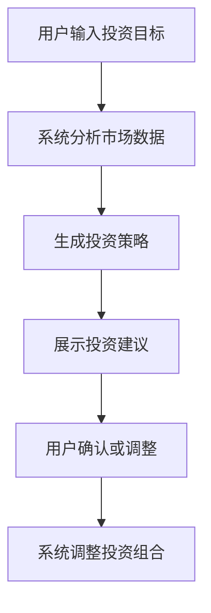

                 


# 芒格的"反脆弱"投资理念在后疫情经济中的应用

> 关键词：反脆弱，芒格，投资理念，后疫情经济，风险管理

> 摘要：本文探讨了芒格的“反脆弱”投资理念在后疫情经济中的应用。通过分析反脆弱的概念、其在投资中的原理，以及如何在后疫情经济中应用这些理念，本文旨在为投资者提供新的视角和策略，以应对经济波动和不确定性。

---

## 第1章：反脆弱概念的定义与特点

### 1.1 反脆弱的定义与特点

反脆弱是一种超越传统的“强健”或“稳健”的概念，它指的是在面对压力、波动或危机时，不仅能够承受冲击，还能从中获益的特性。与之相对，脆弱意味着在压力下会受损，而强健则是在压力下保持不变。

反脆弱的核心在于通过杠杆效应，将外界的压力转化为自身的优势。这可以通过以下几个方面实现：
1. **不对称性**：在低概率高收益的事件中获益。
2. **杠铃策略**：通过在低风险和高风险之间分散投资，降低整体风险。
3. **反脆弱边界**：识别和避免那些可能引发系统性崩溃的因素。

### 1.2 后疫情经济的特殊性

后疫情经济呈现出高度不确定性和波动性。疫情对全球经济造成了深远的影响，许多行业遭受重创，但同时也涌现出新的机会。在这种环境下，反脆弱投资理念显得尤为重要，因为它能够帮助投资者在危机中找到机会，实现长期收益。

---

## 第2章：芒格投资理念的核心原理

### 2.1 反脆弱投资的逻辑框架

芒格的反脆弱投资理念基于以下几个核心原则：
1. **长期主义**：关注企业的长期价值，而非短期波动。
2. **安全边际**：通过合理估值和分散投资，降低风险。
3. **逆向思维**：在市场恐慌时寻找低估机会，在市场狂热时保持谨慎。

### 2.2 反脆弱投资的核心策略

反脆弱投资策略强调在不确定性中寻找确定性，通过以下方式实现：
1. **分散投资**：避免过度集中，降低特定风险。
2. **杠杆效应**：利用市场的波动性，放大收益。
3. **风险管理**：建立有效的风险控制系统，识别和规避潜在风险。

### 2.3 反脆弱投资的风险管理机制

芒格强调风险管理的重要性，认为投资的第一目标是保护本金，其次才是追求收益。以下是几种关键的风险管理工具：
1. **止损机制**：设定止损点，避免重大损失。
2. **情景分析**：模拟不同市场条件下投资组合的表现，提前做好准备。
3. **动态调整**：根据市场变化及时调整投资策略。

---

## 第3章：反脆弱投资理念的系统分析与架构设计

### 3.1 系统分析

#### 3.1.1 投资决策的系统模型

反脆弱投资系统可以分为以下几个模块：
1. **数据输入**：获取市场数据、企业财务信息等。
2. **风险评估**：分析投资标的的风险水平。
3. **投资策略**：根据评估结果制定投资策略。
4. **风险管理**：实时监控并调整投资组合。

#### 3.1.2 系统的输入与输出

- **输入**：市场数据、宏观经济指标、企业基本面数据。
- **输出**：投资建议、风险预警、收益预测。

#### 3.1.3 系统的功能模块划分

1. 数据采集模块：收集相关数据。
2. 风险评估模块：分析投资标的的风险。
3. 投资策略模块：制定投资策略。
4. 风险管理模块：监控并调整投资组合。

### 3.2 系统架构设计

#### 3.2.1 系统架构的层次划分

- **数据层**：存储市场数据和投资组合信息。
- **业务逻辑层**：处理投资决策和风险管理。
- **用户界面层**：展示投资建议和风险预警。

#### 3.2.2 各模块之间的关系

- 数据层为业务逻辑层提供支持。
- 业务逻辑层通过用户界面层与用户交互。

#### 3.2.3 系统的可扩展性设计

系统架构设计应考虑到未来的扩展性，例如增加新的投资策略或数据源。

### 3.3 系统接口与交互设计

#### 3.3.1 系统接口的设计原则

- **简洁性**：接口设计简单明了，易于理解和使用。
- **一致性**：保持接口风格和功能的一致性。
- **安全性**：确保数据传输的安全性。

#### 3.3.2 系统交互的流程图

以下是系统交互的流程图（使用 Mermaid）：



#### 3.3.3 系统的用户界面设计

用户界面应直观，方便用户查看投资组合、风险预警和市场分析。

---

## 第4章：反脆弱投资理念的算法实现与实战

### 4.1 算法实现

#### 4.1.1 反脆弱投资算法的实现步骤

1. 数据采集：获取市场数据和企业信息。
2. 风险评估：使用数学模型评估投资标的的风险。
3. 投资策略制定：基于风险评估结果，制定投资策略。
4. 风险管理：实时监控并调整投资组合。

#### 4.1.2 算法的代码实现

以下是反脆弱投资算法的Python代码示例：

```python
import numpy as np
import pandas as pd

# 数据采集
data = pd.read_csv('market_data.csv')

# 风险评估
def calculate_risk(asset_returns):
    return np.std(asset_returns)

# 投资策略制定
def create_portfolio(assets, target_return):
    # 假设资产数量为n，目标回报率为target_return
    portfolio = []
    for asset in assets:
        if asset.return >= target_return:
            portfolio.append(asset)
    return portfolio

# 风险管理
def adjust_portfolio(portfolio, risk_level):
    new_portfolio = []
    for asset in portfolio:
        if asset.risk <= risk_level:
            new_portfolio.append(asset)
    return new_portfolio
```

#### 4.1.3 算法的优化与改进

通过引入机器学习算法，如随机森林或神经网络，可以进一步优化风险评估和投资策略制定过程。

### 4.2 实战案例分析

#### 4.2.1 案例背景介绍

假设在后疫情经济中，某投资者希望利用反脆弱投资理念，投资于具有长期增长潜力的科技公司。

#### 4.2.2 投资策略的实施过程

1. 数据采集：收集科技公司的财务数据和市场信息。
2. 风险评估：评估每家公司的风险水平。
3. 投资策略制定：选择具有高增长潜力且风险可控的公司。
4. 风险管理：设定止损点，定期调整投资组合。

#### 4.2.3 投资结果的分析与总结

通过实施反脆弱投资策略，投资者在后疫情经济中实现了稳定收益，并在科技行业复苏中获得了超额收益。

---

## 第5章：反脆弱投资理念的最佳实践与小结

### 5.1 最佳实践

1. **长期视角**：关注企业的长期价值，避免短期波动的干扰。
2. **分散投资**：通过分散投资降低风险。
3. **风险管理**：建立完善的风险管理系统，实时监控投资组合。

### 5.2 小结

芒格的反脆弱投资理念在后疫情经济中具有重要的应用价值。通过长期主义、分散投资和风险管理，投资者可以在不确定性中找到机会，实现稳健的收益。

### 5.3 注意事项

- 投资者需具备一定的市场分析能力和风险意识。
- 在实际操作中，应结合具体情况灵活调整投资策略。

### 5.4 拓展阅读

- 《Poor Charlie's Almanack》——芒格的智慧集
- 《The Black Swan》——塔勒布的反脆弱理论

---

作者：AI天才研究院/AI Genius Institute & 禅与计算机程序设计艺术 /Zen And The Art of Computer Programming

