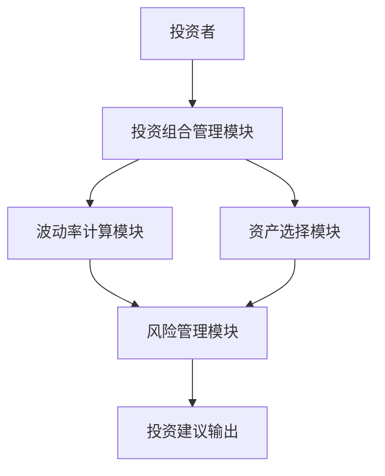
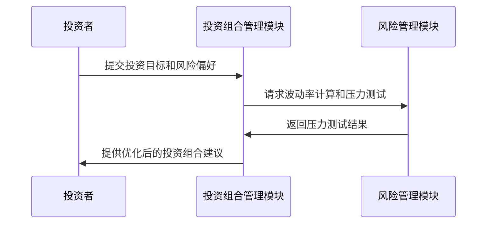

                 


# 《芒格的"反脆弱"投资理念在波动性市场中的应用》

> 关键词：反脆弱，投资理念，波动性市场，芒格，风险管理，数学模型，算法策略

> 摘要：本文深入探讨了芒格的“反脆弱”投资理念在波动性市场中的应用，结合数学模型和算法策略，分析了其在风险管理、投资组合构建以及实际案例中的应用。通过系统分析和项目实战，展示了如何利用反脆弱理念在不确定的市场环境中实现稳健投资。

---

## 第一部分：背景与核心概念

### 第1章：芒格“反脆弱”投资理念的背景与核心概念

#### 1.1 投资市场的波动性与不确定性

金融市场本质上是波动的，价格受多种因素影响，如经济指标、政策变化和市场情绪等。这种波动性使得投资者在决策时面临高度不确定性。传统的投资理念往往依赖于历史数据和统计分析，但在极端波动的情况下，这些方法可能失效。

#### 1.2 反脆弱理念的定义与特征

反脆弱性是指在面对波动和不确定性时，系统或投资组合不仅能够抵御冲击，还能从中获益的特性。与抗脆弱性不同，反脆弱性强调在压力下的积极适应和增长。其核心特征包括：

- **不对称性**：在小概率事件中获益，而非仅在正常情况下盈利。
- **杠杆效应**：通过特定策略放大收益，同时有效控制风险。
- **动态调整**：根据市场变化灵活调整投资策略。

#### 1.3 反脆弱理念与传统投资策略的对比

| 特性         | 传统投资策略                          | 反脆弱投资理念                          |
|--------------|---------------------------------------|-----------------------------------------|
| 风险管理     | 风险厌恶，追求稳定回报                | 风险中性，利用波动性获利                |
| 策略调整     | 定期调整，基于历史数据分析            | 动态调整，基于实时市场信号              |
| 收益来源     | 利息、股息、资本增值                  | 资本增值为主，同时利用波动性套利         |

### 1.4 反脆弱理念的适用场景

- **波动性市场**：在价格剧烈波动时，反脆弱策略能够捕捉机会。
- **危机事件**：在市场崩盘或突发事件中，反脆弱资产可能逆势增长。
- **周期性行业**：在经济周期波动中，某些行业表现出更强的反脆弱性。

---

## 第二部分：反脆弱投资理念的数学模型与算法策略

### 第2章：波动性市场的数学模型

#### 2.1 波动率的计算公式

波动率是衡量资产价格变动程度的重要指标，通常用标准差表示。对于一个资产的价格序列 \( P_t \)，其波动率 \( \sigma \) 的计算公式为：

$$
\sigma = \sqrt{\frac{1}{n-1} \sum_{i=1}^{n} (P_i - \bar{P})^2}
$$

其中，\( \bar{P} \) 是价格的平均值，\( n \) 是数据点的数量。

#### 2.2 风险-收益平衡模型

为了在波动性市场中实现风险与收益的平衡，可以采用以下优化模型：

$$
\max \quad \mu - \lambda \sigma
$$

其中，\( \mu \) 是资产的预期收益，\( \sigma \) 是其波动率，\( \lambda \) 是风险厌恶系数，表示投资者对风险的敏感程度。

#### 2.3 投资组合的波动性优化

通过优化投资组合的构成，可以降低整体波动率。假设 \( w_i \) 是资产 \( i \) 的权重，\( \mu_i \) 是其预期收益，\( \sigma_i \) 是其波动率，\( \rho_{ij} \) 是资产 \( i \) 和 \( j \) 之间的相关系数。则投资组合的波动率为：

$$
\sigma_p = \sqrt{\sum_{i=1}^{n} \sum_{j=1}^{n} w_i w_j \rho_{ij} \sigma_i \sigma_j}
$$

目标是最小化 \( \sigma_p \)：

$$
\min \quad \sigma_p
$$

---

### 第3章：反脆弱投资的算法策略

#### 3.1 基于波动率的资产选择算法

```python
def select_antifragile_assets(assets, threshold=0.8):
    # 计算每个资产的波动率
    asset_fluctuations = {asset: calculate_fluctuation(asset) for asset in assets}
    # 选择波动率高于阈值的资产
    selected_assets = [asset for asset in assets if asset_fluctuations[asset] > threshold]
    return selected_assets
```

#### 3.2 动态投资组合调整算法

```python
def dynamic_portfolio_adjustment(portfolio, market_data):
    # 计算当前市场波动率
    current_fluctuation = calculate_market_fluctuation(market_data)
    # 调整投资组合权重
    adjusted_weights = adjust_weights(portfolio, current_fluctuation)
    return adjusted_weights
```

#### 3.3 压力测试与风险管理

压力测试是评估投资组合在极端市场条件下的表现的关键方法。假设市场出现大幅下跌，反脆弱投资组合应表现出较强的抗跌性和恢复能力。通过蒙特卡洛模拟可以评估不同情景下的投资组合表现。

---

## 第三部分：系统分析与项目实战

### 第4章：系统分析与架构设计

#### 4.1 系统功能设计

- **数据采集**：收集历史价格、市场指标等数据。
- **波动率计算**：使用数学模型计算资产波动率。
- **投资组合优化**：基于反脆弱理念优化投资组合。
- **风险管理**：实施压力测试和风险预警机制。

#### 4.2 系统架构设计



#### 4.3 系统交互设计



### 第5章：项目实战与案例分析

#### 5.1 环境安装与数据准备

- **工具安装**：安装必要的数据分析库，如Pandas、NumPy等。
- **数据获取**：获取相关资产的历史价格数据，如股票、基金等。

#### 5.2 核心代码实现

```python
import pandas as pd
import numpy as np

def calculate_fluctuation(prices):
    returns = prices.pct_change().dropna()
    return returns.std() * 100

# 示例数据
prices = pd.DataFrame({
    'Asset1': [100, 105, 98, 110, 108],
    'Asset2': [80, 85, 82, 88, 90]
})

# 计算波动率
fluctuations = prices.apply(calculate_fluctuation)
print(fluctuations)
```

#### 5.3 案例分析与解读

假设在2020年疫情爆发期间，某投资组合采用反脆弱策略，选择了波动性较高的科技股和黄金。尽管市场大幅波动，科技股的反弹使得组合收益显著超过市场平均水平。这表明反脆弱策略在极端波动中具有显著优势。

---

## 第四部分：总结与建议

### 第6章：总结与最佳实践

#### 6.1 总结

芒格的反脆弱理念为投资者提供了一种在波动性市场中有效管理风险和捕捉机会的策略。通过动态调整投资组合、利用波动性套利机会以及选择具有反脆弱特性的资产，投资者可以在不确定性中实现稳健收益。

#### 6.2 最佳实践建议

- **定期评估**：持续监控市场波动和资产表现，及时调整投资组合。
- **保持灵活性**：根据市场变化灵活调整策略，避免僵化。
- **分散投资**：通过多样化降低单一资产的风险。

---

## 作者：AI天才研究院/AI Genius Institute & 禅与计算机程序设计艺术 /Zen And The Art of Computer Programming

---

通过系统性地分析和详细的技术实现，本文为投资者提供了在波动性市场中应用反脆弱理念的实用方法和策略。希望读者能够结合实际市场情况，灵活运用这些理念和方法，实现稳健的投资回报。

