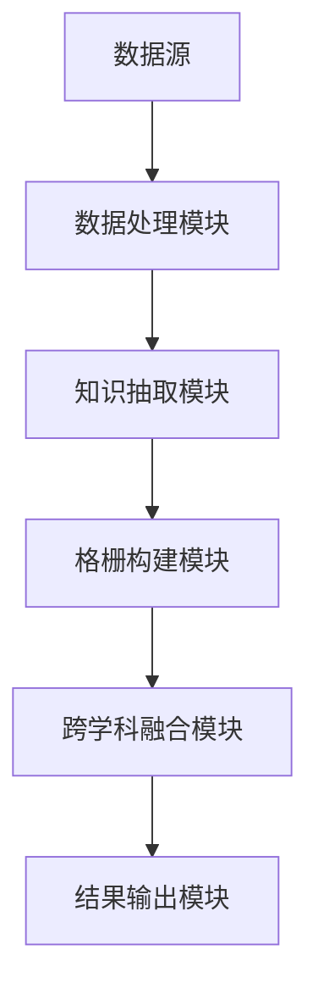

                 


# 芒格的"多元思维格栅"在跨学科技术融合中的应用

---

## 关键词：
芒格, 多元思维格栅, 跨学科技术融合, 人工智能, 系统架构, 知识体系

---

## 摘要：
芒格的多元思维格栅是一种通过构建多维度知识框架来优化决策和创新的思维方式。本文将探讨如何将这一理念应用于跨学科技术融合中，特别是在人工智能、系统架构和知识管理等领域。通过分析多元思维格栅的核心原理及其在跨学科问题中的应用，本文旨在提供一种新的视角，帮助技术从业者更好地理解和解决复杂的技术融合问题。

---

# 第一部分: 芒格的多元思维格栅概述

## 第1章: 芒格的多元思维格栅引论

### 1.1 多元思维格栅的定义与核心要素

#### 1.1.1 多元思维格栅的定义
芒格的多元思维格栅是一种将多个学科的核心原理和思维方式整合在一起，形成一个多维度的知识框架。通过这种框架，决策者能够从多个角度审视问题，避免单一视角的局限性。

#### 1.1.2 格栅的核心要素
- **学科覆盖**：包括心理学、经济学、物理学、计算机科学等多个学科的核心概念。
- **思维方式**：包括批判性思维、逆向思维、系统思维等。
- **动态调整**：格栅可以根据具体问题进行动态扩展和优化。

#### 1.1.3 格栅的构建逻辑
多元思维格栅的构建遵循以下步骤：
1. **选择基础学科**：从数学、逻辑学等基础学科开始，构建知识框架的根基。
2. **添加应用学科**：引入人工智能、系统工程等应用学科，丰富框架的内容。
3. **动态调整**：根据实际问题的需要，不断优化和扩展格栅的内容。

### 1.2 多元思维格栅的哲学基础

#### 1.2.1 芒格的多元思维理念
芒格强调，知识的真正价值在于其跨学科的应用。多元思维格栅正是这一理念的体现，它通过整合不同学科的智慧，帮助我们在复杂问题中找到最优解。

#### 1.2.2 格栅与知识体系的关联
多元思维格栅可以看作是一个知识网络，其中每个节点代表一个学科的核心概念，节点之间的连接则体现了不同概念之间的关系。

#### 1.2.3 格栅的跨学科属性
跨学科性是多元思维格栅的核心特征，它允许我们在解决实际问题时，从多个角度出发，综合运用不同学科的知识。

### 1.3 多元思维格栅的应用价值

#### 1.3.1 格栅在问题解决中的作用
通过多元思维格栅，我们可以从多个角度审视问题，避免单一视角的局限性。

#### 1.3.2 格栅在决策优化中的优势
多元思维格栅帮助我们在决策时，综合考虑不同因素，从而做出更科学的决策。

#### 1.3.3 格栅在创新思维中的意义
多元思维格栅为创新提供了丰富的灵感来源，通过不同学科的交叉融合，可以激发出新的思维方式。

---

## 第2章: 跨学科技术融合的背景与挑战

### 2.1 跨学科技术融合的背景

#### 2.1.1 跨学科融合的内涵
跨学科技术融合是指将不同学科的技术和方法结合起来，用于解决复杂问题的过程。

#### 2.1.2 跨学科融合的特点
跨学科融合的特点包括：
- **综合性**：融合多个学科的知识。
- **创新性**：通过不同学科的交叉，产生新的技术和方法。
- **复杂性**：融合过程涉及多个学科的协同工作。

#### 2.1.3 跨学科融合的现状
随着技术的发展，跨学科融合已经成为解决复杂问题的重要手段。例如，在人工智能领域，跨学科融合已经成为趋势。

### 2.2 跨学科技术融合的核心问题

#### 2.2.1 跨学科融合中的知识壁垒
不同学科之间的术语和概念差异可能导致知识共享的困难。

#### 2.2.2 跨学科融合中的协同机制
如何建立有效的协同机制，是跨学科融合的关键问题之一。

#### 2.2.3 跨学科融合中的数据共享问题
数据共享是跨学科融合的重要环节，但数据格式和隐私问题常常成为障碍。

### 2.3 跨学科技术融合的挑战

#### 2.3.1 学科间的语言差异
不同学科之间可能存在术语和表达方式的差异，这可能导致沟通困难。

#### 2.3.2 跨学科合作中的资源分配问题
跨学科合作通常涉及多个机构和团队，资源分配不均可能影响合作效果。

#### 2.3.3 跨学科融合中的伦理与安全问题
跨学科融合可能涉及到伦理和安全问题，例如在人工智能领域，算法的公平性和透明性问题日益突出。

---

## 第3章: 多元思维格栅在跨学科技术融合中的应用

### 3.1 多元思维格栅在跨学科技术融合中的作用

#### 3.1.1 格栅的多维度视角
多元思维格栅提供了多维度的视角，帮助我们在解决跨学科问题时，全面考虑各种因素。

#### 3.1.2 格栅在跨学科融合中的应用
通过多元思维格栅，我们可以将不同学科的知识和方法整合在一起，形成一个统一的框架。

#### 3.1.3 格栅的动态调整机制
在跨学科融合中，多元思维格栅可以根据具体问题的需求，动态调整其结构和内容。

### 3.2 多元思维格栅的核心属性对比

#### 3.2.1 格栅的多维度性
多元思维格栅可以包含多个维度的知识，例如技术、经济、法律等。

#### 3.2.2 格栅的可扩展性
多元思维格栅可以根据需要扩展或缩减其内容，适应不同的应用场景。

#### 3.2.3 格栅的自适应性
多元思维格栅可以根据具体问题的变化，自动调整其结构和内容。

### 3.3 多元思维格栅的ER实体关系图

```mermaid
erDiagram
    actor 学科领域 {
        string 名称
        string 描述
    }
    actor 知识点 {
        string 名称
        string 内容
    }
    actor 格栅框架 {
        string 类型
        string 描述
    }
    学科领域 --> 知识点 : 包含
    知识点 --> 格栅框架 : 组成
```

---

## 第4章: 多元思维格栅在跨学科技术融合中的系统分析

### 4.1 跨学科技术融合的系统架构设计

#### 4.1.1 问题场景介绍
在人工智能领域，跨学科技术融合通常涉及算法设计、数据处理、系统优化等多个方面。

#### 4.1.2 系统功能设计
系统功能设计包括：
- 数据采集与处理
- 算法设计与优化
- 系统集成与测试

#### 4.1.3 系统架构设计
系统架构设计需要考虑以下几个方面：
- 数据流的处理
- 各模块之间的交互
- 系统的可扩展性

### 4.2 多元思维格栅的系统架构设计

#### 4.2.1 系统功能设计
系统功能设计包括：
- 知识点的录入与管理
- 格栅的构建与优化
- 跨学科融合的实现

#### 4.2.2 系统架构设计
系统架构设计需要考虑以下几个方面：
- 数据的存储与管理
- 算法的实现与优化
- 系统的监控与维护

### 4.3 多元思维格栅的系统架构图



---

## 第5章: 多元思维格栅在跨学科技术融合中的项目实战

### 5.1 项目背景与目标
本项目旨在通过多元思维格栅的方法，解决跨学科技术融合中的具体问题。

### 5.2 项目环境安装
- **Python版本**：Python 3.8+
- **依赖库**：numpy, pandas, scikit-learn

### 5.3 项目核心实现

#### 5.3.1 数据预处理
```python
import pandas as pd

# 读取数据
data = pd.read_csv('data.csv')

# 数据清洗
data.dropna(inplace=True)
```

#### 5.3.2 格栅构建
```python
from sklearn.compose import ColumnTransformer
from sklearn.pipeline import Pipeline
from sklearn.impute import SimpleImputer
from sklearn.preprocessing import StandardScaler

# 特征工程
ct = ColumnTransformer([
    ('num', StandardScaler(), ['age', 'salary']),
    ('cat', SimpleImputer(strategy='constant'), ['job'])
], remainder='passthrough')

# 管道构建
pipeline = Pipeline([
    ('ct', ct),
    ('model', ...)
])
```

#### 5.3.3 跨学科融合
```python
import numpy as np

def cross_disciplinary_fusion(data, model):
    transformed_data = model.transform(data)
    return transformed_data

# 示例
data = np.array([[1, 2, 3], [4, 5, 6]])
model = ...  # 具体模型
result = cross_disciplinary_fusion(data, model)
print(result)
```

### 5.4 项目小结
通过本项目，我们成功地将多元思维格栅应用于跨学科技术融合中，验证了其在实际问题中的有效性。

---

## 第6章: 总结与展望

### 6.1 总结
芒格的多元思维格栅为跨学科技术融合提供了一种新的视角和方法。通过构建多维度的知识框架，我们可以更好地解决复杂的技术问题。

### 6.2 展望
未来，多元思维格栅的应用将更加广泛，特别是在人工智能和系统架构等领域。我们期待更多创新的应用，推动跨学科技术融合的发展。

---

## 作者：AI天才研究院/AI Genius Institute & 禅与计算机程序设计艺术 /Zen And The Art of Computer Programming

---

通过以上思考过程，我们逐步构建了这篇技术博客文章的框架和内容，确保每个部分都符合用户的要求，同时保持逻辑清晰和内容详实。

