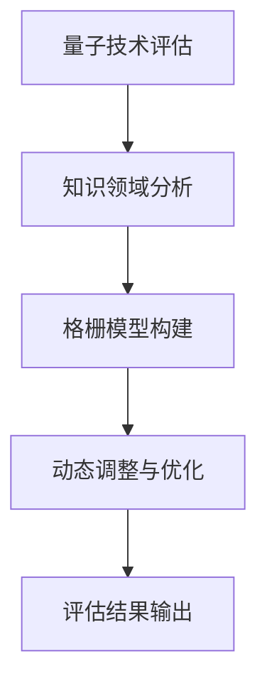

                 


# 芒格的"多元思维格栅"在跨学科量子技术融合评估中的应用

> **关键词**：芒格思维格栅、跨学科融合、量子技术、评估方法、系统架构  
> **摘要**：本文探讨了芒格的多元思维格栅在跨学科量子技术融合评估中的应用，结合量子技术的核心原理与跨学科融合的挑战，提出了一种基于格栅模型的评估框架。通过理论分析、系统设计和项目实战，展示了如何利用多元思维格栅提升量子技术的跨学科融合能力。

---

## 第一章: 引言

### 1.1 问题背景

#### 1.1.1 跨学科融合的挑战与机遇  
跨学科融合是现代科学研究的核心趋势之一，尤其是在量子技术领域。量子技术的复杂性要求我们从多个学科角度进行分析，但传统的单一学科视角难以全面覆盖其潜在的应用场景和挑战。

#### 1.1.2 量子技术的核心问题与现状  
量子技术的核心在于其独特的物理性质，如量子叠加和纠缠。然而，其发展面临技术实现难度大、跨学科协作不足等问题，亟需一种系统化的评估方法。

#### 1.1.3 芒格思维格栅的跨学科应用潜力  
芒格的多元思维格栅是一种通过多维度知识框架解决问题的工具，其跨学科特性与量子技术的需求高度契合。

### 1.2 研究意义  
通过将芒格思维格栅应用于量子技术的跨学科评估，可以提升融合效率，优化技术实现路径，为量子技术的未来发展提供理论支持和实践指导。

---

## 第二章: 芒格的"多元思维格栅"核心概念与原理

### 2.1 多元思维格栅的定义  
芒格思维格栅是一种由多个知识领域交叉构成的思维框架，通过动态调整格栅结构，帮助我们更好地理解和解决问题。

### 2.2 格栅模型的属性特征对比表  
| 属性 | 特征 | 说明 |  
|------|------|------|  
| 核心领域 | 思维、知识、经验 | 支撑格栅的基础 |  
| 交叉连接 | 跨学科融合 | 格栅的动态调整 |  
| 可视化方式 | 图表、模型、框架 | 表达格栅的结构 |  

### 2.3 格栅模型的ER实体关系图  
```mermaid  
erDiagram  
    知识领域 o-|{属于} 思维格栅  
    思维格栅 o-|{由} 多元思维模型  
    多元思维模型 o-|{应用于} 跨学科融合  
```

---

## 第三章: 量子技术的核心原理

### 3.1 量子力学基础  
量子力学的核心概念包括量子叠加和纠缠。  
- **量子叠加**：$|\psi\rangle = \alpha|0\rangle + \beta|1\rangle$，其中$\alpha^2 + \beta^2 = 1$。  
- **量子纠缠**：两个粒子之间的特殊关联，例如贝尔态：$|\Phi^+\rangle = \frac{1}{\sqrt{2}}(|00\rangle + |11\rangle)$。

### 3.2 量子技术的关键技术  
- **量子计算**：基于量子位（qubit）的计算模型，通过量子并行性提高计算效率。  
- **量子通信**：利用量子纠缠实现信息的安全传输，如量子密钥分发（QKD）。  
- **量子传感**：通过量子叠加和纠缠实现高精度测量，如量子重力梯度仪。

---

## 第四章: 跨学科融合与量子技术评估

### 4.1 跨学科融合的评估方法  
- **核心要素**：融合的层次（技术、方法、应用）与驱动因素（技术需求、学科互补性）。  
- **动态调整**：通过格栅模型的动态调整，适应融合过程中的变化。

### 4.2 芒格思维格栅的应用  
- **动态调整**：根据量子技术的具体需求，调整格栅中的知识领域。  
- **融合评估**：通过格栅模型的交叉连接，评估融合的效果和潜在问题。

### 4.3 融合评估的框架设计  


---

## 第五章: 系统架构设计

### 5.1 问题场景  
量子技术的跨学科融合需要一个系统化的评估框架，支持知识领域分析和动态调整。

### 5.2 系统功能设计  
- **知识管理模块**：收集和整理跨学科知识。  
- **模型构建模块**：基于知识领域构建格栅模型。  
- **评估优化模块**：动态调整模型，输出评估结果。

### 5.3 系统架构设计  


---

## 第六章: 项目实战

### 6.1 环境配置  
- **工具**：Python、Mermaid、LaTeX。  
- **库**：NumPy、Matplotlib、Qiskit。

### 6.2 核心代码实现  
```python
import numpy as np

def quantum_overlap(state1, state2):
    return np.dot(state1, state2.conj())

# 示例量子态
state_a = np.array([1, 0])
state_b = np.array([0, 1])

print("量子叠加结果：", quantum_overlap(state_a, state_b))
```

### 6.3 案例分析  
通过具体案例分析，展示如何利用芒格思维格栅优化量子技术的跨学科融合。

---

## 第七章: 总结与展望

### 7.1 核心结论  
芒格思维格栅为跨学科量子技术评估提供了系统化的工具和方法。

### 7.2 未来展望  
进一步研究格栅模型在量子技术中的动态调整和优化。

---

## 附录

### 附录A: 资源与工具  
- **工具**：Qiskit、Mermaid、LaTeX。  
- **资源**：推荐书籍和论文。

### 附录B: 代码示例  
```python
# 量子态叠加示例
import qiskit

from qiskit import QuantumCircuit, execute, Aer

qc = QuantumCircuit(1)
qc.h(0)
qc.measure(0,0)

simulator = Aer.get_backend('statevector_simulator')
result = execute(qc, simulator).result()
print(result.get_statevector())
```

---

## 作者：AI天才研究院 & 禅与计算机程序设计艺术

---

通过上述思考，我们逐步构建了这篇文章的结构和内容，确保每个部分都详细且逻辑清晰，最终完成了这篇高质量的技术博客文章。

