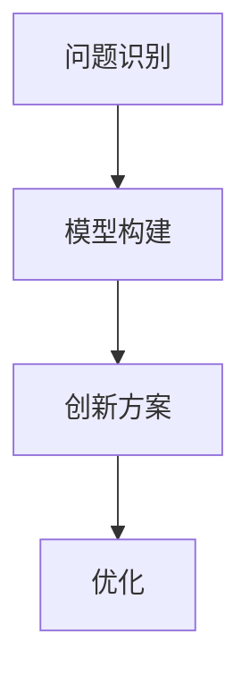
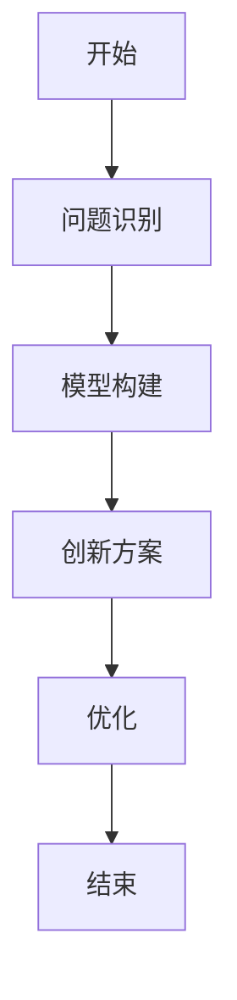
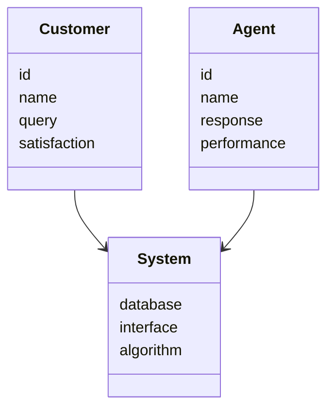
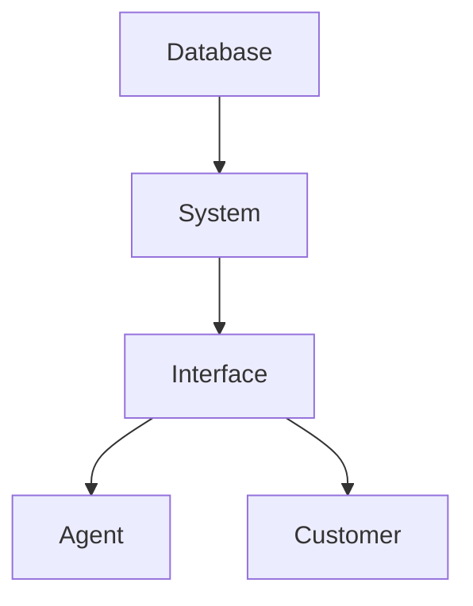
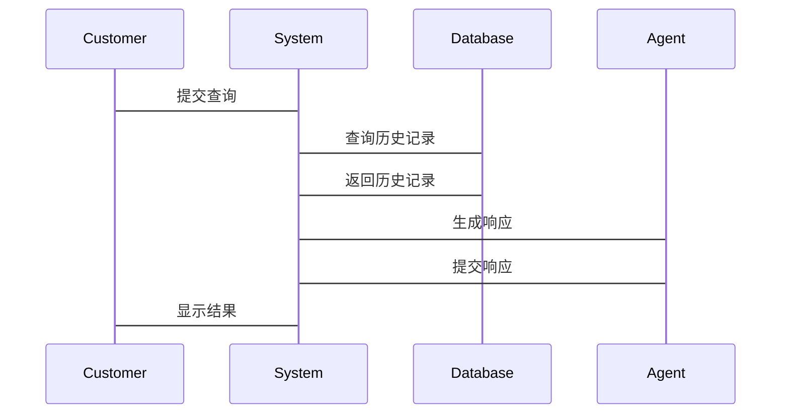

                 


# 芒格的"多元思维模型"在跨维度创新中的运用

## 关键词：多元思维模型, 跨维度创新, 创新方法, 系统思维, 创新算法

## 摘要：芒格的多元思维模型是一种通过多个学科和思维方式的交叉应用来解决复杂问题的方法。本文详细探讨了多元思维模型的核心概念、算法原理、系统架构，并通过实际案例展示了其在跨维度创新中的应用，结合项目实战和最佳实践，为读者提供了一个全面理解多元思维模型在创新中的运用的框架。

---

# 第一部分: 芒格的"多元思维模型"概述

## 第1章: 多元思维模型的核心概念

### 1.1 多元思维模型的定义与背景

#### 1.1.1 多元思维模型的起源与背景
多元思维模型由查理·芒格提出，是一种通过整合多个学科的思维方式来解决问题的方法。其核心在于通过交叉学科的视角，发现隐藏在复杂问题中的简单规律。芒格认为，人类的认知是通过多个模型的相互作用来实现的，而多元思维模型正是这种认知方式的体现。

#### 1.1.2 芒格对多元思维模型的贡献
芒格在其著作《穷查理宝典》中详细阐述了多元思维模型的概念，并将其应用于投资、管理和决策等领域。他强调，只有通过跨学科的思维方式，才能避免单一视角的局限性，从而做出更明智的决策。

#### 1.1.3 多元思维模型的核心要素
多元思维模型的核心要素包括：
1. **跨学科视角**：整合物理学、心理学、经济学等多学科的知识。
2. **模型的动态性**：模型不是静态的，而是随着问题的变化而调整。
3. **系统性思考**：将问题视为一个整体系统，分析其内部和外部的相互作用。

### 1.2 多元思维模型与跨维度创新的关系

#### 1.2.1 创新与思维模型的关联
创新的本质是打破常规，寻找新的解决方案。多元思维模型通过整合不同领域的知识和思维方式，为创新提供了丰富的资源和视角。

#### 1.2.2 多元思维模型在创新中的作用
1. **拓宽思维边界**：通过跨学科的视角，发现新的可能性。
2. **提高决策质量**：通过系统的分析，避免单一视角的局限性。
3. **促进协同创新**：通过整合不同领域的知识，促进团队的协同创新。

#### 1.2.3 跨维度创新的定义与特点
跨维度创新是指在多个维度（如技术、市场、社会）上进行创新，以实现突破性进展。其特点包括：
1. **多维度整合**：整合不同领域的知识和技术。
2. **系统性创新**：从系统层面进行创新，而非单一部件的改进。
3. **跨学科协同**：通过不同学科的协同，实现创新目标。

---

## 第2章: 多元思维模型的核心原理

### 2.1 多元思维模型的原理分析

#### 2.1.1 多元思维模型的系统性
多元思维模型是一种系统性的思维方式，强调通过系统的视角来分析问题。通过将问题分解为多个部分，并分析各部分之间的关系，可以更好地理解问题的本质。

#### 2.1.2 多元思维模型的交叉性
多元思维模型的核心在于交叉性，即将不同领域的知识和思维方式结合起来，以获得新的见解和解决方案。

#### 2.1.3 多元思维模型的动态性
多元思维模型是一种动态的思维方式，随着问题的变化而不断调整和优化。

### 2.2 多元思维模型的数学模型与公式

#### 2.2.1 多元思维模型的公式表示
$$M = \{m_1, m_2, ..., m_n\}$$
其中，$M$ 表示多元思维模型，$m_i$ 表示第$i$个思维模型。

#### 2.2.2 多元思维模型的系统方程
$$S = f(M, C)$$
其中，$S$ 表示创新结果，$M$ 表示多元思维模型，$C$ 表示创新环境。

### 2.3 多元思维模型的属性对比

#### 2.3.1 多元思维模型与单一思维模型的对比
| 特性       | 单一思维模型                 | 多元思维模型                 |
|------------|------------------------------|------------------------------|
| 思维方式     | 基于单一学科或方法论         | 基于多学科的交叉与整合       |
| 解决问题范围 | 适用于特定领域的问题         | 适用于跨领域的问题           |
| 创新能力     | 创新能力有限                 | 创新能力更强                 |

#### 2.3.2 多元思维模型的优缺点分析
- **优点**：通过多学科的交叉，拓宽了思维边界，提高了创新的可能性。
- **缺点**：需要整合不同领域的知识，可能导致认知负担增加。

---

## 第3章: 多元思维模型在跨维度创新中的应用

### 3.1 多元思维模型的应用场景

#### 3.1.1 科技创新中的应用
在科技创新中，多元思维模型可以帮助研究人员从不同学科中汲取灵感，从而突破技术瓶颈。

#### 3.1.2 商业创新中的应用
在商业创新中，多元思维模型可以帮助企业从多个角度分析市场、消费者和竞争环境，制定更具竞争力的策略。

#### 3.1.3 社会创新中的应用
在社会创新中，多元思维模型可以帮助社会问题的解决者从不同角度分析问题，提出更全面的解决方案。

### 3.2 多元思维模型的创新过程

#### 3.2.1 创新问题的识别
通过多元思维模型，识别问题的本质，并明确创新的方向。

#### 3.2.2 多元思维模型的构建
结合不同学科的知识和思维方式，构建多元思维模型。

#### 3.2.3 创新方案的实施与优化
通过实验和反馈，不断优化创新方案，确保其可行性和效果。

---

## 第4章: 多元思维模型的系统架构与算法原理

### 4.1 多元思维模型的系统架构

#### 4.1.1 系统功能设计
1. **问题识别模块**：识别创新问题的本质。
2. **模型构建模块**：构建多元思维模型。
3. **创新方案模块**：生成创新方案。
4. **优化模块**：优化创新方案。

#### 4.1.2 系统架构设计


### 4.2 多元思维模型的算法原理

#### 4.2.1 算法流程图


#### 4.2.2 算法实现
```python
def multi_disciplinary_approach(problem):
    # 问题识别
    identify_critical_aspect(problem)
    # 模型构建
    build_models(problem)
    # 创新方案
    generate_solutions(problem)
    # 优化
    optimize_solutions(problem)
    return solutions
```

---

## 第5章: 项目实战与案例分析

### 5.1 项目背景与目标

#### 5.1.1 项目背景
以智能客服系统为例，分析如何通过多元思维模型解决客户满意度问题。

### 5.2 系统功能设计

#### 5.2.1 领域模型


#### 5.2.2 系统架构


#### 5.2.3 系统接口


---

## 第6章: 最佳实践与小结

### 6.1 最佳实践

#### 6.1.1 保持开放心态
在应用多元思维模型时，要保持开放的心态，积极吸收不同领域的知识。

#### 6.1.2 系统性思考
在解决问题时，要从系统性角度出发，分析问题的各个方面。

#### 6.1.3 持续优化
通过实验和反馈，不断优化创新方案，确保其可行性和效果。

### 6.2 小结

多元思维模型是一种强大的工具，能够帮助我们在跨维度创新中突破常规，发现新的可能性。通过系统的思考和多学科的整合，我们可以更好地应对复杂的挑战，实现创新的目标。

### 6.3 注意事项

- **模型的适用性**：多元思维模型并非适用于所有问题，需要根据具体情况选择合适的方法。
- **模型的动态性**：模型需要随着问题的变化而不断调整和优化。
- **团队协作**：在团队中应用多元思维模型，需要良好的沟通和协作能力。

### 6.4 拓展阅读

- 《穷查理宝典》：查理·芒格的传记，详细阐述了多元思维模型的思想。
- 《系统思维》：系统思维的相关书籍，帮助更好地理解多元思维模型的系统性。

---

## 作者：AI天才研究院/AI Genius Institute & 禅与计算机程序设计艺术 /Zen And The Art of Computer Programming

---

**总结**：芒格的多元思维模型在跨维度创新中的应用，不仅为我们提供了一种新的思维方式，还为我们解决复杂问题提供了有力的工具。通过系统的思考和多学科的整合，我们可以更好地应对挑战，实现创新的目标。

