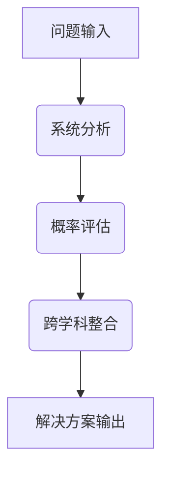
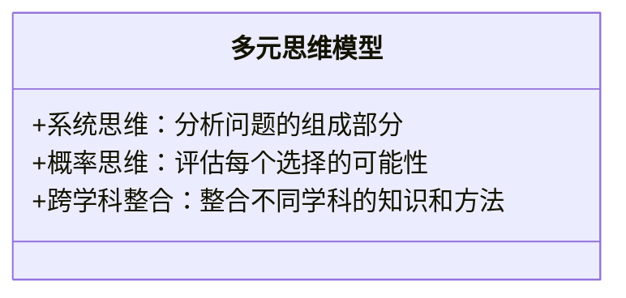
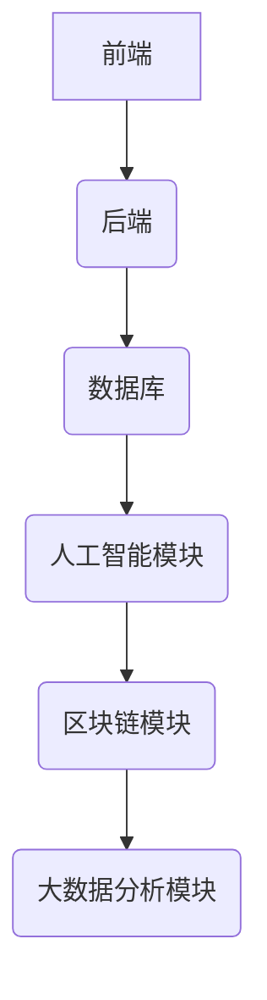

                 


# 芒格的"多元思维模型"在跨维度科技融合中的运用

> 关键词：多元思维模型, 芒格, 跨维度科技融合, 系统思维, 概率思维, 跨学科整合, 人工智能, 大数据, 区块链

> 摘要：本文将深入探讨芒格的多元思维模型在跨维度科技融合中的应用，通过系统思维、概率思维、跨学科整合等核心概念，分析其在复杂科技项目中的价值和优势。结合实际案例，详细讲解多元思维模型的算法原理、系统架构设计和项目实现过程，帮助读者掌握这一强大的思维工具。

---

# 第一部分: 芒格的多元思维模型概述

## 第1章: 多元思维模型的背景与核心概念

### 1.1 多元思维模型的起源与演变

芒格的多元思维模型是一种以跨学科知识为基础的思维方式，其核心在于通过整合不同领域的知识和思维方式来解决复杂问题。芒格的思想体系强调系统思维、概率思维和逆向思维，这些思维模型在科技融合中具有重要意义。多元思维模型不仅仅是一种思维方式，更是一种解决问题的方法论，能够帮助我们在复杂的科技环境中找到最优解。

### 1.2 多元思维模型的定义与特点

多元思维模型是指将多个学科的思维方式整合起来，形成一个完整的知识体系。其特点是：

1. **系统性**：强调整体性思考，避免单一视角的局限性。
2. **可扩展性**：能够应用于多个领域和场景。
3. **动态性**：随着知识的积累和更新，模型不断优化和扩展。

### 1.3 多元思维模型在科技融合中的重要性

在科技融合的背景下，多元思维模型能够帮助我们更好地理解和解决跨领域的问题。例如，在人工智能、大数据和区块链的融合中，多元思维模型能够帮助我们从多个维度分析问题，找到最优解决方案。

---

## 第2章: 多元思维模型的核心概念与联系

### 2.1 多元思维模型的核心原理

多元思维模型的核心原理包括：

1. **系统思维**：从整体出发，分析问题的各个组成部分及其相互关系。
2. **概率思维**：通过概率分析，评估不同选择的可能性和风险。
3. **跨学科整合**：将不同领域的知识和方法结合起来，形成新的解决方案。

### 2.2 多元思维模型的对比分析

以下是不同思维模型的属性特征对比：

| 思维模型       | 描述                                                                 | 优点                   | 缺点                   |
|----------------|----------------------------------------------------------------------|------------------------|------------------------|
| 系统思维模型     | 强调整体性思考，分析问题的各个组成部分及其相互关系。               | 能够发现整体与部分之间的联系 | 需要较高的知识储备和整合能力 |
| 概率思维模型     | 通过概率分析，评估不同选择的可能性和风险。                       | 能够量化风险和不确定性 | 需要数学基础和数据支持   |
| 决策树模型       | 通过构建决策树，分析不同决策路径的可能性和结果。                 | 能够清晰展示决策过程    | 需要详细的数据和假设     |

### 2.3 ER实体关系图架构

以下是多元思维模型的ER实体关系图：

```mermaid
erdiagram
actor(多元思维模型用户) -|{使用}-> model(多元思维模型)
model(多元思维模型) -|{包含}-> concept(核心概念)
concept(核心概念) -|{包含}-> system_thinking(系统思维)
concept(核心概念) -|{包含}-> probability_thinking(概率思维)
concept(核心概念) -|{包含}-> cross_disciplinary_integration(跨学科整合)
```

---

## 第3章: 多元思维模型的算法原理

### 3.1 多元思维模型的应用算法

以下是多元思维模型的算法步骤：



以下是一个简单的Python代码示例，用于实现多元思维模型的核心算法：

```python
def multi思维_model(问题):
    # 系统分析
    系统分析 = 分析问题的组成部分和相互关系
    # 概率评估
    概率评估 = 评估每个选择的可能性和风险
    # 跨学科整合
    整合方案 = 整合不同学科的知识和方法
    return 整合方案

问题 = "如何实现人工智能与区块链的融合"
解决方案 = multi思维_model(问题)
print(解决方案)
```

### 3.2 数学模型与公式

以下是一个简单的概率模型公式：

$$ P(A|B) = \frac{P(B|A)P(A)}{P(B)} $$

其中，$P(A|B)$ 表示在B发生的条件下，A发生的概率。

---

## 第4章: 系统分析与架构设计方案

### 4.1 问题场景介绍

跨维度科技融合的定义是将不同领域的技术和方法结合起来，形成新的解决方案。例如，人工智能、大数据和区块链的融合可以应用于智能金融、智能制造等领域。

### 4.2 系统功能设计

以下是系统功能设计的领域模型：



### 4.3 系统架构设计

以下是系统架构设计的架构图：



---

## 第5章: 项目实战与案例分析

### 5.1 环境安装与配置

以下是环境安装与配置的步骤：

1. 安装Python和必要的库（如numpy、pandas、scikit-learn）。
2. 安装Jupyter Notebook用于数据分析和可视化。
3. 安装区块链开发工具（如Solidity、Web3.js）。
4. 安装人工智能框架（如TensorFlow、PyTorch）。

### 5.2 核心代码实现

以下是核心代码实现的示例：

```python
import numpy as np
import pandas as pd
from sklearn.tree import DecisionTreeClassifier
from sklearn.metrics import accuracy_score

# 数据加载
data = pd.read_csv('data.csv')
X = data.iloc[:, :-1].values
y = data.iloc[:, -1].values

# 模型训练
model = DecisionTreeClassifier()
model.fit(X, y)

# 模型预测
预测值 = model.predict(X)

# 模型评估
准确率 = accuracy_score(y, 预测值)
print("准确率:", 准确率)
```

### 5.3 案例分析与总结

以智能金融为例，以下是实际案例分析和总结：

1. **案例背景**：智能金融需要结合人工智能、大数据和区块链技术，实现智能化的金融服务。
2. **模型选择**：选择决策树模型作为分类器，用于预测客户信用风险。
3. **模型实现**：使用Python代码实现决策树模型，并评估模型的准确率。
4. **案例总结**：通过多元思维模型的应用，能够有效地整合不同领域的知识和技术，实现智能金融的解决方案。

---

## 第6章: 总结与展望

### 6.1 全书总结

多元思维模型是一种强大的思维方式，能够帮助我们在复杂的问题中找到最优解。通过系统思维、概率思维和跨学科整合，我们可以更好地应对跨维度科技融合的挑战。

### 6.2 未来展望

随着科技的不断发展，多元思维模型的应用场景将更加广泛。未来，我们需要进一步优化和扩展多元思维模型，以应对更复杂的科技融合问题。

---

作者：AI天才研究院/AI Genius Institute & 禅与计算机程序设计艺术 /Zen And The Art of Computer Programming

