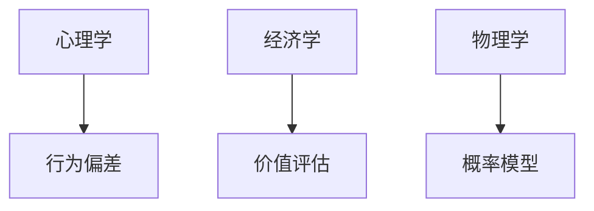
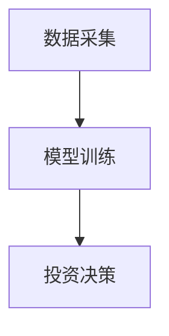

                 


# 多元思维模型在投资中的应用

## 关键词
- 多元思维模型
- 芒格
- 投资决策
- 跨学科知识
- 系统分析

## 摘要
多元思维模型是一种跨学科的知识应用方法，通过整合多个领域的理论和工具，帮助投资者做出更明智的决策。本文将深入探讨芒格的多元思维模型在投资中的应用，包括其核心概念、跨学科应用、数学基础、系统分析、项目实战以及最佳实践。通过实际案例分析和系统设计，读者将能够理解并应用多元思维模型来优化投资策略。

---

# 第一部分：多元思维模型的核心概念

## 第1章：多元思维模型的定义

### 1.1 多元思维模型的背景与来源

多元思维模型（Multi-Model Thinking）是由查理·芒格提出的，强调从多个学科的角度理解问题。这种方法源于他对知识的广泛涉猎和对复杂问题的深刻洞察。芒格认为，单一的思维方式往往会导致错误的决策，而多学科的视角能够帮助我们更全面地分析问题。

**核心概念术语说明**：
- **多元思维模型**：一种通过整合多个学科的理论和工具来解决问题的方法。
- **跨学科应用**：将不同学科的知识结合起来，用于特定领域的问题解决。

**问题背景与描述**：
在投资领域，市场是复杂且动态变化的，单一的分析方法往往无法捕捉所有关键因素。芒格的多元思维模型通过结合心理学、经济学、物理学等学科的理论，帮助投资者更全面地评估投资项目。

**问题解决**：
通过多元思维模型，投资者能够从多个角度分析市场趋势、公司基本面和潜在风险，从而做出更明智的投资决策。

**边界与外延**：
多元思维模型的应用不仅限于投资领域，还可以扩展到商业策略、风险管理等领域。其外延包括将不同学科的理论和工具结合，形成一个综合的分析框架。

**概念结构与核心要素组成**：
- **核心要素**：
  1. **心理学**：理解投资者行为偏差。
  2. **经济学**：分析市场机制和价值评估。
  3. **物理学**：应用概率模型和系统分析。

**概念属性特征对比表格**：

| 学科 | 核心理论 | 应用领域 |
|------|----------|----------|
| 心理学 | 行为偏差 | 投资者决策 |
| 经济学 | 价值评估 | 市场分析 |
| 物理学 | 概率模型 | 风险预测 |

**ER实体关系图架构**：


---

## 第2章：多元思维模型在投资中的应用

### 2.1 投资中的思维模型构建

#### 2.1.1 投资决策的复杂性

投资决策涉及多个变量，如市场趋势、公司财务状况、行业竞争等。单一的分析方法难以全面捕捉这些因素。

#### 2.1.2 多元思维模型在投资中的作用

通过整合多个学科的理论，多元思维模型能够帮助投资者更全面地分析问题，避免单一视角的局限性。

#### 2.1.3 投资中的常见思维陷阱

- **确认偏差**：倾向于寻找支持自己观点的信息。
- **从众心理**：跟随市场趋势而忽略独立思考。

**数学公式**：
- **概率论**：
  - 贝叶斯定理：用于更新概率模型。
  $$P(A|B) = \frac{P(B|A)P(A)}{P(B)}$$
  - 马尔可夫链：用于预测市场趋势。
  $$P_{n+1} = P_n \cdot A + (1 - P_n) \cdot B$$

---

## 第3章：多元思维模型的数学基础

### 3.1 基础概率论

#### 3.1.1 概率的基本概念

概率论是多元思维模型的重要工具，用于量化不确定性。例如，计算某只股票上涨的概率。

#### 3.1.2 贝叶斯定理在投资中的应用

贝叶斯定理用于更新基于新信息的概率模型。例如，根据新的财务报告更新某公司的股票价值概率。

#### 3.1.3 马尔可夫链与投资决策

马尔可夫链用于预测市场趋势，基于当前状态预测未来状态。

### 3.2 统计学基础

#### 3.2.1 投资数据的分布特征

分析投资数据的分布特征，如正态分布、幂律分布等。

#### 3.2.2 假设检验在投资分析中的应用

通过假设检验验证投资策略的有效性。

#### 3.2.3 时间序列分析与市场预测

使用ARIMA模型预测股票价格。

---

## 第4章：多元思维模型的系统分析与架构设计

### 4.1 投资系统的构成要素

#### 4.1.1 投资目标的设定

明确投资目标，如长期增长或短期收益。

#### 4.1.2 投资策略的选择

选择适合目标的策略，如价值投资、趋势跟踪。

#### 4.1.3 投资工具的使用

选择适当的工具，如股票、债券、基金。

### 4.2 多元思维模型的系统架构

#### 4.2.1 系统功能模块划分

- 数据采集模块：收集市场数据。
- 模型训练模块：训练多元思维模型。
- 投资决策模块：基于模型结果做出决策。

#### 4.2.2 系统交互流程设计

1. 数据采集模块收集市场数据。
2. 模型训练模块整合多学科理论。
3. 投资决策模块基于模型结果做出决策。

**系统架构图**：


---

## 第5章：多元思维模型的项目实战

### 5.1 项目背景与目标

#### 5.1.1 项目需求分析

分析某公司的财务状况、行业地位和市场趋势。

#### 5.1.2 项目可行性研究

评估公司是否具有长期投资价值。

#### 5.1.3 项目计划制定

制定详细的分析计划，包括数据收集、模型训练、结果评估。

### 5.2 项目核心实现

#### 5.2.1 数据采集与处理

使用Python脚本从多个来源收集数据。

```python
import pandas as pd
data = pd.read_csv('market_data.csv')
```

#### 5.2.2 模型训练与优化

训练多元思维模型，优化参数以提高预测精度。

```python
from sklearn.model_selection import GridSearchCV
# 参数优化
param_grid = {'n_neighbors': [1, 3, 5]}
grid_search = GridSearchCV(KNeighborsClassifier(), param_grid)
grid_search.fit(X_train, y_train)
best_params = grid_search.best_params_
```

#### 5.2.3 模型部署与测试

将优化后的模型部署到投资决策系统中，并进行测试。

---

## 第6章：多元思维模型的最佳实践与总结

### 6.1 实践中的注意事项

#### 6.1.1 模型的适用性与局限性

认识到模型的局限性，避免过度依赖。

#### 6.1.2 数据的可靠性和有效性

确保数据来源可靠，数据质量高。

#### 6.1.3 模型的可解释性与透明度

确保模型的决策过程透明，易于解释。

### 6.2 投资者的自我提升

#### 6.2.1 知识结构的优化

持续学习新知识，扩展知识面。

#### 6.2.2 思维方式的转变

培养跨学科思维，避免单一视角。

#### 6.2.3 投资心态的修炼

保持冷静，避免情绪化决策。

---

## 第7章：多元思维模型的拓展与延伸

### 7.1 多元思维模型的未来发展

#### 7.1.1 新兴学科对多元思维模型的影响

如人工智能、大数据分析等新兴领域对投资决策的影响。

#### 7.1.2 技术进步对多元思维模型的推动

技术进步提高了数据处理和模型训练的效率。

#### 7.1.3 多元思维模型在其他领域的应用

如商业策略、风险管理等领域的应用。

---

## 第8章：附录与参考文献

### 8.1 附录A：相关术语解释

- **多元思维模型**：整合多个学科理论的分析方法。
- **贝叶斯定理**：用于更新概率模型的公式。

### 8.2 附录B：常用工具与资源

- **数据采集工具**：Python的Pandas库。
- **模型训练工具**：Scikit-learn库。

### 8.3 附录C：经典文献推荐

- 查理·芒格的《穷查理宝典》。
- 《Fooled by Randomness》。

### 8.4 附录D：投资案例分析

分析某公司的投资案例，展示多元思维模型的应用过程。

---

## 作者信息

作者：AI天才研究院/AI Genius Institute & 禅与计算机程序设计艺术 /Zen And The Art of Computer Programming

---

这篇文章系统地介绍了芒格的多元思维模型在投资中的应用，从理论基础到实际案例，详细讲解了每个步骤和方法。通过跨学科的视角和系统分析，帮助投资者做出更明智的决策。

