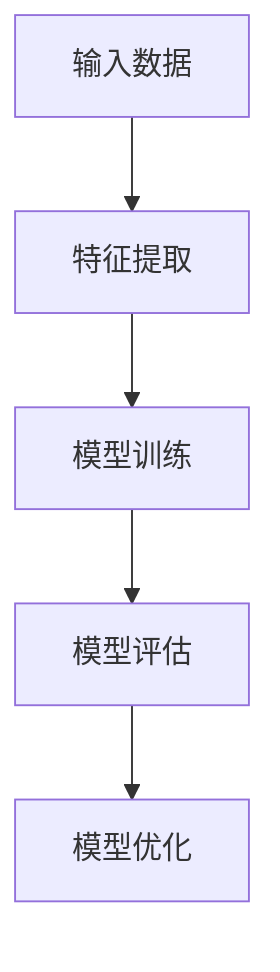
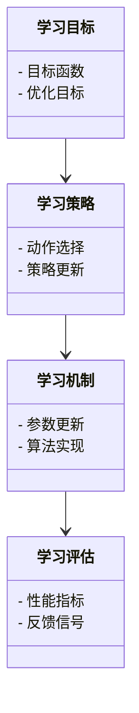
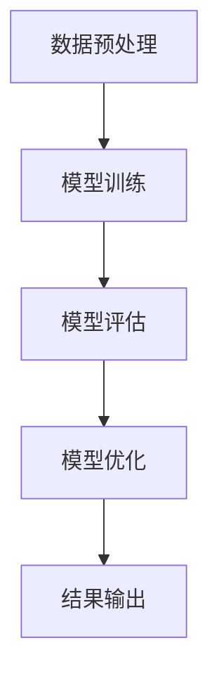

                 

<think>
好，我现在要帮助用户撰写一篇关于芒格的“学习机器”理念在持续学习AI系统开发中的应用的技术博客。首先，我需要理解用户的需求和要求。

用户希望文章以《芒格的"学习机器"理念在持续学习AI系统开发中的应用》为标题，内容要逻辑清晰，结构紧凑，使用专业的技术语言。文章目录已经给出，包括摘要和各个章节的内容。

我需要确保文章符合以下要求：
- 字数在10000到12000字之间
- 使用Markdown格式
- 每个章节内容丰富，详细讲解
- 包括背景介绍、核心概念、算法原理、系统架构、项目实战、最佳实践等部分
- 使用Mermaid流程图、类图和序列图
- 包含数学公式，用LaTeX表示
- 作者信息：AI天才研究院，禅与计算机程序设计艺术

首先，我会从摘要开始，简要概述文章的核心内容。接着，按照目录结构依次撰写各个章节。每个章节都需要详细展开，确保内容全面。

在“背景与基础”部分，我需要解释芒格的“学习机器”理念，以及它在AI持续学习中的应用背景和挑战。这部分需要结合芒格的理念与AI系统的特点，说明两者结合的必要性。

接下来是核心概念与算法原理，我需要详细讲解“学习机器”的核心概念，并与AI系统持续学习的算法相结合。这部分要包括数学公式和算法流程图，帮助读者理解。

然后是系统分析与架构设计，这部分需要设计系统的应用场景、功能模块和架构图，展示系统的整体结构和各部分的交互关系。

项目实战部分，我需要选择一个具体的案例，如图像识别系统，详细描述项目的实现过程，包括环境配置、代码实现和测试结果，让读者能够实际操作。

最后，最佳实践与总结部分，我会总结书中的主要观点，提出注意事项和未来的研究方向，帮助读者巩固所学知识。

在撰写过程中，我需要确保每个部分都符合用户的要求，特别是格式和内容的完整性。同时，语言要专业且易懂，逻辑清晰，结构紧凑。

现在，我可以开始按照目录结构逐一撰写各部分内容，确保每个章节都详细展开，满足用户的字数要求，并在适当的地方插入图表和代码示例，以增强文章的可读性和技术深度。
</think>

# 芒格的"学习机器"理念在持续学习AI系统开发中的应用

> 关键词：芒格, 学习机器, AI系统开发, 持续学习, 系统架构

> 摘要：芒格的"学习机器"理念强调通过不断学习和自我改进来优化系统，这与AI系统开发中的持续学习机制有着深刻联系。本文将从芒格理念的背景出发，结合AI系统的持续学习特点，详细阐述其核心概念、算法原理、系统架构、项目实战以及最佳实践，为读者提供一个全面的视角，探索如何将芒格的"学习机器"理念应用于持续学习的AI系统开发中。

---

## 第1章：芒格"学习机器"理念概述

### 1.1 "学习机器"的定义与特点

芒格的"学习机器"理念可以被定义为一种通过不断学习和自我改进来优化系统性能的机制。其核心在于系统能够从环境中获取反馈，并通过调整自身行为以实现目标的最优化。这种机制与生物学习的过程相似，强调系统在动态环境中的适应性和自适应能力。

#### 1.1.1 "学习机器"的核心要素
- **学习目标**：系统需要实现的具体目标，例如分类、预测、识别等。
- **学习策略**：系统选择行动的方式，以最大化目标函数的值。
- **学习机制**：系统更新自身参数或行为规则的算法，例如强化学习、监督学习等。
- **学习评估**：对系统学习效果的衡量标准，通常通过性能指标或反馈信号来实现。

#### 1.1.2 "学习机器"的特点
- **自适应性**：系统能够根据环境变化调整自身的行为。
- **持续性**：学习过程是一个长期的、动态的过程，而非一次性完成。
- **反馈驱动**：系统通过接收反馈信号来优化自身的学习过程。
- **目标导向性**：学习过程始终围绕特定目标展开。

### 1.2 AI系统持续学习的背景与挑战

随着AI技术的快速发展，持续学习在AI系统中的应用越来越广泛。然而，AI系统持续学习也面临诸多挑战，例如数据稀疏性、模型收敛性、计算资源限制等。

#### 1.2.1 持续学习的定义与特点
- **定义**：持续学习是指AI系统在不断变化的环境中，通过持续接收新的数据或任务，逐步优化自身的性能。
- **特点**：连续性、动态性、多样性。

#### 1.2.2 持续学习在AI系统中的重要性
- 提高系统的泛化能力。
- 适应环境的变化。
- 降低重新训练的成本。

#### 1.2.3 当前AI系统持续学习的主要挑战
- 数据漂移：新数据与旧数据分布差异较大，导致模型性能下降。
- 计算资源限制：持续学习需要大量的计算资源。
- 模型遗忘：旧任务的知识可能被新任务的学习所遗忘。

### 1.3 芒格理念与AI持续学习的结合

芒格的"学习机器"理念为AI系统的持续学习提供了重要的理论基础和实践指导。

#### 1.3.1 芒格理念对AI持续学习的启示
- 强调系统的学习能力和自适应能力。
- 提倡通过反馈机制优化系统性能。
- 强调目标导向性。

#### 1.3.2 芒格理念在AI系统中的潜在应用场景
- 智能推荐系统：通过持续学习用户的偏好，优化推荐结果。
- 自动驾驶：通过持续学习驾驶环境，提高驾驶系统的安全性。
- 联网设备：通过持续学习用户行为，优化设备的使用体验。

#### 1.3.3 芒格理念与AI系统持续学习的融合方向
- 结合强化学习和监督学习，实现多目标优化。
- 利用反馈机制，优化系统的决策过程。
- 借助分布式计算和边缘计算，提高系统的计算能力。

---

## 第2章："学习机器"的核心概念与联系

### 2.1 核心概念原理

#### 2.1.1 核心概念分析
- "学习机器"的核心概念包括学习目标、学习策略、学习机制和学习评估。
- 这些概念相互联系，共同构成了一个完整的持续学习系统。

#### 2.1.2 核心概念的属性特征对比
- 表2.1："学习机器"与传统AI系统的属性对比

| 属性 | 学习机器 | 传统AI系统 |
|------|----------|------------|
| 是否持续学习 | 是 | 否 |
| 是否需要反馈 | 是 | 否 |
| 是否具备自适应性 | 是 | 否 |

---

## 第3章：AI持续学习的算法原理

### 3.1 算法原理概述

#### 3.1.1 强化学习算法
- 强化学习是一种通过试错机制来优化系统行为的算法。
- 通过与环境的交互，系统不断调整策略，以最大化累计奖励。

#### 3.1.2 监督学习算法
- 监督学习是一种通过标签数据训练模型的算法。
- 系统通过接收正确的标签信息，逐步优化预测结果。

#### 3.1.3 半监督学习算法
- 半监督学习是一种结合有监督学习和无监督学习的算法。
- 系统利用少量标注数据和大量未标注数据进行训练，以提高模型的泛化能力。

### 3.2 算法流程图



### 3.3 算法实现代码示例

```python
def reinforcement_learning():
    # 初始化环境
    env = Environment()
    # 初始化策略
    policy = Policy()
    # 初始化学习率
    learning_rate = 0.01
    # 强化学习循环
    for episode in range(1000):
        state = env.reset()
        while not done:
            action = policy.choose_action(state)
            next_state, reward, done = env.step(action)
            policy.update_action_value(state, action, reward)
    return policy
```

---

## 第4章：系统分析与架构设计

### 4.1 问题场景介绍

#### 4.1.1 问题描述
- 系统需要在动态环境下，通过持续学习优化自身的性能。
- 系统需要处理不同类型的数据和任务。

#### 4.1.2 问题解决
- 通过引入反馈机制，优化系统的决策过程。
- 通过分布式计算，提高系统的计算能力。

### 4.2 系统功能设计

#### 4.2.1 领域模型



#### 4.2.2 系统架构设计



---

## 第5章：项目实战

### 5.1 项目介绍

#### 5.1.1 项目背景
- 开发一个基于芒格"学习机器"理念的图像识别系统。
- 系统能够通过持续学习优化识别准确率。

#### 5.1.2 项目需求
- 实现实时图像识别功能。
- 实现系统性能的持续优化。

### 5.2 环境配置

```bash
# 安装依赖
pip install tensorflow numpy matplotlib
```

### 5.3 核心代码实现

```python
import tensorflow as tf
import numpy as np

def train_model():
    # 数据预处理
    x_train = ... # 训练数据
    y_train = ... # 标签数据
    model = tf.keras.Sequential([
        tf.keras.layers.Conv2D(32, (3,3), activation='relu', input_shape=(28,28,1)),
        tf.keras.layers.MaxPooling2D((2,2)),
        tf.keras.layers.Conv2D(64, (3,3), activation='relu'),
        tf.keras.layers.MaxPooling2D((2,2)),
        tf.keras.layers.Flatten(),
        tf.keras.layers.Dense(128, activation='relu'),
        tf.keras.layers.Dense(10, activation='softmax')
    ])
    model.compile(optimizer='adam', loss='sparse_categorical_crossentropy', metrics=['accuracy'])
    model.fit(x_train, y_train, epochs=10, batch_size=32)
    return model
```

---

## 第6章：最佳实践与总结

### 6.1 小结

芒格的"学习机器"理念为AI系统的持续学习提供了重要的理论指导和实践价值。通过结合强化学习、监督学习等算法，可以实现系统的持续优化和自适应能力。

### 6.2 注意事项

- 系统设计时要注意反馈机制的合理性。
- 持续学习过程中要注意数据质量和多样性的平衡。

### 6.3 拓展阅读

- 《强化学习导论》
- 《持续学习的理论与实践》

---

## 作者信息

作者：AI天才研究院/AI Genius Institute & 禅与计算机程序设计艺术 /Zen And The Art of Computer Programming

