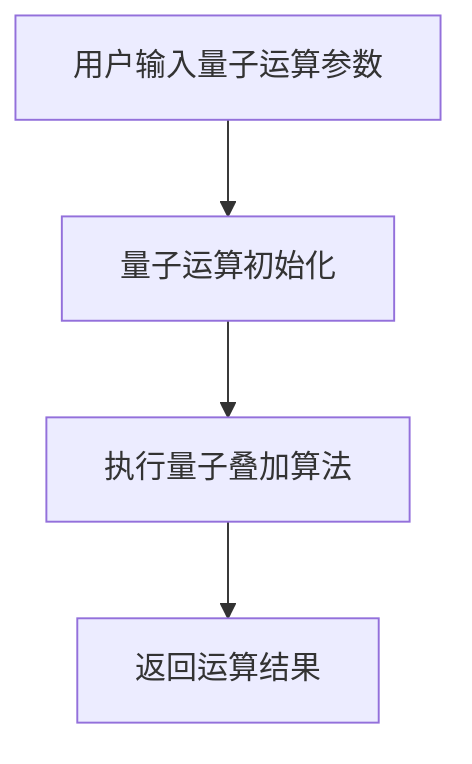
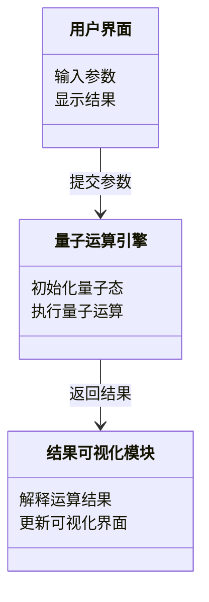

                 


# 芒格的"心理倾向"理论在量子人机交互设计中的应用

> 关键词：芒格心理倾向，量子计算，人机交互，系统设计，交互优化

> 摘要：本文探讨了芒格心理倾向理论在量子人机交互设计中的应用，分析了心理倾向理论与量子计算的核心联系，详细讲解了量子人机交互设计中的心理倾向分析、算法原理、系统架构设计、项目实战及最佳实践。

---

# 第一部分: 芒格的"心理倾向"理论与量子计算基础

---

## 第1章: 芒格心理倾向理论概述

### 1.1 心理倾向理论的起源与发展

#### 1.1.1 芒格心理倾向理论的提出

芒格的心理倾向理论源于他对人类决策过程的深入研究。他认为，人类的决策过程并非完全理性，而是受到多种心理倾向的影响。这些倾向包括确认偏差、从众心理、损失厌恶等，这些倾向在量子计算的人机交互设计中可能会导致用户在操作量子系统时出现误判或低效行为。

#### 1.1.2 心理倾向的核心概念

心理倾向是指个体在决策过程中表现出的内在偏好和行为模式。这些倾向通常基于个体的经验、情感和认知框架。在量子计算中，用户可能会因为对量子概念的不熟悉而产生认知偏差，进而影响其操作行为。

#### 1.1.3 心理倾向在决策中的作用

心理倾向在决策中的作用是双重的：一方面，它们可以帮助个体快速做出决策，另一方面，它们也可能导致错误的决策。在量子计算中，用户可能会因为对量子叠加和纠缠概念的误解而产生错误的交互行为。

### 1.2 量子计算的基本原理

#### 1.2.1 量子计算的基本概念

量子计算是一种基于量子力学原理的计算方式。与经典计算机使用二进制位不同，量子计算机使用量子位（qubit）来进行计算。量子位可以通过叠加和纠缠的状态表示更多的信息。

#### 1.2.2 量子叠加与纠缠

量子叠加是指一个量子位可以同时处于多个状态的叠加态。例如，一个量子位可以同时表示0和1的概率叠加。量子纠缠则是指两个或多个量子位之间形成的一种特殊状态，其中一个量子位的状态会直接影响另一个量子位的状态。

#### 1.2.3 量子计算的优势与挑战

量子计算的优势在于其处理某些复杂问题时的速度远超经典计算机，例如因式分解和优化问题。然而，量子计算也面临诸多挑战，例如量子位的稳定性和纠错技术的复杂性。

### 1.3 心理倾向与量子计算的结合点

#### 1.3.1 心理倾向在量子计算中的应用潜力

心理倾向理论可以帮助设计者理解用户在使用量子系统时可能产生的认知偏差，从而优化系统设计以减少这些偏差的影响。

#### 1.3.2 量子计算中的人机交互问题

在量子计算中，用户通常需要通过复杂的界面和工具与量子系统进行交互。由于量子计算的复杂性，用户可能会因为认知负荷过重而产生疲劳或误操作。

#### 1.3.3 心理倾向理论对量子计算的启发

心理倾向理论为量子计算的人机交互设计提供了理论基础，帮助设计者更好地理解用户的行为模式，从而设计出更符合用户认知习惯的交互界面。

---

## 第2章: 心理倾向理论与量子计算的核心联系

### 2.1 心理倾向理论的数学模型

#### 2.1.1 心理倾向的数学表达

心理倾向可以用概率模型来表示。例如，确认偏差可以用概率权重函数来建模，表示用户在决策过程中对不同结果的偏好程度。

#### 2.1.2 量子计算的数学模型

量子计算的核心是量子态的叠加和纠缠。量子态可以用向量空间中的向量来表示，量子运算可以用矩阵操作来描述。

#### 2.1.3 两者之间的关联性分析

通过将心理倾向的概率模型与量子计算的数学模型相结合，可以发现两者在处理不确定性问题时具有相似的特征。例如，量子叠加反映了概率叠加的概念，而心理倾向的不确定性则反映了量子态的不确定性。

### 2.2 心理倾向与量子计算的对比分析

#### 2.2.1 心理倾向的特征分析

心理倾向具有主观性、个体差异性和动态变化性等特征。这些特征使得心理倾向在不同的用户和不同的场景中表现出不同的影响。

#### 2.2.2 量子计算的特征分析

量子计算具有并行性、叠加性和纠缠性等特征。这些特征使得量子计算在处理复杂问题时具有独特的优势。

#### 2.2.3 两者在特征上的对比表格

| 特征 | 心理倾向 | 量子计算 |
|------|----------|----------|
| 主观性 | 是       | 否       |
| 并行性 | 否       | 是       |
| 个体差异性 | 是      | 否       |
| 动态变化性 | 是      | 否       |

#### 2.2.4 心理倾向与量子计算的ER实体关系图

```mermaid
er
    %% 芒格心理倾向与量子计算的ER实体关系图
    entity 芒格心理倾向 {
        id
        倾向类型
        偏好程度
    }
    entity 量子计算 {
        id
        计算类型
        状态叠加
    }
    芒格心理倾向 --|{n:1} 量子计算 : 影响关系
```

---

## 第3章: 量子人机交互设计中的心理倾向分析

### 3.1 量子计算中的用户行为分析

#### 3.1.1 用户在量子计算中的行为模式

用户在使用量子计算系统时，通常会经历以下几个阶段：系统初始化、量子态设置、量子运算执行和结果解读。在每个阶段，用户的行为都会受到心理倾向的影响。

#### 3.1.2 心理倾向对用户行为的影响

确认偏差可能导致用户在设置量子态时反复检查，从众心理可能导致用户在选择运算参数时倾向于跟随系统推荐的默认值。

#### 3.1.3 典型用户案例分析

例如，一位用户在设置量子运算参数时，因为害怕出错而反复修改参数设置，这体现了确认偏差的影响。

### 3.2 量子计算中的交互问题

#### 3.2.1 交互中的认知负荷

量子计算的复杂性可能导致用户的认知负荷过高，从而影响其操作效率。

#### 3.2.2 心理倾向在交互中的具体表现

损失厌恶可能导致用户在进行量子运算时过于谨慎，避免尝试新的运算参数，从而限制了系统的潜力。

#### 3.2.3 心理倾向对交互设计的启示

通过了解用户的心理倾向，设计者可以优化交互界面，例如提供更多的默认值和直观的可视化工具，以减少用户的认知负荷。

---

## 第4章: 量子人机交互设计中的算法与系统架构

### 4.1 量子人机交互中的算法原理

#### 4.1.1 量子叠加算法的实现

通过量子叠加算法，用户可以在一次运算中同时处理多个状态，从而提高运算效率。

#### 4.1.2 心理倾向对算法选择的影响

用户的心理倾向可能影响其对算法的选择。例如，损失厌恶可能导致用户倾向于选择保守的算法，而风险偏好较高的用户可能选择更具冒险性的算法。

#### 4.1.3 算法实现的流程图



### 4.2 系统架构设计

#### 4.2.1 系统功能设计

量子人机交互系统通常包括用户界面、量子运算引擎和结果可视化模块。

#### 4.2.2 系统架构的类图



---

## 第5章: 项目实战与最佳实践

### 5.1 项目环境与工具安装

#### 5.1.1 量子计算开发环境

推荐使用Qiskit或Cirq等量子计算开发框架。

#### 5.1.2 心理倾向分析工具

可以使用Python的机器学习库（如Scikit-learn）来分析用户行为数据。

### 5.2 核心代码实现

#### 5.2.1 量子叠加算法的实现

```python
from qiskit import QuantumCircuit, execute, Aer

# 创建量子电路
qc = QuantumCircuit(1, 1)

# 执行量子叠加
qc.h(0)
qc.measure(0, 0)

# 模拟器执行
simulator = Aer.get_backend('qasm_simulator')
job = execute(qc, simulator)
result = job.result()
print(result.get_counts())
```

#### 5.2.2 心理倾向分析的实现

```python
from sklearn.cluster import KMeans
import numpy as np

# 示例用户行为数据
X = np.array([[1, 2], [3, 4], [5, 6]])

# 聚类分析
kmeans = KMeans(n_clusters=2, random_state=0)
kmeans.fit(X)
print(kmeans.labels_)
```

### 5.3 实际案例分析

#### 5.3.1 案例背景

假设我们设计了一个量子计算平台，用户可以通过该平台进行量子运算的模拟和优化。

#### 5.3.2 案例分析

通过对用户行为数据的分析，发现用户在使用过程中存在较高的确认偏差，导致操作效率低下。

#### 5.3.3 设计优化建议

基于分析结果，建议在系统中增加更多的默认参数和实时反馈机制，以减少用户的确认偏差。

---

## 第6章: 总结与展望

### 6.1 小结

本文探讨了芒格心理倾向理论在量子人机交互设计中的应用，分析了心理倾向理论与量子计算的核心联系，并通过实际案例展示了如何将心理倾向理论应用于量子系统的交互设计中。

### 6.2 注意事项

在实际应用中，需要注意心理倾向的个体差异性，确保设计能够适应不同用户的认知习惯。

### 6.3 未来展望

随着量子计算技术的发展和心理倾向理论的深入研究，未来的量子人机交互设计将更加智能化和个性化，能够更好地适应用户的认知需求。

---

作者：AI天才研究院 & 禅与计算机程序设计艺术

