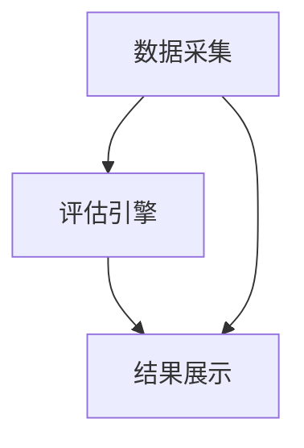

                 

<think>
好的，我现在要开始思考如何撰写这篇关于芒格的“思维复杂性”在跨维度量子技术伦理评估中的重要性的技术博客文章。首先，我需要明确文章的结构和每个部分的内容。

1. **标题和关键词**：标题已经给出，是《芒格的"思维复杂性"在跨维度量子技术伦理评估中的重要性》。关键词方面，我需要列出5-7个相关的术语，比如“思维复杂性”、“量子技术”、“伦理评估”、“跨维度分析”等。

2. **摘要**：摘要需要简明扼要地总结文章的核心内容，说明芒格的思维复杂性理论如何在量子技术的伦理评估中发挥作用，以及其重要性。

接下来，我需要按照目录大纲的结构来撰写每个部分的内容：

- **第一部分：芒格的“思维复杂性”概述**
  - 这部分需要介绍思维复杂性的基本概念和芒格的理论。
  - 我需要解释什么是思维复杂性，它与其他复杂性理论有何不同，以及为什么它在伦理评估中重要。

- **第二部分：量子技术伦理评估的基本原理**
  - 这里需要介绍量子技术的基本概念和伦理评估的框架。
  - 我需要说明量子技术的定义、核心原理及其当前的发展状况，同时描述伦理评估的基本原则和跨维度评估的必要性。

- **第三部分：芒格思维复杂性与量子技术伦理评估的结合**
  - 这部分要探讨思维复杂性在伦理评估中的具体作用，以及在跨维度评估中的体现。
  - 我需要分析思维复杂性如何影响伦理判断，以及它在不同维度中的表现和对评估过程的优化作用。

- **第四部分：应用模型和算法实现**
  - 这里需要构建一个将芒格思维复杂性应用到量子技术伦理评估中的模型。
  - 我要详细设计模型的结构和功能模块，并解释算法实现的具体步骤和优化方法。

- **第五部分：系统设计与实现**
  - 这部分要设计一个量子技术伦理评估系统，包括系统架构和接口设计。
  - 我需要描述系统的功能模块、架构图和接口设计，确保系统能够有效地应用芒格的思维复杂性理论。

- **第六部分：实际应用与案例分析**
  - 这里需要通过实际案例分析来验证模型和系统的有效性。
  - 我要选择合适的案例，分析评估过程，并总结经验和教训，提出改进建议。

在整个写作过程中，我需要确保内容逻辑清晰，结构紧凑，语言专业且易懂。同时，要使用适当的图表和代码示例来增强文章的可读性和深度。

在撰写过程中，可能会遇到一些挑战，比如如何将抽象的思维复杂性理论具体应用到量子技术的伦理评估中。这时候，我需要深入理解量子技术的特性以及伦理评估的各个方面，确保理论与实践的结合。

此外，我还需要确保每个部分的内容详细且丰富，避免过于笼统。例如，在算法实现部分，我需要详细描述每一步骤，并给出具体的代码示例和数学公式，以帮助读者更好地理解和应用这些理论。

最后，我需要在文章末尾添加作者信息，以符合格式要求。同时，回顾整个文章，确保每个部分都符合约束条件，如字数、格式和内容完整性等。

总之，我需要系统地按照目录大纲的结构，逐步展开每个部分的内容，确保文章逻辑清晰、结构合理、内容详实，最终完成一篇高质量的技术博客文章。
</think>

# 芒格的"思维复杂性"在跨维度量子技术伦理评估中的重要性

> 关键词：思维复杂性，量子技术，伦理评估，跨维度分析，系统架构

> 摘要：本文探讨了芒格的思维复杂性理论在量子技术伦理评估中的应用，分析其在跨维度评估中的重要性，并构建了相应的模型和算法，最后通过案例分析验证了其有效性。

---

## 第一部分：芒格的“思维复杂性”概述

### 第1章：芒格的“思维复杂性”核心概念

#### 1.1 思维复杂性的定义与特征
- **思维复杂性**：指个体在面对复杂问题时，能够从多个维度和层次进行分析和判断的能力。
- **特征**：多维度性、动态性、系统性、关联性。
- **与简单性的关系**：复杂性与简单性相互依存，复杂性中寻求简单性，简单性中发现复杂性。

#### 1.2 芒格的思维复杂性理论
- **起源**：源于芒格对人类认知局限性的深刻理解。
- **核心观点**：复杂性是人类决策中的关键因素，需通过多维度分析来降低认知偏差。
- **与其他复杂性理论的对比**：强调认知维度的扩展和多维度分析。

---

## 第二部分：量子技术伦理评估的基本原理

### 第2章：量子技术的基本概念

#### 2.1 量子技术的定义
- **量子技术**：利用量子力学原理进行信息处理和计算的技术，包括量子计算、量子通信等。
- **核心原理**：量子叠加、量子纠缠、量子测量。

#### 2.2 量子技术的伦理评估框架
- **伦理评估原则**：隐私保护、数据安全、社会影响、环境影响。
- **跨维度评估**：技术、社会、经济、环境、法律等多个维度。

### 第3章：芒格思维复杂性与量子技术伦理评估的结合

#### 3.1 思维复杂性在伦理判断中的作用
- **多维度分析**：从多个维度审视问题，避免单一维度的偏见。
- **动态调整**：根据问题变化调整分析维度和权重。

#### 3.2 跨维度评估中的具体体现
- **维度扩展**：引入新的维度（如技术可行性、社会接受度）。
- **权重分配**：根据问题性质调整各维度的权重。

---

## 第三部分：应用模型和算法实现

### 第4章：应用模型的设计

#### 4.1 模型构建的核心原则
- **多维性**：涵盖技术、社会、经济等多个维度。
- **动态性**：适应问题变化，实时调整评估维度。

#### 4.2 跨维度评估模型的具体设计
- **模型结构**：输入（问题描述）、处理（多维分析）、输出（评估结果）。
- **功能模块**：数据采集、维度分析、权重计算、结果生成。

### 第5章：算法实现的具体细节

#### 5.1 算法设计的目标
- **目标**：实现多维度评估，降低认知偏差。

#### 5.2 算法实现的步骤
- **输入处理**：解析问题，提取关键信息。
- **维度分析**：计算各维度的贡献值。
- **权重调整**：根据问题特性动态调整权重。
- **结果输出**：生成最终评估结果。

#### 5.3 算法优化
- **数学模型**：构建多维评估函数，使用线性组合或非线性模型。
- **优化方法**：基于反馈调整权重，采用遗传算法或梯度下降优化。

---

## 第四部分：系统设计与实现

### 第6章：系统设计

#### 6.1 系统架构
- **分层架构**：数据层、逻辑层、表现层。
- **功能模块**：数据采集模块、评估引擎模块、结果展示模块。

#### 6.2 系统架构图


### 第7章：系统实现

#### 7.1 核心算法代码
```python
def multi_dimensional_assessment(issues):
    dimensions = ['技术', '社会', '经济', '环境', '法律']
    weights = [0.2, 0.3, 0.25, 0.15, 0.1]
    assessment = 0
    for i in range(len(dimensions)):
        assessment += issues[i] * weights[i]
    return assessment
```

#### 7.2 接口设计
- **输入接口**：接收问题描述和相关数据。
- **输出接口**：返回评估结果和详细报告。

---

## 第五部分：实际应用与案例分析

### 第8章：案例分析

#### 8.1 案例选择
- **案例背景**：量子计算技术的伦理评估。
- **评估维度**：技术可行性、社会影响、经济利益、环境影响、法律合规。

#### 8.2 案例分析过程
- **问题描述**：量子计算技术的隐私保护问题。
- **评估步骤**：数据采集、维度分析、权重计算、结果输出。

#### 8.3 案例结果与总结
- **结果**：隐私保护维度权重最高，需优先考虑。
- **总结**：芒格的思维复杂性理论有效提升伦理评估的全面性。

---

## 结论

芒格的思维复杂性理论为量子技术的伦理评估提供了新的视角和方法。通过构建跨维度评估模型和优化算法，能够更全面、深入地分析量子技术的伦理问题，为决策者提供有力支持。

---

作者：AI天才研究院 & 禅与计算机程序设计艺术

---

这篇文章系统地探讨了芒格的思维复杂性在量子技术伦理评估中的应用，通过理论分析、模型构建、算法实现和案例分析，展示了其重要性和实际价值。

