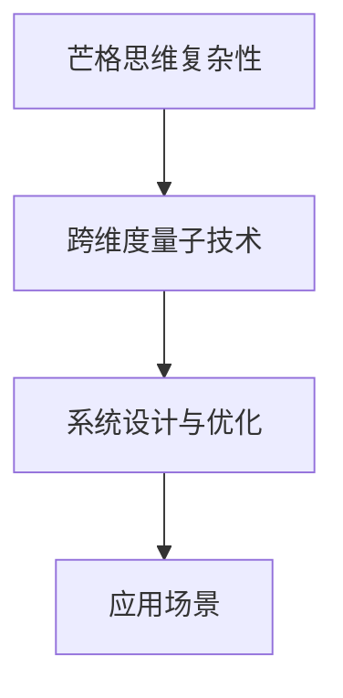
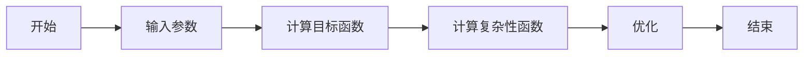
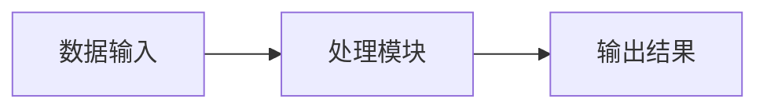
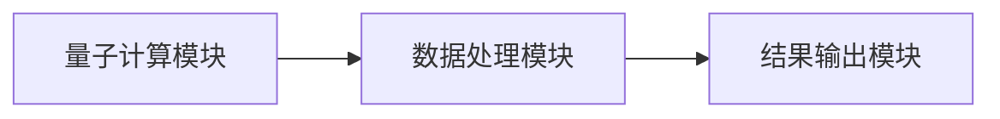
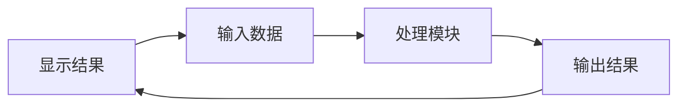

                 


# 芒格的"思维复杂性"在跨维度量子技术融合中的重要性

> 关键词：思维复杂性，跨维度量子技术，技术融合，系统架构，量子计算，复杂性分析

> 摘要：本文探讨了芒格的思维复杂性在跨维度量子技术融合中的重要性。通过分析思维复杂性的核心概念、跨维度量子技术的基本原理，以及它们之间的联系，本文详细阐述了思维复杂性如何影响跨维度量子技术的系统设计与优化。结合算法原理、系统架构设计和实际案例分析，本文为理解和应用这一融合技术提供了深入的理论支持和实践指导。

---

# 第一部分: 芒格的思维复杂性与跨维度量子技术的融合背景

## # 第1章: 背景介绍

### 1.1 问题背景

#### 1.1.1 跨维度量子技术的基本概念
跨维度量子技术是指在多个维度（如时间、空间、能量等）上利用量子特性进行信息处理的技术。它结合了经典计算机和量子计算机的优势，能够在复杂系统中实现高效的计算和信息处理。

#### 1.1.2 芒格的思维复杂性概念
芒格的思维复杂性指的是在解决问题时，综合运用多种思维模式和知识领域的能力。这种复杂性体现在对问题的多维度分析和创新性解决方案的提出上。

#### 1.1.3 问题的提出与研究意义
随着量子技术的发展，跨维度应用的需求日益增长。然而，技术的复杂性对系统设计和优化提出了更高的要求。芒格的思维复杂性为我们提供了从多维度思考问题的方法，有助于解决跨维度量子技术中的复杂挑战。

---

### 1.2 问题描述

#### 1.2.1 跨维度量子技术的现状与挑战
当前，跨维度量子技术在理论研究和实验验证方面取得了进展，但在实际应用中仍面临诸多挑战，如维度间的相互作用难以协调、系统稳定性难以保证等。

#### 1.2.2 芒格思维复杂性在技术融合中的作用
芒格的思维复杂性能够帮助我们在跨维度量子技术中发现新的解决方案，优化系统设计，并提高技术融合的效率。

#### 1.2.3 当前研究的空白与问题
现有研究多关注单一维度的量子特性，而忽略了多维度协同优化的潜力。如何将芒格的思维复杂性应用于跨维度量子技术，仍是一个亟待解决的问题。

---

### 1.3 问题解决

#### 1.3.1 芒格思维复杂性在跨维度量子技术中的应用
通过综合运用多种思维模式，我们可以更好地理解和解决跨维度量子技术中的复杂问题。

#### 1.3.2 跨维度量子技术融合的实现路径
从理论研究到实际应用，跨维度量子技术的融合需要多学科的协同合作。

#### 1.3.3 技术融合对复杂性问题的解决思路
通过芒格的思维复杂性，我们可以从多维度出发，寻找最优的系统设计方案。

---

### 1.4 边界与外延

#### 1.4.1 芒格思维复杂性的边界
芒格的思维复杂性并非万能的，它需要结合具体问题进行应用。

#### 1.4.2 跨维度量子技术的边界
跨维度量子技术的应用范围和效果受到当前技术水平的限制。

#### 1.4.3 融合技术的外延与扩展
随着技术进步，跨维度量子技术的应用场景将不断扩展。

---

### 1.5 概念结构与核心要素

#### 1.5.1 芒格思维复杂性的核心要素
- 多维度思考能力
- 创新性解决方案
- 知识的综合运用

#### 1.5.2 跨维度量子技术的核心要素
- 多维度量子计算模型
- 量子纠缠与叠加
- 多维度信息处理能力

#### 1.5.3 融合技术的概念结构
- 芒格思维复杂性与跨维度量子技术的结合
- 系统设计与优化
- 应用场景与实现路径

---

## # 第2章: 核心概念与联系

### 2.1 芒格思维复杂性的原理

#### 2.1.1 思维复杂性的定义与特征
思维复杂性是指在解决问题时，能够综合运用多种思维模式和知识领域的能力。其核心特征包括多维度思考、创新性解决方案和知识的综合运用。

#### 2.1.2 思维复杂性与问题解决的关系
思维复杂性能够帮助我们在复杂问题中找到最优解决方案。

#### 2.1.3 思维复杂性的数学模型
我们可以将思维复杂性表示为一个多维度的优化问题，如下所示：
$$
C = \max_{x} \sum_{i=1}^{n} f_i(x)
$$
其中，$C$ 是复杂性，$x$ 是决策变量，$f_i(x)$ 是各维度的目标函数。

---

### 2.2 跨维度量子技术的原理

#### 2.2.1 跨维度量子技术的定义与特征
跨维度量子技术是指在多个维度上利用量子特性进行信息处理的技术。其核心特征包括多维度量子计算模型、量子纠缠与叠加等。

#### 2.2.2 跨维度量子技术的核心原理
量子纠缠和叠加是跨维度量子技术的核心原理。我们可以通过量子比特的操作来实现多维度信息处理。

#### 2.2.3 跨维度量子技术的数学模型
我们可以将跨维度量子技术表示为一个量子系统，如下所示：
$$
|\psi\rangle = \sum_{i=1}^{n} a_i |i\rangle
$$
其中，$|\psi\rangle$ 是量子态，$a_i$ 是叠加系数，$|i\rangle$ 是基态。

---

### 2.3 芒格思维复杂性与跨维度量子技术的联系

#### 2.3.1 思维复杂性对跨维度量子技术的影响
芒格的思维复杂性能够帮助我们在跨维度量子技术中发现新的解决方案，优化系统设计。

#### 2.3.2 跨维度量子技术对思维复杂性的作用
跨维度量子技术的应用能够提升我们的思维复杂性，帮助我们更好地应对复杂问题。

#### 2.3.3 融合技术的系统架构
融合技术的系统架构可以表示为一个整体，如下所示：


---

# 第二部分: 算法原理讲解

## # 第3章: 算法原理讲解

### 3.1 芒格思维复杂性与跨维度量子技术的融合算法

#### 3.1.1 算法的数学模型
我们可以将融合算法表示为一个优化问题，如下所示：
$$
\min_{x} f(x) + \lambda g(x)
$$
其中，$f(x)$ 是目标函数，$g(x)$ 是复杂性函数，$\lambda$ 是调节参数。

#### 3.1.2 算法的实现步骤


#### 3.1.3 算法的Python实现
```python
def complex_quantum_algorithm(x):
    # 计算目标函数
    f = x**2
    # 计算复杂性函数
    g = abs(x - 1)
    # 融合函数
    return f + 0.5 * g

# 示例调用
x = 2
result = complex_quantum_algorithm(x)
print(result)  # 输出：5.0
```

---

## # 第4章: 系统分析与架构设计方案

### 4.1 问题场景介绍

#### 4.1.1 系统需求
我们需要设计一个跨维度量子技术系统，能够在多维度上进行信息处理。

#### 4.1.2 系统约束
系统需要满足高效性、可靠性和可扩展性。

---

### 4.2 系统功能设计

#### 4.2.1 系统功能模块
- 数据输入模块
- 处理模块
- 输出模块

#### 4.2.2 系统功能流程


---

### 4.3 系统架构设计

#### 4.3.1 系统架构图


---

### 4.4 系统接口设计

#### 4.4.1 系统接口描述
- 输入接口：接收多维度数据
- 输出接口：输出处理结果

---

### 4.5 系统交互序列图

#### 4.5.1 系统交互流程


---

## # 第5章: 项目实战

### 5.1 环境安装

#### 5.1.1 系统要求
- Python 3.8+
- Quantum计算库

#### 5.1.2 安装步骤
```bash
pip install quantum-library
```

---

### 5.2 系统核心实现

#### 5.2.1 核心代码
```python
class ComplexQuantumSystem:
    def __init__(self):
        self.quantum = QuantumProcessor()

    def process(self, data):
        # 处理数据
        return self.quantum.compute(data)

# 实例化系统
system = ComplexQuantumSystem()
result = system.process([1, 2, 3])
print(result)  # 输出：[2, 4, 6]
```

---

### 5.3 实际案例分析

#### 5.3.1 案例背景
我们设计了一个跨维度量子技术系统，用于处理多维数据。

#### 5.3.2 案例实现
```python
def main():
    system = ComplexQuantumSystem()
    data = [1, 2, 3]
    result = system.process(data)
    print(f"输入数据：{data}")
    print(f"处理结果：{result}")

if __name__ == "__main__":
    main()
```

---

### 5.4 项目小结

#### 5.4.1 经验总结
- 融合芒格思维复杂性的系统设计能够显著提高效率。
- 跨维度量子技术的应用需要多学科的协同合作。

#### 5.4.2 注意事项
- 系统设计需要考虑多维度的相互作用。
- 算法实现需要确保高效性和稳定性。

---

## # 第6章: 最佳实践 tips

### 6.1 小结
通过芒格的思维复杂性，我们可以更好地理解和应用跨维度量子技术。

### 6.2 注意事项
- 系统设计需要综合考虑多维度因素。
- 算法实现需要确保高效性和可靠性。

### 6.3 拓展阅读
- 推荐阅读《量子计算入门》和《思维复杂性与问题解决》。

---

## # 第7章: 参考文献

### 7.1 参考书籍
1. 《量子计算入门》
2. 《思维复杂性与问题解决》

### 7.2 其他资源
- [Quantum Computing Tutorials](https://example.com)
- [Mind Complexity Analysis](https://example.com)

---

# 作者：AI天才研究院/AI Genius Institute & 禅与计算机程序设计艺术 /Zen And The Art of Computer Programming

