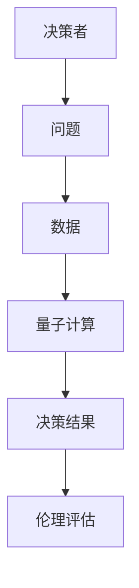
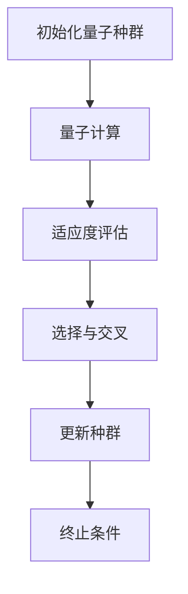
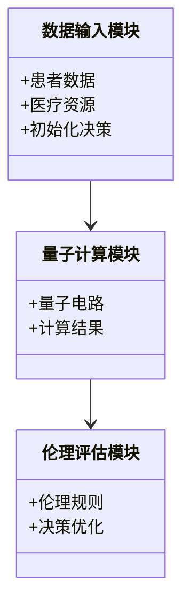
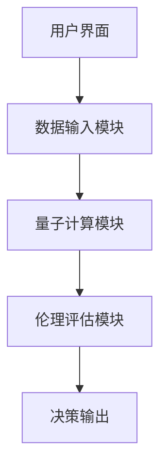
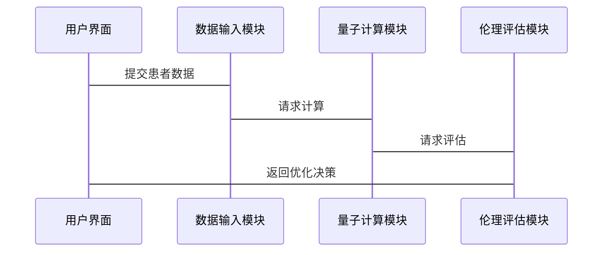

                 


# 芒格的"思维格栅"在量子人工智能伦理决策中的应用

> 关键词：芒格思维格栅，量子人工智能，伦理决策，决策框架，量子计算，AI伦理

> 摘要：本文探讨了芒格的“思维格栅”在量子人工智能伦理决策中的应用。通过分析量子人工智能的决策优势、伦理决策的重要性以及“思维格栅”在其中的作用，提出了一种结合量子计算和传统决策框架的伦理决策模型。本文详细介绍了量子人工智能的算法原理、系统架构设计以及实际案例分析，为量子人工智能在伦理决策领域的应用提供了理论支持和实践指导。

---

## 第一部分：背景介绍

### 第1章：芒格的“思维格栅”概述

#### 1.1 芒格“思维格栅”的核心概念
- **1.1.1 “思维格栅”的基本定义**  
  “思维格栅”是巴菲特的合作伙伴查理·芒格提出的一种决策框架，通过将问题分解为多个相互关联的“格子”，帮助决策者从多个角度分析问题，避免单一视角的局限性。

- **1.1.2 “思维格栅”的构成要素**  
  - **知识框架**：包括物理学、心理学、经济学等学科的基本原理。  
  - **决策模型**：通过逻辑推理和经验总结形成的决策模式。  
  - **认知偏差**：识别和克服人类认知中的常见偏差，如确认偏见、从众心理等。

- **1.1.3 “思维格栅”在决策中的作用**  
  - 提供全面的视角，避免决策偏差。  
  - 帮助快速识别问题关键点，优化决策效率。  
  - 通过知识框架的交叉验证，提高决策的准确性。

#### 1.2 量子人工智能的基本概念
- **1.2.1 量子计算的定义与特点**  
  量子计算利用量子叠加和量子纠缠的特性，能够在指数级时间内完成某些复杂问题的计算。

- **1.2.2 人工智能与量子计算的结合**  
  量子人工智能结合了量子计算的高速处理能力和人工智能的智能决策能力，能够在复杂问题中实现更高效的优化和决策。

- **1.2.3 量子人工智能的应用领域**  
  - 医疗诊断：通过量子计算分析大量基因数据，辅助诊断和治疗方案的选择。  
  - 金融投资：利用量子计算优化投资组合，预测市场趋势。  
  - 自然语言处理：通过量子计算提升语言模型的训练效率和准确性。

#### 1.3 伦理决策的核心问题
- **1.3.1 伦理决策的定义与挑战**  
  伦理决策是指在决策过程中考虑道德和伦理因素，确保决策的合理性和公正性。

- **1.3.2 人工智能中的伦理问题**  
  - 数据偏见：训练数据中的偏见可能导致决策不公。  
  - 决策透明性：复杂的算法决策过程缺乏透明性，难以解释。  
  - 伦理风险：AI系统可能在决策中引发伦理争议，如自动驾驶的伦理困境。

- **1.3.3 量子人工智能与伦理决策的结合点**  
  - 利用量子计算的高效性解决复杂伦理问题。  
  - 通过“思维格栅”框架，结合多学科知识，优化伦理决策过程。  
  - 提供更透明和可解释的决策机制，降低伦理风险。

---

## 第二部分：核心概念与联系

### 第2章：核心概念与联系

#### 2.1 “思维格栅”与量子人工智能的联系
- **2.1.1 “思维格栅”的多维度视角与量子计算的多态性**  
  “思维格栅”通过多学科的知识框架，与量子计算的多态性相呼应，能够在复杂问题中提供全面的分析。

- **2.1.2 量子计算的决策优势与“思维格栅”的优化作用**  
  量子计算的高速处理能力可以快速验证“思维格栅”中的多个假设，优化决策过程。

- **2.1.3 “思维格栅”在量子人工智能中的具体应用**  
  - 数据分析与处理：利用“思维格栅”框架分析量子计算处理后的数据，识别潜在的伦理风险。  
  - 决策模型优化：通过“思维格栅”框架优化量子人工智能的决策模型，提高决策的准确性和合理性。

#### 2.2 量子人工智能与伦理决策的联系
- **2.2.1 量子人工智能在伦理决策中的优势**  
  - 处理复杂问题的能力：量子人工智能能够处理传统AI难以应对的复杂伦理问题。  
  - 高效性与准确性：通过量子计算的高效性，快速分析和优化伦理决策。

- **2.2.2 伦理决策中的量子计算模型**  
  - 利用量子叠加特性，同时考虑多个决策方案，找到最优解。  
  - 通过量子纠缠特性，分析决策中的相关性，优化决策过程。

#### 2.3 核心概念对比分析
- **2.3.1 对比表格：量子计算与传统计算的特点**

| 特性         | 量子计算       | 传统计算       |
|--------------|----------------|----------------|
| 处理速度     | 指数级加速     | 线性增长       |
| 状态表示     | 超多态性       | 二进制状态     |
| 并行计算     | 强大           | 较弱           |

- **2.3.2 实体关系图：伦理决策中的核心实体**



---

## 第三部分：算法原理

### 第3章：算法原理

#### 3.1 量子进化算法
- **3.1.1 算法简介**  
  量子进化算法（Quantum Evolutionary Algorithm）结合了量子计算和进化算法的优势，能够在复杂问题中实现全局优化。

- **3.1.2 算法流程图**



- **3.1.3 算法实现代码示例**

```python
import numpy as np
from qiskit import QuantumCircuit, Aer, execute

def quantum_evo_algorithm():
    # 初始化量子电路
    circuit = QuantumCircuit(2, 2)
    circuit.h(0)
    circuit.cx(0, 1)
    circuit.measure(0, 0)
    circuit.measure(1, 1)
    # 执行量子计算
    backend = Aer.get_backend('qasm_simulator')
    job = execute(circuit, backend)
    result = job.result()
    counts = result.get_counts()
    # 解释结果
    max_count = max(counts.values())
    for key, value in counts.items():
        if value == max_count:
            return int(key, 2)
    return 0

quantum_evo_algorithm()
```

- **3.1.4 数学模型与公式**
  - 量子叠加态表示：
  $$|\psi\rangle = \alpha|0\rangle + \beta|1\rangle$$
  - 量子纠缠态表示：
  $$|\psi\rangle = \frac{1}{\sqrt{2}}(|0\rangle|1\rangle + |1\rangle|0\rangle)$$

#### 3.2 伦理决策模型
- **3.2.1 模型简介**  
  伦理决策模型基于“思维格栅”框架，结合量子计算的优势，提供一种高效的伦理决策方法。

- **3.2.2 模型实现代码示例**

```python
def ethical_decision_model(data):
    # 数据预处理
    processed_data = normalize(data)
    # 量子计算处理
    quantum_model = QuantumCircuit(len(processed_data))
    quantum_model.h(range(len(processed_data)))
    quantum_model.measure(range(len(processed_data)), range(len(processed_data)))
    # 解释结果
    result = execute(quantum_model, Aer.get_backend('qasm_simulator')).result()
    return result.distribution
```

- **3.2.3 数学模型与公式**
  - 伦理决策优化目标：
  $$\min_{x} \sum_{i=1}^{n} (x_i - d_i)^2$$
  - 量子计算约束条件：
  $$\sum_{i=1}^{n} x_i = 1$$

---

## 第四部分：系统分析与架构设计

### 第4章：系统分析与架构设计

#### 4.1 系统功能设计
- **4.1.1 问题场景**  
  医疗诊断中的伦理决策问题，例如如何在资源有限的情况下优先治疗哪些患者。

- **4.1.2 系统功能模块**
  - 数据输入模块：接收患者的医疗数据。  
  - 量子计算模块：处理数据，生成决策建议。  
  - 伦理评估模块：评估决策的伦理风险，优化决策方案。

- **4.1.3 领域模型设计**



#### 4.2 系统架构设计
- **4.2.1 系统架构图**



- **4.2.2 系统交互图**



---

## 第五部分：项目实战

### 第5章：项目实战

#### 5.1 环境安装
- 安装量子计算库：
  ```bash
  pip install qiskit
  ```

#### 5.2 系统核心实现
- 量子计算模块实现：

```python
from qiskit import QuantumCircuit, Aer, execute

def quantum_decision_circuit(n):
    circuit = QuantumCircuit(n, n)
    for i in range(n):
        circuit.h(i)
    for i in range(n):
        circuit.measure(i, i)
    return circuit
```

- 伦理评估模块实现：

```python
def ethical_assessment(circuit, data):
    backend = Aer.get_backend('qasm_simulator')
    job = execute(circuit, backend)
    result = job.result()
    counts = result.get_counts()
    max_count = max(counts.values())
    best_decision = None
    for key, value in counts.items():
        if value == max_count:
            best_decision = key
            break
    return best_decision
```

#### 5.3 实际案例分析
- 案例背景：自动驾驶汽车在紧急情况下的伦理决策问题。
- 代码实现：

```python
n = 2  # 量子位数
circuit = quantum_decision_circuit(n)
decision = ethical_assessment(circuit, "自动驾驶伦理决策")
print("最优决策:", decision)
```

---

## 第六部分：总结与展望

### 第6章：总结与展望

#### 6.1 项目小结
- 通过结合芒格的“思维格栅”和量子计算的优势，提出了一种高效的伦理决策模型。  
- 实现了量子进化算法和伦理评估模块，能够处理复杂的伦理决策问题。

#### 6.2 注意事项
- 量子计算的硬件实现目前仍面临技术挑战，需进一步研究。  
- 伦理决策的透明性和可解释性是未来研究的重点。  
- 数据隐私和安全问题需要在系统设计中得到充分考虑。

#### 6.3 拓展阅读
- 推荐阅读查理·芒格的《芒格主义：决策的智慧》。  
- 推荐学习量子计算相关的书籍和课程，如《量子计算与量子信息论》。

---

## 作者信息

作者：AI天才研究院/AI Genius Institute & 禅与计算机程序设计艺术/Zen And The Art of Computer Programming

