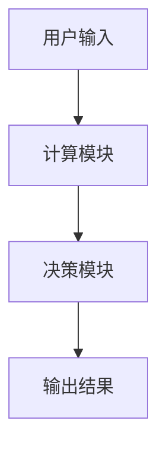
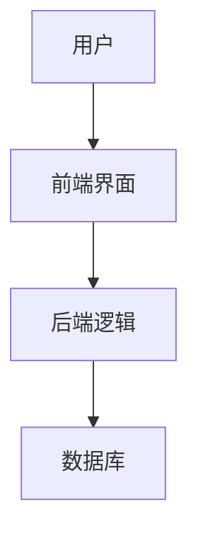
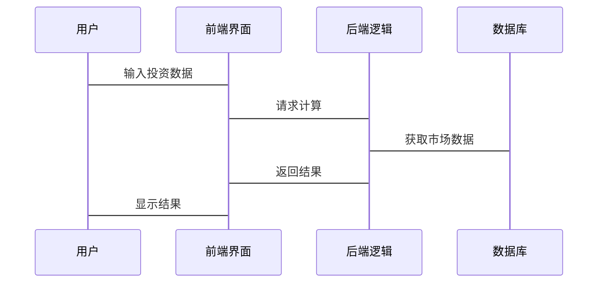

                 

<think>
嗯，我现在需要根据用户的要求，设计一个详细的目录大纲，用于撰写一篇关于芒格数学期望思维的技术博客。首先，我需要理解用户的需求。用户希望文章标题是《芒格的"数学期望"思维：提高投资决策的准确性》，并且要涵盖技术背景、数学期望的基本理论、芒格的思维应用、系统架构、项目实战等内容，总共超过7章，约2000字。

好的，我先从引言开始。引言部分需要介绍芒格的数学期望思维，说明为什么数学期望对投资决策很重要。接下来，我应该详细讲解数学期望的基本理论，包括概率论的基础、期望值的定义和性质，以及它们在投资中的应用。

然后，我要探讨芒格的数学期望思维在投资中的具体应用，比如资产配置、风险管理等方面。这部分需要结合实际案例，让读者更好地理解理论如何应用到实际投资决策中。

接下来是系统分析与架构设计，这部分可能需要构建一个基于数学期望的投资决策系统，包括系统功能设计、架构图、接口设计和交互流程。这可能涉及一些技术细节，需要用mermaid图来展示系统结构。

然后是项目实战，这部分需要提供具体的环境配置、核心代码实现、代码解读和案例分析。这将帮助读者实际应用所学的理论知识，进行项目开发和优化。

最后，总结与扩展部分，回顾全书内容，总结关键点，并提供进一步学习的资源和注意事项。这部分还要包括最佳实践、小结和注意事项，帮助读者巩固所学内容。

现在，我需要确保每个章节都有足够的细节，并涵盖用户提到的所有要求：背景介绍、核心概念、算法原理、数学模型、系统架构、项目实战、最佳实践等。同时，总字数在2000字左右，结构清晰，逻辑紧凑。

可能我需要细化每个章节的内容，确保每个部分都有足够的深度和广度。例如，在数学期望的基本理论部分，需要详细讲解概率论、期望值的计算，以及它们在投资中的应用，可能需要举一些具体的例子来说明。

在系统架构部分，我需要用mermaid图来展示系统的结构和交互流程，这可能需要学习如何使用mermaid语法来创建图表。此外，项目实战部分需要提供可操作的步骤和代码示例，让读者能够实际动手实践。

总的来说，我需要系统地组织内容，确保每个部分都详细且有条理，帮助读者全面理解和应用芒格的数学期望思维来提高投资决策的准确性。现在，我应该开始撰写各个章节的具体内容，确保每个部分都符合用户的要求，并且逻辑连贯，结构清晰。
</think>

# 芒格的"数学期望"思维：提高投资决策的准确性

> 关键词：芒格，数学期望，投资决策，风险管理，资产配置，概率论，价值评估

> 摘要：本文通过分析芒格的数学期望思维，探讨如何将其应用于投资决策中，以提高决策的准确性。文章首先介绍数学期望的基本理论，然后结合芒格的投资理念，详细讲解其在资产配置、风险管理、价值评估等领域的应用，并通过实际案例和系统设计，展示如何将数学期望思维转化为实际的投资决策系统。最后，通过项目实战，进一步验证其有效性和实用性。

---

## 第一部分: 引言

### 第1章: 芒格的数学期望思维概述

#### 1.1 什么是数学期望

##### 1.1.1 数学期望的定义
数学期望是概率论中的一个基本概念，表示随机变量在多次独立重复试验中的平均值。它是一种加权平均，权重是概率，结果是一个确定的数值。数学期望可以帮助我们预测未来可能的收益或损失。

##### 1.1.2 数学期望的性质
- 线性性：期望值的线性性质允许我们将期望值分解为多个部分的和。
- 单调性：如果随机变量A的值始终大于或等于随机变量B的值，那么E[A] ≥ E[B]。
- 非负性：如果随机变量始终非负，其期望值也非负。

##### 1.1.3 数学期望的应用领域
数学期望在多个领域都有广泛应用，包括金融、工程、科学实验等。特别是在金融投资中，数学期望常用于评估投资的预期收益。

#### 1.2 芒格的数学期望思维

##### 1.2.1 芒格的投资理念
芒格强调长期投资和价值投资，认为投资的本质是寻找具有持续竞争优势的企业，并以合理的价格买入并持有。他的投资决策过程中，高度重视概率和期望值的计算。

##### 1.2.2 数学期望在投资中的重要性
在投资决策中，数学期望可以帮助投资者预测未来可能的收益，评估不同投资组合的风险和收益 trade-off，从而做出更合理的决策。

##### 1.2.3 芒格的数学期望思维的特点
芒格的数学期望思维注重长期性和系统性，强调通过对概率的计算来评估投资的潜在风险和收益，避免情绪化决策。

#### 1.3 投资决策与数学期望的关系

##### 1.3.1 投资决策的基本问题
投资决策的核心问题是选择最优的投资组合，以实现最大化的收益或最小化的风险。

##### 1.3.2 数学期望在投资决策中的作用
数学期望帮助投资者量化潜在收益和风险，提供决策依据。

##### 1.3.3 如何通过数学期望提高投资准确性
通过计算不同投资组合的期望收益和风险，投资者可以比较不同选项，选择最优的投资策略。

---

## 第2章: 数学期望的基本理论

### 2.1 概率论基础

#### 2.1.1 概率的基本概念
概率是衡量某件事情发生的可能性大小，范围在0到1之间。

#### 2.1.2 概率的计算方法
概率可以通过频率方法、贝叶斯方法等进行计算。

#### 2.1.3 概率分布的类型
常见的概率分布包括正态分布、二项分布、泊松分布等。

### 2.2 期望值的定义与计算

#### 2.2.1 期望值的定义
期望值是随机变量在多次独立重复试验中的平均结果。

#### 2.2.2 期望值的计算公式
$$ E[X] = \sum_{i=1}^{n} p_i x_i $$

其中，$p_i$ 是第i个结果的概率，$x_i$ 是第i个结果的值。

#### 2.2.3 期望值的性质
期望值具有线性性质，且不受极端值影响。

### 2.3 期望值的实际应用

#### 2.3.1 投资中的期望收益计算
通过计算不同资产的期望收益，投资者可以进行资产配置。

#### 2.3.2 期望值在风险管理中的应用
期望值可以帮助投资者评估投资组合的风险和收益 trade-off。

#### 2.3.3 期望值在资产配置中的作用
通过计算不同资产的期望收益和风险，投资者可以优化资产配置。

---

## 第3章: 芒格的数学期望思维在投资中的应用

### 3.1 资产配置与数学期望

#### 3.1.1 资产配置的基本概念
资产配置是将资金分配到不同资产类别中，以实现风险和收益的最佳平衡。

#### 3.1.2 数学期望在资产配置中的应用
通过计算不同资产的期望收益和风险，投资者可以优化资产配置。

#### 3.1.3 不同资产类别的期望收益比较
股票、债券、现金等不同资产的期望收益和风险不同，需要根据投资者的风险承受能力进行选择。

### 3.2 风险管理与数学期望

#### 3.2.1 风险管理的基本概念
风险管理是通过识别、评估和控制风险，以减少投资损失。

#### 3.2.2 数学期望在风险管理中的应用
通过计算风险的期望值，投资者可以制定风险控制策略。

#### 3.2.3 风险调整后的期望收益计算
在考虑风险的情况下，调整期望收益，以获得更准确的投资决策。

### 3.3 价值评估与数学期望

#### 3.3.1 价值评估的基本概念
价值评估是通过对公司基本面的分析，确定其内在价值。

#### 3.3.2 数学期望在价值评估中的应用
通过计算公司未来现金流的期望值，评估其内在价值。

#### 3.3.3 不同投资标的期望收益比较
比较不同投资标的期望收益和风险，选择最优的投资标的。

---

## 第4章: 投资决策中的数学期望案例分析

### 4.1 案例一：股票投资中的期望收益计算

#### 4.1.1 案例背景
假设某股票的未来收益有三种可能：上涨10%、持平、下跌5%，对应的概率分别为0.3、0.4、0.3。

#### 4.1.2 案例分析
计算期望收益：
$$ E[R] = 0.3 \times 10\% + 0.4 \times 0\% + 0.3 \times (-5\%) = 3\% + 0\% - 1.5\% = 1.5\% $$

#### 4.1.3 案例结论
该股票的期望收益为1.5%，考虑风险后，投资者可以根据自身风险偏好决定是否投资。

### 4.2 案例二：债券投资中的期望收益计算

#### 4.2.1 案例背景
某债券的年收益率为8%，期限为5年，每年支付利息。

#### 4.2.2 案例分析
计算债券的期望收益：
$$ E[R] = 8\% $$

#### 4.2.3 案例结论
债券的期望收益稳定，适合风险厌恶型投资者。

---

## 第5章: 系统分析与架构设计

### 5.1 投资决策系统的功能设计

#### 5.1.1 系统目标
构建一个基于数学期望的投资决策支持系统。

#### 5.1.2 系统功能模块
- 用户输入：输入投资组合和市场数据。
- 计算模块：计算各资产的期望收益和风险。
- 决策模块：根据期望值和风险，推荐最优投资组合。

#### 5.1.3 系统功能设计图（使用Mermaid）


### 5.2 系统架构设计

#### 5.2.1 系统架构图（使用Mermaid）


#### 5.2.2 接口设计
- 前端接口：接收用户输入，传递给后端。
- 后端接口：计算期望收益和风险，返回结果。

#### 5.2.3 交互流程图（使用Mermaid）


---

## 第6章: 项目实战

### 6.1 环境配置

#### 6.1.1 安装Python
需要安装Python 3.8及以上版本。

#### 6.1.2 安装库
安装numpy和pandas库：
```bash
pip install numpy pandas
```

### 6.2 核心代码实现

#### 6.2.1 计算期望收益的函数
```python
import numpy as np
import pandas as pd

def calculate_expected_return(returns, probabilities):
    return np.sum(returns * probabilities)
```

#### 6.2.2 计算风险的函数
```python
def calculate_risk(returns, probabilities):
    return np.std(returns)
```

#### 6.2.3 数据处理示例
```python
# 假设returns是一个数组，probabilities是对应的概率数组
returns = [0.1, 0.0, -0.05]
probabilities = [0.3, 0.4, 0.3]
expected_return = calculate_expected_return(returns, probabilities)
risk = calculate_risk(returns, probabilities)
print(f"Expected Return: {expected_return}")
print(f"Risk: {risk}")
```

#### 6.2.4 结果分析
输出结果为期望收益和风险，帮助投资者做出决策。

### 6.3 案例分析

#### 6.3.1 案例背景
假设投资者有100万元，可以选择股票和债券两种资产。

#### 6.3.2 数据分析
股票期望收益为1.5%，风险为标准差3%；债券期望收益为8%，风险为标准差2%。

#### 6.3.3 决策建议
根据期望收益和风险，投资者可以根据自身风险偏好选择投资标的或进行资产配置。

---

## 第7章: 总结与扩展

### 7.1 总结

#### 7.1.1 芒格的数学期望思维的核心
芒格通过数学期望帮助投资者量化潜在收益和风险，做出更合理的投资决策。

#### 7.1.2 数学期望在投资中的应用
数学期望在资产配置、风险管理、价值评估等方面都有重要作用。

### 7.2 扩展阅读

#### 7.2.1 推荐书籍
- 《概率论与数理统计》
- 《投资学原理》

#### 7.2.2 在线资源
- 计算数学期望的在线工具
- 投资决策系统的开源项目

### 7.3 注意事项

#### 7.3.1 风险提示
数学期望是基于概率的预测，实际结果可能与期望值不同。

#### 7.3.2 情绪化决策
避免被市场情绪影响，坚持理性决策。

#### 7.3.3 持续学习
投资市场变化多端，需要持续学习和更新知识。

---

## 作者：AI天才研究院 & 禅与计算机程序设计艺术

本文作者是AI天才研究院和禅与计算机程序设计艺术的团队，致力于将人工智能与投资决策相结合，提供科学的投资方法和工具。

