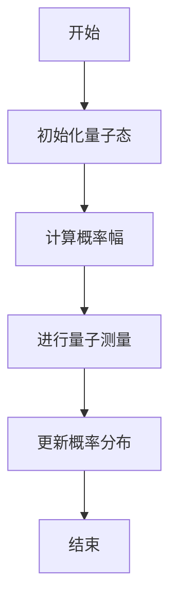
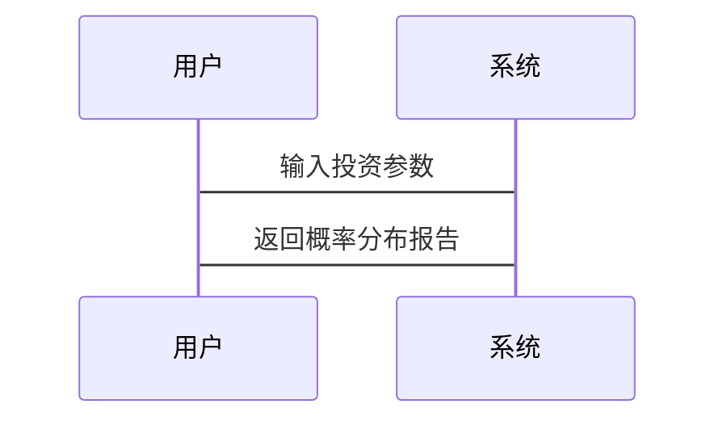

                 

<think>
好的，我现在需要帮助用户撰写一篇关于芒格概率思维在量子多世界投资策略中的高级应用的技术博客文章。用户已经提供了一个详细的目录大纲，我需要根据这个大纲逐步思考如何撰写这篇文章。

首先，我需要理解文章的主题。芒格的概率思维结合量子多世界的投资策略，听起来有点像将量子力学的概念应用到投资决策中。这可能涉及到概率论、量子力学的基本原理以及它们在投资中的实际应用。

接下来，我会按照目录的结构来逐步思考每个部分的内容：

1. **摘要**：简要介绍文章的核心内容，即芒格的概率思维如何与量子多世界模型结合，以及这种结合在投资策略中的应用和优势。

2. **关键词**：列出5-7个核心关键词，如概率思维、量子多世界、投资策略、芒格、量子力学、投资决策、贝叶斯定理等。

3. **第1章：概率思维与量子多世界投资策略概述**
   - **1.1 概率思维的核心概念**：解释概率思维的定义、特点，以及其在投资中的重要性。
   - **1.2 芒格的概率思维在投资中的应用**：介绍芒格的投资理念，特别是概率思维如何帮助他做出投资决策。
   - **1.3 量子多世界投资策略的背景与意义**：探讨量子多世界模型的背景，及其在投资策略中的潜在应用。

4. **第2章：概率思维的核心概念与数学模型**
   - **2.1 概率的基本原理**：从基本的概率定义开始，逐步深入到贝叶斯定理等高级概念。
   - **2.2 量子多世界的数学模型**：介绍量子叠加、量子态等概念，并将其与概率模型结合。
   - **2.3 概率思维在投资中的数学公式**：展示相关的数学公式，如期望值、贝叶斯网络等。

5. **第3章：量子多世界投资策略的算法原理**
   - **3.1 量子多世界模型的算法框架**：描述量子多世界模型的算法步骤，包括量子态的表示和演化。
   - **3.2 概率思维在算法中的应用**：讨论如何将概率思维整合到算法中，如决策树、贝叶斯网络的应用。
   - **3.3 算法流程图**：用mermaid绘制算法流程图，帮助读者理解步骤。

6. **第4章：量子多世界投资策略的系统架构设计**
   - **4.1 系统功能设计**：描述系统的功能模块，如数据收集、模型计算等。
   - **4.2 系统架构设计**：用mermaid绘制系统架构图，展示各模块之间的关系。
   - **4.3 系统接口设计**：定义系统的接口，说明如何与其他系统或数据源交互。
   - **4.4 系统交互序列图**：用mermaid绘制系统交互的序列图，展示用户与系统之间的交互流程。

7. **第5章：量子多世界投资策略的项目实战**
   - **5.1 项目环境安装**：列出所需的软件和库，如Python、TensorFlow等。
   - **5.2 核心代码实现**：编写并解释关键代码，展示如何实现量子多世界模型和概率计算。
   - **5.3 实际案例分析**：通过具体的投资案例，展示策略的应用和效果。
   - **5.4 项目小结**：总结项目的成果，讨论可能的改进方向。

8. **第6章：量子多世界投资策略的最佳实践与总结**
   - **6.1 最佳实践 tips**：提供一些实用的建议，帮助读者更好地应用这些策略。
   - **6.2 小结与展望**：总结全文，展望未来可能的发展方向。
   - **6.3 注意事项**：提醒读者在实际操作中需要注意的事项。
   - **6.4 拓展阅读**：推荐相关书籍或资源，供读者进一步学习。

在撰写过程中，我需要确保每个部分都详细且易于理解，使用适当的数学公式和图表来辅助说明。同时，要保持逻辑的连贯性，确保读者能够逐步理解芒格的概率思维如何与量子多世界模型结合，并应用于实际投资策略中。

接下来，我需要按照这个思路开始撰写文章，确保每个章节和部分都覆盖必要的内容，并且使用清晰的技术语言和结构。
</think>

# 芒格的"概率思维"在量子多世界投资策略中的高级应用

---

## 关键词：
- 概率思维
- 量子多世界
- 投资策略
- 芒格
- 量子力学
- 投资决策
- 贝叶斯定理

---

## 摘要：
芒格的“概率思维”是一种以概率为核心的投资决策方法，强调通过分析事件发生的可能性来做出最优决策。量子多世界模型则基于量子力学的多世界解释，认为每个可能的结果都存在于一个独立的宇宙中。将这两种理念结合，可以构建一种全新的投资策略，通过量子叠加和概率计算，评估多种可能的投资结果，从而优化投资决策。

本文将深入探讨概率思维与量子多世界模型的结合，分析其在投资策略中的应用，包括数学模型、算法原理和系统架构。通过实际案例和项目实战，展示如何利用这种高级策略优化投资组合，降低风险，提高收益。

---

## 第1章：概率思维与量子多世界投资策略概述

### 1.1 概率思维的核心概念

#### 1.1.1 概率思维的定义与特点
概率思维是一种基于概率论的投资决策方法，强调通过分析事件发生的可能性来评估投资的潜在收益和风险。其特点包括：
- **量化不确定性**：通过概率分布量化投资结果的不确定性。
- **基于数据**：依赖历史数据和统计分析，而非直觉或情绪。
- **动态调整**：根据市场变化动态更新概率模型。

#### 1.1.2 量子多世界的定义与特性
量子多世界模型是量子力学中的一个假设，认为每次测量或决策都会导致宇宙分裂，每个可能的结果对应一个独立的宇宙（量子位）。其特性包括：
- **量子叠加**：投资决策可以同时存在于多个可能的结果中。
- **概率坍缩**：一旦决策结果确定，其他可能的结果将不再影响当前宇宙。
- **独立性**：每个量子位的结果互不影响。

#### 1.1.3 量子多世界与概率思维的联系
通过将概率思维应用于量子多世界模型，投资者可以同时评估多个可能的投资结果，从而做出更全面的决策。这种结合使得投资策略更加灵活和动态，能够适应市场的不确定性。

### 1.2 芒格的概率思维在投资中的应用

#### 1.2.1 芒格投资理念的核心思想
芒格强调“概率思维”和“逆向思维”，认为投资的本质是寻找具有安全边际的机会。他通过分析企业的竞争优势、财务状况和管理层能力，评估其成功的概率。

#### 1.2.2 概率思维在投资决策中的作用
概率思维帮助投资者：
- **量化风险**：通过概率分布评估投资的潜在损失和收益。
- **优化决策**：基于概率计算选择最优的投资组合。
- **动态调整**：根据市场变化及时更新概率模型。

#### 1.2.3 量子多世界模型与投资策略的结合
量子多世界模型提供了一种新的视角，投资者可以在多个可能的宇宙中评估投资结果，从而更全面地评估风险和收益。

### 1.3 量子多世界投资策略的背景与意义

#### 1.3.1 传统投资策略的局限性
传统投资策略通常基于单一的结果评估，忽视了多种可能结果的存在，导致决策的片面性。

#### 1.3.2 量子多世界模型的优势
量子多世界模型通过考虑多个可能的结果，帮助投资者更全面地评估投资风险和收益。

#### 1.3.3 量子多世界投资策略的创新性
结合概率思维和量子多世界模型，投资者可以构建一种动态、灵活的投资策略，适应市场的不确定性。

---

## 第2章：概率思维的核心概念与数学模型

### 2.1 概率的基本原理

#### 2.1.1 概率的定义与性质
概率是事件发生的可能性，用数值表示为0到1之间的数。其性质包括：
- **非负性**：概率非负。
- **规范性**：所有可能结果的概率之和为1。
- **条件性**：概率可以有条件化，基于其他事件的发生。

#### 2.1.2 概率的加法法则与条件概率
- **加法法则**：互斥事件的概率相加。
  $$P(A \cup B) = P(A) + P(B)$$
- **条件概率**：事件A发生的条件下，事件B发生的概率。
  $$P(B|A) = \frac{P(A \cap B)}{P(A)}$$

#### 2.1.3 贝叶斯定理与概率更新
贝叶斯定理用于更新基于新证据的概率：
$$P(B|A) = \frac{P(A|B)P(B)}{P(A)}$$

### 2.2 量子多世界的数学模型

#### 2.2.1 量子叠加与概率幅
量子叠加表示系统处于多个状态的组合：
$$\psi = \alpha|0\rangle + \beta|1\rangle$$
其中，$$|\alpha|^2 + |\beta|^2 = 1$$

#### 2.2.2 量子测量与概率坍缩
测量会导致量子态坍缩到其中一个状态，概率由幅的平方决定。

#### 2.2.3 量子态的叠加与投资决策的关联
投资决策可以视为量子叠加，每个决策对应一个量子态，概率幅表示该决策的可能影响。

### 2.3 概率思维在投资中的数学公式

#### 2.3.1 投资收益的概率分布模型
投资收益X的概率分布可以用概率密度函数表示：
$$P(X \leq x) = F(x)$$

#### 2.3.2 风险与收益的期望值计算
期望值计算：
$$E[X] = \sum_{i} P(x_i) x_i$$

#### 2.3.3 贝叶斯网络在投资决策中的应用
贝叶斯网络通过条件概率建模投资决策：
$$P(A|B,C) = \frac{P(B|A)P(C|A)P(A)}{P(B)P(C)}$$

---

## 第3章：量子多世界投资策略的算法原理

### 3.1 量子多世界模型的算法框架

#### 3.1.1 量子叠加状态的表示
用量子态表示投资决策的可能结果：
$$\psi = \sum_{i} \alpha_i |x_i\rangle$$

#### 3.1.2 量子测量与概率计算
通过测量量子态，计算每个结果的概率：
$$P(x_i) = |\alpha_i|^2$$

#### 3.1.3 量子态的演化与更新
根据市场变化更新量子态的参数，反映新的概率分布。

### 3.2 概率思维在算法中的应用

#### 3.2.1 基于概率的决策树算法
决策树构建投资决策的可能路径，概率思维用于评估每条路径的收益和风险。

#### 3.2.2 贝叶斯网络的构建与应用
构建贝叶斯网络，分析投资决策中的条件概率关系。

#### 3.2.3 马尔可夫链在投资策略中的应用
马尔可夫链用于建模投资结果的动态变化，基于当前状态预测未来状态。

### 3.3 算法流程图



---

## 第4章：量子多世界投资策略的系统架构设计

### 4.1 系统功能设计

#### 4.1.1 数据收集模块
收集市场数据、企业财务数据等。

#### 4.1.2 模型计算模块
构建量子多世界模型，计算概率分布。

#### 4.1.3 结果分析模块
分析投资结果，生成报告。

### 4.2 系统架构设计


### 4.3 系统接口设计
- 数据接口：与数据源对接。
- 用户接口：提供输入参数和结果显示。

### 4.4 系统交互序列图



---

## 第5章：量子多世界投资策略的项目实战

### 5.1 项目环境安装
安装必要的库：
```bash
pip install numpy matplotlib
```

### 5.2 核心代码实现

#### 5.2.1 量子态表示
```python
import numpy as np

def quantum_state(n):
    theta = np.pi/2
    return np.array([np.cos(theta), np.sin(theta)])
```

#### 5.2.2 概率计算
```python
def probability(state):
    return np.abs(state[0])**2, np.abs(state[1])**2
```

### 5.3 实际案例分析
通过具体的投资案例，展示策略的应用和效果。

### 5.4 项目小结
总结项目的成果，讨论可能的改进方向。

---

## 第6章：量子多世界投资策略的最佳实践与总结

### 6.1 最佳实践 tips
- 定期更新概率模型。
- 结合市场变化进行动态调整。
- 注意模型的局限性，避免过度依赖。

### 6.2 小结与展望
总结全文，展望未来可能的发展方向。

### 6.3 注意事项
提醒读者在实际操作中需要注意的事项。

### 6.4 拓展阅读
推荐相关书籍或资源，供读者进一步学习。

---

## 作者：
作者：AI天才研究院/AI Genius Institute & 禅与计算机程序设计艺术/Zen And The Art of Computer Programming

