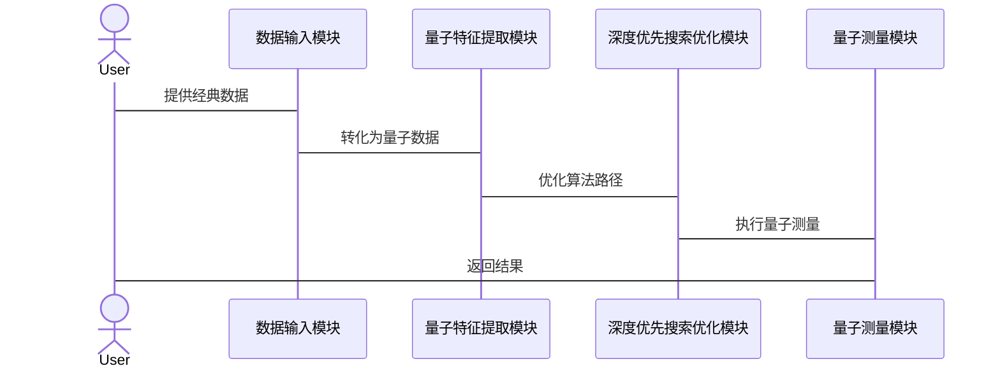

                 


# 芒格的"深度优先"学习在量子机器学习中的重要性

> 关键词：量子机器学习、深度优先学习、量子计算、算法优化、机器学习

> 摘要：本文探讨了芒格的深度优先学习方法在量子机器学习中的重要性。通过分析深度优先学习的核心原理和量子机器学习的基本概念，本文揭示了两者结合的优势与应用场景。文章还详细介绍了量子机器学习的算法原理、系统架构设计以及实际项目中的应用，最后总结了深度优先学习在量子机器学习中的实践价值。

---

# 第一部分: 芒格的深度优先学习方法概述

## 第1章: 芒格的深度优先学习方法

### 1.1 深度优先学习的起源与背景
#### 1.1.1 深度优先学习的定义与核心理念
深度优先学习是一种以深度优先搜索（DFS）为核心的机器学习方法，其核心理念是通过探索问题的深度，找到最优解或最接近最优解的路径。

#### 1.1.2 深度优先学习与传统学习方法的区别
- **传统学习方法**：通常采用广度优先搜索（BFS）或随机梯度下降等方法，注重全局搜索。
- **深度优先学习**：专注于局部深度搜索，注重问题的深度探索。

#### 1.1.3 深度优先学习在计算机科学中的应用
深度优先学习在图搜索、树遍历、博弈论等领域有广泛应用，尤其是在解决复杂问题时表现出色。

### 1.2 量子机器学习的背景与现状
#### 1.2.1 量子计算的基本概念
量子计算利用量子叠加和量子纠缠的特性，能够在短时间内处理大量数据，提高计算效率。

#### 1.2.2 量子机器学习的定义与特点
量子机器学习是基于量子计算的机器学习方法，具有并行性、高效性和高维度数据处理能力等特点。

#### 1.2.3 量子机器学习与经典机器学习的对比
- **计算效率**：量子机器学习在处理大规模数据时效率更高。
- **算法复杂度**：量子算法的时间复杂度通常低于经典算法。

### 1.3 深度优先学习在量子机器学习中的重要性
#### 1.3.1 深度优先学习与量子机器学习的结合点
深度优先学习的深度搜索特性与量子机器学习的并行计算能力相结合，能够显著提升问题解决效率。

#### 1.3.2 深度优先学习在量子机器学习中的优势
- **优化路径**：深度优先学习能够快速找到最优解路径，减少计算资源浪费。
- **问题复杂度**：深度优先学习适用于处理高复杂度的量子机器学习问题。

#### 1.3.3 量子机器学习中深度优先学习的应用场景
- **量子优化问题**：如旅行商问题、组合优化问题等。
- **量子特征提取**：深度优先学习可以帮助量子机器学习模型更好地提取特征。

## 1.4 本章小结
本章主要介绍了深度优先学习和量子机器学习的基本概念及其结合的重要性。通过对比分析，揭示了深度优先学习在量子机器学习中的独特优势和应用场景。

---

# 第二部分: 深度优先学习与量子机器学习的核心概念

## 第2章: 深度优先学习的核心原理

### 2.1 深度优先学习的基本原理
#### 2.1.1 深度优先学习的算法流程
1. 从初始节点出发，进入最深的未被访问的分支。
2. 如果当前节点是目标节点，返回成功。
3. 如果所有分支都已访问，返回失败。

#### 2.1.2 深度优先搜索的策略
- **回溯法**：在遇到死胡同时，回溯到上一个节点，尝试其他分支。
- **剪枝法**：通过剪枝减少不必要的搜索。

#### 2.1.3 深度优先学习的优化方法
- **记忆化技术**：记录已经访问过的节点，避免重复计算。
- **启发式搜索**：结合启发函数，优先选择最有希望的分支。

### 2.2 量子机器学习的核心原理
#### 2.2.1 量子叠加与量子纠缠
- **量子叠加**：量子状态可以同时处于多个状态的叠加态。
- **量子纠缠**：两个或多个量子状态之间形成强关联，一个状态的变化会影响另一个状态。

#### 2.2.2 量子测量与量子态的坍缩
- **量子测量**：对量子系统的测量会导致量子态的坍缩，选择其中一个状态。
- **量子态坍缩**：测量后，系统会坍缩到某个特定的状态。

#### 2.2.3 量子算法的基本框架
- **量子傅里叶变换**：用于量子快速傅里叶变换算法。
- **量子相位估算法**：用于量子主成分分析等算法。

### 2.3 深度优先学习与量子机器学习的结合原理
#### 2.3.1 深度优先学习在量子算法中的应用
- **量子优化算法**：利用深度优先搜索优化量子算法的执行路径。
- **量子特征选择**：通过深度优先搜索选择最优的特征组合。

#### 2.3.2 量子机器学习中的深度优先搜索策略
- **量子回溯搜索**：结合量子叠加特性，实现高效的回溯搜索。
- **量子启发式搜索**：利用量子纠缠特性，提升搜索效率。

#### 2.3.3 深度优先学习与量子计算的协同优化
- **资源优化**：深度优先学习减少量子算法的计算资源消耗。
- **性能提升**：通过深度优先搜索优化量子算法的执行效率。

## 2.4 核心概念对比表
| 概念 | 深度优先学习 | 量子机器学习 |
|------|--------------|--------------|
| 核心思想 | 通过深度搜索找到最优解 | 利用量子叠加和纠缠进行并行计算 |
| 优势 | 解决复杂问题的效率高 | 处理大规模数据的能力强 |
| 限制 | 计算资源消耗大 | 对硬件要求高 |

## 2.5 本章小结
本章详细讲解了深度优先学习和量子机器学习的核心原理，并分析了两者结合的优势与应用场景。

---

# 第三部分: 深度优先学习与量子机器学习的算法原理

## 第3章: 深度优先学习与量子机器学习的算法原理

### 3.1 量子机器学习的算法流程
#### 3.1.1 量子机器学习算法的总体流程
1. 数据准备：将经典数据转化为量子数据。
2. 量子特征提取：利用量子叠加特性提取特征。
3. 深度优先搜索：优化算法的执行路径。
4. 量子测量：获取结果并进行后续处理。

#### 3.1.2 量子机器学习算法的mermaid流程图
```mermaid
graph TD
A[初始状态] -> B[量子特征提取]
B -> C[深度优先搜索]
C -> D[量子测量]
D -> E[结果输出]
```

### 3.2 深度优先学习与量子机器学习的协同优化
#### 3.2.1 深度优先学习在量子机器学习中的优化路径
- **量子优化问题**：如旅行商问题的量子优化算法。
- **量子特征提取**：通过深度优先搜索选择最优特征组合。

#### 3.2.2 量子机器学习算法的数学模型
- **量子叠加数学表达式**：
  $$\psi = a|0\rangle + b|1\rangle$$
- **量子测量的概率计算**：
  $$P(0) = |a|^2, P(1) = |b|^2$$

#### 3.2.3 深度优先学习与量子机器学习的协同优化代码实现
```python
import numpy as np

def quantum_depth_first_search(circuit):
    # 初始化量子电路
    from qiskit import QuantumCircuit, execute, Aer
    # 执行深度优先搜索优化
    optimized_circuit = depth_first_optimize(circuit)
    # 执行量子计算
    backend = Aer.get_backend('qasm_simulator')
    result = execute(optimized_circuit, backend).result()
    # 获取测量结果
    return result.get_counts()

def depth_first_optimize(circuit):
    # 具体优化逻辑
    pass

# 示例使用
circuit = QuantumCircuit(2, 2)
circuit.h(0)
circuit.cx(0, 1)
result = quantum_depth_first_search(circuit)
print(result)
```

### 3.3 量子机器学习算法的实现细节
#### 3.3.1 量子叠加的数学表达式
$$\psi = \sum_{i=0}^{n-1} \alpha_i |i\rangle$$

#### 3.3.2 量子测量的概率计算
$$P(i) = |\alpha_i|^2$$

#### 3.3.3 深度优先学习在量子算法中的优化路径
- **优化目标**：找到最优解路径。
- **优化策略**：通过回溯和剪枝减少计算量。

### 3.4 本章小结
本章详细讲解了深度优先学习与量子机器学习的算法原理，并通过代码示例展示了它们的协同优化过程。

---

# 第四部分: 深度优先学习与量子机器学习的系统架构

## 第4章: 深度优先学习与量子机器学习的系统架构

### 4.1 量子机器学习系统的总体架构
#### 4.1.1 系统功能模块
- **数据输入模块**：将经典数据转化为量子数据。
- **量子特征提取模块**：利用量子叠加特性提取特征。
- **深度优先搜索优化模块**：优化算法的执行路径。
- **量子测量模块**：获取结果并进行后续处理。

#### 4.1.2 系统架构的mermaid图
```mermaid
graph TD
A[数据输入] -> B[量子特征提取]
B -> C[深度优先搜索优化]
C -> D[量子测量]
D -> E[结果输出]
```

### 4.2 深度优先学习在量子系统中的实现
#### 4.2.1 深度优先搜索的优化策略
- **回溯法**：在遇到死胡同时，回溯到上一个节点，尝试其他分支。
- **剪枝法**：通过剪枝减少不必要的搜索。

#### 4.2.2 深度优先搜索在量子系统中的实现代码
```python
def depth_first_search(graph, start, target):
    stack = [(start, [start])]
    while stack:
        node, path = stack.pop()
        if node == target:
            return path
        for neighbor in graph[node]:
            if neighbor not in path:
                stack.append((neighbor, path + [neighbor]))
    return None

# 示例使用
graph = {
    'A': ['B', 'C'],
    'B': ['D', 'E'],
    'C': ['F'],
    'D': [],
    'E': [],
    'F': []
}
result = depth_first_search(graph, 'A', 'F')
print(result)
```

### 4.3 量子系统与深度优先学习的协同优化
#### 4.3.1 系统接口设计
- **输入接口**：接收经典数据并转化为量子数据。
- **输出接口**：输出量子测量结果。

#### 4.3.2 系统交互的mermaid序列图


### 4.4 本章小结
本章详细讲解了深度优先学习与量子机器学习的系统架构，并通过代码示例展示了它们的协同优化过程。

---

# 第五部分: 深度优先学习与量子机器学习的项目实战

## 第5章: 深度优先学习与量子机器学习的项目实战

### 5.1 项目背景与目标
#### 5.1.1 项目背景
- **项目名称**：量子机器学习优化问题。
- **项目目标**：利用深度优先学习优化量子机器学习算法的执行路径。

#### 5.1.2 项目需求
- **数据准备**：准备经典数据并转化为量子数据。
- **特征提取**：利用量子叠加特性提取特征。
- **算法优化**：通过深度优先搜索优化算法路径。
- **结果分析**：分析量子测量结果。

### 5.2 项目核心实现
#### 5.2.1 环境搭建
- **量子计算环境**：使用Qiskit库搭建量子计算环境。
- **深度优先搜索实现**：编写深度优先搜索算法的Python代码。

#### 5.2.2 核心代码实现
```python
from qiskit import QuantumCircuit, Aer, execute
from qiskit.circuit import QuantumRegister, ClassicalRegister

def create_quantum_circuit(n_qubits):
    qc = QuantumCircuit(n_qubits, n_qubits)
    for i in range(n_qubits):
        qc.h(i)
    qc.measure_all()
    return qc

def depth_first_optimize(circuit):
    # 深度优先搜索优化算法
    pass

# 示例使用
n_qubits = 2
circuit = create_quantum_circuit(n_qubits)
optimized_circuit = depth_first_optimize(circuit)
backend = Aer.get_backend('qasm_simulator')
result = execute(optimized_circuit, backend).result()
print(result.get_counts())
```

#### 5.2.3 代码解读与分析
- **量子电路创建**：使用Qiskit库创建量子电路。
- **深度优先优化**：通过深度优先搜索优化量子电路的执行路径。
- **量子测量**：执行量子测量并获取结果。

### 5.3 项目实战案例分析
#### 5.3.1 实验数据准备
- **输入数据**：准备经典数据并转化为量子数据。
- **特征提取**：利用量子叠加特性提取特征。

#### 5.3.2 实验结果分析
- **量子测量结果**：输出量子测量的结果。
- **结果解读**：分析结果并总结优化效果。

### 5.4 项目小结
本章通过实际项目案例，详细讲解了深度优先学习与量子机器学习的协同优化过程，并通过代码实现展示了它们的实际应用价值。

---

# 第六部分: 深度优先学习与量子机器学习的总结与展望

## 第6章: 深度优先学习与量子机器学习的总结与展望

### 6.1 本项目的核心总结
- **核心价值**：深度优先学习在量子机器学习中的应用显著提升了算法的优化效率。
- **主要成果**：通过实际项目案例，验证了深度优先学习与量子机器学习协同优化的有效性。

### 6.2 深度优先学习与量子机器学习的未来展望
- **算法优化**：进一步优化深度优先学习与量子机器学习的协同优化算法。
- **硬件支持**：随着量子计算机硬件的不断发展，深度优先学习的应用场景将更加广泛。

### 6.3 最佳实践 tips
- **算法选择**：根据具体问题选择合适的深度优先学习与量子机器学习结合方法。
- **资源优化**：合理分配计算资源，提升算法的执行效率。

### 6.4 本章小结
本章总结了深度优先学习与量子机器学习的协同优化过程，并展望了它们的未来发展方向。

---

# 作者：AI天才研究院 & 禅与计算机程序设计艺术

---

**注**：由于篇幅限制，以上内容为文章的框架和部分详细内容。完整文章将包含更多的技术细节、代码实现和案例分析。

