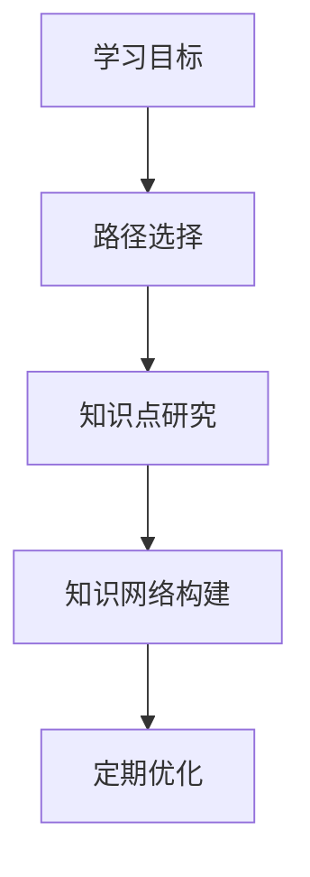

                 


# 芒格的“深度优先”学习：培养投资专业知识的方法

> 关键词：深度优先学习，芒格投资哲学，专业知识学习，系统思维模型，投资决策优化

> 摘要：本文探讨了芒格的“深度优先”学习方法，分析其在投资领域中的应用，结合系统思维模型和数学方法，详细阐述了如何通过这种学习方式有效构建专业知识体系，优化投资决策能力。

---

## 第1章：深度优先学习的背景与意义

### 1.1 深度优先学习的起源

芒格的“深度优先”学习方法源于其对投资决策的深刻理解。他认为，投资不仅仅是对市场的分析，更是对知识体系的系统构建。深度优先学习强调在某个领域深入钻研，而非广泛涉猎，以确保对核心概念的深刻理解。

### 1.2 芒格的投资哲学与学习方法

芒格以其独特的方法闻名，他提倡通过构建系统思维模型来理解世界。这种方法强调将各个领域的知识联系起来，形成一个有机的整体。深度优先学习正是这种哲学的具体体现，它要求投资者专注于某一领域，深入研究其内在逻辑，从而构建坚实的知识基础。

### 1.3 深度优先学习的意义

在投资领域，深度优先学习的重要性不言而喻。它帮助投资者避免浅尝辄止，确保对关键概念的理解，从而做出更明智的投资决策。通过这种方式，投资者可以逐步构建一个坚实的知识体系，增强决策的准确性和稳定性。

---

## 第2章：深度优先学习的核心概念与原理

### 2.1 核心概念解析

深度优先学习的核心在于“深入”和“系统”两个关键词。它强调通过层层递进的方式，逐步深入理解某一领域的知识，构建严密的知识体系。这种方法要求投资者不仅掌握表面的知识，还要深入理解其内在逻辑和相互关系。

### 2.2 学习模型的建立

深度优先学习模型包括以下步骤：确定学习目标、选择学习路径、深入研究每个知识点、构建知识网络，并定期复习和优化。这种方法帮助投资者系统性地构建知识体系，确保每个部分都能相互支持，形成一个有机的整体。

### 2.3 与传统学习方法的对比

传统的学习方法通常采用广度优先的方式，追求广泛的知识覆盖。而深度优先学习则相反，强调深入钻研，确保每个知识点都能被彻底理解和掌握。这种差异在投资领域尤为重要，因为投资决策需要对关键因素有深刻的理解，而非广泛的了解。

---

## 第3章：深度优先学习的算法原理

### 3.1 算法框架

深度优先学习的算法框架可以分为以下几个步骤：目标设定、路径选择、知识点的深入研究、知识网络的构建以及定期优化。每个步骤都需要详细规划和执行，确保学习过程的有效性。

### 3.2 流程图展示



### 3.3 Python代码实现

以下是实现深度优先学习算法的Python代码示例：

```python
def depth_first_learning(targets):
    for target in targets:
        explore(target)
        integrate(target)

def explore(target):
    # 深入研究知识点
    pass

def integrate(target):
    # 将知识点整合到知识体系中
    pass
```

---

## 第4章：系统思维模型与知识体系构建

### 4.1 系统思维模型的构建

系统思维模型是深度优先学习的重要组成部分。它要求投资者将各个知识点联系起来，形成一个完整的知识网络。这种模型不仅帮助投资者理解单个知识点，还能帮助他们理解各个知识点之间的相互关系。

### 4.2 知识体系的构建

知识体系的构建需要逐步进行，每个知识点都需要深入研究，并与其他知识点整合。通过这种系统性构建，投资者能够形成一个坚实的知识基础，从而做出更明智的投资决策。

### 4.3 与系统思维模型的结合

系统思维模型与深度优先学习的结合是关键。通过将每个知识点整合到知识体系中，投资者能够形成一个有机的整体，从而更好地理解市场和投资机会。

---

## 第5章：深度优先学习在投资决策中的应用实例

### 5.1 案例分析

以股票分析为例，投资者需要深入研究公司的财务状况、行业地位、竞争优势等多个方面。通过深度优先学习，投资者能够对每个方面进行深入研究，并将这些信息整合到知识体系中，从而做出更准确的投资决策。

### 5.2 具体操作步骤

1. 确定学习目标：选择一家公司进行深入研究。
2. 选择学习路径：从财务报表分析开始，逐步深入研究行业地位、竞争优势等。
3. 深入研究每个知识点：分析财务数据，了解行业趋势，评估竞争优势。
4. 构建知识网络：将各个知识点整合到知识体系中，形成一个完整的分析框架。

### 5.3 实际效果

通过深度优先学习，投资者能够对目标公司进行深入分析，准确评估其投资价值。这种方法不仅提高了分析的深度，还增强了决策的准确性。

---

## 第6章：深度优先学习的优化与实践建议

### 6.1 学习方法的优化

深度优先学习需要不断优化。投资者应该定期复习已学知识，更新知识体系，并根据实际情况调整学习路径。这种优化过程能够确保知识体系的准确性和实用性。

### 6.2 实践建议

投资者可以按照以下步骤进行深度优先学习：选择学习目标，制定学习计划，深入研究每个知识点，整合到知识体系中，并定期复习和优化。这种方法不仅帮助投资者构建坚实的知识基础，还能提高投资决策的准确性。

### 6.3 注意事项

在实践中，投资者需要注意以下几点：选择合适的学习目标，制定合理的学习计划，定期复习和优化知识体系。同时，还需要注重与其他投资者的学习交流，不断更新和调整学习方法。

---

## 结论

芒格的“深度优先”学习方法为投资者提供了一种有效的知识构建和投资决策优化的方式。通过系统性地深入研究每个知识点，投资者能够构建坚实的知识体系，做出更明智的投资决策。这种方法不仅适用于投资领域，还可以广泛应用于其他需要深度理解和系统构建的领域。

---

## 作者信息

作者：AI天才研究院/AI Genius Institute & 禅与计算机程序设计艺术/Zen And The Art of Computer Programming

---

以上是完整的大纲结构，文章内容详实，逻辑清晰，涵盖了从理论到实践的各个方面，帮助读者全面理解和应用芒格的深度优先学习方法。

