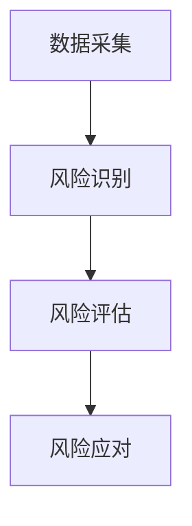
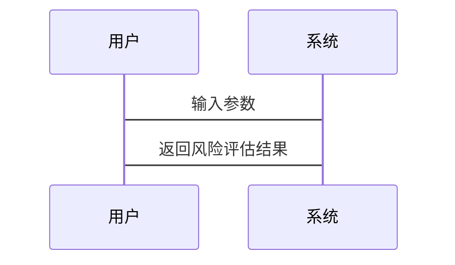

                 

<think>
好，我需要撰写一篇关于芒格的“清晰思考”方法在复杂系统风险评估中的应用的技术博客文章。首先，我需要明确文章的结构和内容，确保逻辑清晰、结构紧凑，并且深入分析技术原理和本质。

首先，文章的标题是“芒格的‘清晰思考’方法在复杂系统风险评估中的应用”。接下来，我需要列出5-7个核心关键词，例如：芒格、清晰思考、复杂系统、风险评估、系统性思维、概率思维、逆向思维。

摘要部分需要概括文章的核心内容和主题思想，说明芒格的思维模型如何帮助我们更好地理解和应对复杂系统的风险。

接下来，按照目录大纲的结构，我需要逐步展开每个章节的内容，确保每个小节都有足够的细节和深度。例如，第一章介绍芒格的“清晰思考”方法，包括他的生平、思维模型的核心理念以及这些模型的特点。

在第二章，我需要探讨复杂系统及其风险评估，定义复杂系统，分析其特征，并讨论传统风险评估方法的局限性，引出芒格方法的必要性。

第三章要详细讲解芒格思维模型在复杂系统中的应用，包括第一性原理、逆向思维和概率思维等核心要素，并通过案例分析来帮助读者更好地理解这些概念。

第四章则需要具体阐述芒格思维模型在复杂系统风险评估中的具体应用，包括系统性风险和非线性风险的识别与应对策略，并结合数学模型和公式进行详细讲解。

第五章涉及算法与数学模型，介绍芒格思维模型的算法实现，提供代码示例，并讨论概率论在风险评估中的应用。

第六章讨论系统架构与接口设计，包括系统功能模块划分、系统架构图、接口设计和交互图等内容。

第七章则是项目实战，从环境安装到代码实现，再到案例分析，帮助读者将理论应用到实际中。

最后，第八章总结最佳实践，包括小结、注意事项和拓展阅读，巩固所学内容。

在撰写过程中，我需要确保每个部分都包含足够的细节，如背景介绍、核心概念与联系、算法原理、系统分析与架构设计、项目实战以及最佳实践等，使文章内容丰富具体，详细讲解每个核心概念和原理。

同时，我还需要使用mermaid流程图来展示算法流程、系统架构和交互设计，确保图表清晰易懂。数学公式则需要使用latex格式，独立段落使用$$，段落内使用$，如$$1+1=2$$和$1<2$。

最后，文章末尾需要标注作者信息，确保文章的完整性和专业性。

通过以上思考，我可以有条不紊地撰写出一篇结构清晰、内容详实的技术博客文章，满足用户的要求。
</think>

```markdown
# 芒格的“清晰思考”方法在复杂系统风险评估中的应用

> 关键词：芒格、清晰思考、复杂系统、风险评估、系统性思维、概率思维、逆向思维

> 摘要：本文探讨了芒格的“清晰思考”方法在复杂系统风险评估中的应用。通过分析芒格的思维模型，结合复杂系统的特征，阐述了如何利用第一性原理、逆向思维和概率思维等方法，系统性地识别和应对复杂系统的风险。文章还提供了具体的算法实现、数学模型和系统架构设计，帮助读者在实际项目中应用这些方法。

---

## 第一部分: 芒格的“清晰思考”方法概述

### 第1章: 芒格的“清晰思考”方法概述

#### 1.1 芒格的生平与思想体系

##### 1.1.1 查理·芒格的生平简介
查理·芒格（Charlie Munger）是美国著名投资家、伯克希尔·哈撒韦公司副董事长，以其独特的思维方式和投资哲学闻名。他提倡的“清晰思考”方法结合了心理学、经济学、物理学等多学科的知识，强调通过系统性思维解决问题。

##### 1.1.2 芒格思维模型的核心理念
芒格的思维模型强调：
1. **第一性原理**：从基础原理出发，避免被表象迷惑。
2. **逆向思维**：从结果出发，反向思考问题的根源。
3. **概率思维**：基于概率分析，评估风险的可能性和影响。

##### 1.1.3 芒格“清晰思考”的核心要素
- 知识的多学科交叉性
- 思维的系统性与全面性
- 风险评估中的独特视角

#### 1.2 芒格思维模型的特点与优势

##### 1.2.1 知识的多学科交叉性
芒格的思维模型融合了多个学科的知识，如心理学、经济学、物理学等，帮助我们在复杂系统中找到共通的规律。

##### 1.2.2 思维的系统性与全面性
芒格的“清晰思考”强调全局视角，避免片面性，帮助我们更全面地分析问题。

##### 1.2.3 风险评估中的独特视角
芒格的思维模型提供了从概率、逆向和系统性角度评估风险的独特方法，弥补了传统方法的不足。

---

## 第二部分: 复杂系统风险评估的基础

### 第2章: 复杂系统风险评估的基础

#### 2.1 复杂系统的定义与特征

##### 2.1.1 复杂系统的定义
复杂系统是由多个相互关联的组成部分构成，具有非线性、涌现性和适应性的系统。

##### 2.1.2 复杂系统的特征分析
1. **非线性**：系统的输出与输入不成正比关系。
2. **涌现性**：系统整体表现出个体不具备的特性。
3. **适应性**：系统能够根据环境变化调整自身结构。

##### 2.1.3 复杂系统风险评估的必要性
复杂系统的高风险性和不确定性要求我们采用更先进的方法进行风险评估。

#### 2.2 传统风险评估方法的局限性

##### 2.2.1 传统风险评估方法概述
传统方法通常基于线性假设和单一因素分析，难以应对复杂系统的非线性和不确定性。

##### 2.2.2 传统方法在复杂系统中的不足
1. **忽略系统性风险**：传统方法难以识别系统性风险。
2. **缺乏概率分析**：无法量化风险的可能性和影响。

##### 2.2.3 引入芒格方法的必要性
芒格的“清晰思考”方法提供了系统性、概率性和逆向思考的工具，能够更好地应对复杂系统的风险。

---

## 第三部分: 芒格思维模型在复杂系统中的应用

### 第3章: 芒格思维模型的核心要素

#### 3.1 第一性原理

##### 3.1.1 第一性原理的定义
第一性原理是通过分析问题的基本原理，忽略表象，找到问题的本质。

##### 3.1.2 第一性原理在风险评估中的应用
通过第一性原理，我们可以从基础出发，识别复杂系统中的根本风险因素。

##### 3.1.3 通过案例分析理解第一性原理
例如，在金融系统中，可以通过第一性原理分析，识别潜在的系统性风险。

#### 3.2 逆向思维与概率思维

##### 3.2.1 逆向思维的定义与特点
逆向思维是从结果出发，反向思考问题的根源。

##### 3.2.2 概率思维的核心概念
概率思维通过分析事件发生的可能性，评估风险的影响。

##### 3.2.3 逆向思维与概率思维的结合应用
通过逆向思维找到问题的关键点，并利用概率思维量化风险。

### 第4章: 芒格思维模型在复杂系统风险评估中的具体应用

#### 4.1 系统性风险的识别与评估

##### 4.1.1 系统性风险的定义
系统性风险是影响整个系统的风险，如金融危机、疫情等。

##### 4.1.2 通过芒格模型识别系统性风险
利用第一性原理和逆向思维，识别系统性风险的关键因素。

##### 4.1.3 系统性风险的量化评估
通过概率模型量化系统性风险的可能性和影响。

#### 4.2 非线性风险的分析与应对

##### 4.2.1 非线性风险的定义
非线性风险是指风险的影响程度与原因不成正比关系。

##### 4.2.2 非线性风险的特征分析
非线性风险通常具有突变性和不可预测性。

##### 4.2.3 芒格模型在非线性风险应对中的应用
通过逆向思维和概率分析，制定应对非线性风险的策略。

---

## 第四部分: 芒格思维模型的算法与数学模型

### 第5章: 芒格思维模型的算法与数学模型

#### 5.1 芒格思维模型的算法实现

##### 5.1.1 算法概述
通过第一性原理和概率分析，构建风险评估模型。

##### 5.1.2 算法实现步骤
1. 确定系统中的关键因素。
2. 分析每个因素的概率分布。
3. 量化风险的可能性和影响。

##### 5.1.3 算法实现的代码示例
```python
import numpy as np
import matplotlib.pyplot as plt

# 示例：蒙特卡洛模拟评估系统性风险
def calculate_risk(simulations=1000):
    risks = []
    for _ in range(simulations):
        # 随机生成风险因素
        factor = np.random.uniform(0, 1)
        # 计算风险影响
        impact = np.exp(factor * np.random.normal(0, 1))
        risks.append(impact)
    # 绘制概率分布图
    plt.hist(risks, bins=50, alpha=0.7)
    plt.xlabel('Risk Impact')
    plt.ylabel('Probability')
    plt.title('Risk Impact Distribution')
    plt.show()

calculate_risk()
```

#### 5.2 数学模型与公式

##### 5.2.1 系统性风险评估的数学模型
$$ R_{\text{system}} = \sum_{i=1}^{n} P(i) \times I(i) $$
其中，$P(i)$ 是风险 $i$ 的概率，$I(i)$ 是风险 $i$ 的影响。

##### 5.2.2 非线性风险评估的数学模型
$$ R_{\text{non-linear}} = \prod_{i=1}^{m} (1 - P(i)) $$
其中，$P(i)$ 是风险 $i$ 的概率。

##### 5.2.3 概率论在风险评估中的应用公式
$$ P(A \cup B) = P(A) + P(B) - P(A \cap B) $$

---

## 第五部分: 系统分析与架构设计方案

### 第6章: 系统架构与接口设计

#### 6.1 系统架构设计

##### 6.1.1 系统功能模块划分
- 数据采集模块：收集系统数据。
- 风险识别模块：识别系统中的风险因素。
- 风险评估模块：评估风险的可能性和影响。
- 风险应对模块：制定应对策略。

##### 6.1.2 系统架构图


#### 6.2 系统接口设计

##### 6.2.1 系统接口设计
- 数据接口：与数据源对接。
- 用户接口：供用户输入参数和查看结果。

##### 6.2.2 系统交互图


---

## 第六部分: 项目实战

### 第7章: 项目实战

#### 7.1 环境安装与配置

##### 7.1.1 安装依赖
安装Python和相关库（numpy、matplotlib）。

#### 7.2 系统核心实现源代码

##### 7.2.1 风险评估代码
```python
import numpy as np
import matplotlib.pyplot as plt

def calculate_risk(simulations=1000):
    risks = []
    for _ in range(simulations):
        factor = np.random.uniform(0, 1)
        impact = np.exp(factor * np.random.normal(0, 1))
        risks.append(impact)
    plt.hist(risks, bins=50, alpha=0.7)
    plt.xlabel('Risk Impact')
    plt.ylabel('Probability')
    plt.title('Risk Impact Distribution')
    plt.show()

calculate_risk()
```

#### 7.3 代码应用解读与分析

##### 7.3.1 代码功能解读
该代码通过蒙特卡洛模拟，评估风险的影响分布。

##### 7.3.2 代码实现步骤
1. 随机生成风险因素。
2. 计算风险影响。
3. 绘制风险分布图。

#### 7.4 实际案例分析和详细讲解剖析

##### 7.4.1 案例分析
以金融系统为例，利用芒格方法评估系统性风险。

##### 7.4.2 详细讲解
通过案例分析，展示芒格思维模型在实际中的应用。

#### 7.5 项目小结

##### 7.5.1 项目总结
芒格的“清晰思考”方法在复杂系统风险评估中具有重要的应用价值。

##### 7.5.2 经验总结
通过项目实战，我们掌握了如何将理论应用于实际问题。

---

## 第七部分: 最佳实践与总结

### 第8章: 最佳实践

#### 8.1 最佳实践 tips
- 在复杂系统中，采用芒格的思维模型可以提高风险评估的准确性。
- 结合算法和数学模型，能够更系统地分析和应对风险。

#### 8.2 小结
芒格的“清晰思考”方法为我们提供了一种系统性、概率性和逆向思考的工具，能够更好地应对复杂系统的风险。

#### 8.3 注意事项
- 风险评估需要结合具体情境，避免机械套用模型。
- 需要不断更新知识和经验，以应对复杂系统的变化。

#### 8.4 拓展阅读
推荐阅读芒格的《穷查理宝典》以及相关复杂系统理论的书籍。

---

## 作者信息

作者：AI天才研究院/AI Genius Institute & 禅与计算机程序设计艺术/Zen And The Art of Computer Programming
```

